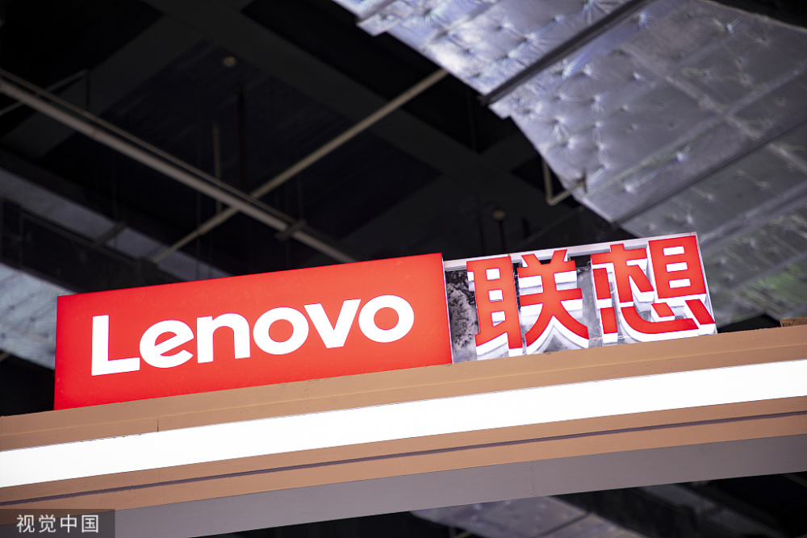
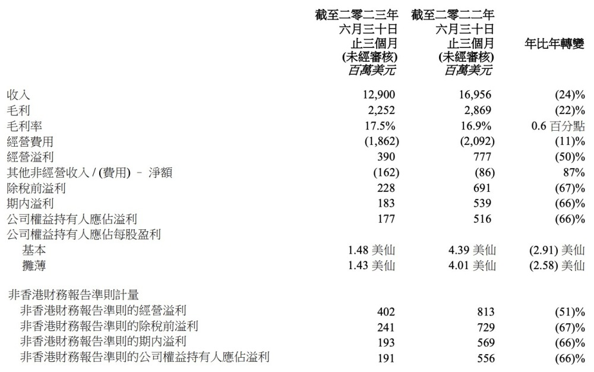
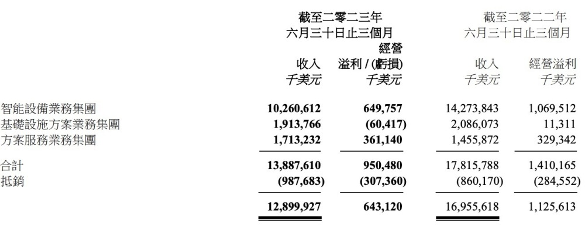

# 联想集团第一财季总收入129亿美元，净利润1.77亿美元

腾讯科技讯 8月17日，联想集团发布2023/24财年第一财季业绩，第一财季总收入129.0亿美元，同比下降24%；净利润1.77亿美元，同比下降66%。

截至2023年6月30日止三个月，联想集团总销售额约为129亿美元。与去年同期相比，期内权益持有人应占溢利减少3.39亿美元至约1.77亿美元，毛利率上升0.6百分点至17.5%，主要由于方案服务业务集团高利润业务贡献增加。而每股基本及摊薄盈利分别为1.48美分和1.43美分，分别减少2.91美分和2.58美分。

期内经营费用较去年同期减少11%。多个领域的支出因费用优化而减少，包括6,000万美元广告及宣传费用，4,500万美元与研发相关的实验室测试、服务和供应费用以及其他费用。期内，集团录得战略性投资公允值收益3100万美元，相比去年同期2500万美元增长24%，反映集团投资组合的价值变化。

智能设备业务集团收入同比下降
28%；受云需求疲软以及向下一代平台的过渡慢于预期的影响，基础设施方案业务集团的收入下降8%；方案服务业务集团收入及经营溢利分别上升18%及10%。

研发占收入的百分比由一年前的3.0%上升至3.5%；并将额外投入10亿美元提升集团的核心能力。

因精简成本结构，第一财季经营费用同比减少11%；净现金结余增加15%至4.54亿美元；现金周转期改善24天。

**具体业务**

**智能设备业务** ：由个人电脑、平板电脑、智能手机及其他智能设备业务组成的智能设备业务集团，其收入同比下降 28%。回顾期内的经营溢利下降 39%至
6.5
亿美元。IDG智能设备业务的营收仍受行业去库存周期的拖累。不过利好的信号已经显现：全球PC出货量和激活量走势已经趋于一致，这意味着渠道库存消化已近完成，联想集团全球PC龙头的位势依然稳固。在移动设备领域，本财季联想手机业务实现了10年来最高的第一财季激活量。

**基础设施方案业务**
：于回顾期内，更广泛的基础设施行业受全行业需求放缓影响导致计算伺服器需求疲软、以及行业向下一代平台过渡速度慢于预期。连续几个季度表现优于行业后，基础设施方案业务集团最终受到行业整体需求调整的影响，收入同比下降
8%至 19 亿美元。由于业务规模缩小，其分部经营业绩转为亏损 6,000
万美元。全球云服务厂商放缓科技支出影响了ISG基础设施方案业务在本财季的营收和利润表现，但ISG业务中的高价值部分，如存储、软件、服务等业务均实现高增长。其中存储业务在三位数增长的驱动下，市场份额达到全球第四。新兴的AI硬件基础设施相关业务也实现同比三位数增长，排名全球第三。

**方案服务业务** ：继续受惠于快速增长的“新 IT”需求，展现强劲增长及高盈利能力。回顾期内，方案服务业务集团的收入为 17 亿美元，同比增长
18%；经营溢利同比增加 10%至 3.61 亿美元。该业务集团表现强韧，可持续经营溢利率保持在
21%，高于所有业务集团；核心利润引擎支持服务表现稳定，全力拓展的运维服务、项目与解决方案服务业务营收在SSG整体占比超过50%。

**区域表现**

联想是一家业务遍及 180 多个市场的全球化企业。

**美洲**
：联想集团的收入同比下降幅度低于集团平均水平，为21%。尽管智能设备业务集团收入录得同比双位数跌幅，但北美的存货水平已恢复至疫情前水平。基础设施方案业务集团收入同比保持稳定，存储需求的增长完全抵消了服务器产品的疲软；方案服务业务集团的收入较去年有所下降，原因是新交易的成交出现延迟所致，但区内主要合约的更新缓减了部份跌幅。

**亚太区（不包括中国）** ：收入下降
17%，但下降幅度仍低于集团平均水平。基础设施方案业务集团在区内的需求疲弱，智能设备业务集团的收入下降，主要由于个人电脑渠道继续消化库存以及当地货币兑美元贬值所致。此外，方案服务业务集团因在该地区市场份额扩大使收入强劲增长。

**欧洲-中东-非洲** ：受智能设备业务集团及基础设施方案业务集团表现疲弱影响，联想集团在欧洲—中东—非洲市场的收入同比下降
29%。方案服务业务集团的收入因主要项目使其收入录得双位数增长，包括第一次在海湾国家赢得 TruScale 项目。

**中国** ：中国的收入同比下跌
29%，主要由于个人电脑及基础设施业务需求放缓所致。尽管如此，方案服务业务集团的收入仍录得双位数增长，主要得益于垂直解决方案的服务交付回升，以及在关键垂直领域的中标合同。

