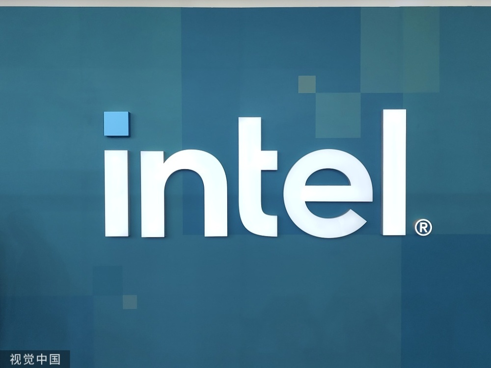

# 英特尔放弃收购以色列代工芯片制造商，因中国未批准？专家回应

【环球时报特约记者 任重 环球时报记者
赵霜】英特尔和以色列代工芯片制造商高塔半导体16日表示，由于未能及时获得监管机构批准，双方拟议的54亿美元收购交易已被终止。路透社、彭博社等多家媒体称，未批准这笔交易的是中国监管部门。

 _英特尔logo_

去年2月，英特尔宣布和高塔半导体达成最终收购协议。彭博社称，收购这家以色列公司是英特尔进入快速成长的半导体代工市场计划的一部分。首次宣布这笔交易时，英特尔表示需要“大约12个月”完成。到去年10月份，这家芯片制造商表示，它的目标是2023年第一季度完成收购，但随后在今年3月警告说，这个日期可能会推迟到第二季度。知情人士说，交易的最后期限是加州时间8月15日午夜，两家公司都预计不会得到中国的批准。

路透社称，英特尔首席执行官格尔辛格曾表示，他正努力让中国监管机构批准收购高塔的交易，上个月他还访问过中国，与政府官员会面。但格尔辛格也表示，无论交易结果如何，英特尔都要投资芯片代工业务。

《华尔街日报》称，大规模的全球收购通常需要主要市场多个监管机构的认可。在中国，如果交易中的两家公司在中国的年收入合计超过1.17亿美元，则合并将引发反垄断审查。

美媒渲染称，这是中美商业关系紧张的最新迹象。《纽约时报》称，在中美紧张的经济关系中，科技是主要战场。美国主导一系列措施限制向中国出售具有军事用途的最先进计算机芯片，以及制造此类芯片的工厂设备，这令北京深感不安。中国谴责这些举动是华盛顿遏制其技术发展和减缓其经济增长的努力。

通信行业专家项立刚16日对《环球时报》记者表示，高塔半导体一些业务在中国开展，相关并购案需要中国监管部门批准。如果并购行为会导致垄断，形成对中国产业的冲击和影响，不被批准是正常的，其他并购案中也出现过相关情况。“对中国产业不利，我们当然就不会批。”项立刚说。

去年，杜邦公司放弃了以52亿美元收购电子材料制造商罗杰斯公司的交易，原因也是未能获得中国监管机构的批准。

《纽约时报》说，尽管中美两国之间存在着紧张关系，但两国经济仍然高度关联，依赖彼此的供应链、技术和投资资金。对英特尔来说，中国既是一个主要的市场，也是一个主要的业务所在地：2022年，该公司在中国雇佣1.2万多名员工，收入超过170亿美元，约占其全球总收入的27%。

