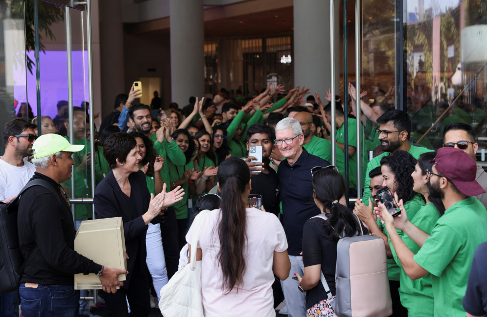

# 苹果印度扩产关键点：首次几乎与中国同时生产iPhone新型号

**划重点：**

  * _1_ 富士康在苹果的工厂已开始生产iPhone 15系列手机，目标是让印度和中国的发货时间更加接近同等水平。这是印度首次几乎与中国同时生产最新的iPhone机型。
  * _2_ iPhone 15在印度的生产规模将取决于零部件的供应情况，其中大部分需要进口，以及富士康工厂生产线的顺利投产。这两方面目前都面临局限。

 _印度一家富士康工厂的员工。_

下一代iPhone已开始在印度泰米尔纳德邦的富士康工厂生产，这是印度首次几乎与中国同时生产最新的iPhone机型。

彭博社8月16日援引知情人士的话报道称，富士康科技集团位于斯里佩鲁姆布杜尔（Sriperumbudur）的一家工厂计划在中国工厂开始发货几周后交付iPhone
15系列。

此前在印度生产的iPhone一直是旧型号。在iPhone
14之前，只有一小部分iPhone的组装是在印度进行的，印度的生产进程落后中国6到9个月，去年这种延误情况大幅减少。

富士康新建工厂

匿名知情人士称，今年的目标是让印度和中国的发货时间更加接近同等水平，尽管供应商尚未确定能否实现这一目标。

知情人士称，除了苹果最重要的代工企业富士康以外，苹果在印度的其他供应商——和硕联合科技和被塔塔集团收购的纬创资通的工厂也将很快组装iPhone
15。两家企业对此不予置评。

苹果公司现在正寻求迅速增加在印度的生产，减少对中国作为单一生产地的依赖，降低其最重要产品供应链的风险。到目前为止，该公司已将7%的iPhone生产转移到印度。在截至3月的财年中，苹果在印度的iPhone产量增加了两倍，达到70亿美元以上。

与此同时，印度在总理莫迪的领导下，一直寻求与美国建立更紧密的联系，并希望通过财政激励措施成为高端制造业中心。

“虽然苹果在印度的发展还处于早期阶段，但我相信政府有一个非常明确的目标，即提升电子制造价值链的地位。苹果的推动肯定会有所帮助。”彭博社援引Counterpoint
Research高级分析师希尔皮·贾因（Shilpi Jain）的话称。

除了生产方面，在以中国制造的功能手机和安卓手机为主的印度市场中，消费者也开始大量购买价位更高的iPhone。苹果今年4月在印度开设了第一家零售店，将快速增长的印度市场视为销售机会。截至6月的一个季度内，iPhone在印度的销量增长了两位数，创下新高，但苹果尚未透露具体数字。

_苹果今年4月在印度开设了第一家零售店。_

据英国《金融时报》8月14日报道，富士康董事长刘扬伟两周前在泰米尔纳德邦讨论了在印度南部邦进行更多投资。邻近的卡纳塔克邦的两位部长邀请他参加会议，随后出示文件称富士康还打算在卡纳塔克邦建造两座工厂。

尽管富士康坚称没有承诺任何项目，但卡纳塔克邦政府的游说表明，印度各地方政府正在酝酿激烈的竞争，以吸引富士康等电子产品制造商的更多投资。

近几个月来，富士康在特伦甘纳邦首府海得拉巴附近的一家工厂破土动工，政府官员称该工厂将生产智能耳机。富士康还在卡纳塔克邦首府班加罗尔的机场附近购置了土地，用于建设iPhone工厂。富士康内部介绍显示，海得拉巴附近的另一个工厂和卡纳塔克邦的另外两个工厂正处于规划阶段。

据富士康内部介绍，目前该公司在印度拥有9个园区、36家工厂，业务主要集中在泰米尔纳德邦和安得拉邦，为索尼、小米和苹果等客户生产智能手机、功能手机、电视机和机顶盒。

印度生产的局限性

iPhone 15在印度的生产规模将取决于零部件的供应情况，其中大部分需要进口，以及钦奈郊外富士康工厂生产线的顺利投产。

熟悉富士康计划的人士表示，印度的智能手机零部件生产目前将主要限于富士康，因为中国供应链的很大一部分由中国生产商组成，而这些生产商很难获准进入印度。

另一个大问题是，富士康能够在多大程度上提高其印度业务的成本效益，这对于利润率微薄的企业来说至关重要。行业高管表示，无论是印度还是越南等任何其他较新的生产基地，都无法容纳像富士康在中国那样的拥有10万工人的单一园区，他们认为大多数印度工人拒绝离开家乡去远方工作并住在宿舍。

目前，富士康扩建了24个现有宿舍并建造了新宿舍。一位熟悉其印度业务的人士表示，虽然印度任何一个园区都“不太可能”容纳10万名或更多员工，但通过彼此相距不远的基地网络，扩大业务规模的空间很大，至少部分基地的工作人员住在现场。但这将带来高昂的成本，也存在局限性。

此外，尽管印度政府正在向投资者提供价值数十亿美元的PLI（与生产挂钩的激励）措施，但一位接近富士康的人士告诉《金融时报》，这种补贴很难获得。该人士表示：“PLI下的资金仅根据上一年的出货量进行支付，即使根据允许预先支付补贴的新政策（例如半导体企业），许多企业也不符合资格。”

《金融时报》的报道称，富士康高管和其他观察人士对印度作为全球技术制造中心的地位可能接近中国的想法不以为然。“中国仍然可以供应美国和许多其他外国市场。”富士康的一位高管表示，“在印度，建立一条供应链来满足不断增长的国内市场，这是合理的——然后它可以成为印度周边有限地区市场的生产基地。”

刘扬伟表示，中国业务占富士康全球业务的75%，高于疫情前的70%。

