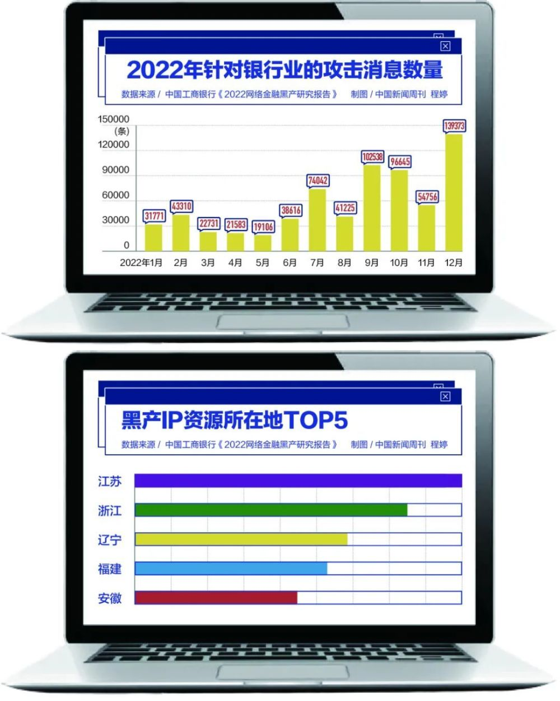
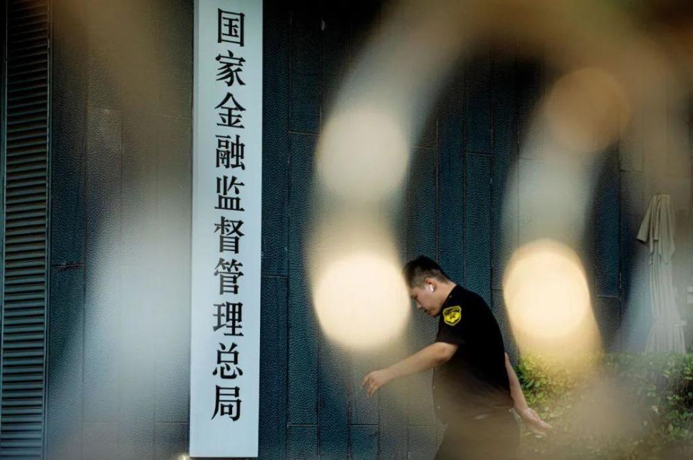

# 起底职业化“债闹”：榨干负债人最后一丝剩余价值

“逃废债黑产又出新套路了。”国内一家民营银行的负责人方进翻看着近期的个人贷款业务投诉资料，倍感无奈。从今年4月起，银行持续收到大量“医院证明”，声称逾期客户因感染重症而无法如期还款，事出有因，希望以此申请停息挂账等优惠政策。

仔细翻看这些投诉资料，客户大多为二三十岁的小伙子。“怎么可能有这么多年轻人突然集体重症？”方进到相关医院逐个核实，是否开具过证明文件，得到的反馈都是“没有这种情况”“不支持相关证明”。

类似的以逃废债为目的的恶意投诉或举报，从去年下半年开始激增。“尤其集中在催收和协商还款环节，相关投诉占总投诉比例从约30％，增长到85％左右，但催收业务本身并没有加紧。”这家银行一位信贷业务负责人夏芳告诉《中国新闻周刊》。更反常的是，经过算法团队的模型分析，相关投诉举报资料的相似度达到了90％以上。

_本文图/视觉中国_

一些已经“爆雷”的借贷人也有相似感受。去年三四月份，从十几家机构贷款后，为还钱感到压力倍增的易尚安突然接到一通“解燃眉之急”的电话，告诉他不必担心催收、不必马上还钱，甚至还能从机构获得退费补偿。不过，这需要他先交一笔钱。“逾期久了，总都会接到类似的反催收‘热线’电话。”易尚安熟知“反催收”产业套路，一边在负债人群体中打捞“肥羊”，一边代理投诉，恶意滋扰金融机构，两头收割。

非法代理维权、“反催收”联盟、有组织逃废债，无论如何称呼，这些打着“债务咨询”“法务咨询”名义的机构，本质上干的都是职业化的“债闹”。

这些“债闹”规模有多庞大？南都大数据研究院联合有关机构今年4月发布的《“非法代理维权”治理调研报告（2023）》（以下简称《报告》）指出，2020
年以来，“非法代理维权”黑产规模出现了比较明显的增长，全国目前有超过万家以“债务咨询”“法务咨询”“停息挂账”“个人债务重组”“征信修复”为名头的公司，仅2021年成立的公司就是过去10年总和的5倍以上。根据行业人士估算，职业化“非法代理维权”从业人员有数十万人。

**“二次收割”负债人**

“负债过多怎么办？整合债务来帮您。”薛晨仿佛抓到了救命稻草，刷到这条广告时，她刚刚全面债务逾期。那些发生在别人身上的暴力催收故事，正逐一变成她生活中的现实，压得她喘不过气。

当初为了给孩子治病，薛晨和丈夫透支了两张信用卡。到2016年前后，为还住院借款，薛晨把亲友借了个遍，不得已开始借网贷。那时夫妻俩已经入不敷出，只能不断借新还旧，以贷养贷，直到再也借不出一分钱。到去年3月，薛晨的债务问题全面爆发，沉下心来仔细统计才发现，竟然欠了十几家平台共计29万元。

“11点不处理，直接走违约流程。”“记住时间，11点。”“你是国家机关人员呢！”得知薛晨无法一次性还款后，一家网贷平台的催收员表示“没有停息挂账政策”，并发来一连串“威胁警告”短信。当天上午11点后，薛晨逾期的消息被曝光到通讯录，朋友、同事都知道了她负债的隐私。

_（全国目前有超过万家以“债务咨询”“法务咨询”“停息挂账”“个人债务重组”“征信修复”为名头的公司。）_

去年4月，两家借款机构催收人员直接找到薛晨工作单位，声称联系不到本人，在办公室四处宣扬其欠款不还，还曾不间断地拨打工位座机，导致常规业务电话无法接入，甚至在内部网站发帖，曝光薛晨负债。“闹得非常难看，他们认准了你有正经工作，怕丢人，就往死里整你，逼你还钱。”为降低负面影响，薛晨不得不申请转岗。

“催收员要的是负债人当天立刻回款，他才有绩效。”一家专注企业催收的公司负责人告诉《中国新闻周刊》，大多数第三方个债催收公司的人员流动频繁，低工资、高绩效，员工业务压力大，当天催收的对象不还款，相关资料可能就会被重新分包给了另一个催收人员，为保证个人收入，催收员势必会想尽办法催人还钱。

“就算你接听了每一通催收电话，他们还是会骚扰你通讯录上的亲友。”易尚安回忆说，甚至有催收公司直接打电话联系了他的客户，“你认识×××吗？他欠我们钱不还，现在联系不上，请你代为告知。”

2019年，易尚安做生意投资失败，拿不到工程回款，员工又等着发工资，便开始借款维持现金流。疫情暴发后，生意越来越难，贷款越借越多，到2021年9月债务全面逾期时，易尚安已经负债28万元左右。日历上，几乎每隔一天就标记为一个还款日，担心催收公司骚扰亲友，易尚安始终保持手机畅通。“生意人最注重声誉，这是要把我往绝路上逼。”

被曝通讯录后，易尚安曾报警处理。由于没有录音，只有通话记录截图，警方只能打电话给催收公司，告诫其不要骚扰报案人。最后催收公司来电道歉，与易尚安重新协商了还款延期方案。

“其他催收公司还是会想尽办法逼迫你。”最让他感到羞愤的一次经历是，催收电话打到了孩子幼儿园老师手机上，还让孩子听到了“他爸爸欠钱不还”。易尚安如今已经还完所有欠款，但那些曾被骚扰的客户却还没全部找回。

逾期前三个月被催收追得最紧时，易尚安曾频繁接到不同“法务公司”来电，声称可以提供专业债务规划服务，如某些平台可以做减免、延期，另外一些平台则可以协商退费。“我也不知道他们从哪拿到的我的个人信息。”易尚安将信将疑地做了后续咨询。

“很多反催收人员原来就是做催收的。”一位借贷领域资深从业者告诉《中国新闻周刊》，他们了解如何与金融机构打交道，也清楚催收套路和负债人怕催收的心理，通过技术手段或购买获得这些个人信息也不算难事。

“我们调查了解到，一些催收群体可能与反催收群体合谋，来完成自身回款指标，或是为帮助反催收团伙达成目标，压低还款标准，从中拿回扣。最终造成金融机构的损失，助长了逃废债业务恶性发展。”清华大学经济管理学院副院长、中国金融研究中心主任何平对《中国新闻周刊》说。

前述《报告》将目前“非法代理维权”模式归结为3类：类微商传销型、人为制造证据型、伪装“负债同路人”型。而基本套路主要有5方面：一是流量平台获客、私域社群诱导；二是教唆故意逾期，培训避债“技巧”；三是煽动反复投诉，层层施压达成目的；四是制假敲诈，层层抽佣收费；五是展业渠道愈发多元化、隐蔽化。

这些组织甚至不满足于“地下状态”，开始对接金融机构“谈合作”。一些金融机构反映，他们会遇到一些逃废债组织主动上门联系，寻求深入合作。方进介绍，这些黑产中介在完成客户委托后，主动联系金融机构客服，声称可以帮助金融机构避免一些反催收骚扰，甚至能够代理金融机构和债务人谈判。

易尚安从债友处了解到的“最没下限的黑产套路”，是打着“反催收”名义的违法借贷。黑产中介鼓励负债人凭信用分在平台分期租借苹果手机，拿到手机后，寄给中介做抵押，获得的贷款只有手机价格的一半。再拿这笔新借款还旧平台债务，从而达成“反催收”目的。表面上看，负债人和黑产中介已经两清，个人不存在新负债，但实际算下来，这笔新贷款的利息已经超过100％，明显属于高利贷，而租赁的手机需到时归还，否则要照价赔偿，这意味着负债人又背上了一笔新债务，同时在租赁平台的信用分也将归零。

“为什么借高利贷？因为逾期负债人的征信已经出现问题，正规渠道借不到钱了。不经历催收，永远不懂那种绝望。”易尚安无奈地说，每天被催收电话威胁、辱骂、逼迫，那种状态下根本无暇计算长远得失，只想解决眼下困境。

“反催收”，就像人溺水时薅住的一根救命绳，不管是不是黑产，都要先抓住再说。而“债闹”们正是利用负债人的这种心理，将被网贷收割一轮的负债者拖入泥潭，二次收割，榨干最后一丝剩余价值。

**“反催收广告都贴到了银行电梯间”**

“就像流水线上制作出来的，除了客户姓名、投诉项目、涉及金额不同，其余内容几乎一模一样。”说起这些投诉信的内容，夏芳介绍，还有几百封手写材料来自多位下沉客户，每份资料都是文采飞扬，字体娟秀，三四页稿纸，找不出一处错别字，内容同样高度相似。“明显有专业人士或机构代写。”

更明显的漏洞是，在大量要求银行减免利息、恢复个人征信的投诉信中，夹带材料都出现了不同程度的公章错误。例如一些由村委会提供的证明材料，盖章显示的是“某某村某某街道”，前后顺序明显颠倒。疫情结束后，夏芳走访了公章所属公司或单位，得到的反馈基本都是“没有开过证明”。

夏芳一度怀疑，会不会因该行减免政策力度较大，灰黑产才针对性“薅羊毛”？咨询过同行，并汇总多家金融机构内部数据后发现，超过50％的投诉客户同时对多家银行进行了投诉，反复缠诉的客户比例超过了三成，即就同一家金融机构的同一问题向监管部门连续投诉三次以上。“这些数据都指向逃废债黑灰产的存在。”夏芳说。

去年2月，平安银行信用卡在一次催收投诉案件复盘检视过程中也发现了异常，投诉人刘某与多起信用卡恶意投诉事件高度相关，怀疑刘某从事非法经营和违规职业代理投诉。公安机关查证其犯罪事实，最终刘某以敲诈勒索罪，判处有期徒刑一年零三个月。这也是全国首例以“敲诈勒索罪”公诉案件判决的信用卡代理维权案，此前，信用卡代理维权案的量刑多以“诈骗罪”定性。

在这起案件中，黑灰产中介刘某专业从事“代理投诉”一年有余，自称可代理多家银行的利息、费用调减等业务。业务开展期间，刘某一直怂恿或直接代理客户与发卡银行进行不合理协商、索赔牟利，并多次以平安银行信用卡客户黄某配偶身份致电客服热线，反馈其遭受信用卡恶意催收，称其已向多个监管部门投诉举报。

经公安机关查证发现，刘某假冒客户黄某，通过缠诉的方式获取现金赔偿，并全部占为己有，同时又谎称黄某的信用卡欠款是由其本人垫付，要求黄某向其支付清偿的部分费用，使银行及客户资金均遭受到损失。

_（据国家金融监督管理总局最新数据，2023年一季度银行业消费投诉10.49万件，其中个人贷款业务投诉5.98万件，占投诉总量的57％，其中不乏“代理投诉维权”“代理征信修复”“反催收联盟”等黑灰产行为。）_

“黑灰产严重危害金融消费者正当权益，破坏社会信用体系建设，侵害金融机构合法权益，影响正常的社会秩序。”蓝海银行行长宋学峰说。根据国家金融监督管理总局最新数据，2023年一季度银行业消费投诉10.49万件，其中个人贷款业务投诉5.98万件，占投诉总量的57％，其中不乏“代理投诉维权”“代理征信修复”“反催收联盟”等黑灰产行为。

逃废债行为早已有之，但其规模化发展是近几年的事情。何平介绍，早在2000年代初，借助互联网渠道的小规模逃废债群体已经开始萌芽，为后来的灰黑产形成打下基础。

P2P行业爆雷后，不少机构利用政策要求钻金融机构漏洞，恶意投诉等手段逐渐形成体系。而疫情暴发后，金融机构纷纷推出停息挂账、债务重组等优惠政策，为因客观因素而导致逾期的借款人留有转圜余地，反而被不法分子利用，成了黑灰产规模化爆发的催化剂。

针对逃废债这一社会现象，清华大学经济管理学院中国金融研究中心和新网银行成立联合课题组，编制了《中国零售金融逃废债风险报告》（下文简称《风险报告》）。据《风险报告》统计，自2020年9月起，全国范围内从事“个人信用修复”企业以每月新增数百家的速度快速增长，仅2021年11月就增加了近千家。另据天眼查数据，截至目前，经营范围包括“个人信用修复”服务的续存企业已超过2.3万家。

整个逃废债市场在新冠疫情暴发后疯狂增长。2019年，北京市互联网金融行业协会共计公布了31家网贷机构提交的逃废债名单，涉及12.06万恶意逃废债行为人。到2021年6月，中国银保监会公布，存量业务尚未清零的停业网贷机构共1387家，《风险报告》按每家约0.39万人推算，逃废债人群规模已超过540万人。

灰黑产盯上了不断扩大的负债群体。“债务重组、反催收培训的广告都贴到银行电梯间了。”夏芳对广告内容感到匪夷所思，“这些机构号称能对银行贷款做出减免，并承诺负债人‘不成功不收费’，到底凭借的是什么？借贷个人为什么会相信这些无稽之谈？”

**“逃废债代理”渐趋专业化**

抱着试一试的心态，易尚安加了其中一个法务公司人员的微信。对方应要求提供了营业执照、律师证，在工商信息官网也可查到该法务公司的注册信息。

随后，这位法务人员发给易尚安一连串“成功案例”，如“总负债20万元，经个性化债务规划，成功结清10万元”“成功协商减免一半欠款”，该人员微信朋友圈每天都会更新十余条类似消息，以彰显其公司的业务实力。

在微博、知乎、抖音、快手、小红书等互联网平台上，以逾期上岸、停催延期、债务协商规划等关键词进行搜索，不乏粉丝量上万、甚至几十万的账户。

“逃废债已经成为一个庞大的、专业化的、有组织的黑灰色产业链。”
据《风险报告》，黑产以营利为目的，分工明确，按照职能和阶段不同分为营销推广、客户运营、提供服务、收费获利等环节，全方位、全流程地吸引借款人，使借款人不自觉地相信逃废债组织的洗脑言论，相信其逃废债的能力，进而购买服务。

_（逃废债已经成为一个庞大的、专业化的、有组织的黑灰色产业链。）_

这些逃废债组织利用各大自媒体平台引流，结合平台特色，套路不尽相同。《风险报告》指出，在短视频平台、直播平台、论坛、贴吧等渠道，以宣传法律知识为幌子，将自己包装成帮助负债人上岸的“拯救者”，通过传播协商停息挂账等技巧来引流。

也有机构人员伪装成负债人，分享自己上岸的故事，在文末附上机构的微信或QQ联系方式。此外，逃废债组织还会在其他与“负债”相关的内容下评论，攫取流量。

随着黑产扩大，受利益驱使，越来越多“专业人士”加入团伙。其中不乏前催收人员、债务维权经验丰富的群体、从事金融服务多年的中介、民事诉讼经验丰富的法律从业者，以及营销推广、活动策划、技术支持人员，有组织有纪律地维持机构运转。

薛晨对比多家广告后，选中了一家在问答社区分享金融知识的法务公司，留言评论后，通过企业微信号进一步联系。在了解薛晨的债务构成和反催诉求后，这家法务公司工作人员开始索要薛晨的个人信息，包括但不限于银行卡号、身份证号等个人隐私，并让薛晨将身份证和手机卡寄到公司，同时快速出具了一份电子合同。

为防上当受骗，薛晨将对话和合同发到债友群寻求意见，很快有人现身说法，劝她“别信，不要被割韭菜了”。有债友表示，寄出电话卡后几个月，又收到了催收电话，原来法务公司只是代接电话，或是用新注册手机号来转移催收电话。“新号”养几个月便丢掉，从而切断负债人和催收方的联系，但并没真正去处理债务问题，最后征信上依旧全是呆账。

“所谓的优化方案，实质是诱导借款人在具备还款能力的情况下，利用政策福利暂时逃避还款义务。”方进介绍说，逃废债组织提供的具体服务无外乎征信修复、停息挂账、贷款减免三种主要类型，而为了误导金融机构，使其相信负债人没有还款能力，黑产机构往往会捏造事实、伪造材料，甚至聚众进行恶意投诉，利用“法不责众”的心理暗示，实现逃废债目的。“这不仅增加了金融机构逾期催收的工作难度，还容易造成消费者的信息泄露和诈骗风险。”

“逃废债代理”团伙呈“专业化”趋势的另一个特征是：这些团伙制假敲诈，层层抽佣收费。

逃废债团伙不断兼容新的信息化技术，提高伪造材料的效率和质量。例如自动化公章生成工具，只要输入机构名称，便能生成相应公章，效率极高，真伪难辨。

薛晨回忆说，那家法务公司预收取其总债务10％~20％的服务费。考虑到薛晨的经济状况，该公司还给出了优惠服务，可以先交3000元定金，成功处理一两个平台的催收问题后，再补齐尾款。

“降低缴费门槛，只是黑产诱人上钩的手段。”有债友提醒她“注意霸王条款”，一旦在合同上签字，后续其他平台债务就算不做处理、没有任何进展，也要把尾款补齐。黑产中介惯用的另一套话术是，“和动辄几十万、上百万元的债务相比，服务费还没有利息多。”

易尚安所咨询的法务公司则提出收取逾期债务25％作为服务费，只办理延期业务，如成功协商减免，对应的减免金额还要对半分。“这些中介主要靠信息差赚取代理服务费，各家银行的普惠政策都是公开的，完全可以自行主动协商。我为什么要花这笔冤枉钱？”易尚安后来没再接受其他反催收机构所谓的“帮助”。

《风险报告》分析，这种一对一的服务费通常在逾期金额的6％~10％，只是逃废债组织的营利方式之一。而最普遍的逃废债盈利模式是开设收费课程，反催收指南是其中最常见的课程内容，包括不同情况下的催收话术以及话术背后的意图，资料十分详实。更有甚者，谎称征信修复、逾期消费是新兴产业，招收学徒，骗取加盟费、课程费。

薛晨咨询的另一家法务公司还表示可以“提供过桥资金”服务。具体做法是，该公司为负债人提供一笔与债务总额相当的贷款，用以还清其他所有平台的债务，最后统一还该公司一家欠款即可，如此便可摆脱其他平台的催收。“这就是变相的借贷中介。”薛晨说，当时债友群有群友不断发消息提醒“这是高利贷，不要上当”，最后被踢出了群聊。

展业成本低、套利空间大，是“逃废债代理”急速发展壮大的土壤。《风险报告》课题组曾在某电商平台搜索“停息挂账”“逾期消除”等关键词，显示有2000多家商户，月交易量最多的一家发货地在湖南长沙，月销量超过1000单。这些关键词如今已被屏蔽，无法搜索。

而在二手交易平台上，搜索“小崔”“定制方案”“WD”“上岸”等更为隐晦的关键词，相关产品比比皆是，售价从几元到几十元不等。

根据中国互联网协会关于黑灰产市场规模的相关统计数据，从业者超200万，平均年龄约23岁，市场规模高达1100亿。

**共享“债闹黑名单”，形成合力反击**

频繁与“反催收”法务人员打交道，易尚安最大的收获，就是掌握了各家金融机构的优惠政策。“主动和银行协商也没有想象那么难。”到去年10月，易尚安与银行、借款平台充分协商后，重新规划了自己的债务，到今年3月，全部欠款均已还清。现在，他偶尔也会给债友做免费咨询，教债友如何与机构协商。

“合理合规的债务协商，降低了金融机构和借款人的沟通成本，对金融机构来说不是坏事，我们并不反对。”何平介绍，而恶意逃废债则涉及诸多违法行为，如虚假宣传、伪造文件、威胁骚扰债权人或金融机构，造成个人、机构和信用体系的损失，只为个人敛取暴利。

“逃废债的违法成本低，获益丰富，而银行的治理成本太高，实在是苦不堪言。”方进坦言，针对越来越专业化、职业化的黑灰产，银行从早期预警、核实举证到惩处追责，每一个环节都面临挑战。

方进介绍，对金融机构而言，接触材料初期，很难仅凭资料判别哪些是常规投诉，哪些是恶意代理投诉等逃废债行为。如果不是出现批量投诉、高度相似等反常情况，也很难发现材料伪造、话术过于专业、投诉目的可疑等问题。

而恶意代理投诉又阻断了银行与真实借款人的有效接触，银行无法得知借款人的真实现状，无从判断其提供资料的可靠性。银行不得不耗费大量人力进行举证，取证时间长、执行难度大、投入成本高，因而漏掉部分恶意投诉，又助长了逃废债黑灰产的嚣张气焰。

“到底什么是逃废债行为，现在还没有清晰的、统一的法律界定，更没有对逃废债个人或团伙的追责体系。”方进透露，有时银行已经通过调查锁定了黑产公司主体，但要对逃废债组织进行处罚，又需要依托于“公文伪造”等罪名，没有对其危害公共秩序、浪费公共资源等行为的追责依据。

“恶意投诉增多，且核实难度大，不仅造成大量行政和监管资源的浪费，也破坏了国家信用体系。”去年3月，全国人大代表，正邦集团党委书记、董事长、总裁林印孙在《关于防范金融风险
打击“债闹”的建议》中指出，债闹等恶意逃废债行为严重破坏金融秩序，干扰企业正常经营活动，让失信之风蔓延，诱发社会不稳定，削弱了金融对消费的拉动作用。

林印孙引用公开数据称，自2020年以后，国有大行、股份制银行信用卡及大多数城商行不良率普遍有所上升，有银行不良率超过6％，一年内增加两倍，可见债闹进一步加剧了银行坏账风险，危害社会稳定。

2020年，“打击恶意逃废债”内容被首次写入政府工作报告，随后的两年监管频频发声严查“非法代理维权”黑产，但黑产在这两年却有愈演愈烈之势。

“债闹愈演愈烈的的根源在于，违法毁约成本极低而非法侵占利益巨大。”林印孙建议将“债闹”纳入刑法，提高其违法成本。这也是与国际接轨的体现，德国、日本、美国等市场经济信用体系完善与民法体系发达的国家都对“债闹”等金融黑产进行了刑事立法。

事实上，相关机构和部门也在尝试建立各种长效应对机制。早在2020年前后，已经有部分银行尝试联合数字平台，将非法代理、诈骗等黑灰产人员在事前就拦截下来。但据一位大型银行人士表示，此后的合作未能保持下来，因为银行之间会顾虑自己的客户信息被他行获取，尤其对中小银行来说，客户重叠度小，更为介意。

2022年3月，第一个针对黑产的行业性组织“打击金融领域黑产联盟”（AIF）成立，AIF联盟由马上消费主办、平安普惠协办，招联消费金融、中银消费金融、新网银行、富民银行等十余家机构共同参与。以此为平台，进行信息共享、经验互通、行动互联。

“应加强跨部门合作。”宋学峰也建议，共建联防联治反诈数据库，将各类涉及反催收、代理投诉等恶意逃废债信息及时上传，实现信息共享，推动形成全行业的反诈防控体系。

“多方联动形成合力，才能打响反黑灰产突围战。”
新网银行副行长刘波认为，应对黑灰产顽疾需以反欺诈组织对抗欺诈组织。今年7月，新网银行与银联数据牵头、多家金融机构参与共建的金融反诈云平台已经启动，成立金融反诈云联盟，建立行业共享“黑名单”。在公安部刑事侦查局的有力支持下，通过金融机构间数据安全共享的方式，能够实现新亚型犯罪行为的贷前阻击、贷后联合打击、精准宣防，维护金融市场的稳定和健康发展。

刘波介绍说，后续还有更多机构陆续加入，平台一旦发现异常信息，会同步给国家反诈中心，方便其搜集证据。但整个平台的建成还需要至少半年到一年时间。

“打击债闹需要全行业共同努力。”林印孙曾提出建议，由行业协会、征信机构牵头，各大平台发挥各自在金融科技领域的优势，将新技术广泛应用于征信体系、社会诚信体系建设。

系统性的“反击”正在打响。8月3日，中国互联网金融协会发布《关于加强互联网金融行业协同、维护行业正常秩序的倡议》披露，正在起草甄别各类黑灰产活动的特征指南和具体应对措施，研究解决黑灰产信息的行业共享、阻断黑灰产信息网络传播等难题。这意味着，由该协会牵头，将组织互金领域从业机构共同应对黑灰产侵害。

“打破信息孤岛，共享债闹‘黑名单’。” 林印孙认为，由此才能对恶意逃废债、恶意投诉行为的当事人给予联合惩戒，让不法分子无处遁形。

（应受访者要求，文中方进、夏芳、薛晨、易尚安均为化名）

发于2023.8.21总第1105期《中国新闻周刊》杂志

杂志标题：起底“反催收”：伪装成“拯救者”的逃废债黑产

记者：杨乐

