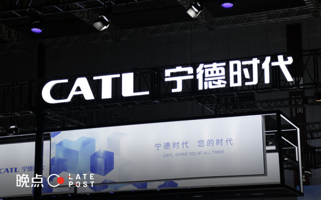
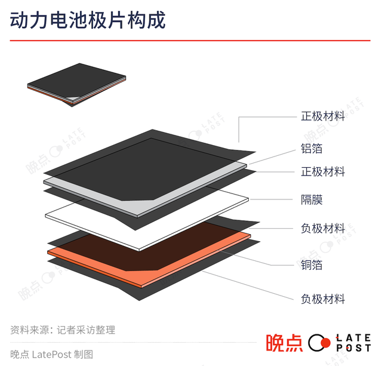
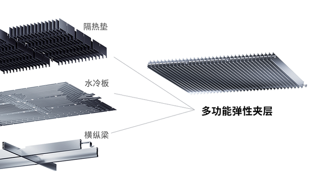
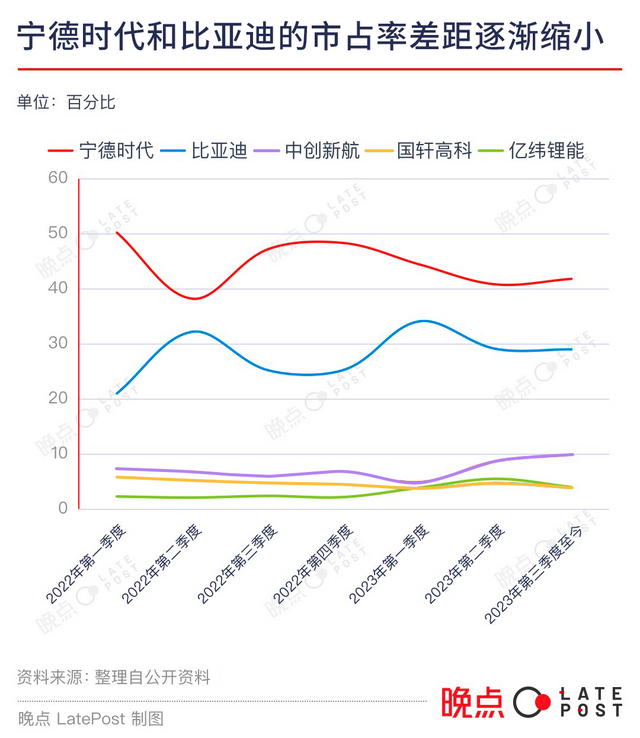
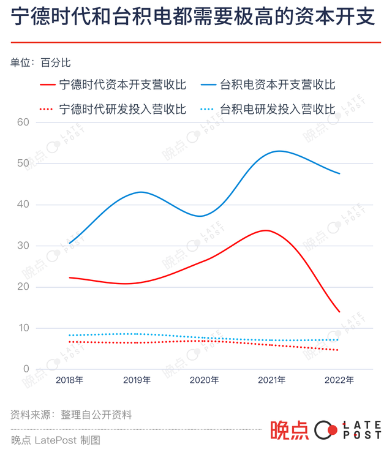

# 顺应汽车价格战，宁德时代造了新电池

当更多技术投入带来的商业收益不再明显增加，宁德时代如何选择。

**文 | 李梓楠**

**编辑丨黄俊杰 程曼祺**

“加油 5 分钟，续航 500 公里” 是燃油车的巨大优势。一般电动车，哪怕特斯拉 Model Y 在超级充电站，也要充 30
分钟电才能跑同样距离。为了抚平车主等待时的焦躁，特斯拉甚至在美国申请建自带餐厅的超级充电站。

一种解决办法是装充电更快的电池。去年发布的小鹏 G9 和更早时发布的北汽极狐阿尔法都可以选配 4C 电池（一小时充满 4 次），做到 “充电 10
分钟，续航 400 公里”。差距还有，但已经可以接受，通勤的车主每周可能只需要花 10 分钟来充电。

4C 电池的主要问题是贵。装 4C 电池的小鹏 G9 高配版和北汽极狐阿尔法各卖 42 万元左右，各比普通电池版本贵 3 万元。而即将发布的搭载
5C（电池一小时充满五次）快充的理想 Mega 售价可能高于 50 万元。

贵的原因在于原料。目前 4C 快充主要是三元锂电池，比普通磷酸铁锂电池贵 28%。一位锂电领域投资人因此向《晚点 LatePost》表示，4C 快充车型在
2025 年前的市场份额不会超过 10%。

宁德时代昨天发布的神行电池或许是一个突破。这是一款磷酸铁锂 4C 电池，它没有采用更贵的三元锂材料，业内人士测算它的成本与普通磷酸铁锂电池相当。这让 20
万甚至 15 万元以下的车型配备快充电池成为可能。

电池巨头宁德时代已经不止一次经历从三元锂到磷酸铁锂的转折。

市场总是选择够用且便宜的技术，而不是最贵的技术。续航比磷酸铁锂更好的三元锂电池曾被认为是电动车的未来，精于此的宁德时代一度在国内没什么对手。但在 2020
年以后，随着新能源补贴减少、磷酸铁锂技术改进，这种门槛相对低的电池技术重回主流。

宁德时代面对的竞争对手也因此多了十倍。一位电池公司高管曾对《晚点 LatePost》说：“中国能做好三元锂路线的团队不超过 5 家，而能做好磷酸铁锂的可能有
50 家。”

现在，快充电池也开启了够用就好的成本革命。区别在于，这一次，变化由宁德时代自行发起。

**更便宜的 4C 快充**

“所有电池公司可能会连夜研究宁德时代的方案，重新开 3 倍工资挖他们的工程师。” 一位行业观察人士说。8 月 16 日的发布会刚结束，就有 3
家电池公司的战略部门人士找《晚点 LatePost》索要宁德时代发布会的媒体资料包。

磷酸铁锂电池做快充是一个冷门方案——此前电池业普遍认为，磷酸铁锂材料电压低、电阻高，不适合做快充。要用这样一个先天不足的材料做快充电池，宁德时代几乎要从头开始设计电池的所有部件，为磷酸铁锂创造一个新的环境。

宁德时代在发布会上称，它们能做到在磷酸铁锂上实现快充，是因为改变了磷酸铁锂正极和石墨负极微观层面的结构：在石墨负极上，“增加了锂离子交换所需要的活性位点”，这能增加锂离子的流入通道、缩短流通距离；新的正极则能
“降低锂离子脱出阻力”。

这就像河水的流动，原本的方案是，所有水流只能按固定方向流动；新的正负极结构则像是在河流的出入口挖了许多河渠，水流可以从更多河道和方向流入流出。

宁德时代也改进了膈膜和电解液，神行电池使用了更薄的隔膜，和粘度更低、导电性更强的电解液，前者能缩短锂离子的流动距离，后者能减少流动阻力。

“上述实现快充的方法很多厂商都能想到、做到。难的是在提升充电速度时，保证能量密度不下降。” 一位电池研发工程师告诉《晚点 LatePost》。

他推测，宁德时代可能在同一个电芯里，通过多层涂布同时使用了原有的正负极和新的正负极，以结合原有正负极能量密度高的优点。这意味着宁德时代也要开发出新的生产设备与制造工艺。

此外，宁德时代还改进了封装电池的外壳，在充电时，电池包会自动将电池均匀加热至 60 摄氏度，这个温度下，磷酸铁锂材料的电阻会迅速下降。

最终让磷酸铁锂电池实现 “快充”，依靠的不是单个技术突破，而是诸多物理、化学的改进。宁德时代还要在实际生产环境中复现这样的设计，完成足够大规模的制造。

“神行电池没有采用更贵的材料，而是改进了电池的微观结构和制造工艺。如果制造环节爬坡顺利，神行电池的成本会无限接近于普通的磷酸铁锂电池。”
前述人士认为，这将使 20 万元甚至 15 万元的电动车上也能装得起快充电池。

叠加宁德时代对电池包结构的改进，神行电池能将汽车的续航里程做到 700 公里，在充电速度、成本和续航里程上做到平衡。

宁德时代计划在今年底量产神行电池，在明年一季度装车。目前宁德时代参与投资的阿维塔已宣布旗下车型将搭载神行电池。

**当车企只想要 “够用” 的电池**

神行电池之外，宁德时代过去两年发布了四款电池新品，性能各具特点：

麒麟电池：其空间利用率是 72% ，比行业产品普遍高 10%。这让汽车在同样的空间里能装更多电芯，实现超 1000 公里的续航，它主要用于 35
万元以上的车型中；

凝聚态电池：它能把能量密度做到 500 Wh/kg，比普通电池高 60%，可用于电动飞机；

M3P 电池：它是磷酸铁锂电池的改良版，将磷酸铁锂电池的能量密度提升了 20%，比麒麟电池更便宜，用在 25 万元左右的车上；

钠离子电池：能量密度低但成本比磷酸铁锂更低，能用在微型车和储能领域。

但车企已不似 3 年前那样渴求宁德时代的新电池方案。2020
年在中国市场，只有宁德时代能提供更符合车企需求的三元锂电池。一些车企需要提前支付半年至一年的货款并预付未来 3 年订单额约 6%-15%
的订单保证金才能抢到电池产能。

而最近几年，两个相继而来的变化导致宁德时代基于三元锂电池建立的巨大市场优势逐渐消弭。

首先是电池封装技术改进，提升了磷酸铁锂电池的续航。宁德时代自己推出的 CTP（cell to
pack）和比亚迪的刀片电池都能在相同体积下塞入更多电芯，让磷酸铁锂电池的续航里程能达到 600 公里。

更重要的变化是，车企对续航的追求不是无限的，有一个 “够用” 的区间。而封装改进使磷酸铁锂得以触及的 600-800
公里续航，已与燃油车相当。大多数时候，这就 “够用了”。

宁德时代的 CTP 技术把 3 个结构件集成至一个夹层，来源：宁德时代官网。

更多车企开始选择这种便宜、够用的磷酸铁锂电池。从 2021 年开始，宁德时代自己的磷酸铁锂电池产量也超过了三元锂电池。到今年上半年，中国超过 2/3
的电动车都采用磷酸铁锂电池。

据《晚点 LatePost》了解，宁德时代在去年年中就已做好 M3P 电池的装车准备。但直到今年 8 月 16 日，这款电池才装上奇瑞星途和智界车型。

接近宁德时代的人士称，车企疲于应对价格战，不想配合宁德时代做 M3P 电池的适配。据宁德时代供应商测算，改用 M3P 电池将让单车成本上涨约 8000
元，够车装 3 个屏幕。

续航达 1000 公里的麒麟电池更为昂贵。搭载 800 公里续航版麒麟电池的极氪 009 售价已经超过 40 万元。再加 200 公里续航，消费者还要多付近
9 万元。

“把续航做到 700-800 公里之后，车主一般只需要两周充一次电，多数长途出行也够了，很少有人需要 1000 公里续航。” 一位电池公司高管曾对《晚点
LatePost》说。

在当前车企对电池的需求中，成本因素越发重要。电池技术的优化重点，也从材料改进进入封装技术改进。材料改进理论上能带来更大性能提升，而且更难被追上；封装技术则更容易被效仿，这使宁德时代要更难保持技术优势。

一位 LG 新能源人士曾对《晚点 LatePost》说，类似 CTP 的技术，几十人的研发团队一年就可以做出来。宁德时代去年刚发布空间利用率 72%
的麒麟电池；今年上半年，蜂巢能源就推出了空间利用率达 76% 的龙鳞甲电池。

而在 30 万元以下的主流汽车市场，宁德时代没有拉开足够的性能差距。宁德时代的磷酸铁锂电池的能量密度为 174 Wh/kg ，行业普遍已能做到 165
Wh/kg 的水平。

宁德时代长期投入制造技术带来的质量优势目前也无法打动多数车企。宁德时代声称，它每产出十亿颗电芯，只有一颗会存在重大缺陷，电池的整个生命周期都会更安全。但在极致的价格竞争下，车企往往更追求眼前的性能参数和价格。

去年以来，宁德时代的技术优势没有再像过去那样通畅地转化为商业成功。2022 年 1 月，宁德时代的市占率是 50.2%。19 个月后，宁德时代市占率跌至
41.7%，创近一年新低。

**追求极限是一种信仰**

宁德时代是过去十年来，地球上投资电池生产技术最多的公司。2022 年，宁德时代研发投入 155 亿元，是中国第四大电池公司国轩高科的 7.5 倍，比 5
年前它第一次成为全球第一时增长了近 850%。宁德时代现在有 1.8 万名研发人员，是中国电池行业 2-4 名的总和。

这家公司长期在正向循环里：赚走了行业最多的钱，有更多钱改进研发和制造，又能以更低成本提供更多、更好的产品，再赚取更多钱。台积电就是用同样激进投入建立了今天的绝对领先地位，将芯片尖端制造的趋势从
“全球化” 掰成了 “台积电化”。

同样是一个大产业的中间环节，台积电之所以优势持续扩大，是因为芯片行业在过去几十年里，延续了每 18
个月性能翻倍的摩尔定律，带来了一次次量变到质变的革命——个人计算机、智能手机、AI。所有厂商所有消费者都渴求更多更高性能、更低能耗的芯片。

电池无疑是像芯片一样重要的现代文明基础设施。但随着里程焦虑被逐渐解决，车用动力电池的改进对驾车体验的影响，也越来越不易被感知。

宁德时代的应对方式是，动力电池业务从更贵的产品转向更高性能的平价产品，并进入储能、电动飞机、船舶等新应用场景：

推出 1.5 万次循环寿命的储能电池，较行业平均水平高约 50% 。储能电池对使用寿命和成本要求极高。

今年 4 月推出适用于电动飞机的凝聚态电池，7 月和中国商飞成立合资公司商飞时代，研发电动载人飞机；

2022 年底成立电动船舶公司时代电船，7 月投资芜湖造船厂。

把高性能产品做得更便宜，和用全新产品开拓新市场，都需要持续技术投入。这不是一个立马见效的过程，昨天发布的神行电池本身是一个例子：宁德时代在 2017
年就曾推出快充磷酸铁锂电池，但因能量密度过低，当时只能给电动大巴用。6 年后，历经更多迭代，能量密度更高的快充磷酸铁锂电池终于能出现在乘用车上。

从研发动作和投入力度看，宁德时代继续相信投入技术可以带来更好的产品，有朝一日会转化为商业优势。这种做法的前景有诸多变数：人们是否一直需要续航更长、充电更快的电池；电力能否最终取代其他能源；锂电池的终极形态固态电池能否成为现实？答案都需要宁德时代这样的先驱者继续探索。

芯片业的摩尔定律也不是物理定律，它只是从业者对技术发展的一种预测。摩尔定律得以延续，是电子工程师、物理学家、制造专家、供应链专家、销售经理、软件开发者共同努力的结果。

不是每一次全力投入都会有美好结局。亨利·福特、托马斯·爱迪生两人经历 12 年的合作， 在 110
年前就造出了电动车。但当福特开动流水线，人类大规模开采石油让汽油变得廉价后，电动车很快就从美国的马路上消失了。又过了 100 年后，电池才被重新装进汽车。

可如果不行动，就根本谈不上成果。最领先的科技公司，即使在继续投入技术的边际商业收益看起来明显下降时，仍不会放弃前瞻性研发。不论是爱迪生还是现在的马斯克和曾毓群，在投入新技术与方案之前，都无从得知自己一定会成功，但就是在日复一日的研发中，质变可能不期而至。

题图来源：视觉中国

