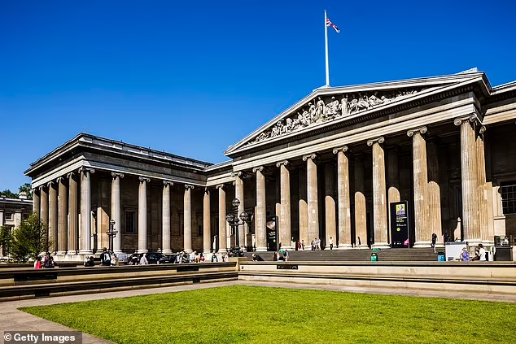

# 黄金宝石珠宝被盗，大英博物馆展开调查，一名员工被解雇

当地时间16日，伦敦大英博物馆接到珍宝“失踪、被盗或损坏”的报告，解雇了一名工作人员，将对其采取法律行动。伦敦警察厅已展开调查。目前尚不清楚有多少文物被盗，但失窃文物的种类包括从公元前15世纪到公元19世纪的“黄金珠宝、半宝石和玻璃宝石”。

_大英博物馆藏品被发现丢失、被盗或损坏后，一名工作人员已被解雇，警方正在调查。_

**疑点集中在被解雇的工作人员身上**

大英博物馆馆长哈特维格·菲舍尔说，博物馆将全力以赴找回物品。他补充说：“这是一起极不寻常的事件。我们已经非常认真地保护我们保管的所有物品了。我们已经加强了安全措施，并且正在与外部专家合作，对丢失、损坏和失窃的物品进行彻底清点。”

大英博物馆主席乔治·奥斯本说，对于所有热爱大英博物馆的人来说，这起失窃案代表着16日是令人悲伤的一天。奥斯本说：“我们报了警，采取了加强安保的紧急措施，对发生的情况和应吸取的教训进行了独立审查，并动用了所有可用的纪律处分权力来处理我们认为应对此负责的个人。我们现在的首要任务有三个：第一，追回被盗物品；第二，找出本可以阻止此事发生的措施；第三，不惜一切代价，在安保和收藏记录方面进行投资，确保此类事件不再发生。”

疑点集中在一名工作人员身上，此人已被解雇。伦敦警察局发言人说：“目前调查仍在进行中，没有逮捕任何人，调查仍在继续。目前我们不会提供任何进一步的信息。”

**失窃文物可能已被销毁，熔化黄金重新切割宝石**

克里斯托弗·马里内罗是一名律师，也是国际艺术品追回组织的首席执行官。他认为，这次被盗的文物至少四年之后才发现，这可能意味着追回这些无价文物为时已晚。马里内罗称，偷窃艺术品的罪犯通常只注重快速变现，并尽快销毁艺术品。他们倾向于尽快熔化黄金，然后重新切割宝石。

 _克里斯托弗·马里内罗。_

艺术品防盗专家迪克·埃利斯称，警方和博物馆官员拒绝公开被盗文物的照片或描述这一事实表明，调查人员可能掌握了一些文物下落的情报并正在策划行动。他声称，通常情况下，在试图追回被盗古董时，官员们都希望最大限度地宣传这些文物，以便任何可能遇到这些文物的人都能报案。

埃利斯认为，这些文物有可能被某个不知道其价值的人所拥有，并解释说警方可能担心媒体的关注会导致这些人销毁这些文物。但马里内罗的观点恰恰相反，他称官方不提供文物的详细信息是因为尴尬，他现在呼吁博物馆公布失踪文物的清单。

据报道，这些文物是在“很长一段时间”内被盗走的，最近没有公开展出，因为它们主要是用于研究目的，许多文物被放在储藏室里。

**前些年丢过希腊雕像、中国宝石和钻戒**

然而，随着失窃消息在社交媒体上的传播，一些网友指出，大英博物馆的许多藏品都是在英帝国时代通过掠夺获得的，而大英博物馆却站出来反对盗窃古代珍宝，这真是一种讽刺。大英博物馆本身也承认这段历史。

国际社会不断向大英博物馆施压，要求其将这些有争议的文物归还原主国。德国最近同意归还尼日利亚被掠夺的艺术品成为一个先例，激起了其他国家的活动家和官员的希望。牛津大学当代考古学教授丹·希克斯在提到归还被盗文物的呼吁时，希克斯在推特上写道：“我们将全力以赴归还之前‘偷走的赃物’。”

博物馆前些年也曾发生过物品丢失事件，包括20世纪70年代的一些硬币和奖章丢失，以及1993年的一起罗马硬币被盗事件。2002年，在一尊有2500年历史的希腊雕像被一名公众偷走后，博物馆对安保工作进行了审查。该机构当时表示，希腊古风展厅一直对公众开放，但在12厘米高的大理石头像被盗时，并没有固定的警卫值班。
两年后，一颗中国宝石也不翼而飞。2017年，据透露，馆藏的一枚价值75万英镑的卡地亚戒指钻石曾在2011年报失。

通讯员希澈

