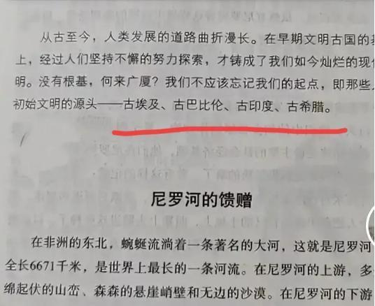

# 《世界上下五千年》四大文明古国没中国？专家：世界史教材不含中国史

近日，有网友发帖称“某出版社出版的《世界上下五千年》中，四大文明古国中没有‘中国’”引发网友热议。8月16日，华商报大风新闻记者注意到，该书网传部分表述并无“四大文明古国”概念，表述的是“人类初始文明的源头”；另外，该系列丛书还有《中华上下五千年》。

陕西师范大学历史学副教授杨盛翔分析道，争议或产生自对“世界史”内涵的误读。在我国，历史学下设考古学、中国史、世界史3个一级学科，就学科分工而言，世界史实为外国史之总和，因此世界史教材可以不包含中国史，或者包含但并不以其为重点。

网传信息——

网友：“四大文明古国”为啥没了中国？

根据网友发帖显示，《世界上下五千年》系某出版社出版，编著为“娄某”。截图中，在《悠远的文明》章节中，“在早期文明古国的基础上，经过人们坚持不懈的努力探索，才铸成了我们如今绚烂的现代文明。没有根基，何来广厦？我们不应该忘记我们的起点，即那些人类初始文明的源头——古埃及、古巴比伦、古印度、古希腊”。该网友配文，“四大文明古国居然没有中国。”

某图书网站显示，《世界上下五千年》系某出版社出版的中小学语文丛书系列，其中还有《中华上下五千年》《唐诗三百首》《中国古代寓言故事》《伊索寓言》等数十本中外名著。其中《世界上下五千年》《中华上下五千年》均为娄某编著。

记者核实——

文内实为“人类初始文明的源头”，中国历史另有《中华上下五千年》

出版社工作人员：书中没有“四大文明古国”字眼

记者注意到，《世界上下五千年》关于该部分文字中，并未提及“四大文明古国”，实际表述为“我们不应该忘记我们的起点，即那些人类初始文明的源头”。书籍简介为，本书以讲故事的方式，将世界范围内的人类历史娓娓道来，生动描绘了数千年社会文明的兴衰更替的历程，使读者得以触摸到每一个真实、鲜活的历史瞬间。本书记叙了从人类创造文字的两河流域文明开始，直至21世纪为止，对于人类文明进程具有重大影响的事件。而《中华上下五千年》一书的简介则为，本书从盘古开天地伊始，将各朝各代的故事以及五千年历史中的博大精深与没落成败都展现在了读者面前……

8月17日，记者联系到该出版社，相关工作人员表示，他们暂时不对此事作出回应，系因为那本书中根本没有提及“四大文明古国”字眼，“网友的视频不论是博取眼球，还是断章取义，其实和我们书籍的内容并不相干。具备基本职业素养的话，都很清楚这是两码事。”对此，他不希望争辩这种没有科学性、不具备学理性探讨的话题。

网友热议——

正方：中国应在初始文明的源头之列

反方：世界史没必要写中国，中国的部分有专门书籍

对此，网友们观点不一。有网友评论道，“作为四大文明古国中，唯一有连续传承的国家，却不在初始文明的源头之列，我不是很理解。”

也有网友持不同观点，认为《世界上下五千年》没必要写中国，因为该书籍主要是给中国人看的，关于中国的部分有更详细、专业、全面的书籍可供选择；另外，也有藏拙和受正统中国历史教育体系影响，将中国历史和世界历史分开成书。

专家分析——

在中国，世界史往往指我国以外的历史总和

“只要文内表述不是‘四大文明古国’则没有问题”

8月16日晚，记者联系到陕西师范大学历史学副教授杨盛翔。他表示，从专业角度来说，“世界史”的概念诞生自国外，通常指全世界范围内的历史总和，但传入我国后，历史学下设考古学、中国史、世界史3个一级学科，中国史与世界史是有明确分工且彼此互补的平行学科。在高校的教学实践中，世界史实为我国之外的各国历史的总和，即便有部分世界史教材加入中国史的内容，出于课本篇幅和教师专长的限制，也难以以其为重点。“因为从学科分工、院系结构的角度来说，世界史学者的研究对象大多是不包括中国史的。”

“这本出版物的划分或许受到了国内高校的教学、研究思路的影响。”杨盛翔说，如果《世界上下五千年》的文内表述未提及“四大文明古国”的国内既定说法，而是宽泛地写作“人类初始文明的源头”，就没有原则性问题，因为古希腊也属于“人类初始文明的源头”之一。

**华商报大风新闻记者 佘晖 编辑 王喆楠**

**（如有爆料，请拨打华商报新闻热线 029-8888 0000）**

