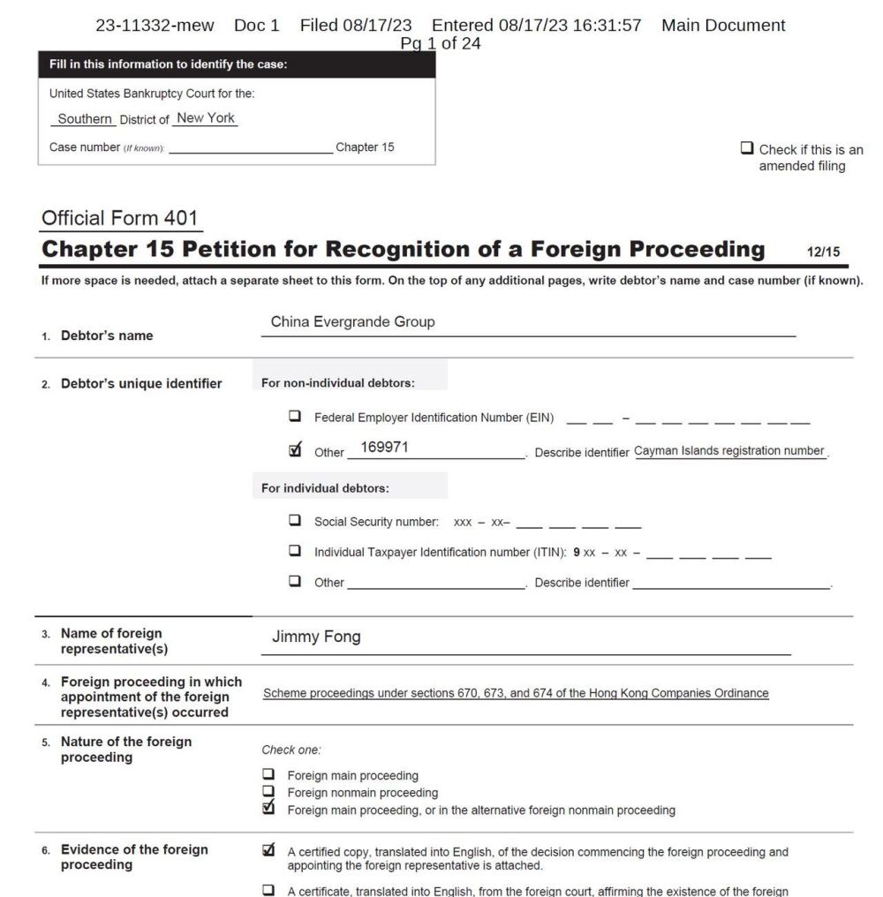
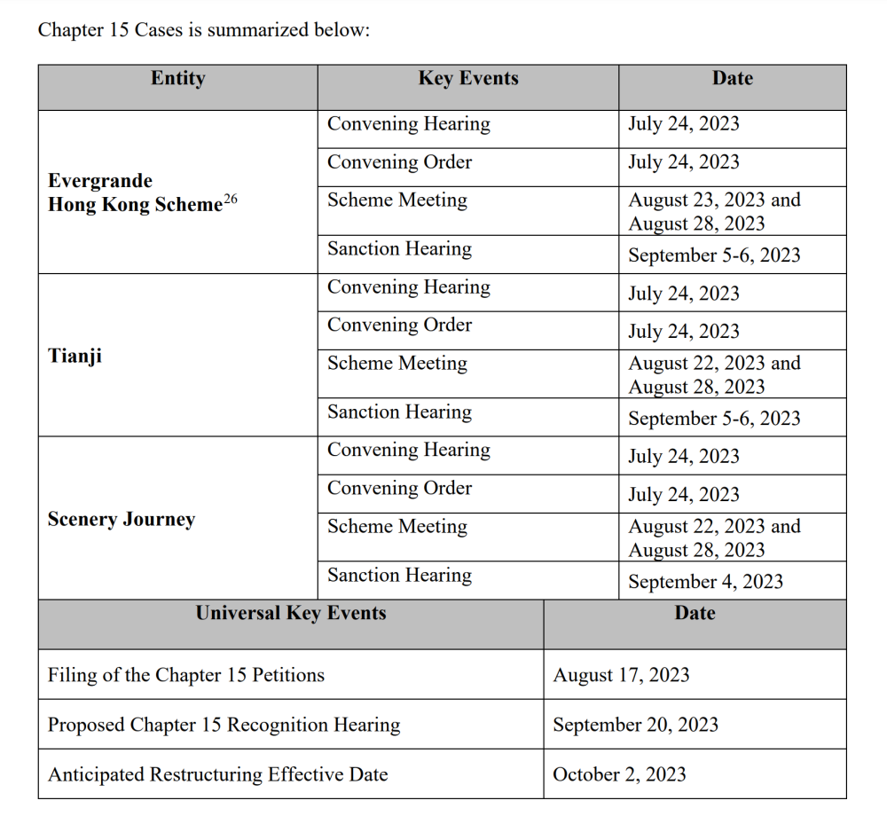

# 一线独家|恒大破产申请文件曝光：在美无重大资产 或为推进债务重组会议

腾讯新闻《一线》 纪振宇 发自硅谷

深陷“债务泥潭”的房地产开发商恒大在美国时间8月17日向纽约南部曼哈顿破产法院提交《美国破产法》第15章，[申请破产保护](https://new.qq.com/rain/a/20230818A00ZI900)。

腾讯新闻《一线》在当天独家获得的这份申请文件显示，这份文件的主要目的是向法庭解释，为何恒大目前的情况符合破产保护，这份文件还指出，恒大在海外并没有重大资产，美元债的偿还主要是通过子公司的分红来进行。

一位在美国从事多年商业案件的资深律师对腾讯新闻《一线》表示，提交破产重组是陷入财务困境的企业惯常的程序，目的是为了最大化保护资产，以便接下来的重组或清算过程，能够在法庭的介入下得以顺利完成。

具体到恒大提交的这份Chatpter 15
破产重组申请，他认为，此前恒大的债务重组方案已经获得了债权人小组的通过，为了确保在接下来的投票会议上，该方案能够顺利获得通过，此时提交破产申请保护是一个正常的流程，主要目的是为了避免在进行债务重组方案投票前，债权人方面的干扰，这也是破产重组案中惯常的程序。

恒大此次提交的破产重组申请，包含恒大母公司及其子公司景程和天基，申请文件称，“（债务人）寻求全面执行重组方案的条款以实施重组。为此,重组方案和外国法院命令必须在美国具有约束力和可执行性，且必须禁止方案债权人在美国采取任何可能阻碍外国诉讼程序所实施重组的行动”。

《美国破产法》第15章的设计目的在于，保护和最大化外国债务人资产的价值，并促进陷入财务困境企业的重建。

腾讯新闻《一线》在8月17日独家获得的法庭文件披露，恒大目前发行在外的美元债面值为142亿美元，截至今年7月31日累计余额为168亿美元。

值得一提的是，恒大此次提交破产重组文件的时间点，恰好赶在重组会议的前一周。根据法庭文件披露的信息显示，恒大及其子公司景程和天基将在8月22日、8月23日和8月28日三天进行重组会议，债权人将在会议上就离岸债务重组计划进行表决；而据此前媒体报道，香港法院将于9月5至6日就恒大集团离岸债务重组举行聆讯，以决定是否接受债权人8月就离岸债务重组计划的表决结果。

根据香港和英属维京群岛的相关法律，重组方案需要51%以上的债权人或者持有至少75%债务总额的债权人投票通过。具体来看，恒大拟通过在开曼群岛、香港或其他适用的司法管辖区的协议安排进行拟议重组。

根据恒大此前公布的重组协议，恒大协议安排下将会有两组债务，即“A组”和“C组”：A组债务包括10笔美元优先担保票据、1笔港元可转换债券和1项私募贷款；C组债务包括私募债、回购义务及公司就若干境外及境内债务提供的担保。

另外，A组债权人及C组债权人均可从恒大协议安排下的两个协议安排对价方案中作出选择，即“方案1”及“方案2”。

在方案1下，债权人将收到中国恒大发行的期限为10至12年的新票据（“A1/C1票据”）。

在方案2下，债权人可以选择将其可获偿金额转换为（取决于调整和重新分配）：由中国恒大发行的期限为5至9年的新票据（“A2/C2票据”）；由以下权利及工具组成的组合：中国恒大发行的可兑换恒大物业服务集团有限公司股份的强制可交换债券、中国恒大发行的可兑换中国恒大新能源汽车集团有限公司股份的强制可交换债券、中国恒大发行的强制可转换债券及中国恒大发行的证券挂钩票据（统称“A2/C2组合”）；或“A2/C2票据”和“A2/C2组合”两者的组合。

