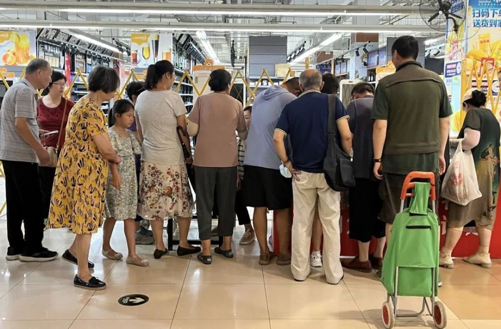
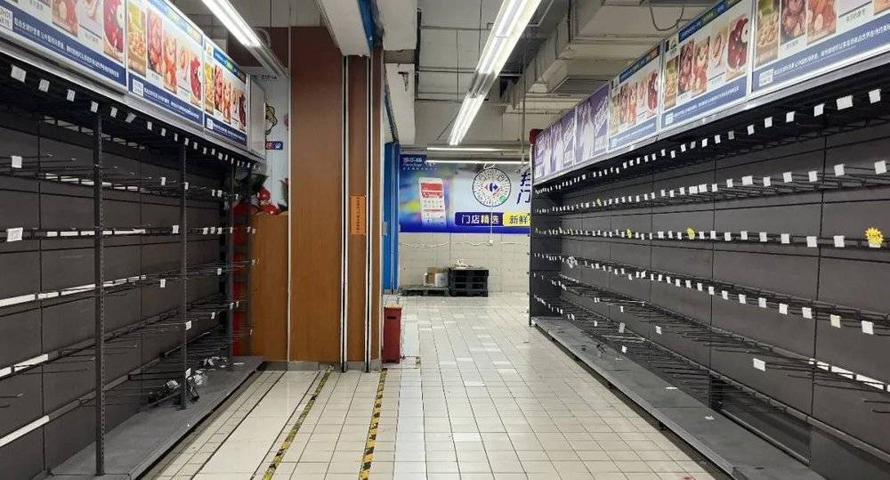

# 北京最后的家乐福：货架大多空置，“清卡人”无奈以三倍价格购物

_图片来源@视觉中国_

文｜刺猬公社

双井店和四元桥店，是北京仅剩的最后两家家乐福超市。

2023年6月2日起，家乐福双井店的营业时间调整为10： 00~19： 00。 很难想象，一个开在北京三环边上的超市，晚上7点就关门了。

早上九点半，家乐福双井店门外的黄色围栏尚未打开，由两张桌子
简易拼接起的“购物卡咨询处”却早已围满了人，这其中以老年人居多。刺猬公社在现场看到，如今想要在家乐福买100元的商品，仅可以花购物卡中的20元，剩下的80元需要再用现金或手机支付；此外，需要先提供姓名及手机号，完成家乐福会员的实名认证，然后在10个工作日后到收银台处查询审核结果，审核通过后每张购物卡可以消费500元，当月有效。

_家乐福北京双井店购物卡咨询处_

“我从大老远来了，你这不是折腾人吗？ ”终于等到工作人员现身，赵大妈却得知自己在7月20日之前办理的家乐福会员的实名认证，只能在7月内使用购物卡。
前些天北京的暴雨，使她错过了有效消费时间，她只能在重新登记后，等待十天再来“清卡”。 面对她渐渐愤怒的情绪，工作人员则指了指桌子上贴的“温馨提示”，说：
“这里都写上了。 ”

消费额度的限制、购物规则的变化、日益空旷的货架和不时传来的倒闭流言，让家乐福购物卡危机在消费者之间漫延。
近些年来，高管离职、供应链断裂、列为“老赖”、裁员闭店等危机接二连三地出现，这已经不是家乐福经历 的唯一风波。

1995年，家乐福进入中国，赶上经济腾飞的浪潮，曾在巅峰时期拥有321家门店。2019年9月末，苏宁易购完成了对家乐福中国80%股份收购，这一双向奔赴却未能使家乐福重现辉煌。苏宁易购发布的财报显示，
**2022年关闭家乐福门店58家，2023年第一季度继续关闭31家门店后，家乐福中国门店仅剩114家。**

这家大型连锁超市，曾经的销售之王，正在经历它的至暗时刻。 不单单是家乐福，沃尔玛等传统连锁商超品牌都在艰难求生。
然而，山姆和盒马这样的会员制超市“价格战”却愈演愈烈，胖东来等三四线城市的大商超，悄然成就零售业的一段传奇。

**那些错过互联网的“传统超市”，真的要和我们说再见了吗？**

再见，北京最后的家乐福

在朝阳区宜居南路，年近70岁的张兰，每周都要来到四元桥购物中心三楼，先在健康馆做按摩，然后顺便去对面的家乐福逛逛。果蔬类和生鲜类是张兰经常光顾的选区，她选购了一袋售价99.99元的300g虾仁，在张兰小区旁的小超市，同样的价钱可以买三袋虾仁。张兰的语气中透露着些许无奈，但为了彻底花完购物卡中的余额，她表示，“现在就这样，多贵你也得买。”

北京最后的家乐福，货架大多空置，商品已所剩无几。在双井店里，大桶洗衣液是人们“清卡”的首选，鸡精则堆叠在一起，几乎无人选购。四元桥店也是同样的境地，货架上的商品散落，而冷冻区内各式各样的速冻食品填满了冰柜，成为了被人们遗弃的角落。

_家乐福内的货架大多已空置_

货品不全，价格翻倍，成为了压垮消费者们的最后一根稻草。“只能用卡里20%的钱也没关系，只要东西全、价钱合理，总可以慢慢花。”这是张兰的想法，但是北京家乐福经营恶化的情况，远远超出她的预期。“等我反应过来他们是在清货的时候，我才知道自己被这种假象蒙蔽了。”张兰之前坚定地认为家乐福不会倒闭，在看到店员整理货架时，她还怀抱着家乐福“东山再起”的希望。可当张兰得知天通苑店倒闭后，“彻底死心了”，于是她又来到双井店，买了几个碗、一把茶壶、几块电池，凑钱清卡。

**曾被称为零售界的“黄埔军校”的家乐福，在时代浪潮的更迭中褪去荣光，不仅收获了倒闭传闻，还有一份份惨淡的营收数据。这十年，家乐福都经历了什么？**

1995年到2007年，家乐福进入中国的最初十几年，在大润发、麦德龙、沃尔玛等一众超市中抢占高位。然而，此时坐上外资零售头把交椅的家乐福，却做出了一系列错误决策，使之与供应商间矛盾激化、核心人才离职，以及不合时宜的扩张，为此后埋下了败退的种子。

2010年，康师傅断货家乐福，零供关系的拉锯战就已开启，而这也只是家乐福与供应商之间矛盾的缩影。从早年在生鲜领域的竞争，不同于打通生鲜采购渠道的永辉，也不像设置全国配送中心的沃尔玛，唯独家乐福选择了“躺平”。后来再到电商崛起时，家乐福对供应链体系的忽视，让它没法抓住新的机会。

公开信息显示：2017年、2018年，家乐福中国地区的净利润分别为-10.99亿元和-5.78亿元。2018年底，家乐福中国资产价值115亿、负债138亿。2019
年，苏宁易购花 48 亿元收购家乐福中国 80% 的股份，家乐福集团正式退出中国大陆市场。

2023年年初，家乐福中国COO张其喆离职，全国多家门店关停，并被爆出裁员、拖欠赔偿金等问题。这一切，仿佛早已为家乐福写下了与中国市场告别的序章。

将时针拨回到1995年，在国展中心附近，家乐福创益佳店落户北京，这是家乐福在中国大陆市场上的第一家门店。那时，“粮票”刚刚退出中国的历史舞台。在家乐福的大卖场里，整洁的环境、热情的销售、超低的价格，每种新元素都带给人们极大的冲击感。

**时过境迁，在如今的家乐福大卖场里，挑选商品不是在整齐有序的柜台上，而是在四零八散的角落里捡漏，是在离收银台处最近的货架上刨找。家乐福这样一家大型连锁超市，就这样在混乱与遗憾中，毫无体面地退场了。**

对于北京最后两家家乐福是否会停业，家乐福双井店的工作人员说：“等东西全卖完就关门。”但四元桥店的收银员则表示还未接到通知。

当一位美团骑手匆忙地赶到家乐福四元桥店时，他被站在唯一开放的收银渠道的工作人员告知，“已经没货了，送不了了。”骑手一脸茫然，他和手机屏幕后的消费者，显然都不知道家乐福变成了如此景象。

传统商超，等即时零售的风口

**2015 年，中国大卖场业态首次出现“负增长”，命运的齿轮或许在那时就已经开始转动。传统商超倒闭与转型的风潮，已经持续了近十年。**

家乐福并不是唯一受困的大卖场，沃尔玛、永旺、大润发等也深陷其中。家乐福如今的境遇，更像是当下整个传统商超业的缩影。有公开数据显示，近三年来，沃尔玛在国内共关闭60余家门店，永辉超市共关闭了近400家门店。

而在各种新消费模式不断涌现的这些年，传统商超也在挣扎中自救，挖掘新的生长空间。

首先是电商的崛起，彻底改变了零售行业，传统商超都面临线上线下融合的问题。起初，多数大卖场都选择与成熟的电商平台合作，比如沃尔玛联手京东，麦德龙入驻天猫国际，大润发与国美在线相互打通。

但是，电商化的转型也没能成为治愈大卖场的良药。线下大型实体超市，向着线上渠道进攻，本身就带有以矛攻盾的意味。线上的销售业态越旺盛，也就代表着线下实体卖场的生命越薄弱。甚至线下超市的实际运作中的房租、人工、水电等成本，也成了转型路上的“拖油瓶”，关闭门店也就变得理所应当了。

从2022年中国网络零售市场发展报告中的数据来看，2022年网上零售额为137853亿元，占社会消费品零售总额的比重为29.8%，线下零售占比超过70%。
**即使线上零售增速高于整体水平，但线下依旧是全民消费主战场。**

其次是付费制会员成为零售行业新战场，各大巨头纷纷加入，开启了新一轮争夺中产消费者的战争。其实，国内最先开启会员制的外资零售巨头是沃尔玛，1996年，沃尔玛在中国的第一家会员店深圳山姆会员店开业。但是在随后的十年间，大卖场业态最为火爆，仓储会员制超市没有激起太大的浪花。

**如今，山姆终于等来了新中产阶级消费升级的风口，同时迎接它的，还有会员制超市的疯狂内卷。**

据QuestMobile发布的《2022新中产人群报告》显示，截至2022年7月，新中产人群的全网占比提升至13.7%，用户规模达到1.63亿，同比增长15.6%。财富相对自由的新中产人群，更愿意为高品质的产品付费，成为消费升级的主力军。

相比于普通大卖场，山姆这样的会员制超市先打造出一个付费会员的门槛，然后打出了“致力为会员服务，为菁英生活提供高品质商品”的口号。山姆会员店除了赋予中产阶级一个身份的象征，更重要的是品类少而精的优势。

据公开资料显示，大卖场的SKU通常在20000，普通超市的SKU也有10000，而山姆的SKU只有4000。精简SKU，实际是给消费者提供了更为垂直的选择，也有助于减轻供应链的压力，从而能持续提供高品质的商品。

会员店赛道的拥挤程度，或许可以从盒马和山姆为一块榴莲蛋糕开打价格战中窥探一斑。在传统大卖场溃不成军的时候，以高品质的商品俘获中产的心，的确是一条可行之径，但并不能成为挽救传统商超的唯一出路。

家乐福也曾做出过向会员店转型的尝试，2021年10月，家乐福首家会员店在上海成山路开业，家乐福正式进军会员制竞争。然而，就在开业之初，家乐福就因其竞争对手给供应商下了“二选一”的规定后，出现大量断货而致歉。2023年4月，家乐福悄然关闭了这家首位会员制超市。曾被家乐福视为救命稻草的会员店，最终也没能挽救家乐福。

我们还需要传统超市吗？

回头看看，我们真的不再需要像家乐福这样的“平民超市”了吗？

传统商超拥有许多老年消费者，相比起农贸市场，他们更加信任超市的品质。对这一辈的人来说，倘若能赶上打折买到稍微便宜点的东西，对他们来说也是一件“乐呵儿”的事情。张兰的爱人不吃肉、只爱鱼，于是张兰和爱人特别关注超市里的鱼。他们原本最认可的，是大润发里的鱼，可是前几天丈夫花了五十多块买回六条品类难辨的小鱼后，张兰对大润发再一次失望了。作为老顾客的张兰，能明显感受到传统大卖场里，货品的质量在下降。

张兰住在北三环中路安华桥附近，旁边就是安华商厦，内有华联生活超市。“晚上吃完饭，去逛逛商场，有合适的就买点，没有的话就兜个凉风儿回来。”
可是自安华商厦停止营业后，她一次商店的门都没进过，一件衣服也没买过：“一是因为没心气了，二是百货商店都没咯。”

退休后的老年人结伴逛超市、逛商场，某种程度上构成了他们的生活方式。如今传统商超的退场，却让他们无处可去了。当巨头们争先收割中产时，却遗忘了这部分需要平民商场的人。

**但这也从侧面说明，二十年前“中产象征”的家乐福超市们，正在面临用户老化的问题：年轻人消费习惯的改变，让曾经的逛超市变成了过去式。**
他们很少比较线下大超市和线上超市的价格，更在意能否送货上门、节约时间，囤货的方式变了，再加上被即时零售和24小时便利店包围，年轻人更少选择为了一两件商品大型商超购物。

那些熟练使用智能手机的中老年人，也在“逃离”传统超市。比如社区团购的出现，因为没有了巨大的场地房租、水电、人力等成本，这让大商超的供应链带来的低价优势荡然无存。追求实惠的消费者，果断投向了社区团购的怀抱。

“社区团购再干一两年的话，我讲500平方以上的超市基本上没戏了”。2020年，名创优品创始人、CEO叶国富做出预言。

这在当时看起来不太可能，毕竟在2020年，即使是家乐福也实现了盈利。 **但时代的浪潮汹涌之间，任何企业终究抵挡不住潮水的流向。**

**参考资料：**

[1] 零售商业财经：《家乐福中国的至暗时刻》[2] 网易数读：《曾经的零售之王家乐福，挤满了要退卡的人》[3]
新熵：《大卖场转型：电商化救命，会员店换轨》[4]《2022年中国网络零售市场发展报告》[5] QuestMobile：《2022年新中产人群报告》[6]
其他数据来源：苏宁易购年度报告，网络公开资料整理。

