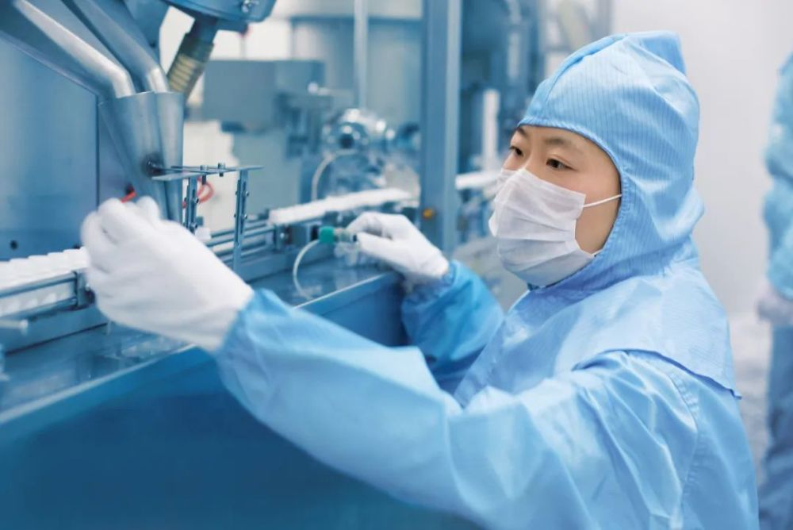

# 医药反腐牵出陈年痼疾：药企状告医院不回款，最多一家欠9043万元

8月16日，海王生物发布公告，披露了 **公司连续十二个月累计发生的109起诉讼。仲裁金额合计约人民币5.35亿元，**
占公司最近一期经审计净资产绝对值的11.4%。

海王生物披露的案件中，公司及控股子公司作为原告或申请人的诉讼占绝大多数，共71起，涉及金额约4.86亿元，主要为公司作为原告要求对方支付拖欠公司的应收款项等。

海王生物将14起公司作为原告，且单笔金额较大的案件作了详细公布。健识局注意到，里面不少是针对河南、新疆两地的公立医疗机构发出的控告，如汝州市第一人民医院、汝州市人民医院、汝州市中医院、和田市疾病预防控制中心等。

涉及买卖合同纠纷的公立医院， **汝州市中医院欠款金额数量最大，达9043万元，其次是汝州市第一人民医院，诉讼金额为7536万元。**

医药领域回款难向来是行业里长年存在的问题。回款周期中，流通企业垫资，资金流动差的不在少数。海王生物面对的问题，只是冰山一角。

回款难问题，医药领域的陈年痼疾

海王生物的主要业务分为药品、医疗器械流通两大部分，主要是为医院、基层医疗机构、药品零售机构等提供药品和器械的配送及相关服务，
**近期因医药反腐大火的医用物资供应链服务（SPD），海王生物也有涉猎。**

2022年海王生物营收378.35亿元，比去年减少7.84%， **净利润亏损达到10亿元之多。**
5月22日，海王生物在投资者调研会上回应了公司利润率偏低的问题：公司客户主要是公立医疗机构， **正常营收账款的平均账期为六个月左右。**
但受疫情影响，公立医疗机构财政支付能力减弱，应收账款回款周期拉长。

和公立医院做生意，原本是不用考虑商业信用问题的。医保还能有不给钱的吗？

现实情况真的如此。海王生物公告显示，涉及诉讼金额最大的两家医院，汝州市第一人民医院、汝州市中医院，均是与其控股子公司河南德济堂医药有限公司签订。目前法院已出具民事调解书，医院将按民事调解书按月回款。
**该公司与汝州市妇幼保健院的买卖合同纠纷，企业已申请强制执行。**

汝州的医院迟迟没有结款，其实从当地医保基金情况就能看出端倪。

汝州是河南平顶山下辖的县级市，河南医保收支整体就比较紧张。河南省医保局网站显示，2022年全省基本医保基金收入1398.95亿元，支出1275.1亿元，累计结余1200.35亿元，低于国际上结余应满足15个月支出的警戒线。

汝州市市医保局并未公开当地的医保收支情况。邻市登封倒是公开过：2022年登封市职工基本医保基金收入4.54亿元，略微高于支出4.49亿元。滚存结余仅5176万元，很容易就捉襟见肘。

海王生物是民企，融资成本要高于国有医药流通企业，在汝州开展业务，碰上医院回款不及时，肯定拖累公司业绩。

流通企业的很大一部分成本就是资金占用成本。
**2021年，全国医药流通直报企业平均毛利率为7.4%、净利润率为1.6%。与十年前相比，行业已经呈现经营微利化趋势。**

海王生物的应收账款还在连年走高。公司年报显示，2022年，海王生物应收账款余额192.35亿元，坏账准备余额4.22亿元。公司近年来的应收账款的规模逐年扩大。
**单看2022年，海王生物的应收账款占总资产的比例已高达50%以上。**

面临回款难的不只海王生物。今年6月，鹭燕医药58亿元应收账款引发关注。一季报显示，鹭燕医药一季度应收账款高达58.52亿元，高于同期公司营收48.42亿元。国企占款更加严重，2018年来，国药控股的应收账款均高于1000亿元；2022年，上海医药应收账款也已升至667.6亿元。

医保基金结算加速

医药领域回款难的问题已经受到政府部门的关注。

今年4月，广州公共资源交易中心发布通知，将在平台交易子系统新增广州地市医院欠款情况排行榜功能。榜单每月更新累计欠款金额和欠款比例前3名的医院。这是全国首个对欠款医院作排行公示的地区。

企业要不到钱，其实欠款的医院也很头疼。国家卫健委卫生发展研究中心翟铁民等人的一篇论文指出：疫情前的
**2019年，全国公立医院应收医保款约为3500亿元，其中半年以上未结算医保款为906亿元，占比26%，** 确认无法收回的有349亿元。

上游的回款压力必然会传导到下游，导致医药企业应收账款的走高。推进医保基金直接结算或许是“医保-医院-
企业”三角债的解决之策。8月4日，湖南省医保局、财政厅、卫健委三部门发布《关于实施医保基金直接结算集中带量采购中选产品医药货款的通知》。

按照湖南省的要求，医药基金直接结算货款全流程在30至60天内即可完成。

事实上，2020年2月，中共中央国务院就已明确推进医保基金直接结算医药货款。近年来这一政策走上快车道。目前，湖南、福建、广东、山东、内蒙古、河北等多地均在推动医保基金直接结算医药货款。

与此同时，集采开展五年，已走向常态化，医药回款更加不能影响集采中选药品在医疗机构的使用。
**目前，大多数推进医保基金直接结算的省份都围绕在集采中选药品医保基金结算。**

去年6月，山东医保局曾指出，药品货款直接结算已覆盖全省2622家公立医疗机构，全面实现对集采药品的直接结算。其中，德州市的货款结算周期由之前的平均8-12个月缩减至平均30天。

部分省份正在计划将医保基金直接结算推向医药全行业，例如山东省明确表示将在 **2025年全省全面推行医保基金与医药企业直接结算。**
困扰药企、流通企业的回款问题有望进一步得到解决。

撰稿｜杨曦霞

编辑｜江芸 贾亭

运营 | 廿十三

插图｜视觉中国

**声明：健识局原创内容，未经许可请勿转载**

