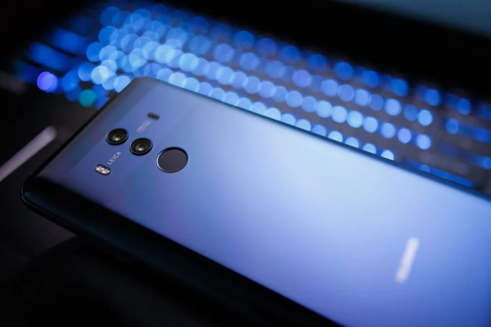

# 华为5G，下半年有戏？

**作者 |** 宋子豪

**编辑 |** 刘杨

8月11日，知名科技博主@数码闲聊站爆料称：“华为多款5G新机通过蓝牙备案，nova 13到nova
16备案型号均为5G，后面还有几个未知命名的全5G新机。”这一消息在数码圈引发了热烈讨论。不过，这条微博目前已经被删除。

今年6月以来，有关华为5G手机广为流传的几类传言包括：高通将恢复向华为供货5G芯片；华为将通过搭载骁龙8 Gen2
4G处理器+国产5G射频芯片的方式实现对5G网络的支持；华为将推出纯国产麒麟5G芯片。

其中， **关于高通恢复对华为的5G芯片供应已经被官方辟谣。**

据《第一财经》报道，6月13日，华为终端业务CEO余承东辟谣相关传言，他表示：“虽然双方一直在努力推动谈判，但目前高通对华为的芯片供应依旧处于禁令的状态。”

而后，高通和联发科相继表态，仍处在禁令状态，并未获得美国政府相关批准。

不过，在手机销量方面，华为倒是传来了好消息。IDC数据显示，在旗舰手机不具备5G功能的前提下，华为的第二季度国内销量排名已经重回前五，并且在国内高端手机市场市占比第二，可以说是在智能手机市场长期收缩的大环境下，逆势上涨。

如果拥有5G的华为回归市场，势必是下半年智能手机市场最大的看点之一。华为5G手机下半年能重出江湖吗？

1、传言中的华为5G手机

关于华为将推出5G手机的传言已久。实际上，每年关于华为会不会发布5G手机的讨论、爆料、辟谣，都够科技博主吃一年。

《豹变》向爆料称华为有搭载射频方案或麒麟5G方案的部分博主求证后， **不止一位博主表示，自己也没有确定的消息来源，博文是根据相关信息推测的。**

这种推测往往缺乏参考。比如，某博主告诉《豹变》，自己确定华为将会推出5G手机，是因为上市公司汇博云通公布了正在给华为5G手机做样机测试的消息。

但汇博云通相关公告的实际内容为：“公司已与华为海思和华为终端等华为系公司建立了长期稳定的合作关系，公司作为华为海思信息技术服务供应商之一，主要向华为海思提供芯片外场测试等服务以保障其芯片产品的质量及性能，从而有效支持华为海思进行芯片研发。”

**这条公告仅阐述了与华为的合作关系，并未提到近期在为华为做5G手机的样机测试。**

一般来说，如果爆料的科技博主具有一定影响力，可能会有厂商向其透露一些产品消息，对即将发布的产品进行预热。这是行业内常见的营销手段，或者某些博主有一定的内部员工渠道。

为了维持热度，一位科技博主可能一天要发三四条爆料，可以说是科技博主常有，而内部信息不常有。

比如，某科技博主曾在去年发微博称“明年5G稳了”，暗指2023年华为将发布5G手机。到了2023年4月，华为还没有公布相关进展，该博主则发微博表示：“我倒是觉得，打我脸挺好，今年就算可以上5G，但如果是困难重重没必要。”而等到这一轮华为5G传言兴起后，该博主又发微博称，此前自己就暗示过华为要出5G手机。

不管有没有5G手机，类似的科技博主都是两边押注，流量通吃。

排除纯属虚构的爆料之外，也有博主讳莫如深地向《豹变》表示，自己有内部员工的消息渠道，但具体的不方便多说，他说：“（5G手机）百分百回归，只是方式有点另类。”

另一名博主也告诉《豹变》自己也有内部消息，“现在已经有两个不同的手机新项目安排了5G版本，纯国产（芯片）。”

只不过， **所谓“内部消息”未必可靠。**
此前，腾讯深网在一篇报道中援引某渠道商消息，称华为终端BG首席运营官何刚曾在视频会议中透露过，“10月份之后，华为会有重大消息公布”，并且有华为内部员工暗示会有5G手机。

报道发出后，何刚辟谣称：“假消息，没说过类似的话”。

虽然众说纷纭的爆料吊足了用户的胃口，但从目前的公开信息来看，离最让消费者期待的旗舰级麒麟芯片回归，似乎还需要一段时间。

2、麒麟与旗舰不可得兼？

距华为的上一款5G旗舰芯片麒麟9000系列发布，已经过去将近三年。

在此期间，华为为推出5G手机做过不少尝试，比如授权第三方品牌代工，下放部分软硬件技术，扶持出HI
nova、鼎桥等华为智选系列手机。由于该系列品牌并不属于华为旗下，所以不受禁令限制，可以使用高通5G芯片。

**但由于华为智选系列需要和华为旗舰拉开差距，导致其配置不高。**

其后，华为的供应商数源科技在2022年6月推出5G通信壳，运用了“虚拟通信技术”可以通过手机壳内嵌的eSIM芯片，加上5G调制解调器，实现5G功能。

用户只要开通eSIM服务就可以将4G升级为5G，通信壳适配机型包括华为P50 Pro和2022年9月发布的Mate50系列。

不过， **通信壳799元的售价并不便宜，并且需要开通eSIM卡业务才能使用，还会有占用充电口、增加耗电等问题。**

虽然在官方渠道通信壳的定价还算坚挺，但在第三方平台，通信壳的售价一直在下跌，尤其三大运营商均宣布暂停eSIM业务后，部分平台的价格甚至降至两位数。

以上两种曲线救国的5G方案并没有得到用户认可，也让消费者更加期待原汁原味的华为5G旗舰机。

从目前尚未证实的爆料来看，如果nova系列继续保持一年两更的速度，华为nova 12系列预计会和往年一样，在下半年的9-10月份发布。

那么，nova 13的5G机型可能要等到2023年4月左右上市。

即使nova13提前上市，搭载在中端nova系列上的5G芯片，大概率也不会是用户最期待的麒麟旗舰芯片。

目前两种可能的5G实现方案中，纯国产的麒麟芯片性能受制于上游技术，根据路透社此前的相关报道，华为与中芯国际的N+1制程配合生产出相当于7nm的芯片。

而苹果、高通，联发科的下一代旗舰芯片，如A17、骁龙8 Gen3、天玑9300等，预计都会用上芯片厂商的3nm制程。

即使国产的麒麟芯片回归，等效7nm制程与3nm制程旗舰芯片在使用体验上也会有一定差距，大概率不会搭载在旗舰机型。

而 **骁龙8+ Gen2 4G芯片外挂国产5G射频芯片方案理论上可行**
，一名相关从业者告诉《豹变》：“如果处理器包含5G基带芯片，加上5G的射频和天线，是完全可以实现5G网络的。”

此前赛微电子宣布5G射频前端必不可少的BAW滤波器实现量产。锐石创芯、慧智微、唯捷创芯、飞骧科技、卓胜微等国内企业也在5G射频方案上有所突破，也增加了这种方案的可能性。

同时，爆料中未命名的5G手机也带给用户一些想象空间，但这样一来也表示，麒麟与旗舰始终不可得兼。

3、决胜在高端

5G的回归可能是华为下半年布局的关键所在。

根据IDC数据，在2023年第二季度，华为手机的市场份额达到13%，重回国内厂商市占比前五，并且几乎追平第四名小米。

**华为的逆袭，与之前在高端市场的优势分不开。**

手机越来越贵、用户换机欲望越来越低是不争的事实。根据Counterpoint的数据，2022年智能手机出货量相较于2016年的峰值减少了41.5%，但销售额只下降了11.7%。也就是说，过去6年间智能手机的平均价格一直保持增长。

虽然价格上涨有升级5G及各种硬件的因素。但消费者的钱包很诚实，智能手机出货量持续下跌。Canalys数据显示，2023年第一季度，全球智能手机出货量3040万台，同比下跌13.3%，为2014年以来最低的第一季度出货量。

但在这种趋势之下，高端机型的销量却逆势上扬，Counterpoint发布的《中国智能手机高端市场白皮书》显示，2017年至2022年期间，国内高端市场的年复合增长率达到了9.8%，2022年，国内高端手机销量占到整体市场的26%以上。

IDC数据显示， **今年第二季度中国600美元以上高端手机市场份额达到23.1%，相比2022年同期增长3.1%。**

国内厂商中，华为在高端市场优势最明显。2023年第一季度，700美元以上的细分市场，苹果占比79.5%，华为占比9.4%，第三名OPPO占比3.6%。

如果仅从纸面配置上来看，华为P60配置了骁龙8+芯片、4GB网络、8GB内存，而当时同价位的安卓旗舰中已经可以选择更新的骁龙8
Gen2芯片、5G网络的国产旗舰手机，部分旗舰的内存也升级到12GB。

但 **没有5G的P60系列却销量长红** ，在京东上有10万+的评论，好评率96%。这是其他品牌没有的待遇。

另一方面，有着先发优势的华为，几乎拿下国内折叠屏市场的半壁江山。

一位华为官方授权店的工作人员告诉《豹变》：“二季度P60系列和nova
11系列销量都不错，但卖得最好的是X3，到现在都没货，其他渠道据说加价三四千才能买到。”

CINNO发布的数据显示，2022年中国折叠屏手机销量达283万部，同比大幅增长144.4%。国内头部厂商几乎都实行了折叠屏加直板双旗舰的运营策略。

据艾瑞咨询，2022年各品牌折叠手机市场份额中，华为占比51.3%。并连续三年保持50%以上的份额。

此前据《中国证券报》报道，华为已上调2023年手机出货量目标至4000万部，相较年初目标几乎上调1000万左右。

**如果下半年没有5G旗舰，华为可能要打一场硬仗。**

首先，面对华为品牌自身的换机用户，一部分麒麟芯片的钉子户是否愿意换机骁龙4G手机需要打个问号。

而且，目前5G带来的换机潮几乎已经过去，其他品牌用户如果转为购买华为旗舰，也可能面对5G降级4G这种稍显尴尬的场景。

此外，禁令的影响不只是5G芯片，市场研究机构Canalys的数据显示，2022年，华为折叠屏幕在全球出货量接近200万部，市场份额位居第二，但排名第一的三星出货量接近1200万部。出货量的差距，有可能是因为华为受到了无法使用谷歌服务的影响。

在国际市场发展受制的情况下，国内市场份额竞争显得更为重要。这样看来，下半年旗舰是否支持5G，可能是华为能否重回巅峰的关键。

