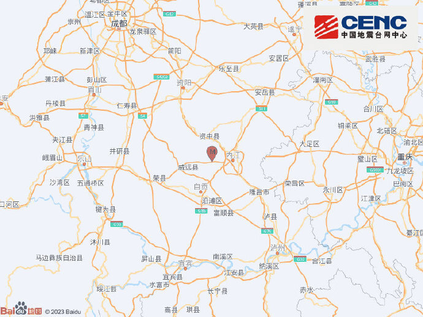
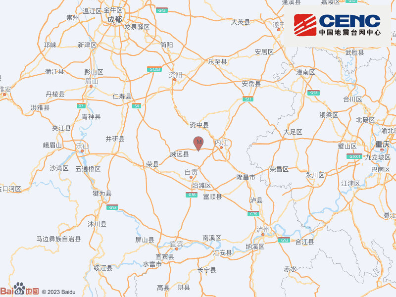

# 四川内江今日连发多次地震

中国地震台网正式测定：08月18日10时39分在四川内江市市中区（北纬29.58度，东经104.87度）发生4.0级地震，震源深度10千米。

中国地震台网正式测定：08月18日09时52分在四川内江市资中县（北纬29.60度，东经104.88度）发生3.4级地震，震源深度10千米。

中国地震台网正式测定：08月18日09时30分在四川内江市资中县（北纬29.58度，东经104.85度）发生3.4级地震，震源深度10千米。

