# 小学生满口“我没K”等网络烂梗，逐渐成为成年人心中的一根刺

**作者 | 付思涵**

小学生的“梗”，逐渐成为成年人心中的一根刺。

近期，一场引导小学生理解“网络烂梗”的班会火了。面对一见“背带裤梗”就发笑的小学生，南京市浦口区车站小学的语文老师朱文洁上了一堂生动而发人深省的班会课，引导孩子们不盲从热点，学会反思日常生活中网络语言的使用。

这并非相关话题第一次引起关注，“小孩爱说的烂梗越来越多了”“小学生把拴Q之歌写进作文”屡登报道，当“10后”与网络文化正面相遇，总会引发成年人集体性的忧虑。

1982年，写出《娱乐至死》的尼尔·波兹曼曾在另一本著作《童年的消逝》中意味深长地指出，电视的出现，取消了成人与儿童之间的界限。在电视文化影响下，儿童正逐步走向成年，知晓原本成年人认为儿童不宜知晓的种种隐秘、矛盾、暴力和悲剧。

而如今，当我们来到了一个互联网无所不包的时代，又应当如何理解网络文化对孩子的渗透，重新架起理解与沟通的桥梁？

**01**

**“坤坤”，小学生的“顶流”**

六年级女生杨桃感到很苦恼，自从上四年级以后，身边玩“烂梗”的同学就越来越多了。刚开始时，他们喜欢模仿“电摇”，常常弯曲身子，摇头晃脑，发出不明所以的抖动。后来，“鸡你太美”又开始流行起来，男生们经常把“只因”挂在嘴边，她明白这个“梗”背后的负面含义。“跟他们交流，我感到愤怒又无奈。”

“鸡你太美”来自于对蔡徐坤参加《偶像练习生》节目片段的恶搞，蔡所表演的歌曲中有一句“只因你太美”，因为发音相似，“只因”被恶搞为“鸡”，并在网络中广为流传。蔡徐坤也被许多玩梗者称为“坤坤”，然而这一昵称所包含的感情色彩，调侃与嘲讽居多。

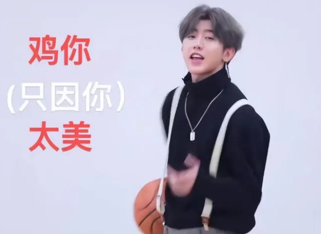

_蔡徐坤被恶搞的视频截图_

“坤坤”也出现在了家长们的视线中。来自南京的六年级小学生家长张适告诉南风窗，儿子无聊时就会蹦出一句“鸡你太美”。“他让我猜这是什么明星，我只能想到萧敬腾在《王妃》里唱‘夜太美，尽管再危险’，都不知道这是怎么跟蔡徐坤扯上关系的。”

“我们家孩子最夸张的时候，所有的话讲完都要加一个‘坤’字。家里的猫本来叫‘火心’，他非要改名叫‘火坤’。”深圳的五年级小学生家长杜岚无奈道。

类似于“鸡你太美”的网梗，出现在小学生的口头禅里，甚至是作文、美术作业、课桌涂鸦上，俨然成为小学生之间的“顶流”。大人们惊奇地发现，“网言网语”播撒到小学生这片土壤后，发展得是如此迅猛而茁壮。

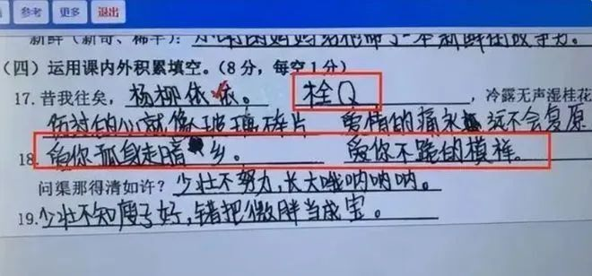

曹茉是苏州一所小学的五年级语文老师兼班主任。某天，她在教室里听到“你个老6，你个老6”，还没反应过来，另一个声音立即反击，“你才是个老6呢！”她愣了一下，为了弄明白孩子口中的“流行语”，赶紧上网查了查：原来所谓的“老6”最初出现在游戏里面，指的是游戏中的自由人，即水平高超，如隐形人一般给人一种出其不意的感觉，后来在现实中变成了“喜欢玩阴险手段的人”。

“班上大概有5到6个孩子，会在作文里用到一些热梗，像‘老6’‘yyds’等。”在深圳某小学担任五年级语文老师的岳亭对南风窗表示。他在课堂上提到李白时，学生们纷纷说，李白是“刺客”，速度快、攻击强。尽管“10后”们也会从课本上背诵诗人李白的生平，但在课堂交流场合，他们更愿意用游戏《王者荣耀》中的刺客“李白”获取表达上的快感。

 _董宇辉在直播时讲解“诗仙”李白的人生经历，弹幕却刷起了“李白是刺客”等游戏话题_

“网络‘烂梗’会束缚语言思维、削弱思考能力、固化表达方式，导致孩子们‘文字失语’。”曹茉说。热门的网络用语随意改变语言的基本组合，随意使用错字、怪字，学生在网络语言的冲击下很难体会到语言文字的庄重美感，辞不达意、语句不通的现象变得普遍。

岳亭补充道，“玩梗会导致一种固定的、套路化的反应。我们更希望学生在面对生活时，有自我意识地去观察、辨别和思考。”他举了个例子，在节庆日上，比起听到学生们说“今天学校布置得真是yyds”，他更希望听到的是，“今天学校布置得真是如梦似幻、美轮美奂”。

“有很多网络文化的恶搞、改编，非常好笑有趣，但它们是空心的，没有任何真实性作为底蕴。这种不真实感会影响孩子们的学习。”他说。

**02**

**“不再天真”的孩子**

在杨桃看来，烂梗让小学生之间的交流不再像以往一样纯粹。她觉得玩梗的同龄人有种“幼稚的成熟”“明明是学生，却说着不属于这个年纪的话”。

为何当代小学生呈现出一种令人瞩目的“早熟”？当我们试图寻找罪魁祸首时，过分发达的互联网，常常作为答案浮出水面。

“我们的孩子比以往任何时候都要消息灵通，他们知道长辈知道的一切。当儿童有机会接触到从前密藏的成人信息的果实时，他们已经被逐出儿童这个乐园了。”

1982年，针对电视文化对儿童童年的“侵蚀”，尼尔·波兹曼在著作《童年的消逝》中做出了如上断言。如果将电视的语境置换为由短视频和智能手机主宰的时代，这一论断的正确性显得有过之而无不及。

_《嘉年华》剧照_

为何当儿童与成人说着同样的话语、做出同样的行为时，我们会感到怪异，认为孩子不再成其为孩子？换言之，我们对于儿童的定位，似乎不仅基于他们有限的生理年龄，更基于他们心智上的“无知”与“纯粹”。

对此，波兹曼进行了更加直白的揭示：童年是被发明的、社会文化的产物。

追溯历史，在中世纪时，成人与儿童没有泾渭之分。中世纪的孩子生活在与成人相同的社会范围内，只要一个孩子长到7岁，习得了所有的口头语言，具备与人交往的能力，那么他就能够参与所有成人的活动。孩子们几乎是脱离了需要人照料的婴儿期，就立即投身于职业化的学徒等角色中，社会上也没有学校这样专门安置未成年人的机构。

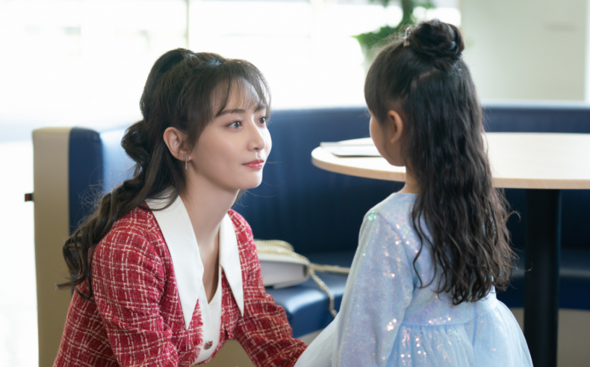

_《加油！妈妈》剧照_

直到15世纪中叶，印刷机的发明与广泛应用改变了这一切——作为一名媒介文化学者，波兹曼从传播媒介来理解社会的变迁。

不同于口语时代，印刷机将知识与经验固定下来，实现无远弗届的传播，人与人之间的交流需要以文字为中介，开始注重抽象经验与严谨的逻辑推理。一种“识字的文化”（social
literacy）诞生了，社会中的人由此被分为掌握识字和阅读能力的人，以及没有掌握这一能力的人。而前者，就成为现代意义上广泛认同的“成人”，因为拥有识字阅读的能力，也就意味着拥有理性。

当成年变得“需要努力才能挣来”时，儿童便被逐出了从前与成人所混居的世界，来到专为他们划分的“童年”世界生活。在这里，儿童接受学校教育，以便在将来习得成人的种种能力：有逻辑、有次序的思考，操控高层次的抽象概念，延迟满足和自我控制等。

在儿童变为成人之前的“保护期”，性、暴力、冲突等成人知识，要坚决远离儿童，并且分阶段地为儿童逐步揭秘。波兹曼认为，羞耻感是文明人与野蛮人相区分的标志，也因此构成儿童教育中“珍贵而微妙的一部分”。通过对成人秘密分阶段的揭示，儿童才怀着对秘密的敬畏之心，在逐步了解世界全貌的同时，将羞耻感转化为一系列道德规范。

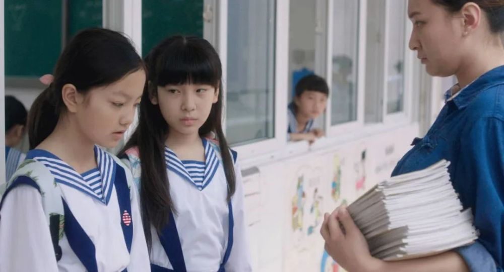

 _《嘉年华》剧照_

正是这样的“禁忌”，构成现代儿童与成人之间明确的分野，以及儿童理想的成长路径。

因而，当电视以及短视频取代了具有阅读门槛的书籍报纸，成为人们获取信息的主要来源时，成人极力向儿童隐瞒的秘密被无情地戳破。当纷繁复杂的信息如潮水向观众漫溢时，儿童“提前”接触到成人世界的种种秘辛，内心随之“早熟”。

“儿童必须通过提问进入成人的世界。由于媒介，儿童的好奇被愤世嫉俗——或者更糟——被狂妄自大所取代。于是，我们的孩子不能依靠有权威的成人，而是依赖不知从哪里来的新闻来获取知识。我们的孩子还没有提问，就被给予一大堆的答案。”波兹曼这样写道。

波兹曼的诊断，很好地道明了今时今日孩子们玩梗的“病因”：儿童的“早熟”，是社会在传播结构变革下难以逆转的趋势。当智能手机取代电视后，这一趋势更加得到了强化。如果说电视仍然有公共观看的属性、有严格的节目审查制度，那么私人化的手机和蓬勃的自媒体，则将成人试图保护的秘密演绎得更为露骨。

与互联网伴生的另一个后果是，当儿童原本因无知而淳朴的世界迅速崩塌时，他们以自己的力量建立起了一个青少年的独立世界。这个世界构成了迥异于成人主流文化的亚文化圈层。

_《少年法庭》剧照_

当我们将小学生间的热梗视作一种“社交货币”时，便很容易理解他们的玩梗行为。正如成年人流行city
walk、追捧洞洞鞋，小学生也有一套独属于自己的社交“硬通货”，并以此构成群体内部的认同。

岳亭观察到，当班里的学生大跳“电摇”、出口成“梗”时，他们所在乎的是赢得他人的目光，哪怕目光里并非全然是赞赏。“这是一种自我满足感，或者说虚荣心的实现。”

“我儿子其实并不知道‘鸡你太美’的来源。我和他讲了之后，他才知道原来只是唱歌像这四个字，但他还是想模仿，觉得能逗笑同学。所以，（这个梗）有些像是孩子们的社交工具。”杜岚说。

**03**

**谁在“定制”儿童**

在朱文洁上传到B站的公开课视频开头，当小学生听到“背带裤”就发笑时，她问学生，“哪里好笑？”此时，弹幕上飘过一片成年观众的评论：“对不起可是真的很好笑”“换我我也忍不住”。

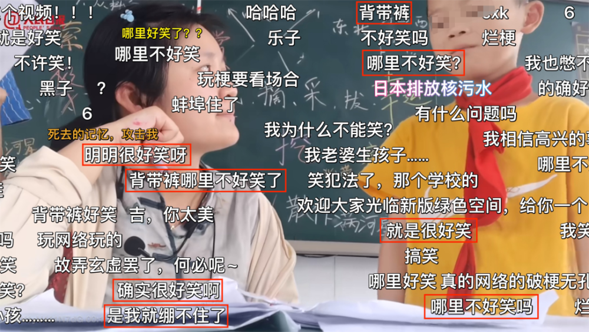

同一片海域里“冲浪”、同一个“好笑的梗”，为何成人能够免于批判地自由表达，孩子却不行？

或者说，当我们认为“网梗侵蚀了儿童的纯真”时，我们为何假定儿童本应“纯真”？

循着波兹曼关于童年的定义，我们可以发现，当成人向儿童保持秘密并逐步揭晓时，二者实际上构成了一种信息等级秩序。在这一秩序下，成人代表着权威与控制，儿童则居于更加被动的位置：他们暂时还没有权利，公开表达成人所接触到的那个粗俗、污秽、残酷的世界。

而这一体系的底层逻辑是，儿童尚不具备足够的自制力。

儿童在生理和社会心理层面尚未成熟、有待发展，是现代童年观的基本前提。其中最具代表性的学说是让·皮亚杰提出的线性发展理论。在他看来，童年需要经过一步一步的发展，臻至成熟。当儿童通往完满的成人状态，也就完成了思想从简单到复杂、行为从非理性到理性的进化。

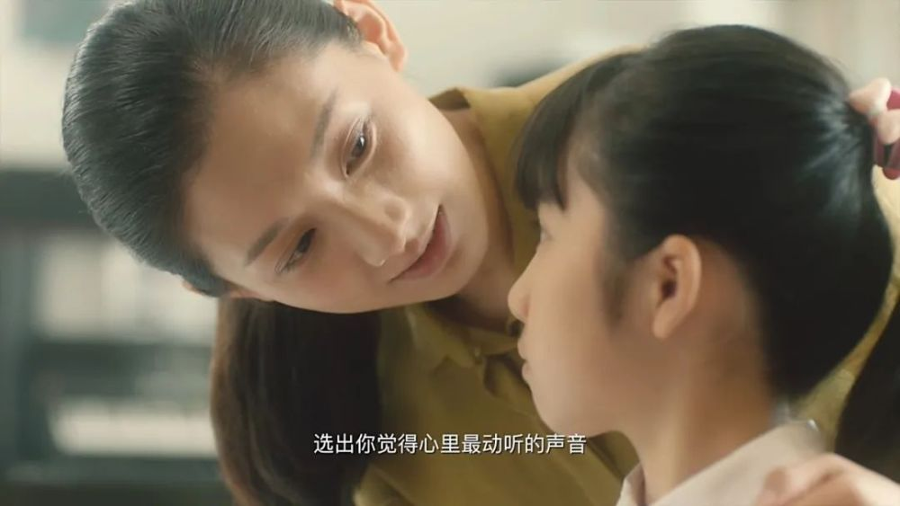

_《你好，旧时光》剧照_

然而，线性发展理论却包含着一种致命的价值取向——当童年的一切被视为朝着成年的“未来”而努力时，真正发生在“当下”的童年便沦为工具。儿童被作为成人的附属，成年则被晕染上成熟圆满的光环。

身为成人，我们应当认识到一个事实：我们所谈到的大多数童年，并不由儿童自己代言，而是由我们自己来描绘的。

“成人通过创造童年的定义，进而创造了儿童的生活样式和内容。”《童年之死》的作者大卫·帕金瀚指出，成人建构童年的观念是为了表达自己某种情感、记忆或者期望。波兹曼也有类似的表达：“现代童年的范例也是现代成人的范例。当我们谈论我们希望孩子成为什么的时候，其实是在说我们自己是什么。”

因此，成人在对儿童的凝视中，投入了一定程度的自恋与想象。这也导致他们在面对儿童问题时容易滑向两个极端：或假设孩子们一尘不染，或过度担忧孩子身上的“恶”。

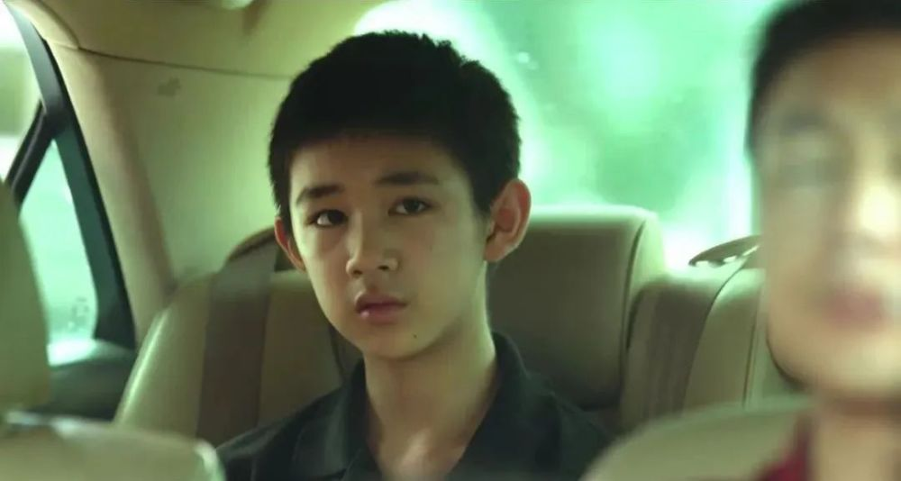

_《隐秘的角落》剧照_

社会学家克里斯·简克斯从历史上归纳了两种关于儿童的经典观念：酒神式儿童观，与阿波罗式儿童观。前者认为孩子们是小恶魔，天生顽皮、不守规矩；后者则将孩子们描绘成小天使，生来善良无辜。然而，这两种观念无不从静态刻板的角度理解儿童，无论“好”或“坏”，儿童的行为都被认定为其与生俱来的本质，必须由成年人加以塑造或控制。

怜爱与忧惧，因而构成大人对儿童的认知基调。这也就不难解释，为何当小学生“玩梗”进入公共视野时，我们会产生深切的忧虑。因为，我们一方面认为其天真脆弱，不容污染，一方面又担忧他们一经污染，便堕入深渊。

“成年人在过往生活中已经形成了一定的掌控感，觉得自己能掌控孩子的想法和需求，但事实挑战了他们的这种自恋。他们处于一种自恋被打击的状况，会产生一定的失控感。”南京大学教育研究院副教授、江苏省教育厅心理健康教育专家指导委员会副秘书长费俊峰向南风窗解释道。

日益扁平化的网络，正在使成人对于儿童的规范与控制力所不逮，至少在文化方面如此——让家长头疼的小学生“玩梗”就是例证。

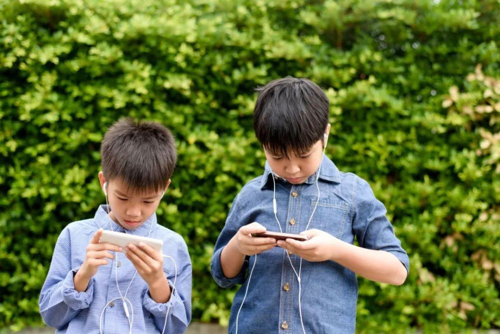

玛格丽特·米德在其著作《文化与承诺》中指出，我们正在进入一个日新月异、信息公开的世界，成年人已经不能扮演年轻人的导师角色，因此导致了一种“信仰危机”。

在波兹曼笔下，电子媒介的冲击打破了成人与儿童间“权威—好奇”关系的平衡，这一冲击在智能手机时代来得尤为猛烈。喧闹的短视频里，对童年的定义权、对儿童行为的掌控，正加速从成人手中逸散。

这一冲击与挑战，使我们不得不更新对于儿童的认知：若想达到有效的教育，首先，我们如何做到真正的走近与理解？

**04**

**空白书写板，或一株野生的植物？**

“应对之道是‘正常化’。亲子、师生之间不加评判与指责地平等沟通。我们带着好奇去了解，孩子们的表达是什么，为何用这种方式表达，他们满足了什么。”针对小学生“玩梗”，费俊峰对南风窗指出。

面对“网梗”在小学生与成年人之间竖起的屏障，解决的良方，唯有理解与沟通。

朱文洁在那堂走红的班会课上，是这样对学生们说的：“气球是空心的，所以当一阵风飘过来的时候，气球就飞走了；而蝴蝶在风吹来时，会迎风起舞。它们的区别在于，蝴蝶面对风，有自己的思考。小朋友们，你们是愿意当气球，还是当蝴蝶？”

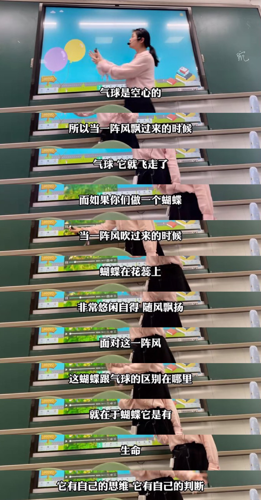

_朱文洁用“做有生命、会思考的蝴蝶，不做随风而飞的气球”引导小学生理解“网络烂梗”_

岳亭告诉南风窗，网络文化非常考验学生的自我辨别能力，五年级的孩子正处在自主意识发展和彰显的阶段，他会利用这一点做出引导。“我跟学生说，我们都是高年级的孩子，高年级孩子要有自己的判断，对不对？”

曹茉则精心设计了一堂主题为“孩子，擦亮你的眼睛”的班会课。她先是让孩子们小组讨论，分辨出“积极向上/低俗不健康的网络用语”，又播放了一则讲述网络烂梗对人造成伤害的案例故事，孩子们对故事主人公纷纷写下安慰的小纸条，“可可姐姐不要难过，我们都会支持你！”在批判之外，她还从报刊新闻里截取了一些网络语言使用得当的语句，让学生们从中体会，应当如何正确地运用网梗。

从“网络冲击下一代”的焦虑里回过神来，我们会发现，在难以逆转的技术趋势下，能够努力的功课是，我们如何建设温润的亲子和师生关系，如何在成人与儿童间建立通畅、健康的交往。

我们对于儿童应如何教育的所有看法，可以归结为两种截然不同的比喻。启蒙运动时期，英国思想家洛克在《教育漫话》中写道，人类的头脑生来是一张空白的书写板。因此，儿童正如一本尚未写好的书，在儿童的心灵上写下的内容，使得书页被填满，儿童由此走向成熟。

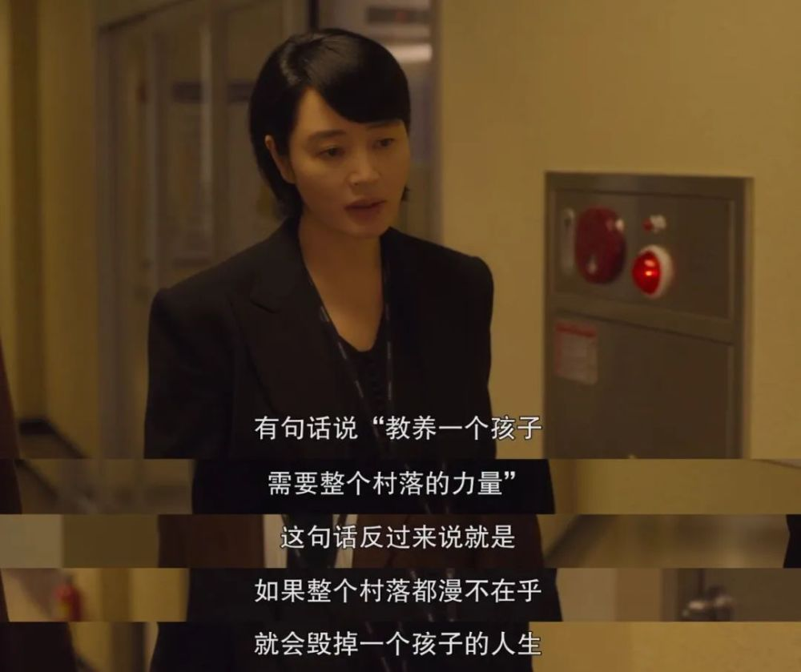

_《少年法庭》剧照_

而另一位启蒙思想家卢梭则主张，儿童是一株野生的植物，其生长是有机和自然的，几乎不能靠书本来获得改善。儿童具有自发性、纯洁、力量和欢乐的美德，只要不被文明的阴影所窒息就已经是万幸。

“洛克寄希望于教育带来一本丰富、多样和翔实的书；卢梭则希望教育带来一朵健康的花朵。”我们能够获得的启示是，既尊重儿童的自有天性，又使其得到循序渐进的教化与培育，在两者之间寻求平衡。

“双向沟通很重要。无论网络用语、电子游戏还是某种行为，家庭里应有更多的开放式讨论，让孩子收获不同的看法，形成自己的判断。”家长杜岚对南风窗表示。

例如，孩子曾经不能理解她为何会花钱去听某位歌手的演唱会。她解释，因为那位歌手的歌声特别能引起她的共鸣。这时，孩子的爸爸说自己的偶像是姚明，他给孩子播放了姚明的比赛片段和纪录片，说姚明不仅努力，还幽默、举重若轻。“从那以后，孩子就比较理解‘偶像’这件事了。”

乔乔是一名五年级小学生的家长，常常在社交媒体上记录她和女儿之间的对话。有一次，女儿对她发“麻麻，come
on的胃，接呀”，乔乔不明所以，百度之后回复女儿，“麻麻应该接ABC？”她在帖子里写，“以为我会唱孤勇者已经抓住她的心了，没想到还有一个come
on的喂（捂脸）”。

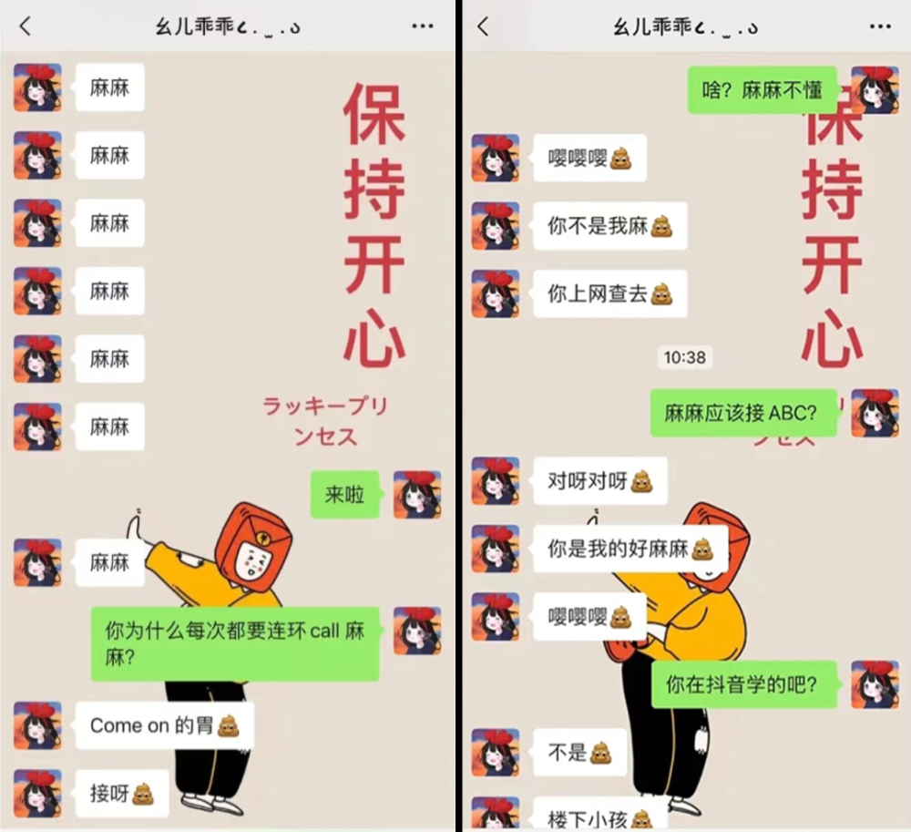

_乔乔和女儿的聊天记录 / 图源受访者_

“我和她的相处模式更像是朋友，从来不会因为自己是她母亲，就拿这个身份要求她、压制她，所以她很乐于跟我分享。”乔乔说，她能够站在孩子们的角度理解他们的世界，因为自己也曾从这个年龄走过来。

“其实收获还是蛮多的，我了解到孩子的世界是丰富多彩的，也算是成人世界的一个缩小版。他们之间会有复杂的关系，也会有积极向上的一面。”

“我希望，成人和儿童之间是一种建设性的对话关系。我们在对话中更加地了解彼此，同时也保有自己。就像哲学家马丁·布伯所说的我—你关系，我在你的眼睛里看到了我，在我的眼睛里看到了你，但你是你，我是我。”费俊峰说。

（文中杨桃、张适、杜岚、曹茉、岳亭、乔乔皆为化名。）

编辑 | 向由

排版 | 八斤

关注南风窗，查看更多精彩内容

