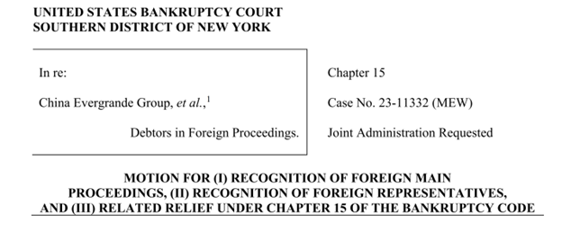
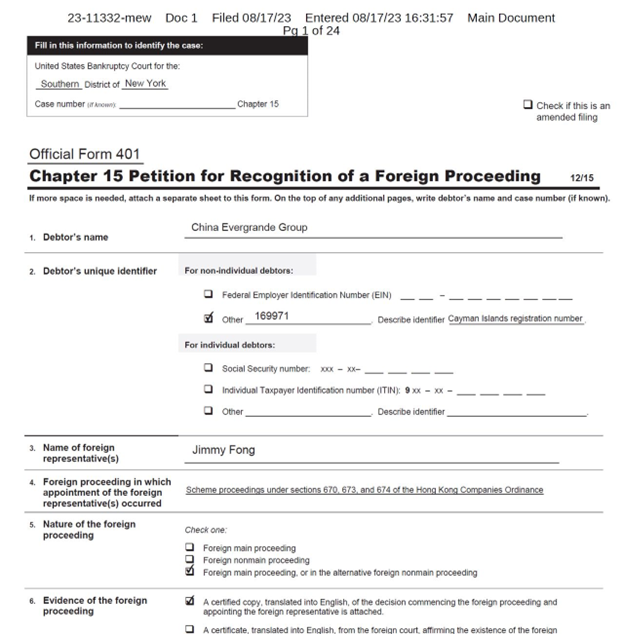

# 恒大申请破产保护文件独家曝光：属正常程序 防止资产被强制扣押

腾讯新闻《潜望》 作者 纪振宇 厉海

深陷“债务泥潭”的房地产开发商恒大在美国时间8月17日向纽约南部曼哈顿破产法院提交《美国破产法》第15章，申请破产保护。

腾讯新闻《潜望》在当天独家获得的这份申请文件显示，这份文件的主要目的是向法庭解释，为何恒大目前的情况符合破产保护，这份文件还指出，恒大在海外并没有重大资产，美元债的偿还主要是通过子公司的分红来进行。

一位在美国从事多年商业案件的资深律师对腾讯新闻《潜望》表示，提交破产重组是陷入财务困境的企业惯常的程序，目的是为了最大化保护资产，以便接下来的重组或清算过程，能够在法庭的介入下得以顺利完成。

具体到恒大提交的这份Chatpter 15
破产重组申请，他认为，此前恒大的债务重组方案已经获得了债权人小组的通过，为了确保在接下来的投票会议上，该方案能够顺利获得通过，此时提交破产申请保护是一个正常的流程，主要目的是为了避免在进行债务重组方案投票前，债权人方面的干扰，这也是破产重组案中惯常的程序。

目的：为下周债务重组保驾护航

恒大此次提交的破产重组申请，包含恒大母公司及其子公司景程和天基，申请文件称，“（债务人）寻求全面执行重组方案的条款以实施重组。为此,重组方案和外国法院命令必须在美国具有约束力和可执行性，且必须禁止方案债权人在美国采取任何可能阻碍外国诉讼程序所实施重组的行动”。

《美国破产法》第15章的设计目的在于，保护和最大化外国债务人资产的价值，并促进陷入财务困境企业的重建。

腾讯新闻《潜望》在8月17日独家获得的法庭文件披露，恒大目前发行在外的美元债面值为142亿美元，截至今年7月31日累计余额为168亿美元。

值得一提的是，恒大此次提交破产重组文件的时间点，恰好赶在重组会议的前一周。根据法庭文件披露的信息显示，恒大及其子公司景程和天基将在8月22日、8月23日和8月28日三天进行重组会议，债权人将在会议上就离岸债务重组计划进行表决；而据此前媒体报道，香港法院将于9月5至6日就恒大集团离岸债务重组举行聆讯，以决定是否接受债权人8月就离岸债务重组计划的表决结果。

根据香港和英属维京群岛的相关法律，重组方案需要51%以上的债权人或者持有至少75%债务总额的债权人投票通过。具体来看，恒大拟通过在开曼群岛、香港或其他适用的司法管辖区的协议安排进行拟议重组。

根据恒大此前公布的重组协议，恒大协议安排下将会有两组债务，即“A组”和“C组”：A组债务包括10笔美元优先担保票据、1笔港元可转换债券和1项私募贷款；C组债务包括私募债、回购义务及公司就若干境外及境内债务提供的担保。

另外，A组债权人及C组债权人均可从恒大协议安排下的两个协议安排对价方案中作出选择，即“方案1”及“方案2”。

在方案1下，债权人将收到中国恒大发行的期限为10至12年的新票据（“A1/C1票据”）。

在方案2下，债权人可以选择将其可获偿金额转换为（取决于调整和重新分配）：由中国恒大发行的期限为5至9年的新票据（“A2/C2票据”）；由以下权利及工具组成的组合：中国恒大发行的可兑换恒大物业服务集团有限公司股份的强制可交换债券、中国恒大发行的可兑换中国恒大新能源汽车集团有限公司股份的强制可交换债券、中国恒大发行的强制可转换债券及中国恒大发行的证券挂钩票据（统称“A2/C2组合”）；或“A2/C2票据”和“A2/C2组合”两者的组合。

成功先例：瑞幸咖啡

值得注意的是，此前陷入财务造假危机的瑞幸咖啡，在债务重组时也选择了相同的路径，向美国法院申请破产重组。彼时瑞幸咖啡根据《破产法》第11篇第15章（Chapter
15
Petition）向美国纽约南区破产法院提出申请。目前公司正在与其利益相关者就公司财务重组进行谈判，通过加强公司的资产负债表，使公司能够继续经营，同时为所有利益相关者谋利益。

瑞幸咖啡表示，作为公司重组的重要步骤，也是开曼程序下常见做法，临时清盘人向美国法院提起程序，寻求美国法院对于公司目前在开曼进行的临时清盘程序的认可。该程序将会暂停美国境内针对公司的诉讼程序，为完成开曼重组创造条件并有序完成重组。

过去有诸多公司通过申请破产保护，获得喘息重生的机会。一位中银律所律师表示，美国《破产法》第15章主要是针对外国程序的承认和救济，破产作为概括性的、为全体债权人利益而进行的执行程序，其最根本宗旨就是要实现全体债权人的公平清偿。此外他介绍，需要获得第15章“对外国程序的承认和救济”的申请材料并不复杂，在材料符合法院要求的情况下，很快会得到批准。

根据第一财经报道，一旦外国实体根据Chapter
15申请破产，美国破产法院就可以授权受托人或审查员开始行动，并且在不违反美国法律的情况下，允许美国法院向外国代表提供额外的帮助；在外国法院的法律可能缺乏的情况下，允许美国法院为提出破产申请的外国国民提供额外的帮助；赋予外国债权人参与美国破产案的权利；防止在破产案件中对外国债权人的歧视；需要在美国提交的破产案件中通知外国债权人；赋予外国债权人在美国破产案件中提出索赔的权利。

2022年瑞幸咖啡宣布公司已经顺利完成债务重组，在债权人的支持下，公司正式结束作为债权人的破产保护程序。这意味着公司在任何司法管辖区不再受到破产或破产程序的约束。未来，公司将持续致力于增强公司治理和内控，并且专注于业务长效增长和盈利能力提升，为股东创造长期价值。瑞幸咖啡董事长兼首席执行官郭瑾一在公告中表态，债务重组的完成标志着瑞幸咖啡的新开始。

艰难的谈判：寄望于复牌

相同的路径，恒大是否能复制瑞幸咖啡的成功？

截至2022年底，恒大的债务总额已达到2.4374万亿元，其境外债务超190亿美元。而在此前的3月份，恒大公布了最长12年的外币计价债务重组方案，其中包括将债券等转换为关联企业的股份。

恒大于8月16日晚宣布，原定于8月22日和23日举行的债务重组谈判将推迟到8月28日。在谈判之前向美国法院申请破产保护，亦是为了在即将到来的谈判中占据主动权。

恒大寄希望于在此次债务重组谈判中达成结果，解决债权人向香港特别行政区高等法院提出的清盘呈请问题，并赶在18个月的停牌大限之前恢复股票交易，盘活资产。

中国恒大股票自2022年3月21日上午9时于港交所停止买卖，至今已停牌近17个月，根据港交所2018年修订的规则，对于连续停牌18个月的证券，港交所可以对其进行摘牌。就在今年4月，江西房企新力控股上市地位被港交所公告取消，成为第一家因停牌超18个月被摘牌的房企。

距离港交所的18个大限，目前中国恒大仅剩余1个月时间。中国恒大补发延期财报，以及推动境外债务重组谈判，都被视为中国恒大自救的信号，以向外界证实自身有足够的业务运作并且拥有相当价值的资产支持其营运。

此外，根据港交所的复牌指引，中国恒大还必须撤销或解除掉债权人提出的清盘呈请。2022年6月，一家名为Top Shine Global Limited of
Intershore Consult （Samoa）
Limited的公司，向香港特别行政区高等法院提出对本公司的清盘呈请，该公司曾为中国恒大“房车宝”的战略投资者之一。

随后恒大多次发布针对清盘呈请聆讯延期的公告，根据最新公告，呈请的聆讯推迟至2023年10月30日。

但从恒大补发的财报数据来看，净资产约为-5991亿元的中国恒大面临的状况极为困难。在外部输血关闭，自身造血无望的当下，中国恒大在自救路上，前路漫漫。

