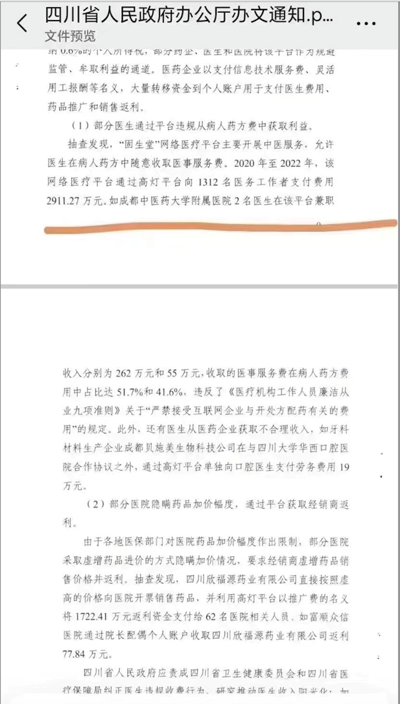

# 有医生网上接诊赚262万，互联网医疗平台成了一条隐秘通道

 _图源：视觉中国_

特约作者 | 陈方

编辑 | 陈弗也

出品 | 棱镜·腾讯小满工作室

8月14日晚，一条官方文件截图在网上流传，引发关注的是，该文件首次将整顿医疗乱象的重点扩展到了互联网医疗领域。文件写道，医药企业以支付信息技术服务费、灵活用工报酬等名义，将药品推广、销售返利的费用转到医生的个人账户中。

_（图片来自于网络）_

“这个现象并不少见。”一位在职医药代表向作者介绍，“不少互联网医疗平台就是这样走过来的，不过，最近查的严，这种现象少了很多。”

2014年，被称为“互联网医疗元年”，一些互联网医疗平台喊出了“颠覆传统医疗”的口号。没想到，9年过去了，它们不但没能颠覆传统医疗，反而路子越走越窄。过去几年，“互联网医疗就是卖药”的质疑也不绝于耳，创业先锋们的初心也逐渐被磨平。

更为糟糕的是，部分互联网医疗平台甚至沦为了医疗乱象的隐秘渠道。

**“挂上100个号，把钱给到医生”**

262万元，这是上述文件提到的一个数据。

根据文件内容，在2020-2022年的三年间，一家中医互联网医疗平台累计向1312名医生支付2911.27万元的“医事服务费”，个别医生在该平台兼职收入竟然达到了262万元。

“医生线上问诊收取服务费，其实是合理的，毕竟人家付出了劳动。”一位从事过药代工作的人士向作者表示。不过，网上问诊应该收费多少，这里面却有很大的门道。

上述文件写道，这位兼职收入高达262万元的医生，收取的“医事服务费”就占药方总费用的51.7%。但是，网上诊疗，没有CT、核磁等检验检查费用，也没有手术操作、医用耗材，有的只是诊疗费和药费。

问诊费用达到总费用的一半以上，这显然超出互联网医疗的应有之义。国家相关规定已对互联网医疗平台的问诊费用进行限制，比如，作者在这家互医平台上看到，一般主任医师的“医事服务费”达到300元，一些高年资的医生“医事服务费”也能达到200元。

除医事服务费外，还有药事服务费，这也是医生的医疗服务费用，按照国家规定，医生不能在互联网医疗平台收取“药事服务费”，只能收互联网复诊费、会诊费等。

一位医药代表向作者揭开了一些高额药事服务费的秘密：“比如，医生开我的药特别多，我就在互医平台上给这个医生挂100个号，不就合理地把钱给到医生了么？”

上述从事过药代工作的人士也向作者介绍：“一些医药企业会选择从医生那买患者信息，就和当年招聘网卖信息差不多。”有了真实的患者信息，虚增网上挂号量就顺理成章了。

其实，国家很早就对这种行为有所限制。2021年年末，国家卫健委、医保局和中医药局联合印发《医疗机构工作人员廉洁从业九项准则》，第一条就是“合法按劳取酬，不接受商业提成”，条款中明确提到：严禁接受互联网企业与开处方配药有关的费用。

这条规定限制了医生开方的权利，但是在各种“服务费”的名号下，这条灰色利益通路也被打通。

线上的患者群往往都很大，随着网络销售方式的多样，这些第三方互医平台会更加精准地触及患者，然后通过小程序等方式推广药品、保健品、医疗器械等。在医院，医生需要指示患者家属“到医院门口的药店”去买买药，但在线上，只不过是一个弹窗、一个点击而已。

**平台亏损，医生兼职却赚百万**

在行业鼎盛时期，全国平台型互联网医疗企业达数千家。但直到目前，国内互医行业始终尚未形成合适的盈利模式，大批想要在这个行业里“捞金”的玩家在2017年关停、注销。

自那以后，不少互联网医疗平台在赔钱运作，但这并未阻止市场和资本的热情，尤其是近几年，一些外卖平台都可以对接到医生问诊。

在2018年初举办的“领航者大会暨2018品牌医生年度盛典”上，某在线医疗问诊平台创始人分享了公司当时的业绩数据。其中，引发社会关注的是这个平台对医生的“奖励”：2017年，利用业余时间在网上接诊的医生，最高收入达到139万元。

平台公布这个数字，是想要吸引更多的医生加入。聚拢了更多医生，平台才有和药企商谈的基础，医生是部分互医平台最珍贵的资源。

而对于药企来说，只要医生能多开出他们的产品，无论是在平台上还是线下，对他们都是价值。药企可以通过这些平台将利益输送给医生，比如，部分医院隐瞒药品加价幅度，通过平台获取经销商返利。

从两票制到药品集中采购、医保目录一年一更新，医疗政策在不断围堵药企的销售费用，目的只有一个：减少流通中的加价，降低患者的就医成本。

互医平台的出现，本是为了方便患者就诊，但在实际的操作中，部分平台变了形：为了保持业务流水，拉来更多的医生和患者，他们走向了反面，成为药企销售费用的一个隐秘通道。

主流的互联网医疗平台显然更为规范，大浪淘沙，一些不规范的行为也会被逐一清理。这一轮医疗反腐，互医平台这个角落也已经被关注到，其实是件好事。

