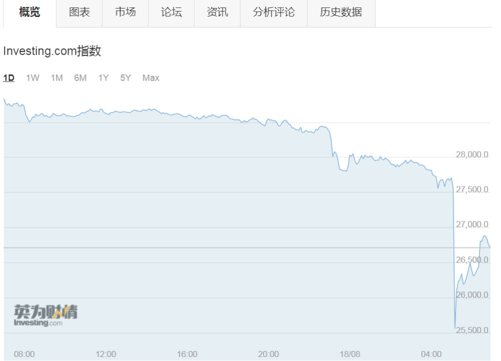
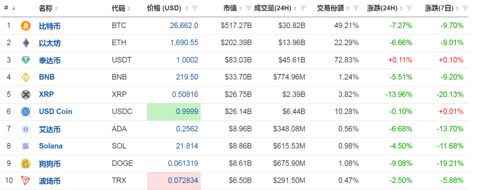
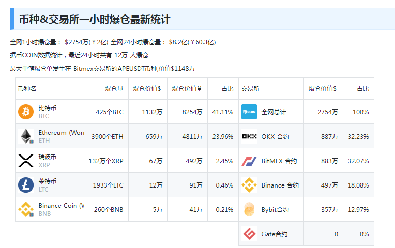

# 比特币凌晨突发暴跌！一度击穿26000美元关口，全网24小时12万人爆仓

每经编辑：杜宇

大型加密货币在今日（8月18日）凌晨突然暴跌，比特币一度击穿26000美元关口，以太坊短线暴跌近200美元，1小时内全网爆仓量跃升至6.5亿美元。

截至发稿，比特币报26662美元，跌幅7.27%；以太坊报1690.55美元，跌幅6.66%。

据界面新闻8月18日消息，早前据《华尔街日报》报道，文件显示，马斯克旗下太空探索技术公司（SpaceX）在去年和2021年将其持有的比特币价值减记了3.73亿美元，并出售了这种加密货币。特斯拉此前对其持有的比特币也采取了类似的做法。目前尚不清楚SpaceX出售比特币的时间。

_图片来源：视觉中国-VCG211156924488_

另据媒体报道，在全球各国国债收益率攀升至最近约十五年来最高水平之际，避险情绪给加密货币市场带来压力。

“当你考虑到债券市场上发生的一切，比特币下跌就很容易理解”，Oanda高级市场分析师Edward
Moya在报告中表示。“如果避险情绪成为华尔街的主流，那么看跌势头之下，比特币可能会下探27,200美元这个水平。”

据币COIN数据统计，最近24小时全网共有12万人爆仓，8.2亿美元（约60亿元人民币）资金蒸发。

每日经济新闻综合界面新闻、华尔街见闻、公开数据

