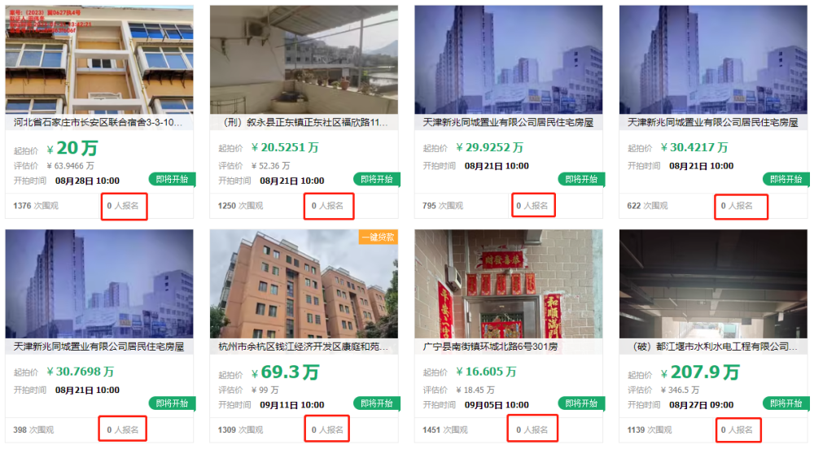
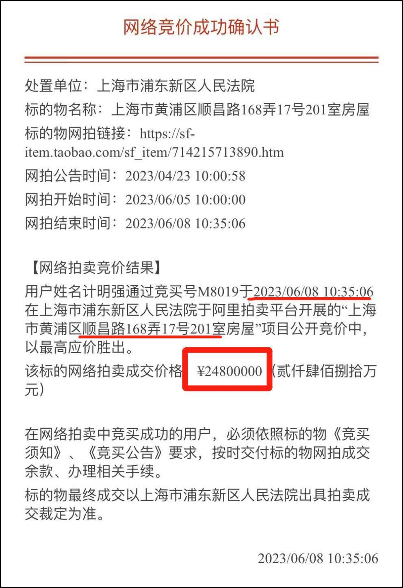
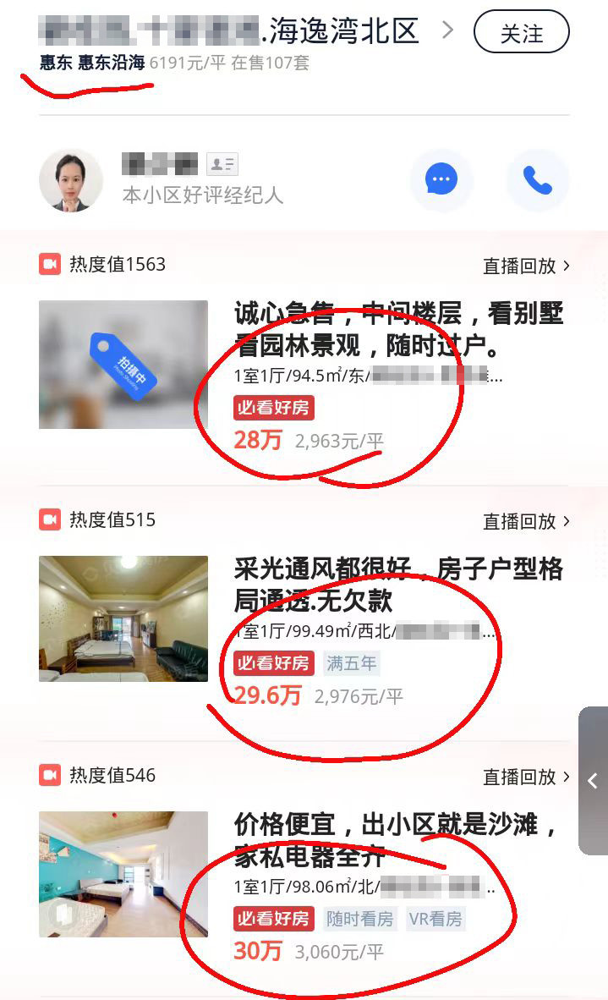

# 法拍房骤增背后：越来越多购房者因收入难覆盖房贷，选择“主动断供”

（文/张志峰
编辑/马媛媛）近日，关于“越来越多人弃房断供”的言论仍在发酵，尽管已有如深圳等地金融监管部门辟谣，但多个城市法拍房数量、二手房挂牌量增多，成交量减少却是不争事实。

而相较于此前因“交付危机”引发的集体断供潮，此轮法拍房、二手房增多，更大原因在于越来越多的购房者因收入难以覆盖房贷，导致的被动断供。

更为严峻的是，部分地区二手房价格下行，所购买房屋的市场价值已接近甚至低于待偿还的房贷金额，购房者主观还贷意愿降低，开始面临“亏钱还贷保个人征信”还是“断供及时止损”之间的抉择。

有行业人士向观察者网分析称，目前出现流动性危机的不仅仅是房地产企业，连带着以高杠杆购房的家庭同样如此。过去二十年间，不仅仅是炒房客，几乎所有人都习惯了以房价上涨作为主要财富增长手段，也习惯了高杠杆购房，而忽视了其间风险。但如今房价上涨势头遭到遏制，房子骤然回归本身的居住属性，仍以原有的购房逻辑来看自然无所适从。

**法拍房不实时反映断供情况**

日前，有自媒体发布视频，将深圳楼市现状描述为“越来越多的人选择弃房断供，目前深圳断供房数量为146549套”。

针对此传言，深圳金融监管部门很快回应表示：视频内容严重失实，纯属谣言。

该金融监管部门称，目前深圳市房地产贷款按揭不良率为0.23%，一直保持在较低水平，没有明显变化。如果按照传言中的深圳断供房数量，以断供房平均未偿贷款100万元/套的保守假设测算，仅按揭不良贷款就超过1400亿元，这与实际情况严重不符。

事实也的确如此，深圳作为过去十年间，全国楼市走向的风向标城市，业内普遍认为，是全国房价最为抗跌的城市之一，目前房地产市场颓势尚未在深圳有直观表现。

就如同不久前上海著名豪宅翠湖天地折价1000多万元挂牌一样，降幅较大的房源显然只是个例，而非常态。

金博大律师事务所合伙人曹文峰律师也告诉观察者网，长期来看，如今法拍房增多确实与越来越多人弃房断供存在因果关系，但不会传导得这么快。一般是银行作为债权人与贷款人协商无果，才会向法院提起申请，然后才会进入法院查封、起诉、受理、裁决、执行等诸多流程，最后进入拍卖程序，这一过程通常需要1-2年。

因此在他看来，法拍房数量变化只能反映一个大致趋势，并不能实时反映银行断供情况。现阶段的法拍房数量增多，实则是过往几年中企业破产、用户断供等事件长期积累的结果。

此外，对于此次“深圳大面积弃房断供”谣言，国家高端智库CDI研究员宋丁向媒体表示，这次金融监管部门的辟谣力度不够，应该要明确告诉大家目前深圳有多少套断供房，而不是只说不良贷款率是很低的。在现在这个市场环境下，虽然没有精确到十多万套，但是可能相当多的人相信断供房的数量很多，使得大家对楼市越来越失去信心。

要知道，无论主动断供还是被迫断供，在如今二手房挂牌量猛增，却销售不畅的背景下，绝大多数房屋最终还是难逃被折价法拍的命运。

**二手房横盘加剧法拍房积累**

事实上，根据阿里拍卖平台的数据，2022年全国法拍房的数量就已经一路狂奔到了200万套。

2023年上半年，根据中指监测数据，全国法拍房挂拍套数再次新增30.4万套，较上年增加19.7%；而成交套数仅5.2万套，远远不及增长速度。从挂拍物业类型来看，住宅、商业为法拍房主流，住宅2023年上半年挂拍量17.9万套，占总体59%，逐渐成为法拍房的主力。

分省份看，上半年挂拍量较高省份四川首次超4.5万套，同比增加15472套、增幅51.3%。其他省份如广东、重庆、河南、江苏等均有不同程度增加，其中广东前6个月挂拍同比增加7987套，河南前6个月挂拍较上年同期增加10101套，增幅高达63.38%。

值得警惕的是，7月份以来，就目前各城市监测数据来看，无论法拍房数量增速还是二手房挂牌量相较上半年都有进一步提升的趋势。

易居研究院研究总监严跃进告诉观察者网，受近两年整体经济环境影响，部分省会城市以及绝大多数三四线城市房价下滑的同时，导致打工人和小商贩收入降低，而房贷固定支出不变，导致无力偿还，迫不得已只能停贷。

此外，不少中小企业破产，作为抵押物或者公司财产进入破产清算程序的房屋数量不断增加，也是导致法拍房数量上升的重要因素。

值得一提的是，法拍房之所以存在一次性全款付清、暗含潜在的债务纠纷等多种弊端，依旧能够顺利参与市场流通，最为核心的因素是其价格远低于市场价，存在较大的“捡漏”机会。

然而随着近期二手房市场“横盘”，部分区域房价本身就已进入快速下行区间，法拍房原有的优势也就逐渐减弱。

仍以今年7月“上海顶级豪宅翠湖天地房源折价千万”为例，该房源原本就是6月份从法拍房流入市场，中标者原以为2480万元成交价远低于市场挂牌价，怎么也能赚上一笔，却不想接下来一个月内，该房源在二手房市场挂牌价格从3188万元一降再降却始终无人问津，最终在其他债务压力下，无奈下只能一次性将价格下降至1999万元，才引来众人围观。

有行业人士告诉观察者网，在过往房地产上行周期中，法拍房早已诞生了无数上述购房者一样的“职业玩家”，专门从事“法拍房捡漏”工作，负责处理完法拍房源（尤其是豪宅）的潜在隐患和风险之后，将之重新投入二手房流通环节，从中赚取差价。如今随着破产企业增多，法拍房潜在风险增加，却在投入二手房市场环节受阻，且价格随时面临下跌风险，因此大量类似机构离场，这也是如今法拍房数量增多，但成交率大幅下降的原因之一。

**主动断供更值得警惕**

恶性循环之下，导致法拍房增多的因素中，比之破产清算、被迫停贷等，更加令人担忧的是，随着部分地区二手房价格下行，所购买房屋的市场价值已接近甚至低于待偿还的房贷金额，部分购房者宁愿牺牲个人征信，也要“及时止损”，主动停贷。

最为典型的案例，就是今年7月郑州一名业主“免费送房”的新闻，尽管后来证实只是该业主试图引人关注的“噱头”，却引发多地购房者争相“模仿”，发出类似消息，其背后原因足以引发行业警惕。

据观察者网了解，该房源所在的曼哈顿小区，最早于2007年开盘时，均价仅4700元/平方米，仅因为后来附近的曼哈顿商业中心开业，又通了地铁，短短几年间房价飙升，至2018年巅峰时二手房价格约2万元/平方米，与周边新房价格相当，

该名业主正是此时“上车”。据其介绍，该房源共69平方米，入手总价119万元，贷款总额90万元，还了5年还剩余80多万元。

而随着近两年市场下行，房价最先下跌的便是此类房龄相对较长、居住体验较差的“跟涨”房源。

贝壳APP显示，目前该小区房源在售同类房源挂牌价约为1.2万元/平方米，相较2018年高峰时大幅下跌将近40%。

换句话说，该业主此时即便重新购买一套同类房源，总价款也不过82.8万元，与上述房源，且无论贷款利率还是首付比例，都要比其现有房源划算得多。因此该业主表示，只要有人愿意帮忙还贷，可以免费将上述房源过户。

相较于作为省会的二线城市，更多三四线城市中，类似相对老旧的学区房、跟涨房源，以及较偏远区域文旅配套房源，下跌幅度更加惊人。

有惠州惠东县沿海区域购房者向观察者网表示，其所购房源2018年开盘均价为1.5万元/平方米，如今刚刚交付没多久，二手房市场挂牌价却仅剩余不到3000元/平方米，跌幅高达80%。

为表达不满，购房者们单方面签订“集体断供协议”。目前，该购房者表示，正在就此问题与银行方面进行协商。

有资深律师向观察者网表示，单从法律方面来看，上述断供协议并无法律效应，而购房者与银行签订的贷款协议，也不受房价下跌影响，正如过去几年，房价上涨时，银行亦不能以此为由，向购房者额外收取费用。

在他看来，主要原因还是经历了过去房价快速上升周期后，所有购房者都习惯于将购房行为理解为“稳赚不赔”的投资行为，事实上很多房源的价格本就与其自身价值脱节。相比之下，一线城市及强二线城市核心地段房价就几乎不受此轮下行周期影响。

而从长远来看，清除行业弊病的过程必定伴随着阵痛，挤去泡沫后的房地产市场才更能快速地回归健康发展。

