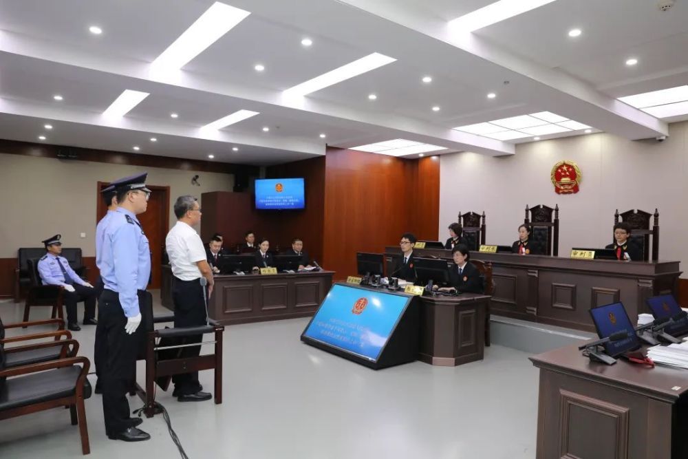
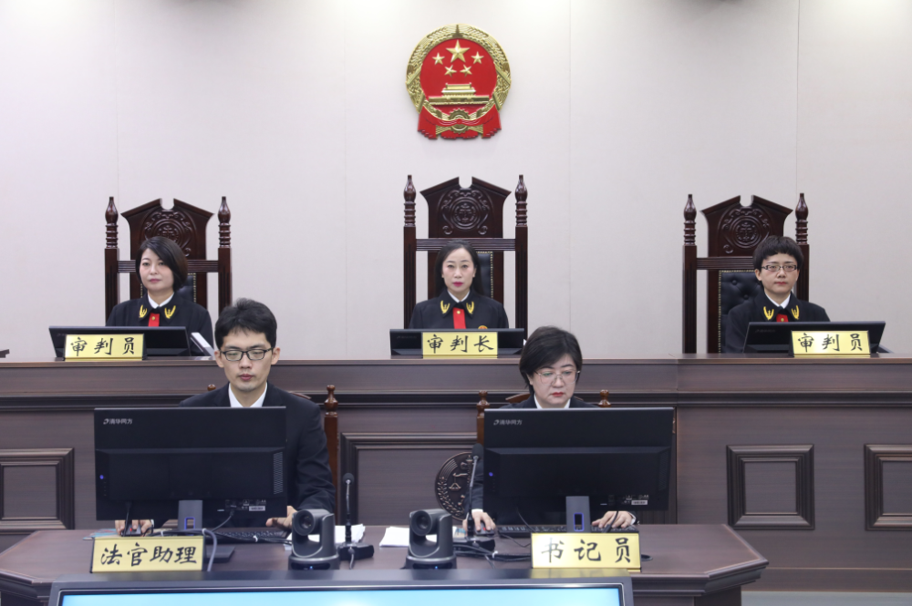
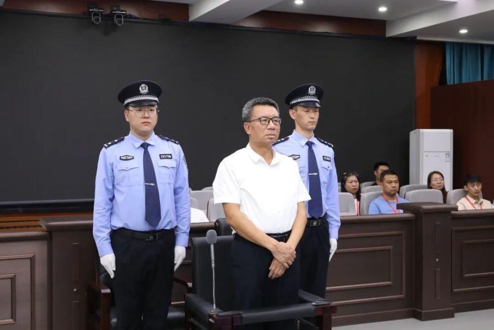
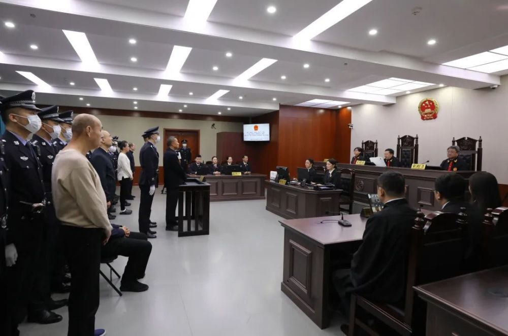
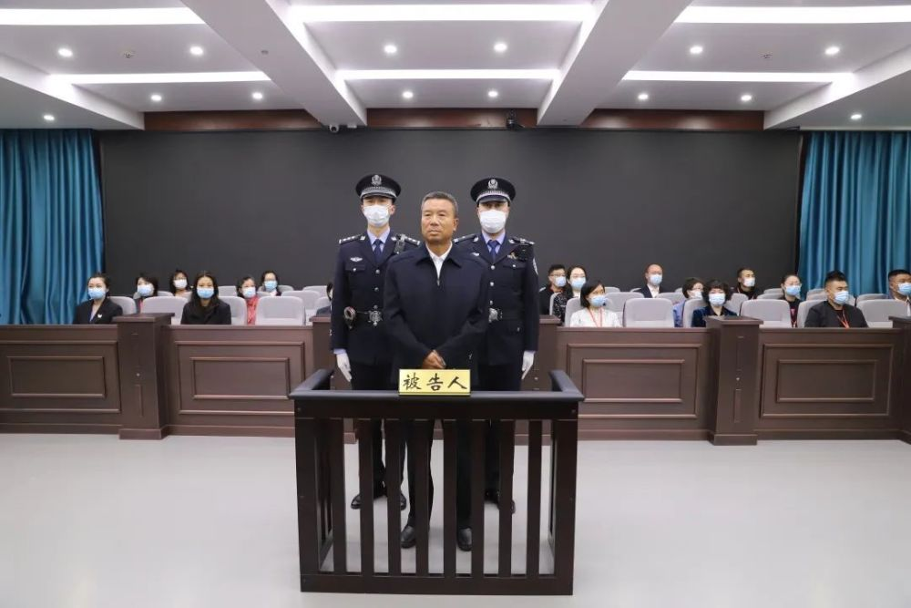
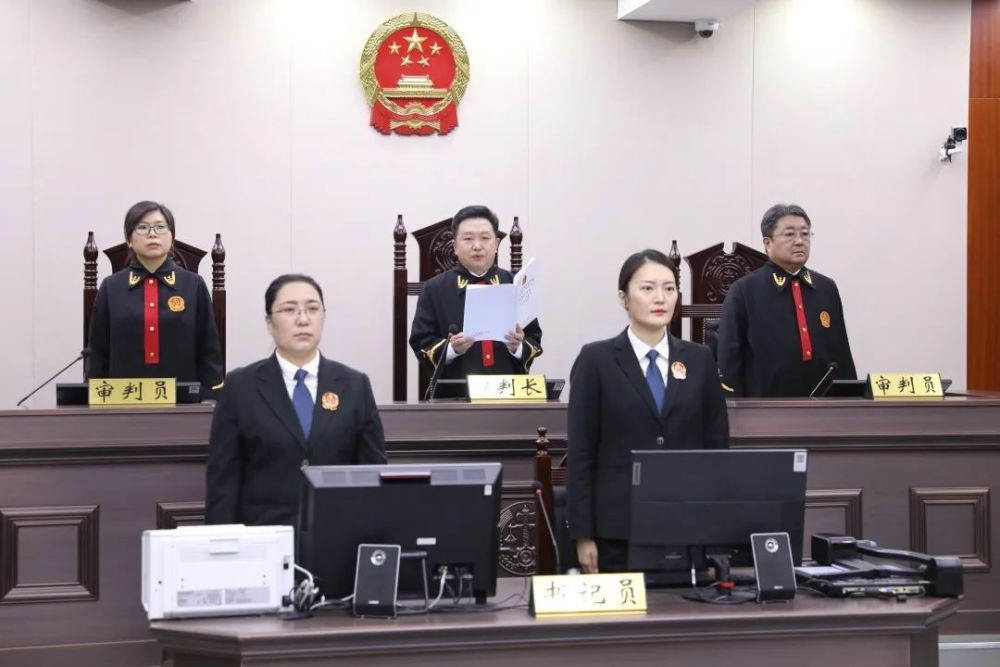

# 涉案30亿元的内蒙古贪官李建平案二审开庭，将择期宣判，一审被判死刑

2023年8月17日，内蒙古自治区高级人民法院对呼和浩特经济技术开发区党工委原书记李建平贪污、受贿、挪用公款、纵容黑社会性质组织一案进行二审开庭审理。

内蒙古自治区兴安盟中级人民法院曾于2022年9月27日对该案公开宣判，认定被告人李建平的行为构成贪污罪、受贿罪、挪用公款罪、纵容黑社会性质组织罪，数罪并罚，决定对其执行死刑，剥夺政治权利终身，并处没收个人全部财产。对其他同案被告人分别判处十年以上有期徒刑或无期徒刑。一审宣判后，李建平及同案被告人不服，提出上诉。

李建平等上诉人及其辩护人均到庭参加诉讼。庭审中，法庭主持检辩双方对相关证据进行了质证，依法保护各方的诉讼权利，李建平充分发表了自己的辩解意见，各辩护人充分发表了辩护意见，李建平还进行了最后陈述。法庭宣布休庭，择期宣判。

**相关阅读：**

内蒙古自治区呼和浩特经济技术开发区党工委原书记李建平贪污、受贿、挪用公款、纵容黑社会性质组织案一审宣判

2022年9月27日，内蒙古自治区兴安盟中级人民法院公开宣判内蒙古自治区呼和浩特经济技术开发区党工委原书记李建平贪污、受贿、挪用公款、纵容黑社会性质组织一案，对被告人李建平以贪污罪判处死刑，剥夺政治权利终身，并处没收个人全部财产，以受贿罪判处死刑，缓期二年执行，剥夺政治权利终身，并处没收个人全部财产，在其死刑缓期执行二年期满依法减为无期徒刑后，终身监禁，不得减刑、假释，以挪用公款罪判处无期徒刑，剥夺政治权利终身，以纵容黑社会性质组织罪判处有期徒刑五年，数罪并罚，决定执行死刑，剥夺政治权利终身，并处没收个人全部财产；对李建平贪污所得及孳息、挪用公款予以追缴，发还被害单位，对其受贿所得及孳息予以追缴，上缴国库，不足部分继续追缴。对其他同案被告人分别判处十年以上有期徒刑或无期徒刑。

经审理查明：2016年至2018年，被告人李建平利用担任内蒙古自治区呼和浩特经济技术开发区党工委书记的职务便利，伙同他人侵吞国有资金14.37亿余元，其中2.89亿余元尚未实际取得。2009年至2014年，李建平利用担任呼和浩特春华水务开发集团有限责任公司董事长及呼和浩特经济技术开发区党工委书记的职务便利，为他人在工程承揽方面提供帮助，收受财物共计5.77亿余元。2006年至2016年，李建平本人或伙同他人挪用国有公司公款共计10.55亿余元，其中4.04亿余元案发前尚未归还。此外，李建平与黑社会性质组织的组织者、领导者赵文远(已判刑）长期交往、关系密切、相互勾结；李建平不依法履行职责，在拆迁工程、收购土地、安排工作等方面纵容以赵文远为首的黑社会性质组织进行违法犯罪活动。

兴安盟中级人民法院认为，被告人李建平的行为构成贪污罪、受贿罪、挪用公款罪、纵容黑社会性质组织罪。其贪污、受贿数额特别巨大，贪污所得中部分用于赌博或转移境外，犯罪情节特别严重、社会影响特别恶劣、给国家和人民利益造成特别重大损失；其挪用公款数额巨大不退还，纵容黑社会性质组织进行违法犯罪活动，情节严重。李建平一人犯数罪，主观恶性极深，社会影响极其恶劣，罪行极其严重，依法应予严惩。法庭遂作出上述判决。

