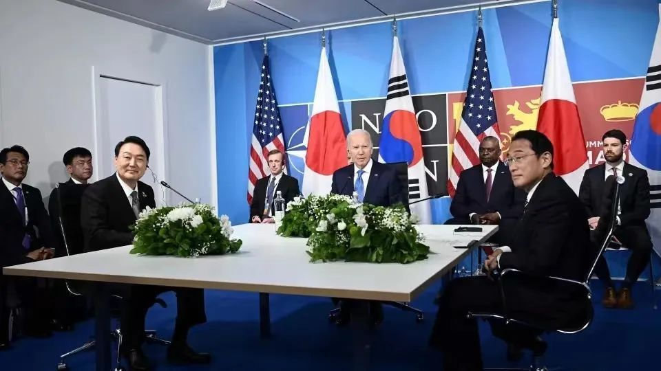
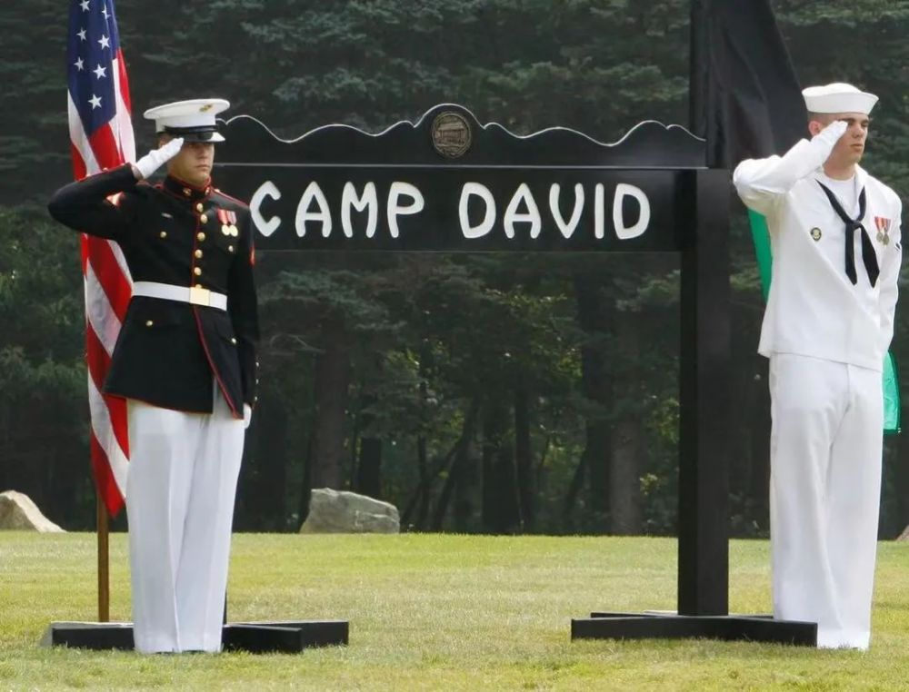

# 美日韩领导人华盛顿“私聊”，动机很危险，矛盾难化解

**在某种意义上，这重启了冷战时期的“南三角”概念（由美日韩三国组成）。**

虽然已多次在国际场合有过交流，但美日韩三国领导人还是决定在美国华盛顿的戴维营坐下来“私聊”。当地时间17日下午，日本首相岸田文雄和韩国总统尹锡悦乘抵达美国，准备出席于18日举行的美日韩首脑峰会。

这是三国首次以非国际会议的形式单独举行首脑会晤，分析人士认为，本次峰会将围绕政治、军事安全等主要议题展开，美国积极推动此次会晤，旨在进一步拉拢日韩，做实美日韩三国军事安全一体化的机制。但此种行为，无疑将损害亚太地区的和平与稳定。

 _美国总统拜登与韩国总统尹锡悦、日本首相岸田文雄在马德里北约峰会上会面。图源：美联社_

美日韩华盛顿“私聊”

应美国总统拜登邀请，岸田文雄和尹锡悦定于18日在华盛顿近郊的戴维营与拜登举行三边峰会。

据报道，此次会晤意在加强美国与日韩两个盟国的合作，涉及军事、科技、经济等多领域。三国领导人还将推动三方会晤机制化。

15日，美国国务卿布林肯将日韩两国称为美国在印太乃至世界范围内的“核心盟友”，称三国领导人预计将就三边合作架构“进一步制度化”的方式达成一致。

日本方面认为，美国邀请日韩领导人到戴维营会谈是想给三方会谈赋予特别意义，其核心议题除半岛问题外，将是推动三方军事及经济安保合作。美日在双边会谈中还可能就共同开发新型拦截导弹达成协议。

韩媒猜测，本次峰会将讨论三国合作的共同蓝图与基本原则、构建多层次合作体系、应对朝核问题的合作方案等主要议题。

另有媒体透露，岸田文雄还计划在会谈中提及福岛核污染水排放问题，希望获得美韩的理解和支持。

旨在强化军事同盟

有舆论指出，美方选择在极具象征意义的戴维营举行会晤，凸显了美方对此次活动的重视程度。日韩都是美国的盟国，都与美国签订了共同防御条约，华盛顿希望能够加强与日韩合作，尤其是强化军事同盟关系。

 _戴维营（Camp David）建于1942年罗斯福总统任内，自那以后每位美国总统都使用过这个地方。图源：美联社_

**复旦大学美国研究中心教授张家栋**
认为，美国积极推动此次会晤，主要动机是为了做实美日韩三国军事安全一体化的机制。冷战时期，美日韩三方所谓的一体化是基于美军对日本自卫队、韩军的领导权。冷战后，日韩都开始追求战略自主，这其中就包括将军事指挥权逐渐收回。就目前而言，美军仅凭过去的所谓战时指挥权完成一体化是不够的，因此美国希望通过新的方法和机制去完成这件事。

“正如外界所说，拜登政府力促美日韩首脑举行戴维营会谈，意在推动三方合作朝机制化方向发展，从而应对所谓来自中国、朝鲜的地区威胁。”张家栋说，“近日，东亚局势颇为复杂，美国深感仅凭一己之力难以应对，而日韩也需要进一步绑住美国，防止美国从地区脱身，美日韩三国在加强三边合作上是有共识的。”

影响区域战略平衡

尽管美方积极拉拢日韩，企图推动日韩关系的和解，但在外界看来，日韩之间的矛盾仍难弥合。

在张家栋看来，美日韩合作的最大变量就是日韩之间的矛盾。尽管随着韩国公布二战劳工问题赔偿方案、两国首脑恢复穿梭外交等事件的发生，日韩双方矛盾有淡化趋势，但客观来说，双方之间的矛盾确实没有得到根本解决。

日本山口大学名誉教授纐缬厚认为，日韩之间的历史和经济问题，应通过有关各方的一系列讨论来解决。美国为一己之私，试图强行解决日韩两国之间的问题，日韩两国在这种情况下难以实现历史和解。

至于美日韩这一连串动作又将对地区形势带来怎样的影响，张家栋表示，在某种意义上，这重启了冷战时期的“南三角”概念（由美日韩三国组成）。一旦美日韩三边合作朝机制化发展，就意味着其将会对区域战略平衡产生一定影响。但由于缺乏互动，美日韩“小圈子”进行阵营对抗、集团对垒的必要性会有所下降，而日韩出于种种原因，也不会选择将自己深绑在美国“战车”上。

**出品 深海区工作室**

**撰稿 王若弦**

**编辑 高语阳**

