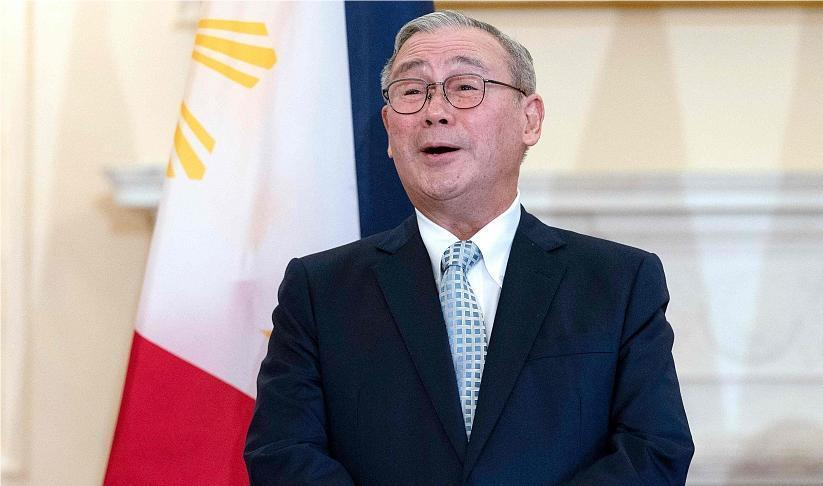

# 菲律宾前外长被任命为“中国特使”，对华交往曾态度不一，专家解读

【环球时报报道 记者
丁雅栀】当地时间16日，菲律宾宣布，总统马科斯任命前外交部长洛钦为总统中国特使，负责特别事务。菲方表示，这项任命将有助于促进该国与中国的双边关系。法新社等外媒渲染中菲关系正处于“微妙时刻”，并在报道中强调洛钦曾对华发表过强硬言论。“一般来说，被任命担任这一职务的人与中国有一些特别的交情，或者是对中国比较了解。他需要通过自己的关系网推动中菲交往，并向中国政府转达菲律宾官方的声音。”暨南大学国际关系学院副院长、菲律宾研究中心主任代帆17日接受《环球时报》记者采访时说。

_菲律宾前外交部长洛钦 资料图_

据菲律宾通讯社介绍，洛钦是一名律师、政治家，曾经当过记者。2018年10月，他被时任菲律宾总统杜特尔特任命为外交部长。2022年9月，洛钦被马科斯任命为菲律宾驻英国大使。宣布洛钦出任中国特使后，菲总统府新闻部长加拉菲尔表示，“他将兼任两项工作”。

对于这项任命，外媒炒作洛钦曾多次发表“对华强硬”的言论。2021年，他曾就南海问题用不文雅的语言发表言论。遭到中方驳斥后，洛钦向中方道歉，杜特尔特当时也在电视节目中不点名批评过他。事实上，洛钦也展现过对华友好。据菲律宾《世界日报》报道，他曾在2018年的一个电视节目中表示，除了在南海问题上有些争议之外，中国这个亚洲强国是菲律宾的朋友。菲律宾《马尼拉公报》称，2019年，鉴于时任美国国务卿蓬佩奥警告在与中国打交道时“要看清细则”，洛钦在社交媒体上说，上次菲方“没看清细则时”，是西方的金融机构让他们陷入了“最严重的债务陷阱”。

《马尼拉公报》17日援引菲律宾众议院副议长雷克托的话说，尽管洛钦“犀利的言辞”可能是“最好的武器”，但目前的局势需要的不是扩音器外交，而是能带来成果的无声努力。他认为，相信洛钦不会“煽动”局势恶化，而是“按下重启按钮，使中菲关系转向相互尊重的阶段”。

法新社提及，中菲关系如今处于“微妙时刻”。8月5日，菲律宾不顾中方一再劝阻和警告，仍执意派出船只擅自闯入仁爱礁海域，中国海警船依法予以拦阻，并采取了警示性执法措施。15日，菲律宾公布最新的国家安全政策文件，强调加强与美国的“共同防御条约”，并提到台湾问题。

《菲律宾每日问讯者报》引述菲参议员埃赫西托的话说，洛钦的任命意味着菲政府希望在海上争端中保持马尼拉和北京之间的渠道畅通。“南海争端是中菲关系的主要矛盾。在仁爱礁问题上，菲政府的表态强硬，使南海问题局势恶化，但菲律宾不想丢掉中菲关系，希望与中国继续沟通。”中国现代国际关系研究院东南亚和大洋洲研究所副所长骆永昆17日对《环球时报》记者说，在南海议题上，马科斯面临着复杂的决策环境，需要在美国施压和鼓动之下对其有所交代以及维护菲中关系之间找到平衡点，同时要顾及东南亚其他国家的看法。

有观点认为，菲方任命中国特使加强接触也是为了延缓与中国的直接冲突，为自身发展和布局争取时间。菲副防长埃斯皮诺16日在一场听证会上说，菲律宾应对南海局势的总体战略包括加强经济、利用联盟以及发展可靠的防御力量。骆永昆表示，对于洛钦担任中国特使不能过于乐观，虽然这一职务承担着与中方沟通交流的作用，但“我们既要听其言还要观其行，关键是看菲方将采取哪些行动”。

