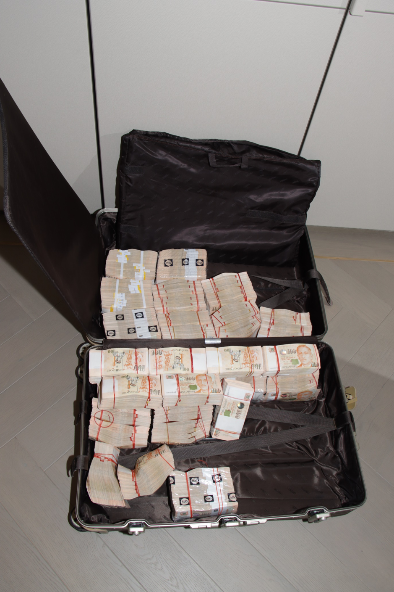

# 超50亿元！新加坡破获特大洗钱案：现金成捆豪车成排，有嫌犯为中国人

近日，10名嫌疑人在新加坡因涉嫌伪造文件和洗钱等罪行被抓获，涉案财物总值约10亿新元（约53.7亿元人民币），或为新加坡近年来涉案金额最大的犯罪活动。

从新加坡警方通报的内容看，嫌疑人中有3人是中国公民。

**涉案金额超50亿人民币**

据新加坡警方16日通报，15日，400多名新加坡警察对超豪华别墅和公寓等多地进行突击检查，最终抓获10人。新加坡警方表示，嫌疑人年龄在31岁至44岁之间，涉嫌参与伪造文件、洗钱以及拒捕。

另有12人正在协助调查，另有8人目前被警方通缉。据信这些人之间有联系。所有涉案人员既不是新加坡公民，也不是永久居民。

警方此前收到关于可能从事非法活动的情报，包括使用涉嫌伪造的文件来证实新加坡银行账户的资金来源。警方透过广泛的调查和情报跟进，包括分析可疑交易报告，发现一群涉嫌参与清洗海外有组织犯罪活动（包括诈骗和网上赌博）的外国国民。

该案涉案财物总值约10亿新元，新加坡《联合早报》报道称，相信是新加坡近年来涉案金额最大的犯罪活动。

警方对94处房产和50辆汽车发出了禁止处置令，估计总价值超过8.15亿新元（约43.3亿元人民币），以及多种酒瓶和葡萄酒。警方还查获了超过35个相关银行账户，估计总余额超过1.1亿新元（约5.9亿元人民币）。现金（包括外币）超过2300万新元，250多个奢侈品包和手表，120多个电子设备，如电脑和手机，270多件珠宝，两根金条和11份虚拟资产信息文件。

_被警方扣押的现金、珠宝和其他奢侈品 来源：新加坡警察部队官网_

新加坡警方表示将继续调查，不排除后续涉及更多资产和账户。

根据当地法律，如果罪名成立，针对个人的洗钱罪可处以10年以下监禁或50万美元以下罚款，或两者并罚。意图欺骗的伪造文件罪可处以10年以下监禁，犯罪者还将被处以罚款。使用伪造证件罪最高可判处4年监禁或罚款，或两者并罚。拒捕罪可处以1年以下监禁或罚款，或两者并罚。

_由警方发出禁止处置令的物品 来源：新加坡警察部队官网_

**有3人是中国公民**

**新加坡警方列出了当前被捕人员的国籍和护照情况：**

一名40岁的塞浦路斯男性持有中国和柬埔寨护照；

一名42岁的土耳其男性持有中国和瓦努阿图护照；

**一名44岁的中国男性和43岁的中国女性** 分别持有多米尼加和土耳其护照；

一名41岁的柬埔寨男性持有中国护照；

一名35岁的瓦努阿图男性持有中国护照；

一名33岁的柬埔寨男性持有中国和多米尼加护照；

一名34岁的塞浦路斯男性持有中国和柬埔寨护照；

**还有一名31岁的中国男性** ，和一名31岁的柬埔寨男性，均持有中国护照。

_来源：新加坡警察部队官网_

新加坡《联合早报》报道，这10人的原籍均为中国福建，其中一人相信是2022年5月一次性在新加坡豪华公寓康宁河湾买入20套住宅的中国买家，总值超过8500万新加坡元（约合人民币4.54亿元）。

**上述3名中国人被抓捕详细情况如下：**

一名44岁的男性中国公民和一名43岁的女性中国公民，在圣淘沙湾珍珠岛别墅内被抓获。警方发现该男子持有据信由圣基茨和尼维斯签发的外国护照，该女子被发现持有据信由多米尼加共和国和土耳其签发的其他外国护照。

新加坡警方扣押了二人超过760万新元（约4000万元人民币）的现金和其他外币，并对估值超过1.06亿新元（约5.7亿元人民币）的9处房产和5辆汽车发出了禁止处置令，还冻结了一个相关银行账户，包括超过2200万新元（约1.2亿元人民币）和其他外币。这两人将被控意图欺骗的伪造文件罪。

另有一名31岁的男性中国公民在汤姆林森路公寓被抓获。他还被发现持有据信由瓦努阿图签发的外国护照。警方缴获了近11.2万新元（约59.5万元人民币）的现金、其他外币和3台电子设备，并对一辆估值超过30万新元（约159.4万元人民币）的汽车发出了处置令缓期执行。该男子将被指控洗钱罪。

**编辑|** 卢祥勇 杜恒峰

**校对|** 程鹏

每日经济新闻综合自看看新闻、南方都市报、新加坡警察部队官网

