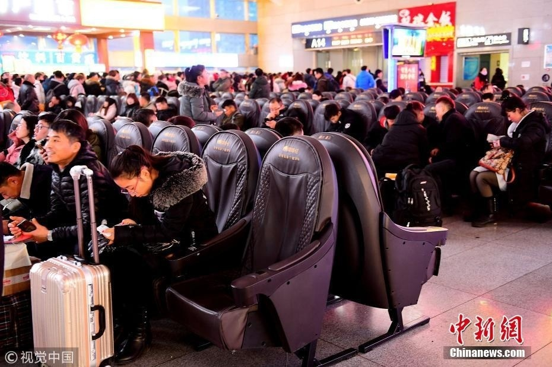
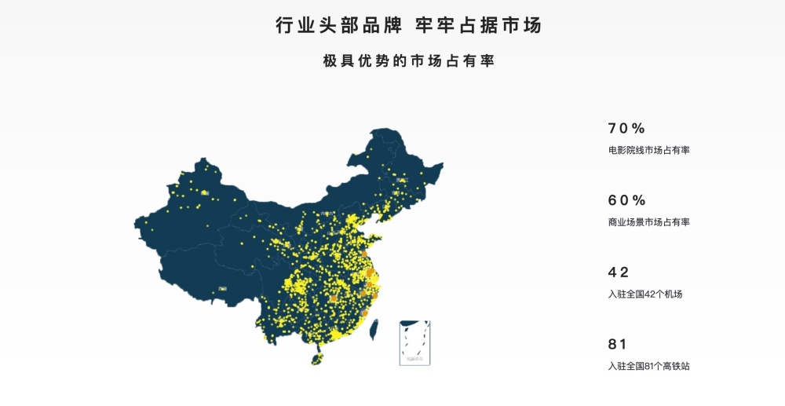

# 高铁站按摩椅：5年前开始扩张，抽成费“自己谈”，半年到10个月回本

近日，“按摩椅占九成”的泰安高铁站被卷入舆论漩涡。

8月17日中国铁路发文称，铁路部门对泰安站多功能候车座椅（按摩座椅）经营服务问题进行了通报批评，并要求多功能候车座椅数量不得超过全部候车座椅的20%。

九派新闻检索发现，按摩椅行业从2017年开始大量扩张，2018年开始大规模进入高铁站等公共服务空间。

按摩椅头部品牌“乐摩吧”一位工作人员表示，不同的场地、场合有不同的定价标准，高铁、机场的按摩椅使用起步价要比商场高。

“摩摩哒”一位负责招商的经理表示，抽成费等需要自己和场地方谈，因此具体利润无法核算，回本周期在半年到10个月左右。

中国人民大学国家发展与战略研究院研究员、公共管理学院教授马亮公开发文称，这涉及公共价值、商业利益和乘客需求之间如何平衡的问题，要坚持公共不受伤、共享不过度、商业不越界的基本原则，处理好公共服务、商业追求和公众需求之间的关系。

_2018年，沈阳火车站候车室的按摩椅。图/视觉中国_

**【1】按摩椅引乘客不满，铁路部门发文整改**

据《央广网》报道，泰安高铁站值班的邹女士告诉记者，目前泰安高铁站共有第一、第二两个候车室，共有各类座椅1488个，其中普通座椅558个、按摩椅930个，并非网传9:1的比例。

记者实地探访发现，按摩椅总数约有400多个。普通座椅集中在靠墙处，估计有40个左右。几乎每个座椅都坐有乘客候车，有些没有座位的乘客选择了席地而坐。

泰安高铁站不是个例。上月，就有网友发视频称，岳阳高铁站候车室的座位换成了收费按摩椅，让等车的旅客“完全没地方可以坐”。

岳阳东站所属站段广铁集团长沙南火车站发布情况说明称，岳阳东站二楼候车室有普通座椅1130张，按摩椅176张（占比13.5%），属于正常差异化服务经营范围。

对于按摩椅，社交平台上的抱怨屡见不鲜。

乘客肖女士告诉九派新闻，她对车站的按摩椅很厌烦，有的按摩椅坐上会不停地发出提示音，有的则会弹到不舒适的位置“逼”人离开。几次，她坐下被吵得受不了，会离开到一旁。

在“湘问·投诉直通车”页面上，2022年就有乘客投诉称，沈阳北站按摩椅过多，使得可免费使用的椅子越来越少。在无免费椅子时，坐在按摩椅上会有人进行驱赶，而车站工作人员却视而不见。

此类投诉并不在少数。西安北站、南京南站、连云港站等车站都被乘客投诉称，在没有免费座位的情况下，坐在按摩椅上被工作人员驱赶。

针对泰安站按摩椅过多的问题，中国铁路微信公众号于8月17日发布“铁路部门整改规范多功能候车座椅经营服务”一文，称铁路部门对泰安站多功能候车座椅（按摩座椅）经营服务问题进行了通报批评。

铁路部门要求，合理布设，便利旅客出行。对设置多功能候车座椅的车站，必须确保候车区域旅客候车座椅总数不减少，多功能候车座椅数量不得超过全部候车座椅的20%，并在各候车区分散均衡设置，不得影响旅客候车、通行。

此外，铁路部门还将在多功能候车座椅区域醒目位置规范设置“免费就座、扫码按摩”标识，并公布服务监督电话。8月底前，组织开展全面排查整顿，对多功能候车座椅数量、规格、布局、状态、卫生不符合要求的，限期整改到位。对客流量大且候车面积不足的车站，进一步压减多功能候车座椅比例和数量。

**【2】2018年开始在车站、机场扩张**

按摩椅行业的版图如何扩张，又是如何闯入高铁站等公共空间的？

“天眼查”数据显示，2017年共享按摩椅行业新增注册企业数量，是2016年的5倍。2018年，这一数据较2017年又几近翻番。仅2018年一年，全国共享按摩椅铺设量超过100万台。

竞争中，傲胜、奥佳华和荣泰等生产厂家占据头部位置，形成鼎立格局。

据《中国按摩椅行业发展趋势分析与投资前景调研报告（2023-2030年）》，2018年，我国按摩椅保有量超200万台市场规模超50亿元。2021年，我国按摩椅保有量达500万台左右，市场规模近90亿元。

_按摩椅市场规模及增速于2018年达到峰值。图/恒州博智_

恒州博智发表的市场调查报告《2022-2028中国共享按摩椅市场现状研究分析与发展前景预测报告》显示，据数据，目前中国大陆按摩椅渗透率仅为1%左右，而日本、韩国、中国香港、中国台湾按摩椅渗透率均高于10%，其中日本按摩椅渗透率达到20%。

2020年3月，头部生产商荣泰健康推出公开发行A股可转换公司债券预案，在现有厂房所生产按摩椅的设计产能约27万台基础上，集资金投资项目总投资额6.14亿元，设计年产能30万台，预计于2021年12月建设完工，三年后完全达产。

《中国按摩椅行业发展趋势分析与投资前景调研报告（2023-2030年）》显示，从供需端来看，行业仍具备高成长性，预计2025年我国按摩椅保有量将达到1905.2万台，市场规模达到285.8亿元。到2030年我国按摩椅保有量将达到5284.03万台，市场规模为577.43亿元。

在公共空间，各大按摩椅品牌不断抢占着市场份额。2018年，按摩椅陆续进入机场与高铁站。其中，市占率最高的头部品牌“摩摩哒”和“乐摩吧”均曾公开表示，进军交通枢纽场景的计划。

行业头部品牌“乐摩吧”官方首页显示，将高端按摩椅铺设在商场、机场、高铁站、酒店、影院、旅游景点、网咖等场景，并已入驻全国42个机场，81个高铁站。

早在2018年4月，“摩摩哒”副总裁曾必焱表示，“摩摩哒”已与重点交通枢纽达成合作，响应全国交通枢纽包含机场、高铁、火车站的升级改造，推动改善出行等候空间的智能共享按摩椅候车区和大数据在行业的应用升级。

其表示，大力铺设国内重点交通枢纽，目前已覆盖2/3国内重点城市机场、火车站、汽车服务站等重点交通枢纽，触达重点城市超过70%出行旅客,服务近亿人次。

_乐摩吧宣传网页。 网络图片_

**【3】按摩椅抽成费要“自己和场地方谈”**

如今，车站、机场等交通枢纽似乎也在欢迎按摩椅的进入。

“延边交通文艺广播”微信公众号于2018年4月发文称，延吉车务段经过近一周的安装更替调换，为珲春站候车室安设了576把新型按摩座椅，其中重点旅客座椅72把，旅客通用座椅504把。

中国新闻网在2018年2月14日报道，辽宁沈阳火车站候车室4600个座椅被换成可以给手机充电给乘客按摩的座椅，将之称为“豪华候车室”。

“摩摩哒”一位负责招商的经理表示，市场占有率至少在50%，目前在一线城市部分高铁、火车上铺设，县级火车站较少。不论在哪类场地，抽成费等需要自己和场地方谈，因此具体利润无法核算，回本周期在半年到10个月左右。

人流吞吐量巨大的高铁站，是否带来了商机？“乐摩吧”一位工作人员朱先生表示，之前曾在某高铁站铺设过，但人流量很少，按摩椅使用率不高，之后就撤掉了。“不同的场地、场合有不同的定价标准，高铁、机场的按摩椅使用起步价肯定要比商场要高一些。”他说道。

**【4】学者：10%以内的候车区设置按摩椅就足够**

中国人民大学国家发展与战略研究院研究员、公共管理学院教授马亮在界面新闻发布的《高铁站设共享按摩椅，不该为商业伤了公共利益》一文中提到，共享按摩椅打着“共享”的旗号，看似服务于乘客，但是却让乘客感到被冒犯，究其原因，主要是因为当地没有把握好一个度，导致共享服务过犹不及。

他指出，公共空间的过度商业化备受争议，也严重影响乘客出行体验。候车厅等公共场所的功能定位是公共服务，使用按摩椅的乘客在少数。一般来讲，10%以内的候车区域设置为共享按摩椅就已经足够了。

但是据《央广网》消息，泰安站的共享按摩椅占用了候车大厅相当于一半的座椅比例，明显设置过多，导致公共为商业让路的尴尬。把绝大多数普通座椅改为有偿使用的共享按摩椅，侵犯了乘客的合理权益。

他建议，相关部门可以研究制定项目上马的审批流程和服务标准，对此类带有商业性质的经营项目进行指导和规范。比如，设置多少比例的按摩椅，消费项目如何定价，如何保障乘客安全等。

“归根结底，这涉及公共价值、商业利益和乘客需求之间如何平衡的问题，要坚持公共不受伤、共享不过度、商业不越界的基本原则，处理好公共服务、商业追求和公众需求之间的关系。”马亮在文中写道。

**九派新闻记者 王怡然 实习记者 曾粤萍**

**编辑 曾金秋**

版权归原作者所有，向原创致敬

