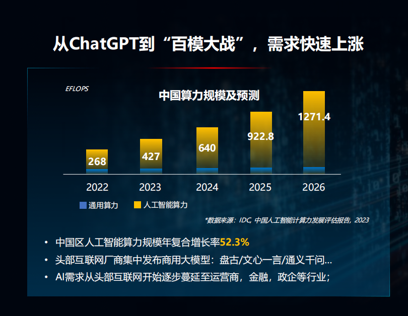

# AI推高中国算力总量 产业从“计算”到“智算”还差几步？

当英伟达创始人黄仁勋在今年5月高喊出“生成式AI的引爆点正在到来”时，一场围绕全球算力产业链的竞逐也在同时进行。

“中国的算力产业已初具规模，服务器、计算机、智能手机等计算类产品产量全球第一。从算力总规模来看，位居全球第二。”8月19日，工业和信息化部党组书记、部长金壮龙在2023中国算力（基础设施）大会上表示，算力已成为数字经济时代的关键生产力，是全社会数字化、智能化转型的重要基石，要加快关键技术攻关。

身处产业链中的企业们也在感受着这场算力革命带来的机会。“大家都在争先恐后的布局。”超聚变的一名管理人员对记者表示，无论是智算还是具体到大模型算力上，国内(企业)的投入和部署的规模速度都在加快。

**AI算力需求“跳变”**

作为数字经济时代的重要生产力，2022年我国算力核心产业规模已达到1.8万亿元。

根据《2022-2023全球计算力指数评估报告》显示，IT支出每投入1美元，可以拉动15美元的数字经济产出，同时也可拉动29美元的GDP产出。换言之，国家的计算力指数每提高1点，数字经济将增长3.6‰，GDP将增长1.7‰。

在工信部19日公布的最新数据中，截至目前，全国在用数据中心机架总规模超过760万标准机架，算力总规模达到1.97万亿亿次浮点运算（197EFLOPS），位居全球第二。此外，围绕算力枢纽节点建设130条干线光缆，数据传输性能大幅改善。

在2022年年底，我国在用标准机架超过650万架，算力总规模为180EFLOPS。相较之下，今年前八个月两项数据分别增长了16%和9.4%。而据IDC数据显示，受AI影响，从2022年到2026年，中国区人工智能算力规模年复合增长率将达到52.3%。

“格局重塑的大门已经打开，国内计算产业正在发生前所未有的重大变化。”超聚变董事长兼CEO刘宏云用“跳变”来形容当前的行业状态。他认为，大模型正在催生更多的AI算力需求，进入“智算”时代。

“语言大模型参数量从2018年亿级发展到21年GPT-3的千亿级别，5年增长1000倍，与之对应，这些模型对算力的需求每18个月增长10倍，是摩尔定律的5倍。近年来借助稀疏计算MoE理论，更出现了万亿参数甚至百万亿参数的语言大模型。”刘宏云在一场合作伙伴峰会上表示，多模态AI的兴起，将带来更加复杂的模型，以及更加庞大的算力需求。大模型于AI如同大地于各种动植物，具备极大提升AI的开发和应用的速度和质量。

超聚变所处的行业是算力产业链上的“服务器”环节。目前，该公司在行业的份额达到了前二，仅次于浪潮。

对于像超聚变这样的算力产业链玩家而言，AI时代下万亿级参数大模型正在不断涌现，多样性算力需求也在增长。

据天眼查向记者提供的数据，截止2023年上半年，与“大模型”直接相关的融资事件20余起，与大模型相关的专利申请数量40余项。以GPT为代表的大模型时代里，语音、图片、视频等多模态AI技术快速崛起，塑造了更广的数据形态。

随着AI大模型进入行业，带去的算力也将体现在政务、工业、交通、医疗等行业领域。记者注意到，从去年开始，已有包括河南、杭州、成都、武汉、上海、宁夏等地接连出台政策支持算力发展，以推动互联网、大数据、人工智能等技术与实体经济深度融合。

**关键点有哪些？挑战又在哪？**

但算力产业在快速发展的同时，也面临着风险和挑战，比如算力能耗和算力不足的问题。

行业中曾有统计，在1000张英伟达V100
GPU上训练GPT-3大模型共需14.8天，在数据中心PUE为1.1的条件下，总能耗将达到1287MWh，以2021年中国人均生活用电水平计算，单次大模型训练耗电相当于一个人4年的生活用电总量。

此外，算力市场仍存在需求与供给之间的鸿沟。据研究机构预测，未来三年新产生的数据量将超过过去三十年的总和。然而，数据总量在增长，真正被有效利用的数据占比却微不足道。而在关键技术上，比如服务器芯片领域，无论是通用处理器还是加速处理器，英特尔（Intel）、AMD和英伟达占据国内85%以上的服务器芯片市场，高性能芯片的供给不足。

“算力需求的变化也在倒逼着我们必须要往上游走，联合生态合作伙伴围绕服务器底座进行架构的重塑。”超聚变全球Marketing与销售服务部总裁张小华对记者表示，算力产业最为关键的是生态产业链合作伙伴的共识和推进。

“生态我们定义了多个维度，销售、服务、上游供应商、联合创新实验室、软件服务提供商以及行业标准组织，并从体系、激励、权益、支持、服务等方面为合作伙伴业务提供支撑。”张小华对记者表示，内部目前采用的“双生态”模式。一方面是与全球头部部件与原材料供应商合作。另一方面，通过自有操作系统、虚拟化等技术实现国内硬件和软件产品的自由组合。

除了部署软硬件生态外，在算力功耗的解决上，中国厂商也在积极布局，其中液冷技术成为攻坚的方向。

目前，包括阿里、腾讯等互联网厂商，超聚变、浪潮信息、曙光等服务器厂商先后投入液冷设备建设队伍中。而为了解决能耗问题，三大运营商规划到2025年开展液冷的规模应用，50%以上数据中心项目将采用液冷技术。

“从整个液冷架构到液冷的实现，再到液冷传输过程当中所涉及的最关键的散热环节，技术迭代到了第四代。”张小华对记者表示，研发节奏是产品一代，研究一代，运营一代。目前已经联合多个产业伙伴成立10家XLab联合创新实验室，覆盖材料到器件、板级部件级到设备级、生态到数据中心的各层面关键技术。

“技术突破是算力发展的根本，要密切跟踪全球技术演进和产业发展趋势。”金壮龙在算力大会上表示，要加强系统性创新，牢牢掌握发展主导权。

此前，工信部计划出台推动算力基础设施高质量发展的政策文件，进一步强化顶层设计，增强自主创新能力，提升算力综合供给。

在此次大会上，金壮龙强调，我国算力产业已初具规模，高算力芯片加速迭代升级，一批行业骨干企业茁壮成长，（接下来）将开展“算力强基揭榜挂帅”，充分发挥“链主”企业牵引作用，围绕计算、网络、存储等关键环节，汇聚科技力量，加大研发投入，尽快突破一批标志性的技术产品和方案，加快新技术、新产品落地应用。

