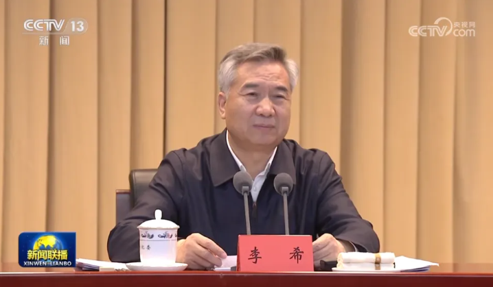

# “重要政治任务”部署半年后，中央纪委有最新判断

**撰文 | 董鑫**

**全国纪检监察干部队伍教育整顿取得阶段性成效。**

最新一期《中国纪检监察》杂志刊发题为“严字当头
一严到底——扎实开展全国纪检监察干部队伍教育整顿综述”的文章。对于半年来教育整顿工作取得的成效，文中作出如上判断。

最新数据显示，今年上半年全国纪检监察系统共接收涉及纪检监察干部问题线索或反映2.02万余件次，处置涉及纪检监察干部问题线索1.87万余件，谈话函询纪检监察干部6647人次，立案纪检监察干部2482人，处分1647人，移送司法机关73人，其中，处分厅局级干部54人、县处级干部285人。

**政知见（微信ID：bqzhengzhiju）注意到，处置涉及纪检监察干部问题线索一项，今年上半年的数量就已超过2022年全年。**
2022年全国纪检监察机关共接收涉及纪检监察干部问题线索或反映2.21万件次，处置涉及纪检监察干部问题线索1.72万件。

上述综述文章中透露，各级纪检监察机关组织了专门力量 **对党的十八大以来反映纪检监察干部问题线索进行起底梳理、归口管理** ，确保件件有着落、事事有结果。

**抓住根本、紧盯要害、把握关键**

今年2月24日，全国纪检监察干部队伍教育整顿动员部署会议在北京召开。中共中央政治局常委、中央纪委书记李希在会上指出，
**开展教育整顿，是当前纪检监察机关的一项重要政治任务。**

根据安排，教育整顿分为3个环节，即学习教育、检视整治、巩固提升。

李希在会上要求，要抓住学习教育这个根本；紧盯检视整治这个要害；把握巩固提升这个关键。

_△中共中央政治局常委、中央纪委书记李希（资料图）_

**目前，教育整顿已经进入检视整治环节。**

在《中国纪检监察》杂志刊发的综述文章中，详细梳理了各级纪检监察机关在学习教育和检视整治环节中的具体工作。

**学习教育**

在中央层面：

今年“七一”前夕，中央纪委国家监委举行学习贯彻习近平新时代中国特色社会主义思想主题教育、全国纪检监察干部队伍教育整顿主题党课报告会，李希作党课报告；

中央纪委常委会举办中央纪委委员研讨班，围绕“践行‘三个务必’，赓续红色血脉”举行集体学习；

中央纪委国家监委机关分5期对系统内局处级干部进行集中轮训。

在地方层面：

各级纪检监察机关综合运用集体学、个人学、读书班等方式，围绕重点内容开展研讨，分层分级开展专题培训，实现重点对象全覆盖。用好红色资源，寻根溯源感悟对党绝对忠诚。

例如，福建省纪委监委组织开展“重温习近平总书记在闽廉政故事、重读习近平总书记在闽廉政文章、重走习近平总书记在闽足迹”主题活动；陕西省纪委监委组织赴延安、照金等地接受革命传统教育等。

**检视整治**

中央纪委国家监委制定教育整顿个人自查事项报告表，要求各地区各部门纪检监察机关（机构）结合各自实际，对本单位本部门可能存在的重点问题和具体表现予以细化完善。

例如，今年端午节前，四川省纪委监委每名干部都收到了一份30页的自查自纠参考清单和报告表，要求重点从信仰缺失、政治动摇、放弃原则、作风不正、滥用权力、清廉失守等6个方面39个小项开展自查自纠，对照清单对存在的问题如实填报。

发现问题更要解决问题。安徽省纪委监委针对可能存在的目无法纪、跑风漏气、以岗谋利等问题完善内控机制，探索设置事前告知预防、事中跟踪监督、事后回访检查3个监督重点环节，前移监督端口，形成监督闭环。

**自剜腐肉**

在2月份的动员部署上，李希还提出，要坚决查处“两面人”、坚决防治“灯下黑”，要刀刃向内自剜腐肉。

半年以来，纪检监察机关清理门户的成效如何？

公开报道显示，中央纪委已有多名“内鬼”落马：

中央纪委国家监委宣传部副部长、一级巡视员郝宗强

中央纪委国家监委第十三审查调查室一级调研员崔玉男

中央纪委驻交通运输部纪检组第二纪检室原主任姚西科

中央纪委国家监委第二监督检查室原副主任、一级巡视员刘燃等

此外，《中国纪检监察》杂志的综述文章还点名了四个近期落马的“内鬼”：

贵州省黔南州纪委副书记、州监委副主任白林贤

国家能源集团神东煤炭集团有限责任公司原纪委书记刘永武

广东开放大学党委副书记、纪委书记刘卫红

天津市纪委监委驻市民政局纪检监察组组长陈宇

**其中，刘卫红和陈宇分别在今年6月和7月主动投案。**

“以刀刃向内自剜腐肉的行动纯洁组织。”综述文章表示。

教育整顿仍在深入推进中。

7月31日，中央纪委国家监委召开全国纪检监察干部队伍教育整顿检视整治工作推进会。

中共中央书记处书记、中央纪委副书记、全国纪检监察干部队伍教育整顿领导小组常务副组长刘金国在会上表示，当前，教育整顿正处在最见决心、最见力度的关键时刻，中央纪委国家监委要带头落实，各级领导干部特别是“一把手”要投入足够时间和精力，要狠抓问题整改，找准查实问题，全面清理线索，强力推动办案，坚持实事求是、讲求政策策略，确保真改实改。

**资料 ｜ 中央纪委国家监委网站**

**【版权声明】本文著作权归政知新媒体独家所有，未经授权，不得转载。**

