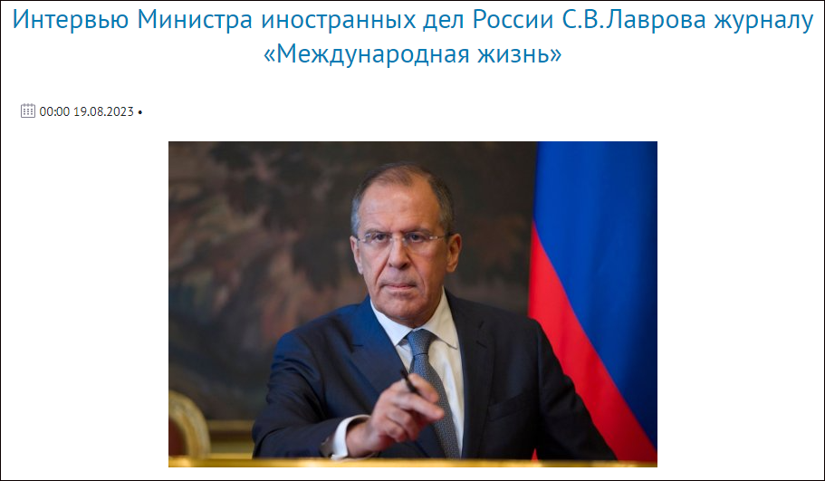

# 为何多次威胁用核武？拉夫罗夫：俄方需不断提醒西方核战争风险

（观察者网讯）自俄乌冲突后，俄罗斯方面多次提到使用核武器的可能，被西方批评进行“核威胁”。当地时间8月19日，俄外长拉夫罗夫在接受俄罗斯《国际事务》杂志采访时表示，俄罗斯的核威慑政策完全是“防御性的”。他解释说，为阻止俄罗斯与北约间冲突升级，俄方需不断提醒西方有关核战争的风险。

 _俄外长拉夫罗夫，图自外媒_

采访中，《国际事务》杂志询问拉夫罗夫，在如今的公共话语中，有关核武器的话题被广泛讨论，导致一部分人认为这将使俄罗斯使用核武器的门槛降低，对此有何看法？

“我想提醒大家，我们（俄罗斯）已在理论文件中列出了可能使用核武器的条件。”拉夫罗夫回答称，“俄罗斯在核威慑领域的国家政策完全是防御性的”，目的在于，“将核力量潜力维持在保障国家主权和领土完整所需的最低水平，并防止对俄罗斯及其盟国的侵略”。

拉夫罗夫称：“在当今背景下，拥有核武器是目前应对我国安全面临的一些重大外部威胁的唯一可能的反应。”他补充说，乌克兰局势证明了俄罗斯的关切是正确的，即北约利用俄乌冲突对俄罗斯发动混合战争。

随后，拉夫罗夫进一步解释说，当前存在的巨大危险在于，“俄乌冲突或导致事态升级，俄罗斯有可能与美国等北约国家直接陷入核对抗的境地”。他说：“因此，我们不得不提醒对手存在高度的军事政治风险，并向对手发出警醒的信号。”

“我国充分遵守不允许发生核战争的原则，并从核战争不可能有赢家的事实出发。”拉夫罗夫强调。

 _俄罗斯《国际事务》杂志截图_

2020年6月2日，俄罗斯总统普京于签署了《俄罗斯联邦国家核遏制政策原则》。

文件列举了可能导致俄罗斯使用核武器的四种情形，分别是：可靠信息显示，攻击俄联邦及（或）其盟国领土的弹道导弹已经发射；敌人对俄联邦及（或）其盟国领土使用核武器或其他大规模杀伤性武器；敌人对事关俄核反击能力存亡的关键政治及军事目标实施影响；敌人用常规武器攻击俄联邦并威胁俄国家的生存。

2022年1月3日，俄乌冲突一个月前，五个核武器国家领导人发布关于防止核战争与避免军备竞赛的联合声明：中国、法国、俄罗斯、英国和美国认为，避免核武器国家间爆发战争和减少战略风险是我们的首要责任。我们申明核战争打不赢也打不得。鉴于核武器使用将造成影响深远的后果，我们也申明，只要核武器继续存在，就应该服务于防御目的、慑止侵略和防止战争。我们坚信必须防止核武器进一步扩散。

随着俄乌冲突全面爆发，世界对于核战争的担忧也与日俱增。俄联邦安全会议副主席梅德韦杰夫等多名俄官员多次在社交媒体上发表使用核武器的有关言论。7月31日，梅德韦杰夫警告说，俄军不仅在击退反攻，也在防止全球性冲突发生，因为一旦俄罗斯失去部分领土，俄政府将不得不动用核武器。

但在8月11日，俄罗斯外交部发文明确表示，俄罗斯正采取一切必要措施保障国家安全，但坚定致力于不允许发生核战争的原则，并就是否要废止俄罗斯与英美战略核导弹互不瞄准协议一事发表评论。

“我国领导人坚定地坚持不允许发生核战争的原则。我们从这样一个事实出发，即在这样一场战争中没有赢家，（核战争）绝对打不得。”俄外交部称，俄方正采取一切必要措施确保国家安全、领土完整和主权，并将继续这样做。防止针对俄罗斯及其盟友的潜在侵略行为是“国家最高优先事项之一”。

8月1日，中国外交部军控司司长孙晓波在《不扩散核武器条约》第十一次审议大会第一次筹备会一般性辩论中发言。孙晓波表示，中方支持五核国在去年1月联合声明的基础上，继续开展对话合作，探讨减少战略风险的可行举措。基于当前国际安全形势的现实和中方在减少战略风险问题上的一贯立场，中方呼吁核武器国家谈判缔结“互不首先使用核武器条约”，并主张在裁谈会谈判缔结无核安保国际法律文书，这些举措将显著减少战略风险。

**本文系观察者网独家稿件，未经授权，不得转载。**

