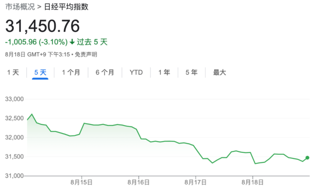

# 利率风暴施压，全球股市刚经历三月以来最惨一周

美联储再放鹰，投资者重新审视降息预期，市场重挫。

本周，全球股市出现了自3月以来最大的单周跌幅，主要原因是美国经济数据展现出的韧性使投资者降低了美联储降息的预期。

标普500指数本周累计下跌2.1%，纳斯达克综合指数本周累计下跌2.6%。

引领纳指的七巨头——谷歌母公司Alphabet、亚马逊、苹果、Meta、微软、英伟达和特斯拉——也损失惨重。七巨头在过去三周中连续下跌，市值已损失逾9000亿美元，这是今年以来总市值跌幅最大的一次。

此前美联储在7月FOMC会议上再次加息25基点，市场押注美联储将在明年5月开始降息，7月为最后一次加息。

本周三公布的美联储会议纪要显示，最近一次美联储会议上，联储决策者警告通胀还有较高的上行风险，可能迫使他们进一步加息：

由于通胀仍远高于联储的长期目标，劳动力市场仍紧张，大多数（most）与会者继续认为通胀有重大的上行风险，这可能需要货币政策进一步紧缩。

美联储再次放鹰，市场对明年的降息预期降温。

美国劳工部周四公布的数据显示，在截至8月12日的一周内，申请失业救济人数有所下降，本周早些时候公布的7月份零售销售数据也高于预期。

荷兰国际集团(ING)美洲研究部区域主管Padhraic Garvey表示：

基本上，由于经济没有停滞，市场已经缩小了未来降息的幅度。

富时环球指数本周下跌2.6%，这是自3月份美国银行业危机导致全球股市暴跌以来的最差表现。

欧洲斯托克600指数(Stoxx 600)周跌幅2.3%，是去年9月以来的最差单月表现。

法国CAC 40指数本周下跌2.2%，德国DAX指数本周下跌1.5%。

日经225指数本周下跌3.1%。

本文不构成个人投资建议，不代表平台观点，市场有风险，投资需谨慎，请独立判断和决策。

