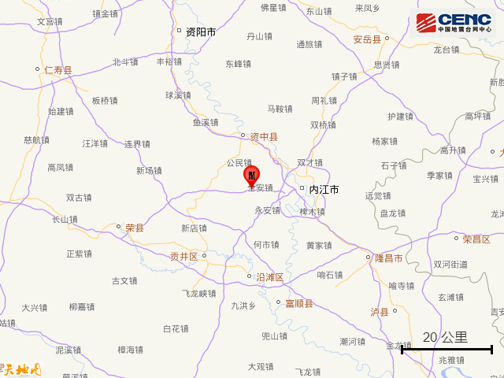
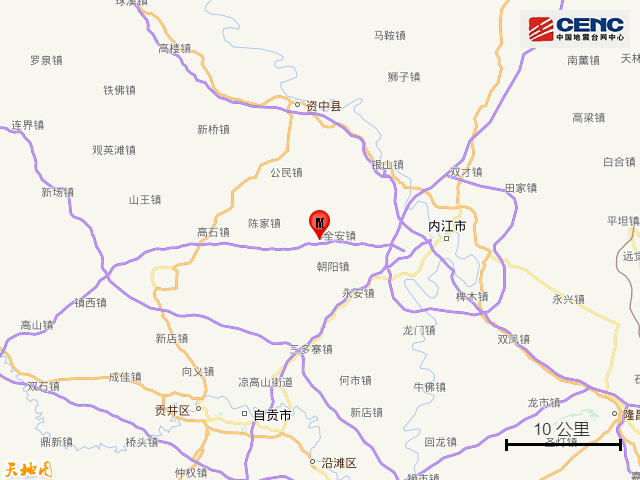
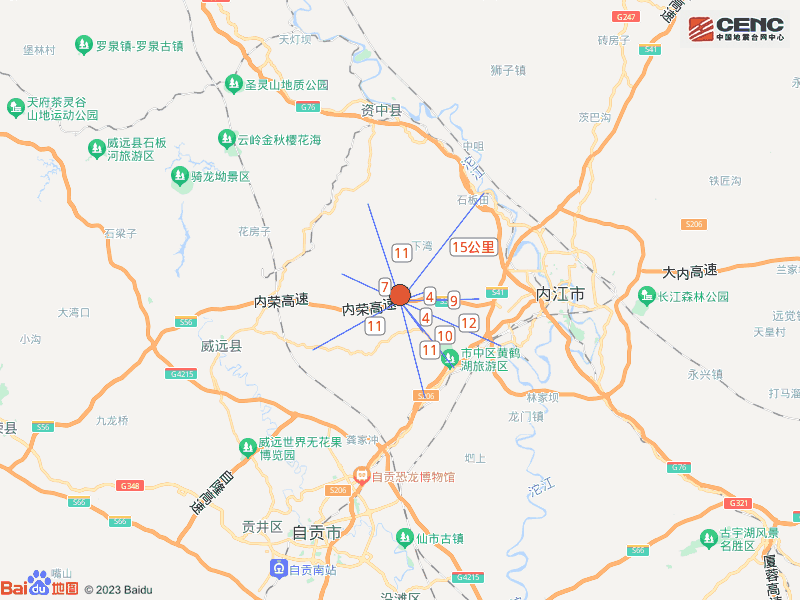
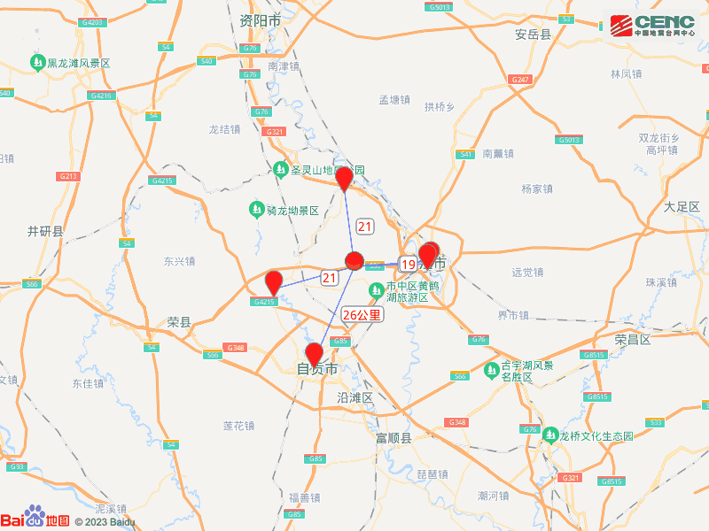
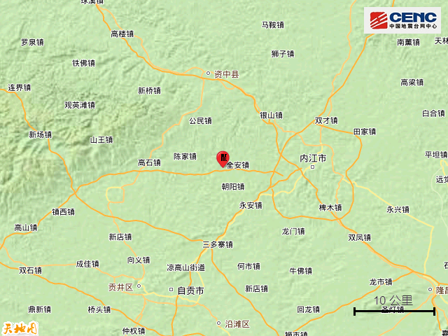
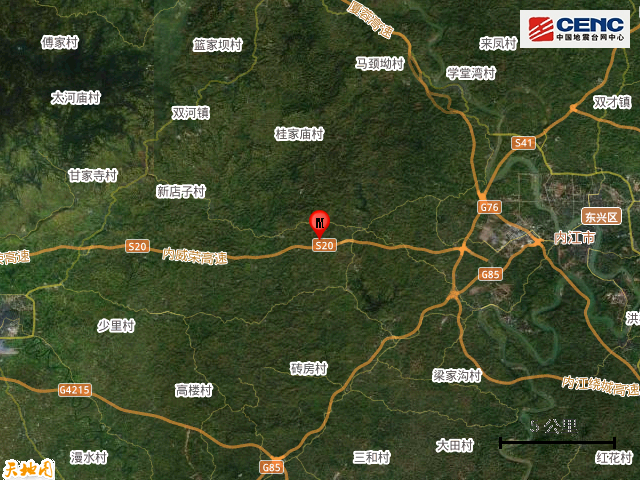
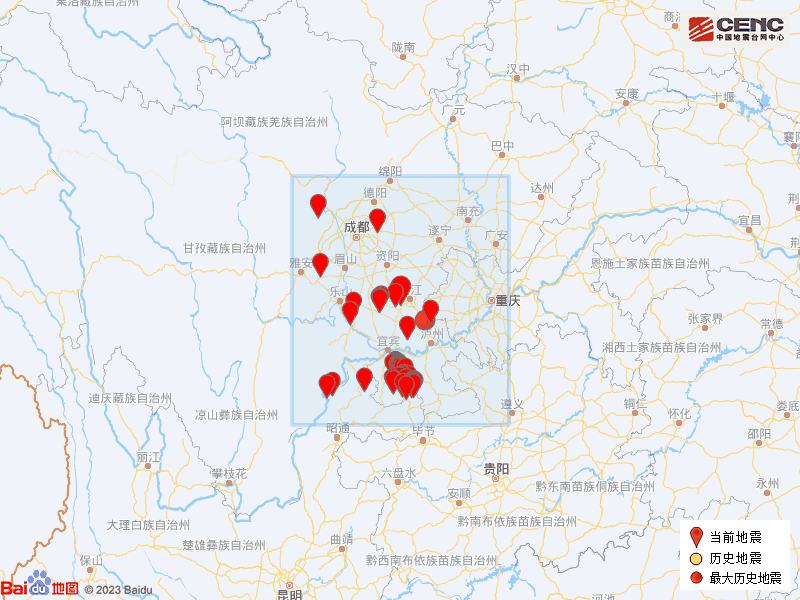

# 四川内江市市中区发生4.2级地震，震源深度8公里

**速报参数：**
据中国地震台网正式测定，8月19日15时31分在四川内江市市中区发生4.2级地震，震源深度8公里，震中位于北纬29.58度，东经104.88度。

**基础背景：**

**附近村镇：**
本次地震周边5公里内的村庄有严石厂、虾儿滩、段家祠村、尖尖房、回龙湾、梅堂湾村、清明寺、烂塘房、李家湾、王家大房子，20公里内的乡镇有全安镇、朝阳镇、靖民镇、白马镇、陈家镇、公民镇、永安镇、龙会镇、凌家镇、银山镇。

**周边县城：** 震中距市中区18公里、距东兴区19公里、距威远县21公里、距资中县21公里、距大安区26公里，距内江市17公里，距成都市142公里。

**震中地形：** 震中5公里范围内平均海拔约359米。

**历史地震：**
根据中国地震台网速报目录，震中周边200公里内近5年来发生3级以上地震共308次，最大地震分别是2021年9月16日在四川泸州市泸县发生的6.0级地震（距离本次震中61公里）和2019年6月17日在四川宜宾市长宁县发生的6.0级地震（距离本次震中138公里），按震级大小前50次历史地震分布如图。

