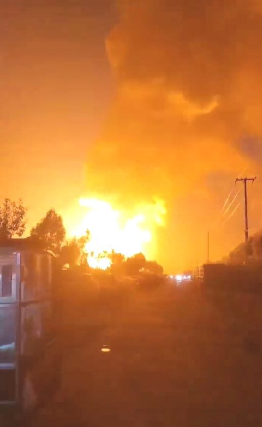
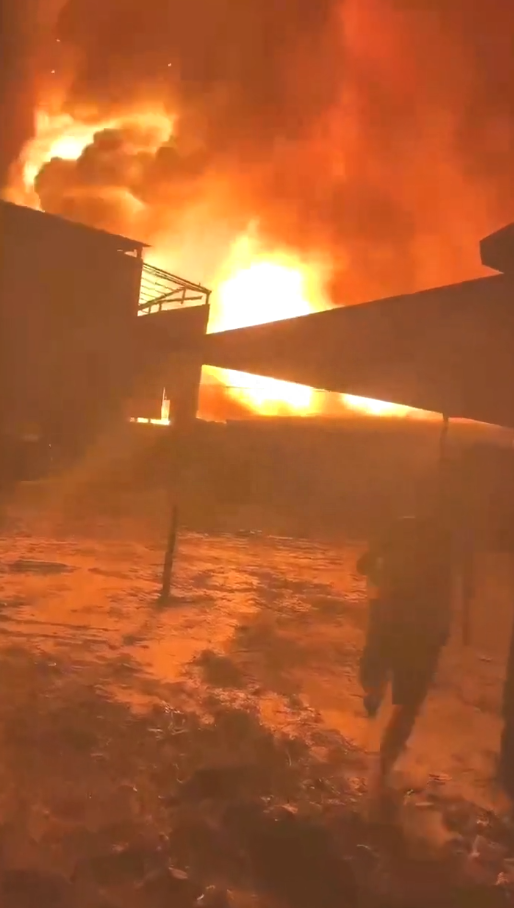

# 天津一化工厂发生爆炸起火？应急部门：不是爆炸是起火，暂不确定伤亡

8月18日，天津市滨海新区太平镇友爱村一家工厂发生大火，有网友发布消息称为一化工厂爆炸。

8月19日，太平镇应急值班人员告诉潇湘晨报记者，“着火是肯定有的，但爆炸具体不太清楚。”并表示不在现场，不清楚是否有人员被困。

天津市应急管理局工作人员向记者表示：“不是爆炸，只是起火，现在起火原因正在调查中。”并称不是化工厂，“有没有人员伤亡还说不好，要看调查结果。”

据天津市滨海新区太平镇2022年发布的一份突发事件综合应急预案显示，第二产业方面，镇内现有生产经营企业105家，主要以钢管、建材、食品、五金、化工等行业为主。其中危化企业1家，为三级重大危险源企业，加油站5家，运输企业1家，燃气供应企业2家，供电节能企业1家，在建供电节能项目6家。现存化学品储罐企业（包括关停企业）17家，共有储罐222个，设计储存量达约17万立方。此外，镇域内有大港油田西二联合站和南三联合站以及数百口油井（或注水井），采油队、采油站遍布田间。

潇湘晨报记者 吴陈幸子 实习生 罗威翼

