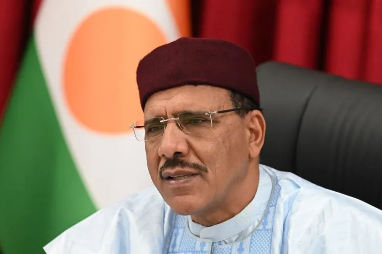
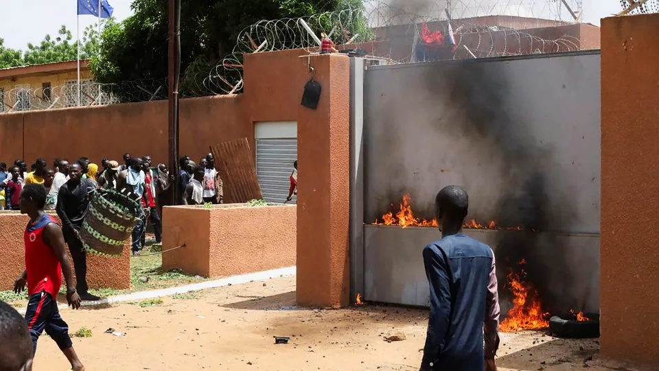
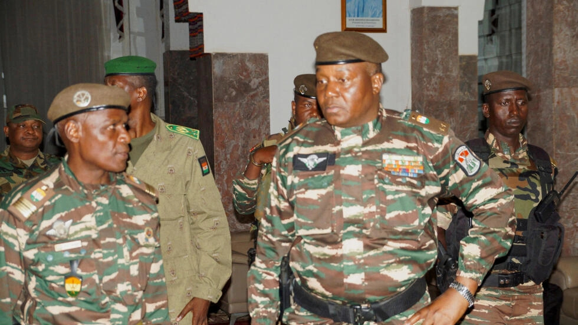
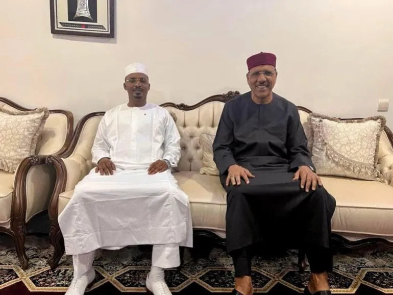
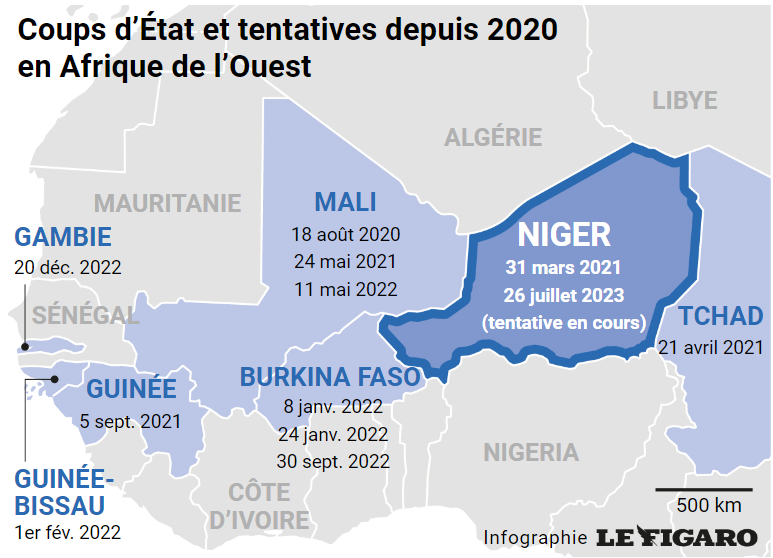
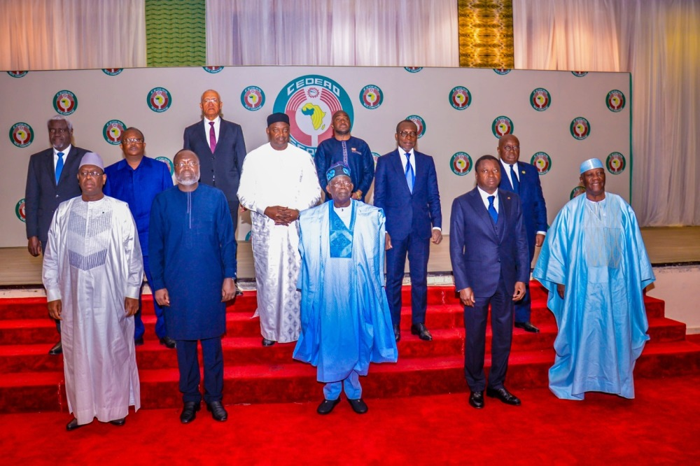
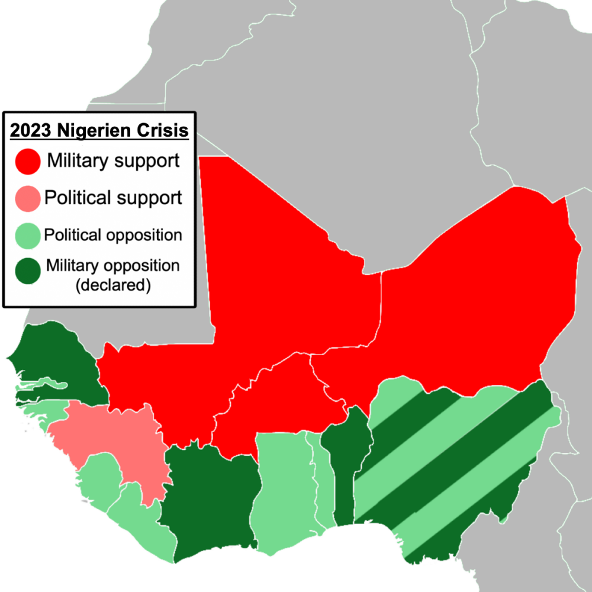
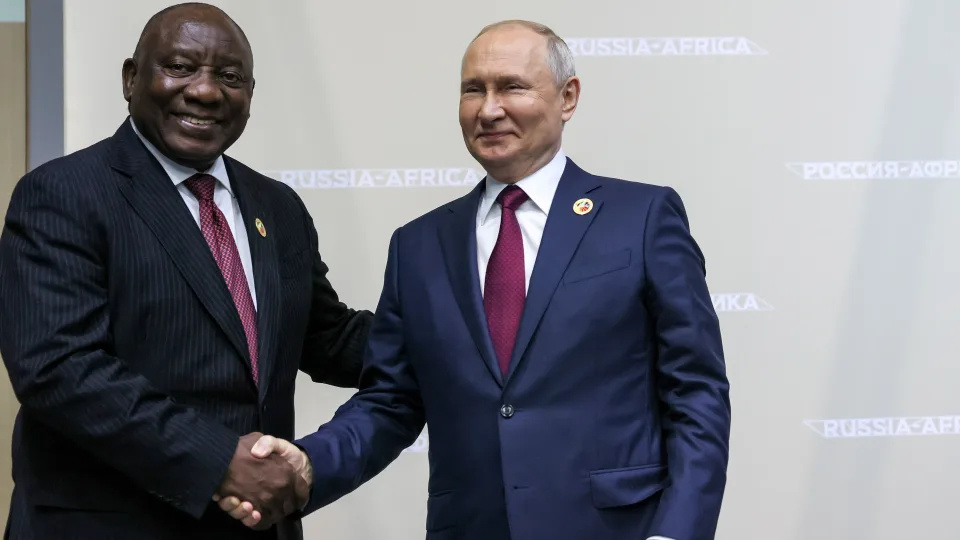
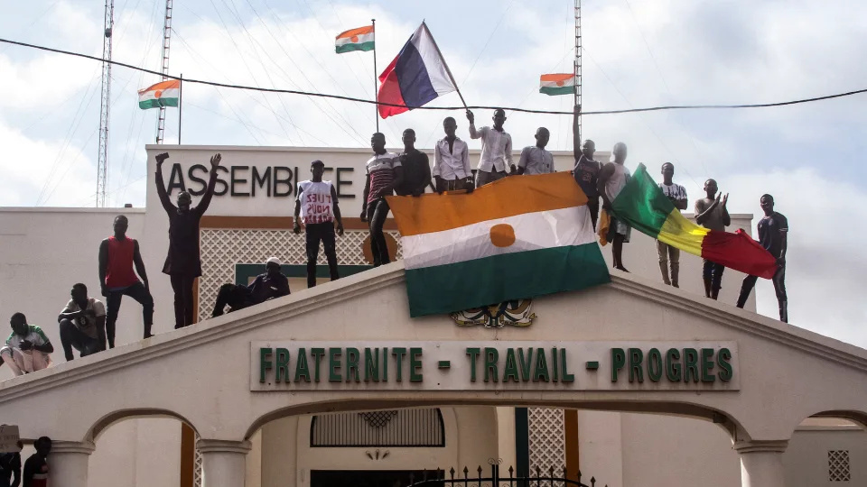

# 尼日尔政变后：当地人喊“俄罗斯万岁”，西共体下达军事干预最后通牒

**文/胡毓堃**

**编辑/漆菲**

距离西非国家尼日尔7月26日突发军人政变，迄今已过三周。在此期间，政变军人宣布成立保卫祖国国家委员会，总统卫队长阿卜杜拉赫曼·奇亚尼出任主席，由这一军政权接管国家事务。8月13日，该军事当局宣布，将起诉被其解除职权的在押总统穆罕穆德·巴祖姆。

自7月26日政变以来，巴祖姆及其家人一直被关押在总统官邸。

这一事件也深刻搅动了该国所处的“政变地带”——西非萨赫勒地区，周边国家既有好言相劝，也有武力威胁。在乍得总统代比亲赴尼日尔劝和不成之后，西非国家经济共同体（ECOWAS，下称“西共体”）对尼日尔进行了停权、制裁等措施，一些地区国家则以“军事干预”相威胁，却引发同为政变后军人执政的马里与布基纳法索的反弹，并称“干预就等于向它们宣战”。

尼日尔政变爆发后，该国乃至萨赫勒地区日益浓厚的反法氛围，与以瓦格纳为代表、持续扩大的俄罗斯影响力形成鲜明对比。政变次日，第二届俄罗斯-
非洲峰会在圣彼得堡开幕，俄罗斯与部分西非国家密切互动。8月15日，俄总统普京与马里过渡总统戈伊塔通话，进一步引发外界对萨赫勒地区“俄进法退”的联想。

_政变发生后，尼日尔示威者来到法国驻尼日尔大使馆门口进行抗议。_

对外界来说，尼日尔政治危机带来的连锁反应引人担忧。这个西非国家本就有430万人依赖人道主义援助。联合国机构8月16日警告，尼日尔政变引发危机，可能导致这个西非国家的粮食短缺状况严重恶化，相关国家和地区组织执行关闭边界等对尼制裁措施时应为人道主义援助“开个口子”，避免人道主义灾难。

在押总统命运成疑

在8月13日的电视讲话中，尼日尔政变军人发言人阿马杜·阿卜杜拉曼表示，已经收集证据，“将向尼日尔和国际社会有关机构起诉巴祖姆及其在尼日尔境内外的同谋，罪名为叛国、破坏尼日尔内外部安全”。声明说，这一指控基于巴祖姆与尼日尔有关人员、他国政府首脑、国际组织有关负责人的往来记录。根据尼日尔刑法典，一旦定罪，这位在押总统可被判处死刑。

 _尼日尔军人政府领导人阿卜杜拉赫曼·奇亚尼（右）。_

尽管联合国、非盟、西共体等国际和地区组织，以及美国、法国等国家强烈要求恢复巴祖姆总统职权和人身自由，尼日尔军事当局丝毫没有让步，反而给外界以“一意孤行”的姿态。也难怪美国国务院首席副发言人韦丹特·帕特尔将这一起诉形容为“毫无根据、毫无正当性”，西共体则把此举视为新的挑衅，完全背离了此前尼日尔当局所宣称的希望和平解决危机。

政变以来，63岁的巴祖姆几乎没再公开露面（除了乍得总统代比来访期间的合影），他的处境成为外界热议的话题。

_这张图片取自乍得总统代比的脸书页面，显示他于7月30日在尼亚美会见了被推翻的尼日尔总统巴祖姆。_

他的女儿扎齐亚（政变时人在法国）向英国《卫报》披露，巴祖姆一家被拘押在环境幽暗的总统府地下室，这里没有冰箱，食物慢慢变质，只能靠意大利面和米饭过活。同时也缺乏清洁用水、燃气即将用尽。在恶劣的拘押环境下，巴祖姆体重急剧下降，他20岁的儿子饱受慢性病折磨，却无法得到必要的医疗。

联合国人权事务高级专员沃尔克·图尔克（Volker
Türk）将巴祖姆所处的拘押环境描绘为“非人道、侮辱性、违反国际人权法”。按此说法，没等到审判定罪或者和平解决，巴祖姆的身体可能先垮了。

尼日尔政变军人发言人在声明中否认军方接管了巴祖姆的官邸，称后者不仅可以自由地与外界联系，医生还能定期拜访他，“医生没对解职总统及其家庭成员的健康提出任何问题”。

但据巴祖姆的助理说，政变军人8月12日首次允许总统私人医生去探望他。尼日尔驻美国大使则在接受美联社采访时说，政变军人允许巴祖姆使用手机，他仍能与外界保持联系。

国际社会之所以关心巴祖姆，是因为他的命运不仅关乎尼日尔的政治走向，也事关这一地区的稳定与安全。

巴祖姆本人对此心知肚明。在8月3日投书美国《华盛顿邮报》的文章中，他在开篇直言自己现在就是“人质”。卡塔尔半岛电视台驻尼日利亚记者艾哈迈德·伊迪里斯认为，尼日尔军事当局指控巴祖姆，就是要表达“拒不妥协”的态度，试图未来与西共体成员国谈判时增强砝码。对此，西共体内部一名高级军官也给出类似判断。

从这个意义上说，巴祖姆的命运，如同他曾领导的国家，从一开始便注定身不由己，甚至不完全取决于军事当局。萨赫勒地区各国的考量，域外大国和国际社会的施压效果，塑造了复杂交错的影响因素。

美国代理常务副国务卿维多利亚·纽兰8月7日前往尼日尔谈判，却未能见到巴祖姆或奇亚尼。在会见政变军人代表时，对方告诉她，如果邻国为恢复巴祖姆的职权而发起军事干预，他们会杀死巴祖姆。

西共体军事干预不易

作为非洲最大的发展中国家区域性经济合作组织，西共体成立于1975年，共有15个成员国，覆盖非洲超过六分之一的领土和三分之一的人口。自成立以来，西共体不仅致力于实现区域经济一体化、建设单一自贸区，还积极维护地区秩序、调解内部冲突。1990年以来，西共体干预了利比里亚、塞拉利昂、几内亚比绍、科特迪瓦、马里、冈比亚等国的内部冲突、政权非法更迭等政治危机。

政变发生之初，从西共体的反应来看，战争似乎一触即发：除了暂停尼日尔的成员国资格外，该组织还在商贸、金融等各个领域对其施加“极限制裁”。尼日尔军事当局坦承民众缺乏食物、药品、用电，并谴责西共体采取“非法、非人道、侮辱性”措施。

7月30日，西共体在尼日利亚首都阿布贾召开紧急峰会，给出“不排除军事干预”的最后通牒，又过了几天，各成员国的国防部长甚至制定了详细的军事预案，表明其态度并非口头威慑这么简单。

然而，尼日尔的两个地区邻国却给出针锋相对的立场：同样因军人政变被西共体暂停资格的马里与布基纳法索，基于共同立场力挺尼日尔军事当局，声称“任何针对尼日尔的军事干预都将等同于向马里和布基纳法索宣战”。抛开西非萨赫勒地区错综复杂的跨国武装势力，不同国家间在尼日尔危机上摆出“集团对立”的态势，更加剧了地区战火重燃的阴影。

尽管上述通牒尚未转化为切实的军事行动，但西共体并未放弃使用武力的可能性。8月10日，西共体宣布启动地区常备部队，为恢复尼日尔宪法秩序做准备。8月17日-18日，西共体成员国的参谋长在加纳首都阿克拉召开会议，部署针对尼日尔的常备部队最终计划。法国亦于8月16日表示，无计划撤回驻尼日尔的1500名法军。

战火尚未重燃，武力和暴力活动已然开始涌动。同样在8月16日，尼日尔军事当局宣称，其武装部队在马里边境附近的科托戈镇郊区“遭到恐怖分子伏击”，造成17人死亡、20人受伤。极端组织袭击恶化了安全局势，这也是尼日尔军事当局宣称的政变理由，继一周前关闭领空后，此刻宣布“恐袭”的消息，进一步传递出“危险重重、准备应战”的信息。

西共体各国缘何反应如此强烈，又是否会真对尼日尔军事当局发动战争？

西非萨赫勒被外界称为“政变地带”（Coup
Belt），这里法制秩序极为脆弱，军事政变频次和成功率出奇地高，因此成为各国的“梦魇”，以至于这些国家对于发生在本地区的政变尤为敏感。

短短两年间，尼日尔已是该地区第六个发生政变的国家（一说第七个，即算上2021年4月的乍得），而近期的地区国家政变情况表明，军人统治在这里有着更加稳固的传统，比民选政府更难撼动。

 _2020年以来西非地区发生政变的国家。图源：法国《费加罗报》_

对多米诺骨牌效应的恐慌，让那些尚未遭到波及的地区国家尤为不安，因此西共体的多数国家才会激烈反对、全力施压尼日尔军事当局。

历史上，西共体的军事干预出现多次，最近一次是2017年1月对冈比亚政局的干预，最终获得成功，进一步证明该组织对武力维护地区国家宪政秩序素来拥有决心和能力。

但就此次尼日尔危机而言，指望西共体能迅速启动军事行动、恢复该国原有秩序并不容易。想要组织有效的武装干预，西共体面临的客观限制还有很多。

首先，作为非盟承认及事实上的次级组织，西共体要遵守非盟“不干涉成员国内政和尊重地区主权”的原则，历史上的一些军事干预行动要么得到了非盟授权、要么是与非盟进行合作，且主要针对的是成员国内部的政治僵局或武装冲突。

而像尼日尔这样没有明显内部冲突的政变，西共体主要诉诸经济、外交压力迫使军方还权。这也是为何西共体在宣布“最终部署计划”的同时，仍然强调在采取任何军事手段之前先穷尽外交途径。

_尼日尔政变发生后，西共体成员国领导人在尼日利亚首都阿布贾举行会议。_

其次，非洲各国在这一问题上的立场有明显分歧。政变之后，关于暂停尼日尔非盟成员国资格的决议没能通过。近日在埃塞俄比亚首都亚的斯亚贝巴举行的非盟和平与安全理事会，更否决了西共体的军事干预提议。据法国“24小时”新闻台（France
24）披露，与会的众多北非和南部非洲成员国激烈反对任何军事干预手段。

在非盟其他地区国家不支持的情况下，西共体内部也难形成合力。被暂停成员国资格的马里、布基纳法索和几内亚与尼日尔军事当局处于同一阵营，剩下11国中只有尼日利亚、科特迪瓦、塞内加尔、贝宁承诺参与军事干预，其中真正有能力提供主要兵力的是西共体轮值主席国尼日利亚。

_西非萨赫勒地区针对尼日尔政变的态度（红色表示支持，绿色表示反对）。图源：Wikipedia_

上海社科院国际问题研究所副研究员李因才指出，尽管尼日利亚新任总统博拉·蒂努布希望以强硬姿态解决地区问题、重振其地区大国主导地位，可他目前面临国内强烈的反对干预声音，以及极端势力、武装叛乱、宗教和族群冲突等安全挑战，实属自顾不暇。“一旦陷入军事干预过久，巨大的资源消耗更是这个非洲第一大经济体难以承受之重。”

相比之下，已与马里和布基纳法索结成安全同盟的尼日尔军事当局，正在推进其内部整合与社会动员，逐渐巩固权力。得益于巴祖姆时代的亲西方立场与重要的地缘位置，尼日尔武装力量获得过美国、法国等西方国家的重点援助与培训，经历了长期打击极端组织与叛乱武装的历练，其战斗力远超西共体曾经干预成功的塞拉利昂、冈比亚等国。

两相比较，西共体整合、组建、部署有力的武装力量仍有待时日，但时间越久、军事干预的机会和效果会越打折扣。倘若贸然重燃战火，恐将严重偏离“恢复尼日尔宪政秩序”的目标。

“俄进法退”的分水岭？

“各国人民要求改变的愿望已经撼动了这一地区……这导致我们不再理会传统伙伴，而转向我们新的朋友，例如从去殖民化开始至今都支持我们的俄罗斯。”

7月27日，在圣彼得堡举行的第二届俄罗斯-非洲峰会上，35岁的布基纳法索过渡总统（非洲最年轻的国家领导人）易卜拉欣·特拉奥雷直白表达了“弃法亲俄”的态度。

同为经过军事政变上台的领导人，他无疑支持尼日尔军方在前一天发动的政变、推翻亲西方总统巴祖姆的做法：“我们想要共同的目标……一个以主权为导向的多极化世界……并彻底改变我们的伙伴。”

同一时刻，在非洲有着广泛利益的瓦格纳集团创始人普里戈任也对这场政变表示恭喜：“发生在尼日尔的事件已经酝酿多年……原殖民者试图保持对非洲各国人民的控制。为了控制他们，原殖民者往这些国家塞进恐怖分子和各种土匪组织，制造了巨大的安全危机。”

目前尚无迹象表明俄罗斯或瓦格纳集团在尼日尔政变中有任何参与，但当西共体扬言准备军事干预后，俄方的立场与行动更加明确。

_俄罗斯-非洲圣彼得堡峰会期间，俄总统普京与南非总统拉马福萨握手。_

8月15日，普京在与马里过渡总统戈伊塔通话时强调，和平的政治与外交手段对于解决问题至关重要，无疑是对西共体启动常备部队的回应。此前西共体首次提出“军事干预”时，俄罗斯外交部便警告此举会加剧对抗、破坏萨赫勒地区的稳定。

就俄方可能发挥的作用而言，国际社会并不预期它会亲自下场，外界的目光仍聚焦于近年来在西非萨赫勒地区高度活跃的私人武装瓦格纳集团。马里和布基纳法索发生政变后，当地军人政府与瓦格纳在培训本国军队、打击极端组织、平息国内动荡等安全领域展开了密切合作。

在其他非洲国家，瓦格纳的身影也随处可见。他们与苏丹内战中的“快速支援部队”（RSF）在金矿区就采矿、安全行动等方面开展业务来往，还参与了中非总统图拉瓦德的安保工作。

与之形成鲜明对比的，是以法国为代表的原宗主国影响力式微。2014年发起的“新月形沙丘”反恐行动效果不彰，援助承诺大都口惠而实不至，西非各国民众对法国转向失望，耐心也随着时间的流逝而消磨。

2017年5月19日，法国总统马克龙在马里北部加奥视察驻扎在非洲萨赫勒地区的法国军队。

随着“反殖民主义”思维下的反法情绪日益浓厚，布基纳法索、马里等国已对法军下达“逐客令”。法国电视五台的非洲部负责人奥斯曼·恩迪亚耶称，尼日尔抗议中所表现出的对法国的愤怒在政变之前就有，整个萨赫勒地区都充斥着“对法国对非政策的不满”。

政变发生后，数百名年轻人来到法国驻尼日尔大使馆门前抗议，大喊“俄罗斯万岁”“欢迎瓦格纳”等口号。“我们需要俄罗斯。我们希望有新的伙伴帮助我们取得独立。我们希望以马里和布基纳法索的兄弟为榜样。”在这些示威者看来，这样才能获得新希望，让国家安全形势改善并实现自主发展；而巴祖姆领导的亲西方民选政府由于在社会、经济、安全治理方面表现乏力，已然是“穷途末路”。

8月3日，亲军事政权的尼日尔民众举行示威活动，有人举起了俄罗斯国旗。

在西共体部署军事干预之时，据美联社披露，尼日尔当局派出二号人物萨利福·莫迪访问马里，公开提出寻求瓦格纳的援助。

普里戈任此前宣布，瓦格纳集团将暂停招募新兵，未来继续在非洲和白俄罗斯展开活动。相比于已与瓦格纳密切合作的马里和布基纳法索，尼日尔的大国博弈格局一旦生变，影响无疑会大得多：

安全领域，美国和法国在该国有军事基地，德国、意大利、加拿大也以不同形式有其军事存在或者培训；经济方面，尼日尔丰富的铀矿是欧洲所依赖的核燃料来源（满足法国15%的铀需要和欧盟20%的铀储量）；就地缘位置而言，尼日尔地处阿拉伯北非（马格里布地区）与撒哈拉沙漠以南非洲地区的过渡地带，对于困扰欧洲的移民浪潮是重要的缓冲地带。

2021年，法国总统马克龙（右）在非洲萨赫勒地区安全会议召开之前会见巴祖姆。

对法国而言，尼日尔危机之所以严峻，除了该国独特的战略价值，还在于它彻底暴露了法国与非洲法语区国家之间的裂痕。美国CNBC网站称，法国、欧盟和西共体是这场政变的最大输家。南非智库“安全研究所”研究员奥杰威尔直言：“针对非洲的第三波争夺已经到来……所有人都想与非洲做贸易。”

由此来看，尼日尔真正的变化或许刚刚开始。

（作者系中国翻译协会会员、国际政治专栏作家 ）

