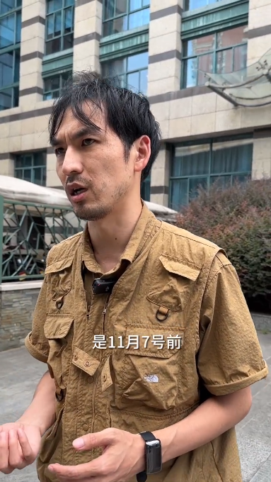
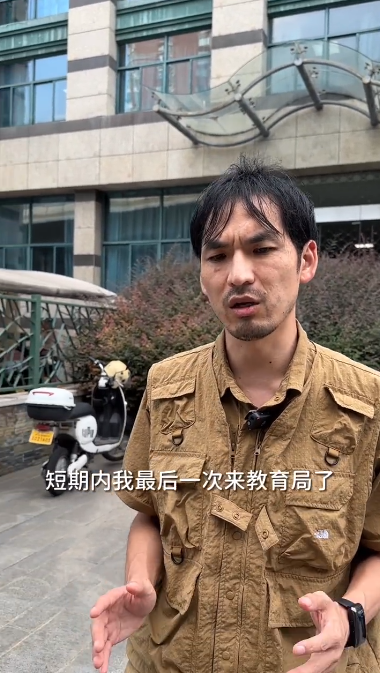
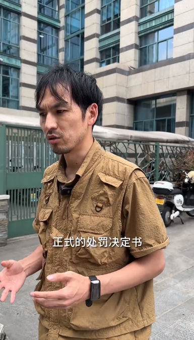
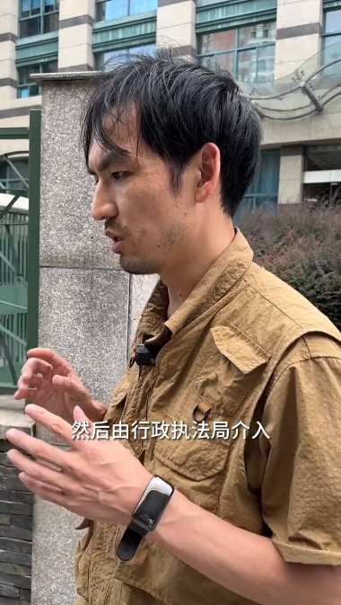

# 网红铁头发布视频称没有故意针对新东方，最近太累将休息一阵子

8月19日，陷入舆论风波中的网红“铁头惩恶扬善”发布视频称，近来，杭州新东方补课事件受到了很大关注，教育局给的结果是11月7号前会给到一份正式的处罚决定书，目前就是正式立案，由行政执法局介入，初步查实了杭州新东方的违规补课的事实。

铁头称，关于举报新东方违规教培，第一，没有故意针对新东方；第二，没有任何人给出谋划策，没有大佬或资本，全部是自己一个人的决定，去新东方也是偶然的行为；第三，暂时告别举报教培补课、还有所谓在各大初中高中学校里面超前上课的行为，去做其他更有意义的打击消费欺诈、维权的事。因为最近真的太累了，想休息一阵子。

**【来源：当事人账号】**

