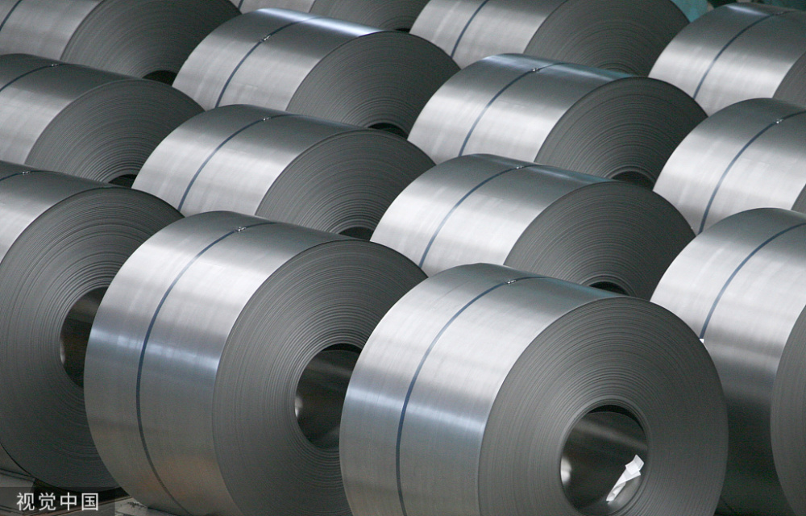

# 美国对3国征镀锡钢反倾销税，中国税率最高，专家：非常阴险

【环球时报报道 记者 高雷
陈子帅】美国商务部8月17日表示，将对从中国、德国、加拿大进口的镀锡钢征收初步反倾销税，理由是中国、加拿大与德国的镀锡钢生产商在以低于“公平市场价格”的售价销售这些产品，即这些厂商在国外市场的售价，低于其在本国市场的售价。

 _美国商务部8月17日表示，将对从中国、德国、加拿大进口的镀锡钢征收初步反倾销税。图片为资料图_

据彭博社18日报道，此次美国商务部的决定基于今年2月美国钢铁厂商克利夫兰-
克里夫斯的请愿书。该请愿书指控外国在马口铁（电镀锡薄钢板的俗称）行业存在倾销行为，近年来已导致多家美国工厂关闭。除了指控中国、德国和加拿大“倾销”，克利夫兰-
克里夫斯还指控英国、荷兰、韩国、土耳其以及中国台湾。该厂商要求征收的反倾销税也非常高，比如要求对英国征收111.92%，韩国110.5%，荷兰296%的反倾销税。

美国商务部最终剔除英国、荷兰、韩国、土耳其以及中国台湾，但决定对中国施加122.5%的税率，德国7.02%，加拿大5.29%。美国商务部一名官员称，中国的税率这么高是因为中国的一家厂商不够配合美国的调查，其他中国厂家无法证明它们独立于中国政府，所以被做出“不利推定”。

此外，路透社提到，作为一项单独平行调查的一部分，美国商务部 6
月宣布，对从中国宝山钢铁公司进口的锡厂征收543%的初步反补贴税，对从所有其他中国生产商进口的锡厂征收89%的初步反补贴税。

清华大学战略与安全研究中心特约专家余翔18日对《环球时报》记者表示，美国单独对中国施加122.5%的税率，明显是一种具有惩罚性和歧视性的措施，但客观来说这也符合美国一贯的政策逻辑。余翔表示，当前中国经济正处在快速复苏阶段，美国通过反倾销打压中国传统制造业，是非常阴险的做法。制造业涉及面广，并且能够解决不少就业，美方希望借此给中国经济施压。此外，在美国眼中，德国是仅次于中国，对美国出口有较大影响的国家，所以这次连带打击德国，而加拿大只是象征性的“陪衬”。

由于镀锡钢用于制造食品罐头与其他容器，有美国媒体称，这会导致一些罐头食品价格上涨。路透社报道称，美国罐头制造商协会在美国商务部做出决定之前表达了担忧，称由于美国钢铁制造商目前生产的马口铁不到国内罐头制造所需的一半，任何新的进口关税都将导致在通胀时期材料成本和食品价格继续升高。美国会议员在6月份的一封两党信中还表示，高额反倾销税将提高食品罐头和气雾剂产品包装的成本，最终可能帮助中国的罐头食品生产商，导致从中国进口的罐头食品增加。

至于美国商务部的决定对中国相关行业有多少影响，余翔分析认为，中国镀锡钢出口量大，全球市场份额占比多，短期内国内相关企业会受到冲击，但近年来国家出于环保，调控了镀锡钢的生产规模，所以从中长期来看，美方此举反而能够倒逼国内企业进行产业转型和技术升级。

