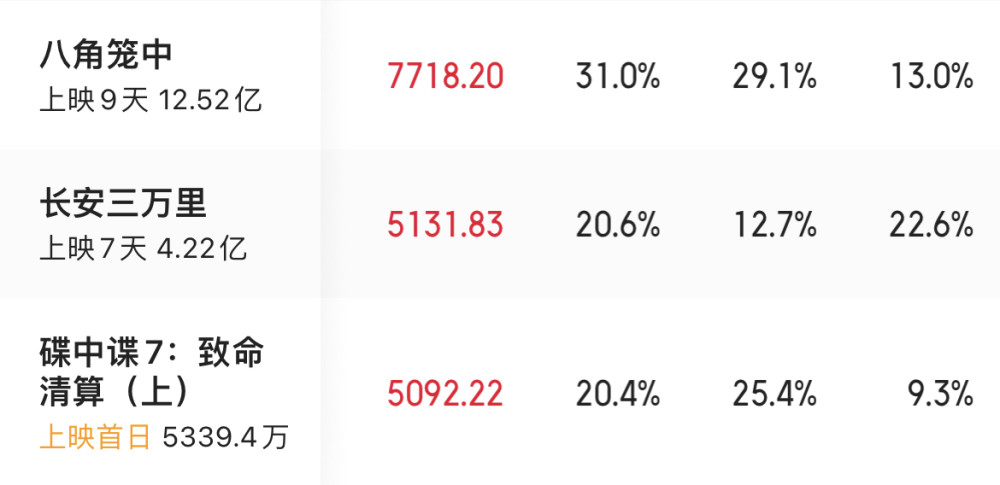

# 美媒尴尬发现：没有“国产保护月”，好莱坞电影也打不过中国电影了

（观察者网讯）综合路透社、美国文娱杂志《Variety》网站等18日报道，中国大陆暑期档票房17日超过2019年同期的178亿元人民币，提前14天锁定“史上最强暑期档”。而在这份傲人的成绩单中，西方好莱坞电影起到的作用“微乎其微”。

《Variety》还发现一件更为尴尬的事：今年好莱坞电影终于挺进暑期档，打破了过去每年6至8月引进片避让的“国产电影保护月”惯例，但这些影片居然被中国国产片“爆杀”得片甲不留，连《变形金刚》、《碟中谍》这种超级IP都风光不再，拿下的票房连大热国产片的零头都不到。

在目前全球电影市场总体表现依然疲软的环境下，中国市场今年以来捷报频传，尤其进入暑期档后，中国电影市场更爆出记响亮的“双响炮”。

据国家电影局8月18日发布的统计数据，截至2023年8月18日7时，今年暑期档电影票房已达178亿元，超过2019年暑期档总票房177.79亿元，创历史新高，同时今年年度票房突破400亿元大关。2023年暑期档观影人次已超过4.35亿。

暂列2023年暑期档票房榜前五名的影片分别为：《消失的她》（35.21亿元）、《孤注一掷》（22.53亿元）、《八角笼中》（21.87亿元）、《封神第一部》（21.35亿元）、《长安三万里》（17.39亿元），皆为国产作品，并且其中4部影片的票房超过20亿元，数量上也是历史最多。

 _《封神》剧照_

路透社、《Variety》也发现中国国产影片在暑期档一路高歌猛进，表现远远好于《芭比》等好莱坞大片，连连感慨，“这一票房纪录的缔造者是中国国产电影，美国好莱坞电影的功劳微乎其微。”

报道援引电影咨询公司Artisan
Gateway的最新数据称，截至今年8月中旬，中国内地票房总额比去年同期高出整整72%，仅低于2019年同期6%。而美国电影在中国内地市场的票房总额为5.92亿美元（约合人民币43.12亿元），远低于2019年同期的19亿美元（约合人民币138.352亿元）。

《Variety》还关注到一个细节：与往年不同，今年中国大陆的影院并没有出现“国产保护月”的惯例，相反，好莱坞电影的引进频率几乎达到了疫情前的水平，从6月至8月中旬，基本每周都有好莱坞电影上映，但这些电影几乎“全军覆没”，在国产电影面前输得一败涂地。

“国产电影保护月”是国家电影局从扶植国产电影的角度考虑，2004年口头下达的希望全国各院线支持国产影片的通知，每年6月10日至7月10日（或7月到8月）期间，不鼓励引进海外分账大片。

这段时间被媒体和业界简称为“国产电影保护月”。尽管不成文，但在过去十多年里，国产片和引进片心照不宣地在暑期档养成了“井水不犯河水”的默契，待暑期尾声“交棒”。

“国产电影保护月”当初存在的初衷，是为了在来势汹涌的好莱坞大片面前，给国产片留有喘息的余地。但没想到的是，好不容易“杀”进暑期档的好莱坞大片，如今居然成了“弱势”的一方。

61岁的汤姆·克鲁斯赤身上阵、玩命肉搏，也只为《碟中谍7》搏回一个“好莱坞商业动作片最后荣光”的名声，这部7月14日于内地上映的爆款IP，预计最后的内地总票房不超过3.5亿元人民币（目前为3.46亿）。

一个很扎心的比较是，作为一部集齐了所有“大爆”元素，并且上映时没有其他新对手的影片，《碟中谍7》上映首日仅收获了5400万元内地票房，还没有已经上映了近10天的《八角笼中》高。

出现差不多情况的还有《变形金刚：超能勇士崛起》（6月9日大陆上映，内地票房6.55亿元）、《蜘蛛侠：纵横宇宙》（6月2日，3.57亿元）、《芭比》（7月21日，2.46亿元）、《闪电侠》（6月16日，1.85亿元）、《疯狂元素城》（6月16日，1.14亿元）。

更惨的还有《夺宝奇兵5：命运转盘》（6月30日，2392.1万元）、《忍者神龟：变种大乱斗》（8月11日，856万元），这两部电影上映以后存在感极弱，几乎毫无水花。

《速度与激情10》是一个比较特殊的例子，非常重视中国票仓的它，提前于北美上映2天前与中国大陆观众见面（5月17日），密钥延期至7月16日，一只脚踩进暑期档，但“超长战线”最终也只拿下9.83亿元的票房。

再回溯到6月暑期档开始前，《黑豹2》《蚁人与黄蜂女》《银河护卫队3》等热门超级英雄电影的成绩也不如人意。

《Variety》提到，近一年内在中国市场取得较好成绩的，可能只有2022年12月16日上映的《阿凡达:
水之道》，获得近17亿元的内地票房。但报道也指出，这个成绩在一定程度上得益于中国观众当时的“报复性消费”。

中国市场是好莱坞的重要票仓。西方一直通过电影、流行乐等软实力向东方输出，但近年来中国观众对于好莱坞电影的兴趣在下降。在英国诺丁汉大学中国项目主任乔纳森·沙利文看来，随着中美关系陷入紧张，国内爱国主义热情高涨，中国人正在重新评估西方文化的价值，也更愿意支持国产电影。

《华尔街日报》7月曾以“连汤姆·克鲁斯也无法吸引中国影迷去看好莱坞电影”为题发文，谈到中国观众不再对好莱坞电影着迷，其采访的一名中国观众直言：“人们对好莱坞电影祛魅了。”

文章还称，如今一些好莱坞的制片人们显然也意识到了他们在中国市场的尴尬境地。美国资深制片人贝拉·艾弗里坦言，不应再抱着那种以为不费吹灰之力就能让中国影迷买单的想法，那种自以为是的傲慢时代已经过去了。

美国《新闻周刊》网站6月援引一份报告指出，中国电影市场的繁荣，也导致其消费需求已经影响到了好莱坞的内容创作。

沙利文认为，好莱坞要想在中国保持成功，就必须开始制作更加迎合中国人口味的电影——这与之前觉得中国人的口味会变得更加西方化的判断截然相反。

“我认为整个好莱坞都意识到，中国市场的要求已经变得更加与众不同。”沙利文说，“在以往，有几个场景切换就足够了；现在我认为业界意识到，中国越来越需要更多的定制产品，以满足观众需求的变化。”

**本文系观察者网独家稿件，未经授权，不得转载。**

