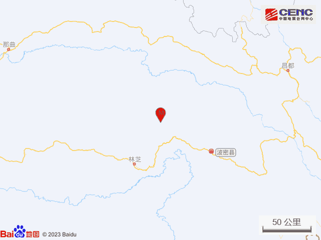
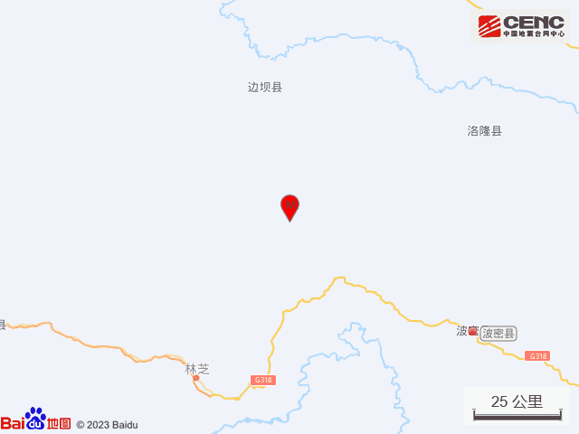
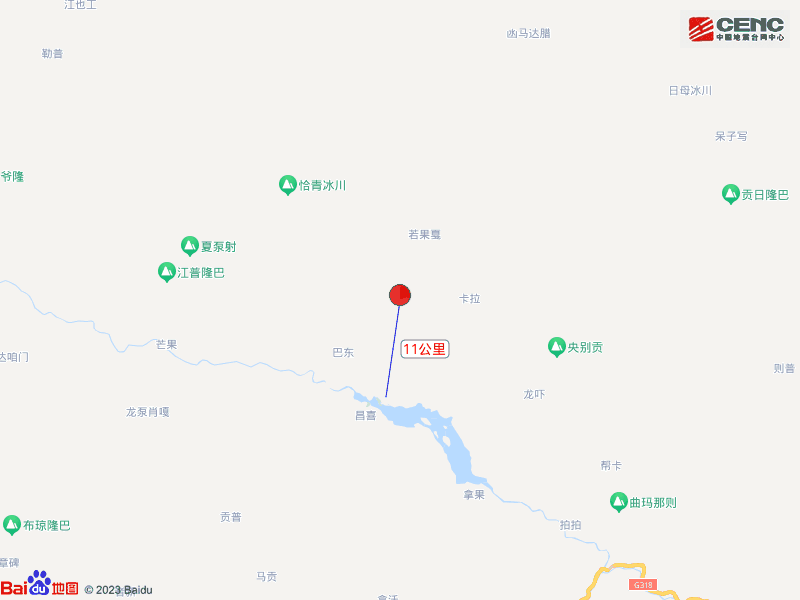
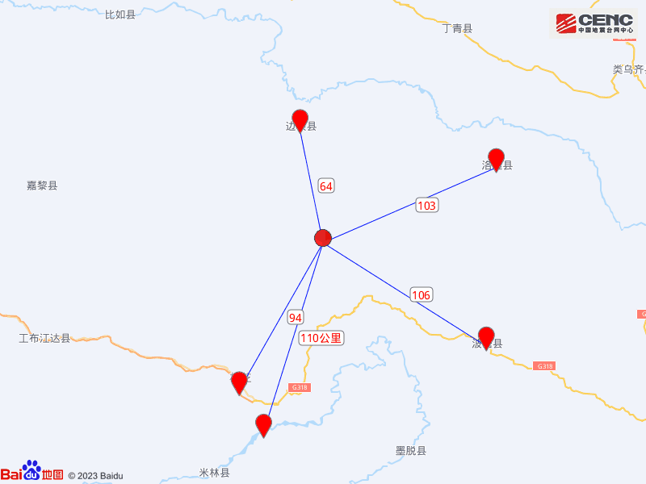
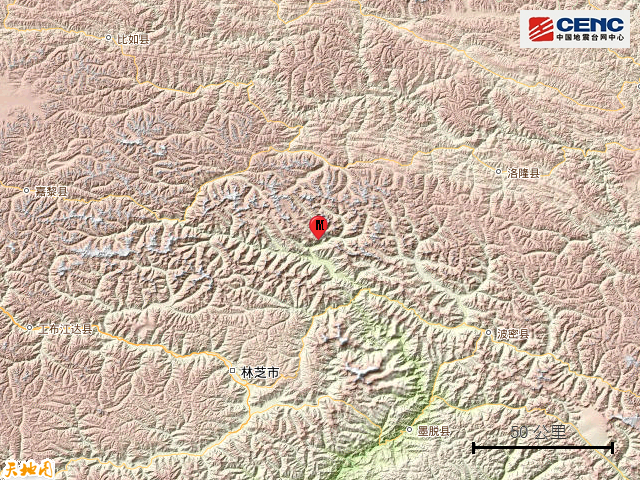
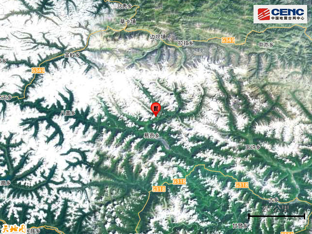
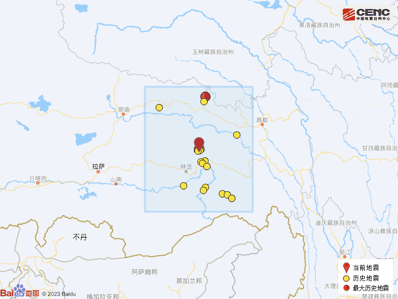

# 西藏林芝市波密县发生4.3级地震

据中国地震台网正式测定，8月19日22时46分在西藏林芝市波密县发生4.3级地震，震源深度10公里，震中位于北纬30.37度，东经94.84度。

本次地震周边5公里内的村庄有崩果，20公里内的乡镇有易贡乡。

震中距边坝县64公里、距巴宜区94公里、距洛隆县103公里、距波密县106公里、距米林县110公里，距林芝市93公里，距拉萨市368公里。

震中5公里范围内平均海拔约3270米。

根据中国地震台网速报目录，震中周边200公里内近5年来发生3级以上地震共109次，最大地震是2020年1月25日在西藏昌都市丁青县发生的5.1级地震（距离本次震中181公里），按震级大小前50次历史地震分布如图。

