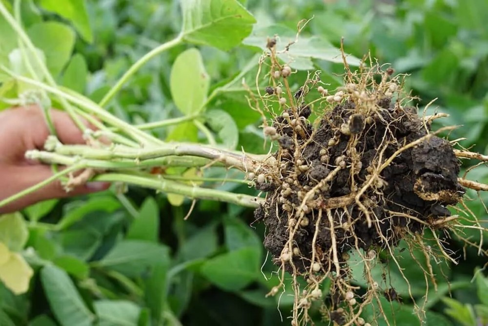
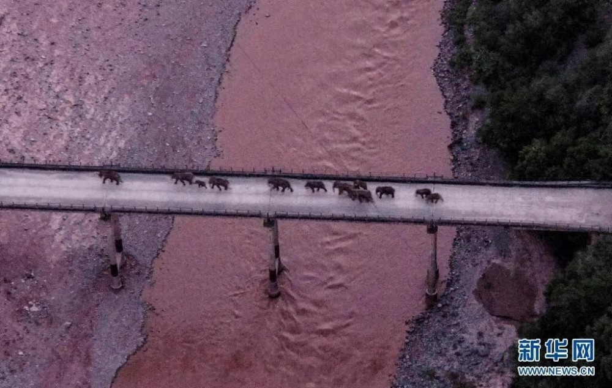

# 高温影响爬行动物性别？极端天气下，各类物种正经历灾难性“死亡”

**核心要点**

  * _1_ 很多细菌及微生物随着温度上升会变得异常活跃，不断侵蚀我们的生活，侵蚀其他动植物的生存环境。
  * _2_ 高温甚至会影响海龟和很多爬行动物的性别，比如温度越高，雌性海龟的数目会更多一点，温度越低，雄性海龟就多一点。高温引起的性别差异可能对未来种群繁衍产生很大影响。
  * _3_ 最近几十年的监测发现，欧洲的普通燕子的尾巴越来越长。由于快速沙漠化，只有尾翼更长的燕子才能飞越撒哈拉沙漠，体型正常的燕子则在飞行过程中死掉。

极端的气候变化正愈演愈烈，而跟随极端气候变化到来的，是越来越多的动植物惨烈死亡的事件和越来越快的物种灭绝速率。

全球高温之下，动植物正在发生哪些不为人知的变化？它们有能力应对这场气候危机吗？这种种生态灾难，我们真的能寄希望于生物的进化能力和自然的修复能力吗？本期《一起来唠科》邀请博物学科普作者任辉、中科院大气物理所气象所气象学家魏科和中科院自然科学史研究所特别研究助理孙亚飞，共同来关注全球高温之下的生物生存挑战。

**任辉：气候变化有可能会对全球的生态系统，尤其是生物带来巨大的压力。现在野生动植物的灭绝速度本身已经远远快于自然界正常的灭绝速度，有些学者称之为是地球上的第六次大绝灭的时代。那么气候变化可能又进一步加剧了这种绝灭的速度。目前已经出现了因为极端天气和气候变化而灭绝的物种，这种故事以后会不会越来越多地出现？请两位老师，从自己的专业角度共同探讨一下气候变化对全球生物的影响。**

**孙亚飞：**
读博期间我经常用细菌做反应，细菌是对温度非常敏感的一种生物，很多细菌及微生物随着温度上升会变得异常活跃，不断侵蚀我们的生活，同样也会侵蚀其他动植物的生存环境。
**历史上人们说的瘴气，很大程度上其实就是微生物带来的。**

另外，微生物本身的生态也是很重要的， **因为一些动植物也是需要微生物提供能量以及矿物质的。**
例如山上的松树，它所吸收的很多营养物质是靠和它共生的微生物传递的；豆科植物能够合成出氨类的物质，也是靠它的根瘤菌去实现的，这曾经是地球上的胺类物质产生的主要方式。
**因此气候变化之后引起的微生物的新变化，可能是非常致命的。**

 _豆科植物与根瘤菌（图源：网络）_

这在我自己的实验当中也有据可循：在纤维素水解的过程当中，温度的变化将引起细菌分解葡萄糖多少的不同。这映射出一种非常典型的温度上升所带来的整个生态的变化。

**魏科：关于气候变化与生物多样性之间的关系，我自己还写过一套科普的图书，叫做《当世界变得不一样》，** 里面都是一些活生生的案例。

刚刚孙老师提到了微生物，那我就讲微生物的例子。在2020年前后，国际机构忽然发现在非洲博茨瓦纳地区，大概有330多头大象死亡。大象的身体都很完整，没有枪击的痕迹，象牙都在，排除了偷猎的可能性。调查研究最终发现是源于当地发生的大规模高温和干旱事件，大象平时喝水的池沼里面的水面积变小，有机质含量超标导致蓝藻爆发，释放出藻毒素。这是一种神经类的毒素，大象体型大饮水多，引发的中毒就更严重。

在同一时期，大家可能还记得云南当时有一批大象离家出走，从西双版纳一直走到昆明市郊区，关于出走原因的讨论众说纷纭，最终云南大学的王海军教授做过调查之后发现，那个地区发生了建国以来最严重的高温和干旱，当地发布了高温橙色预警、干旱橙色预警和森林火险橙色预警，很多大象平时喝水的池塘都干涸了，因此被迫出走。

_云南象群（图源：新华网）_

这是大象的两种遭遇，都跟高温和干旱有关。

同样是高温和干旱，引发了2019年至2020年澳大利亚的那场山火，大概30多亿只动物死去；今年加拿大的山火到目前为止也已经有大概两个月时间了，过火面积已经到了11万km²，超过了韩国的国土面积。

**还有一些影响以大家意想不到的方式出现，**
比如高温可以引起珊瑚礁的白化。高温甚至会影响海龟和很多爬行动物的性别，温度越高，雌性海龟的数目会更多一点，温度越低，雄性海龟就多一点。这种高温引起的性别差异可能对于未来爬行动物未来种群繁衍产生很大影响。还有很多北欧科学家研究发现，驯鹿的体型在过去二十年当中越来越小。这是因为当地雨下得多、雪下得少，雨下多了在地上容易成为冰，驯鹿的蹄子刨不开，吃不到底下的苔藓，给整个种群带来巨大的影响。

**任辉**
：我也提供几个我知道的案例。2015年哈萨克斯坦有一种高鼻羚羊。这种羚羊原来在我们国内西北也有分布，现在主要是在哈萨克斯坦及周边的几个中亚国家。
**2015年的春天，这种羚羊的全球种群规模大概是257000余头，在一周之内就死了210000多头，也就是说整个物种在一周之内就减少了80%以上。**
关于死亡原因有着很多推测，后来发现羚羊的死因是体内器官内出血。原来2015年的春天比往年的雨水来得要早了一些，羚羊吃了大量含水量远超于往常的草，体内的败血性巴斯德氏菌产生了一些有毒物质，差点把这个物种给一锅端了。

还有一个例子是我们再熟悉不过的燕子。儿歌里说，春天的时候燕子会回来，那么秋天的时候，燕子要往哪儿去？我们中国的燕子其实是有三个去处：第一是像印度尼西亚、巴布亚、新几内亚等赤道上的区域；第二是澳大利亚或者新西兰以及中东；还有一批最远的会飞到非洲去。而欧洲的燕子，就是在非洲的南部和欧洲之间来回的迁徙。最近几十年的监测发现，欧洲这边生活的普通燕子的尾巴越来越长。为什么会出现这种现象？燕子在迁徙的时候是要横穿撒哈拉沙漠的，撒哈拉沙漠南面有个地方叫撒哈勒地带可以供燕子落脚，最近这几十年出现了快速的沙漠化，那么只有那些尾翼更长，能够提升更大升力的燕子，才能一口气儿都不歇飞越撒哈拉沙漠，体型比较正常的燕子在飞行过程中都死掉了。
**这是很残酷的自然筛选的过程。**

另外有一种候鸟叫红腹冰玉，这种鸟是在南北的高纬度地区来回迁徙，在全世界有六条迁徙的途径。其中一条途径是直接从阿根廷飞到美国的西海岸，中间要连续不停飞行大概七八天完全不能落地的，这种鸟本身体型又非常小，大概只有鸽子的一半，以至于它从阿根廷起飞之前就要进行一系列身体上的变化，甚至要把自己的性器官、腿上的肌肉这些飞行时用不着的东西彻底萎缩掉，并通过大量进食在身上储备脂肪来应对这场七八天的飞行。但最近也发现它们迁徙的成功率在不断下跌，一个原因就是近年在它飞行的路上不断出现飓风，它们发现飓风就要多绕行一千多公里，很多鸟就在绕行过程中死了。另一个原因是，它们原本要在目的地北极的极昼刚开始、昆虫开始大量滋生的时候，大量地吃昆虫来恢复体能、完成繁殖，但现在北极的春天越来越早，等它们饥肠辘辘地来到这里，很多昆虫已经死了，它们就没有东西吃。

**通过上边这些例子，我们可以看到很多生物因为气候变化面临着困境。但还有一些生物，也因为气候变化而受益。**
例如，“蓝眼泪”原来是在温暖海域才有的，福建平潭市的“蓝眼泪”就是当地巍为壮观的特色景象。但近年来，浙江，江苏，山东的日照、青岛、威海，甚至辽宁的丹东都出现了“蓝眼泪”。蓝眼泪作为一种赤潮，反映出微生物的环境出现了一些异常的变化。

 _福建平潭“蓝眼泪”（图源：平潭文旅）_

我最近几年常去一些沿海地区的核电站。沿海的核电站需要不断从海里边抽水来给自己的反应堆来带走过量的余热，原来在抽水的过程中特别害怕有很多的海洋生物把取水管道堵住，很多核电站设计的时候做过调查，当海域里没有什么东西，抽取时摆上几道网过滤一下杂物就可以。但是现在发现有很多原本不应该出现在这里的水母、小毛虾、笔帽螺大量出现，
**这也是海水温度导致生物不断向北扩散的实证。**

还有去年有网友说在国内某平台上买到了一种有毒的蓝环章鱼，质疑为什么正规的平台没有检测出蓝环章鱼，让它流入了市场。其实是因为这种章鱼原来在中国海域不存在，但现在在我国东南地区沿海一次寻常的海水捕捞就捞了出来，那它以后会不会再出现在更靠北的海区，这都很难说。

总之，希望大家能对气候变化对生物带来的影响有更直观的更全面的认识，同时需要注意到这些对生物的影响最后都可能会引导我们人类自己身上。

**专家信息：**

撰稿：胡芸雯

**版权声明：本文系腾讯新闻《一起来唠科》独家稿件，未经授权禁止媒体转载，但欢迎转发至个人朋友圈。**

