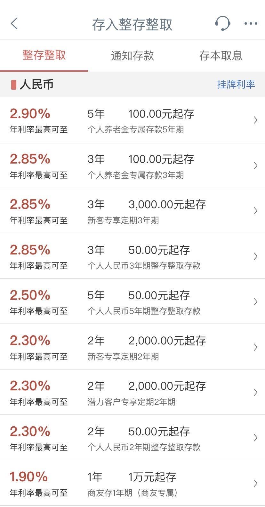
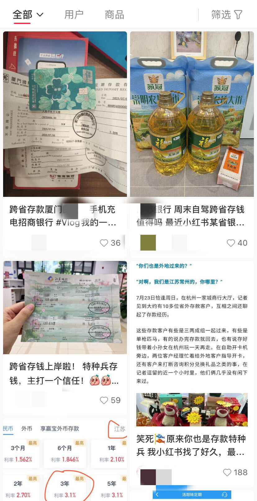

# “存款特种兵”的经济账：15万本金，花330块车费，多赚1800块利息

本文来源：时代周报 作者：李杭

“特种兵式”存钱在年轻人中流行了起来。

今年以来，随着国有大行、股份制银行相继下调存款利率，市场上衍生出一种“特种兵式”的存钱现象。

_国有银行存款利率相继下调 图源：网络_

简单来说，就是为了更高的存款利率，在限定的时间内，从一个城市到另一个城市存款。

自8月以来，多家中小银行下调了存款挂牌利率，部分村镇银行经过此次调整后，3年期、5年期定期存款利率已调降至3%以下。

在这样的背景下，不少年轻人试图赶在部分银行没有调整利率前，把钱存进存款利率相对高的银行。

仍处于理财小白阶段的年轻人，在权衡收益和风险之间，做了一些努力和尝试。

**三年多赚1800元的利息**

8月12日，本来应该是个睡懒觉的周六，豆豆一大早爬起来，从连云港坐高铁赶到杭州，目的只有一个：存钱。

“早上9点起床，11点坐上高铁，下午3点到杭州，再坐半个小时地铁到达银行，存完钱后，立马赶到高铁站，晚上6点到了苏州。”这是苏州人豆豆体验特种兵存款的一天。

自从工作以来，存钱成为了豆豆生活中的习惯。在存到人生第一笔十五万块之后，她准备给存款找一个好去处。

“一方面是感觉网络诈骗防不胜防，把钱放在卡里我不太放心；另一方面是每天看到余额宝的收益越来越少，觉得很不划算，所以开始有意识地在网上搜索一些存钱理财方式。”豆豆说。

反复的对比之下，豆豆决定把钱拿去银行存定期。“在钱这一方面，我一直比较谨慎，最终还是选择了储蓄这种低风险的理财方式。”

在选择银行的时候，豆豆才知道，不同银行和地区有存款利率上的差别，这让她开始有了跨省存钱的念头。

“我在网上对比了几家银行的利率，发现江苏银行的利率比较高，可以达到存3年定期利率3.3%。在社交平台上，有客户经理联系了我，并且许诺报销车票，送礼品，所以我就特别心动。”豆豆说。

出于安全考虑，豆豆要来了对方的工号，并仔细核对了身份信息。“我觉得算是双向奔赴吧，当时我买完车票后，那个客户经理立刻就把高铁票的钱转给了我，这让我们之间建立起了很强的信任。”

出发之前，豆豆仔细地算了一笔账。

“以15万为本金计算，就利息来看，在苏州本地的一些银行存，三年利率是2.9%，3年的利息是13050元，如果去杭州的江苏银行存，三年利率是3.3%，3年就是14850元，多了1800元。”

不仅如此。豆豆从连云港出发到杭州，高铁票330元。但从杭州回老家苏州的的119元高铁票，客户经理给报销了，还送了一张300元的购物卡，“我个人感觉还是比较合适的”。

据了解，不同地区存款利率有所不同，是由诸多因素共同导致的。

光大银行金融市场部研究员周茂华告诉时代周报记者，各地银行存款利率差异主要反映了国内区域经济发展不同，各地银行存款市场供求及各区域银行负债情况方面的差异。

由于不同地区银行资金需求、资金成本、同业竞争态势的不同，会出现同一银行在不同地区、不同网点、线上线下存款利率的些许差异。此外，同一家银行的不同分支机构，市场竞争情况、资产负债情况会存在差异，在符合总行制定的利率基本原则下，总行会下放给分行一定的灵活调整权限。

“总体来说，还是要注意跨省携带大额资金不便、不安全，各省存款手续费不同等问题。”周茂华强调。

**存钱，年轻人的新风潮**

降息潮以来，越来越多人开启“暴走”模式去外地存款。

_社交媒体上不少网友分享了自己的跨省存款经历 图源：网络_

他们之中，不少人在社交媒体上分享了自己跨地区存钱的经历。有的人辗转四地，只为找到利率4.0%的“宝藏”银行；有的人不惜一天内跋涉上千公里，只为多出的一万块利息；也有人整夜不睡，蹲守抢大额存单。

这些不寻常的操作，吸引到了不少网友的关注与讨论，催生了“网红银行”，也吸引了不少人跟风前往。

一位在今年7月尝试跨省存钱的90后女孩程玥告诉时代周报记者，她选择跨省存钱的主要原因是从众心理，“当时在网上看到上海有一家利率比较高的‘网红银行’，我从昆山坐地铁就可以去，几乎没有成本，所以我就跟风去存了，没有想那么多。”程玥说。

不过，在豆豆看来，除了跟风之外，选择跨省存款的年轻人其实是想在保守理财求稳的基础上，能够得到更高的收益，大部分人是仔细考虑后才做出决定的。“对于我这种理财专业知识不足的人来说，这其实是一种最优解。”

在年轻人的需求之下，有不少银行的客户经理开始通过社交媒体“揽客”。

“最近一段时间，大部分银行的存款利率都跌到了3%以下，我行目前还未调整，三年定期存款利率还能有3.3%的银行，市面上已经非常少了，建议大家趁早上车。”浙江一银行的客户经理在网上发帖称。

“明天上班吗？”“哪个支行”“可以线上办卡吗？”……在该帖子的评论区中，有近20人向该银行经理询问具体的存款方式。

对此，时代周报记者咨询了该客户经理，该客户经理表示，今年开始，选择定期存款的人确实是比较多的，但是具体人数不方便透露。

来自中国人民银行的数据显示，2022年全年，人民币存款增加26.26万亿元，同比多增6.59万亿。2023年上半年，中国居民的人均存款已达到9.42万元，存款总额更是高达20万亿人民币。

存钱正在成为新的风潮。

“像我还加入了豆瓣的‘用利息生活：储蓄’小组，现在组里的成员已经超过了10万，除此之外，还有一个叫‘用利息生活：投资理财’的小组，组员人数超过了60万，目前在年轻人之中，已经形成了一种储蓄风潮。”豆豆说。

对此，周茂华表示，近年来，存款产品确实具有比较大的吸引力。“主要是近年来国内经济面临内外特殊环境，居民增加防御储蓄，同时，金融市场波动较大，部分产品净值波动较大，也导致部分稳健型投资者增加储蓄类产品配置。”

不过，周茂华也强调，该现象可能与整体宏观经济和市场波动有关，并不意味着长期趋势，随着国内需求逐步恢复，经济活跃度上升，将带动人们风险偏好和流动性偏好逐步回暖。

