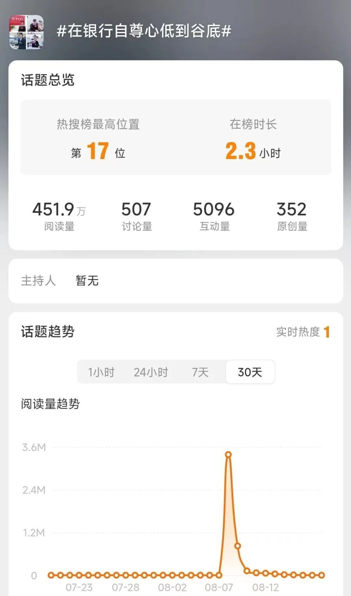
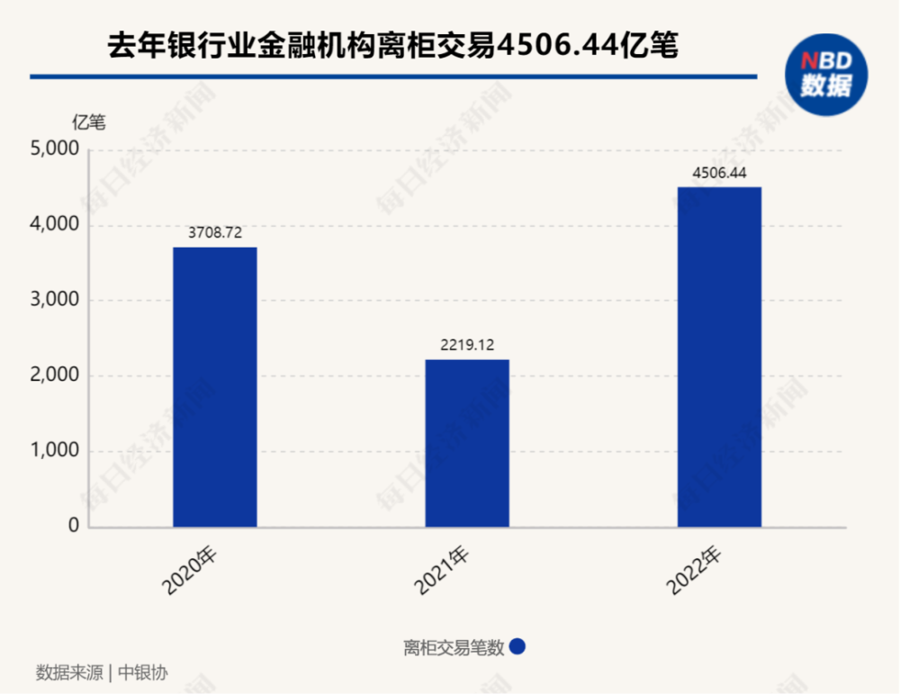
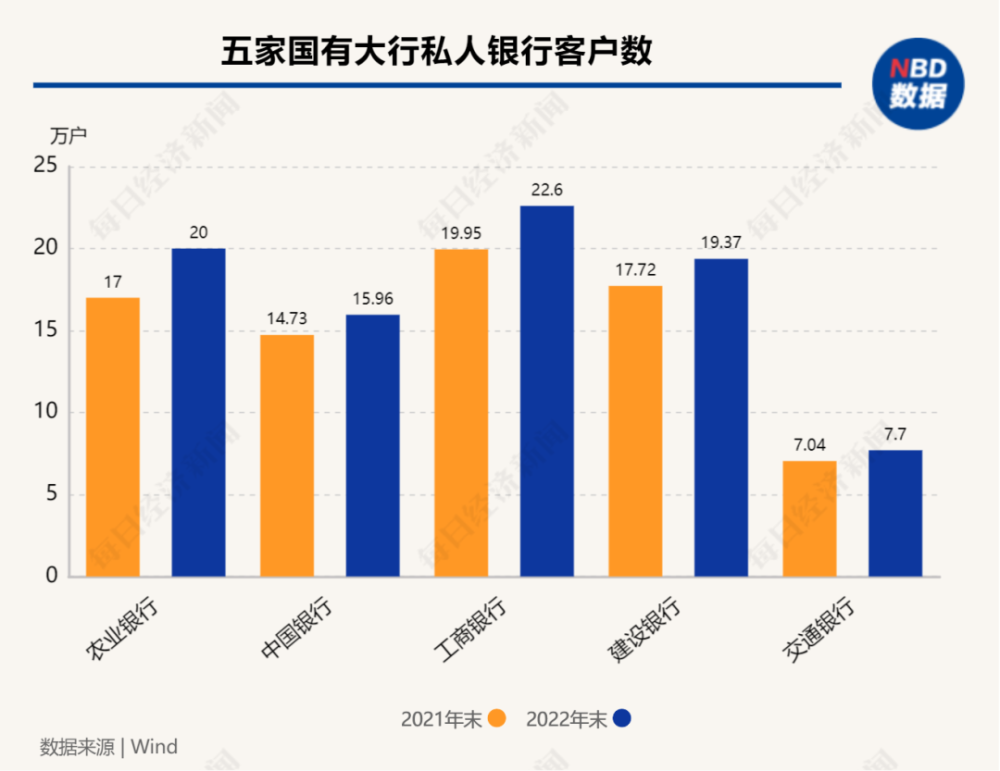

# “客户转来几千万，我们崩溃了”，银行基层员工：大家都说累的想生娃

在一般人眼中，银行是“金饭碗”，薪资高、工作压力小、稳定、下班早。也因此，银行的招聘门槛越来越高。

然而，银行里的人却不时传出一声声叹息！日前，有银行人表示#在银行自尊心低到谷底#，而类似的吐槽银行工作的话题，这并不是第一次登上微博热搜。

**“一眼望去，网点里的新晋职工全是研究生。”**
在国有行工作的李佳（化名）感叹到。与此同时，社交平台上冲充斥着各种各样的“银行劝退贴”。有人感慨，“做我们这行就是要褪去孔乙己的长衫”，也有人选择离职一走了之。

究竟是什么造就了这种“内外温差”？《每日经济新闻》记者采访了多位银行从业者，试图还原最真实的从业者形象。

无处不在的压力

去年，在银行柜台干了几年的李佳转岗了，去做了理财经理。在告诉记者转岗的一瞬间，电话里她低沉的声音里还是透露着些许高兴。按照李佳的说法，虽然底薪下降了，但是去拿存款做销售的时间更多了，提成也会更多，收入基本没天花板了！

在李佳看来，“ **现在银行的趋势是全员营销，不求质量、只求数量的任务就会拿来做全员营销。**
美其名曰‘全员营销’，其实就是压力传导。每一级都将自己完不成的指标分级拆解，分派给其他人。即使你的本职工作是个人理财，在全员营销的浪潮下，也会让你去负责对公开户。”

《每日经济新闻》记者注意到，“全员营销”席卷之下，新入职员工的“保护期”形同虚设。一位博主在某社交平台上写到“硕士应届毕业生，本来说好有一年多的学习培养期（保护期），却突然有了业绩指标。”

“领导会说，这叫团队作战。新入行的员工，也会给你对公开户的任务，但其实新入行的员工连个人业务还没有搞清楚，怎么去做对公业务呢？”李佳说道。

压力大，不止是李佳有感受，在股份行工作的张高(化名)也是深有感触。在行里负责对公业务的他也有自己的烦恼，“这两年业务都挺难做的。一些国有行还可以通过普惠贷款，或者承接大项目，来完成对公业绩。但这些筹码股份行都没有，只能通过服务赢得客户。”

基层员工如此，没想到曾作为支行领导的陈俊(化名)也有一番来自压力的吐槽。

陈俊曾任国有行华北区某市分行个金部负责人，分管个金条线。也曾任支行分管个金行长多年，业绩垫底的支行到了陈俊手里也能变成业绩第一。但去年他辞职了，开始放松心情，享受生活。陈俊告诉《每日经济新闻》记者，每个岗位都要面对不同的压力，只是压力的点不同。压力排解不出来，很容易生病，他身边就有一些同事得了抑郁症，甚至躁狂症。

陈俊表示，全员营销一般是在开门红这种特别关键的时间节点。或者每年都会有几个指标下来，所有银行一窝蜂去做的。他举例说，“比如前几年的ETC，不管什么岗位，你都要去拉几个亲戚朋友来办个ETC。”

李佳也提到了ETC，“有段时间ETC压得很重，每逢周末，银行人就会去高速口、商场地下停车场吸尾气。有名牌大学毕业的女生来我们这里，我们就调侃问她，你进银行之前知不知道你既要收桌子，又要吸尾气。”

谈及为何要转岗，李佳说道，“其实现在柜员也累，多方因素导致柜面工作效率下降，柜员要经常面对客户的抱怨。而且从晋升路径的角度考虑，如果一直做柜员，天花板会非常低。一种晋升路径是去后台，但转后台的竞争更激烈；另一种就只能去做客户经理，但客户经理现在也不好转。”

值得注意的是，即使只想安心做柜员，不求晋升，也会面临被动转岗。李佳所在的国有银行，一直在减少人工窗口，很多业务都移步到智能终端。银行安排柜员转岗去做大堂经理，转岗后底薪变得很低，剩下的要靠业绩去填补。

中银协数据显示，2022年银行业金融机构离柜交易笔数达4506.44亿笔；离柜交易总额达2375.89万亿元；行业平均电子渠道分流率为96.99%。

李佳直言，“如果被转岗到大堂经理，又一直没有业绩，这名员工就会主动离职。”

“支行分管不同条线的行长也有不小的压力。”陈俊说道，“一方面，分行每到一季度，就会把全年的业务指标分下来，每一项指标，增长率是多少，有多少个客户，每个客户多少存款，多少中间业务收入，每一单项今年要增长多少，这些都会有一个具体的指标，大大小小的指标有几十项。那么如何将指标合理地分配落实，以及资源整合、大客户维护、人员管理、风险把控，这些都需要分管行长来做，工作量很大，也很考验负责人的能力。另一方面，中层的会议是最多的，所谓‘上面千根线，下面一根针’。手下的人员出了风险、指标完不成，负责人都要担责任。”

手下的人员会出什么风险呢？对此，陈俊以个金条线举例道，首先，客户经理去营销客户，话术一定要合规。尤其是这两年，很多客户经理，包括支行都受了现实的教育。理财产品净值化后，产品很有可能会亏损，客户经理也没经历过这种亏损，销售时没把产品的风险说清楚，很多客户接受不了，来行里闹事。所以现在客户经理的风控意识都很强了，做理财之前要双录（录音录像），把录音录像保存在系统里。

其次，个人贷款的风险也很大。消费贷、房贷，按揭贷款，甚至很多小微企业的经营贷款，也是个金条线在做。对客户的贷前调查很重要。对小微企业的风险把控，得去现场核实调查。核实企业的流水，看他的经营状况，再去做授信。

做对公业务的张高对此深有体会，资产类业务的客户经理每个月要扣风险金，风险金在未来三年会慢慢退还。期间，如果业务没有出现不良，就会正常退给你。

疯狂的吸储大战

客户经理各显神通

对于银行员工来说，业绩压力是循环往复的。陈俊说，开门红最早是从1月份到3月份，后来有些条线或银行就变成1月份到4月份，甚至到6月份。开门红的战线拉到半年，甚至从前一年年底的12月份或者11月份就开始开门红了。二季度还有年中冲刺。三季度很多银行搞决战金秋，而且三季度要为年终收官做准备。四季度做年末收官，为明年的开门红做准备。

“银行一般很看重季度末的时点。因为监管部门统计各家银行的市场份额基本上是按照季度末去统计。所以大部分的银行每个季度末都会有冲存款的需求。”张高补充，“稍微轻松一点的时间就是7、8月份，所以我们休假基本上也就排在这个时候。”

在完成业绩这件事上，客户经理们有自己的诀窍。

李佳说，有客户头疼得非常厉害，同事给找了很厉害的中医馆，想办法跟客户处成朋友。

张高所在的分行，有的客户经理去写字楼挖掘客户；资源比较好的，客户转介客户；此外，分行也有专门做客群的业务室。业务室会去找一些比较优质的客户名单，按照这些客户所在的区域，分配到各个网点。各个网点就可以通过优质客户的名单去开拓客户。

陈俊从管理者的角度看，每家支行每个阶段的任务都不同。支行行长或分管行长会根据分行的安排，结合支行的情况，包括客户到期的情况、营销的情况，合理分配每个季度的冲刺重点。

通常，存款这样的指标会放得早一点开始冲刺。因为像日均存款这类指标，是从开年第一天开始平均，钱存过来越早，日均涨得越多。销售类的指标可能放在年中或者三季度去冲刺。四季度主要在为第二年做打基础的工作。明年可能放贷款或进存款的客户今年储备好，明年一开年就能落地。客户的营销工作得提前开始，否则一月份才开始营销，等落地开门红都结束了。

“整个分行、支行节奏把握得好，可能这一年都会很轻松。如果有一个节点没把握好，也许今年的业绩就不好看，而且很累、手忙脚乱。”陈俊总结道，“有时也得看运气，有时看安排的能力，包括对客户经理特长的发挥。但现在银行其实也是鞭打快牛，支行的业绩做得越好，下次给你的任务就越重。指标没有完成的一天，一完成又会有新的指标过来。”

“挖掘存量客户也是个技术活儿。”陈俊补充，“很多客户在你这里存的钱不多，但其实是其他银行的私人客户。有客户在我们银行存了200万，一直存这么多，好几年了。客户经理想当然认为这个客户就是200万的潜力了。但是我到这个支行后，通过跟客户的沟通，当天客户就转过来1500万。1500万转过来之后，又发现客户还有更大的潜力，几千万上亿可能都在别的银行存着。”

“黄牛”下场，月末存一天

利息“万15”

完成业绩的压力大不大？面对《每日经济新闻》记者的问题，李佳坦言，“基本上业绩都需要靠买才能完成，行业里不少银行都会有买来的业绩。”

买业绩，就要找“黄牛”。在某购物平台上，听清来意，卖家给记者报价，“城商行做不了，其他行二类户存入非月末‘万2.5’，月末跨月初一天‘万15’，只需要告诉我开户行，给我开户二维码即可。
**”卖家口中的“万15”是指1万块钱存一天利息15元。**

记者进一步询问资金来源，卖家表示，“我们这个不是地推，有专门的客户。”

谈及“黄牛”，陈俊表示，现在利率市场化了，存贷款利差越来越小。本来银行主营业务收入就在缩水，相应的营销费用、绩效奖金也会缩水。客户经理再拿出钱跟黄牛去抗争，真的会好难，更加剧行业的内卷。

**近年来存贷利差不断收窄**

陈俊做支行领导的时候，行里从来没有买过存款。

陈俊说，“一是没有必要，二是风险很大。而且一旦你买了一次，后面可能月月都得买，要不每个月都会有一个窟窿。一旦陷入这个循环，压力会很大。一个月不买，一个季度不买，你的窟窿就会很大，要拿真实的存款去填那个窟窿。因为从黄牛那里买来的存款，月底来了，月初立马又转走，回到原来的银行。这并不是一个真实的客户增量，却凭空抬高了基数，所以不如摒弃这个东西。我宁愿就要一个平均数，比如你一个月里，3号来30号走，也没关系，你在我这儿能存二十多天。调整好心态，提前做好应对。”

黄牛的出现，变相提高了银行负债端成本。“很多客户长期跟黄牛合作，到年底或者月底，钱就转走了，黄牛那边给很多利息或者补贴。”陈俊表示，“但是我们没有办法控制这种流出，我们没有这么多钱去跟黄牛竞争，即使用营销费用给客户一些礼品，在客户看来还是九牛一毛。所以我们会提前把每次月底就会走的客户考虑进去，不要把它计算到月底存款的数据当中。”

除了依靠“黄牛”完成吸储指标，《每日经济新闻》记者还注意到，社交平台上一些博主表示
**，为了完成银行的贷款提款指标，只能自掏腰包给客户贴息，让客户提款。**

针对这一现象，陈俊解释，因为不提款就没有利息，相当于没有给客户做授信。现在很多银行，贷款提款的指标就是完不成，授信很多，但是客户不提款。会有客户经理一直完不成业绩，宁可把绩效拿出来补给客户。

但陈俊觉得，这始终不是长久之计。每次都这样搞的话，将来客户即使真的要用款，也可能等着你联系他，给他鼓励一下，他再提款。所以最重要的是找有需求的客户。

**“现在银行已经这么卷了，你自己还要加剧这种** **内卷。”** 陈俊说道，“从整个银行业的角度看，这是一种资源的浪费。”

值得注意的是，对于贴息揽储，监管早已明令禁止，根据《储蓄管理条例》规定，储蓄机构不得使用不正当手段吸收储蓄存款。《关于完善商业银行存款偏离度管理有关事项的通知》规定，商业银行不得通过返还现金或有价证券、赠送实物等不正当手段吸收存款；不得通过个人或机构等第三方资金中介吸收存款。

李佳表示，“也有买存款被坑的，因为买存款本身是不合规的，有人利用这一点进行敲诈。用聊天记录威胁你加钱，你不同意的话就去监管部门告发你。”

那么为何有银行人宁可冒风险也要找黄牛呢？没完成业绩会怎么样？

陈俊表示，首当其冲的是绩效奖金。而且如果一直完不成任务，什么任务都完不成，甚至态度都有问题，或者是你的能力不适合做这个岗位，可能会有一些岗位调整。但万不得已的情况下才会转岗，更多的是对个人的督导，让你下班去学习业务。因为转岗后，你所有的业务都要重新安排，你的客户可能要换客户经理，会造成客户流失。

甚至有些银行周末也会让员工来参加督导、参加演练。一部分人做客户经理，一部分人假扮客户，提出各种问题，客户经理针对客户的常见问题进行解答。员工要分析为什么指标完成得不好，是对产品的理解有问题吗？还是态度有问题？还是其他的原因？根据不同的原因进行督导。

李佳说：“你花钱买了以后，领导就不天天请你‘喝茶’了，这时候你就会衡量一下，这个钱我要不要花。”

陈俊在分行的工作之一，就是给支行下发指标。

陈俊表示，每年要完成的主要指标，以及每年的目标方向，首先由总行制定。总行制定、下发到省行；省行分解、下发到辖行；辖行继续分解、下发到支行。指标通常情况下不会是简单的平均分配，有很多调节系数。上级会综合考虑各分行支行的人员情况、基数情况、上一年度的增长率。包括不同地区的经济发展水平、客户主体情况，这些都会考虑进去。

有些指标可能这家支行特别擅长做，比如某家支行周边的客户群体都是存款客户，那可能在存款的指标上就会给这个支行多分一点。有些支行的客户经理销售能力特别强，就会把销售指标更加偏向于这家支行。

所以，在与陈俊的沟通中，陈俊多次强调， **虚增的数据除了加据** **内卷没有任何意义，反而会成为负担。**

拉存款不容易，有时又要踹存款

有时需要员工疯狂地拉存款，有时又要员工赶存款。这也让刚转岗的李佳深感费解。

李佳表示：“假设定了一个5000万的任务，大家拼死拼活完成了5000万。然后可能到最后一天晚上七点，通知你存款超了，让你把钱赶走。他们说是因为有一个指标叫存款偏离度（月底时点存款与当月日均存款的偏离度），定这个指标的初衷是想要避免网点在最后时点冲存款。”

陈俊表示，会有赶存款的情况，“每年最后一天，我们就会盯死自己的存款。客户要来要走都要报备，尤其是大客户。很多时候可能上午疯狂说存款不够了，赶紧拉拉拉。到下午的时候又说存款超了，赶紧踹踹踹。所以最后一天甚至两天，一直在拉存款和踹存款之间不停的循环。”

“记得有一年我们存款刚好完成任务，挺好，挺完美。结果晚上八点， **突然客户从别的银行转过来几千万，我们崩溃了。**
**客户说我没办法了，每家银行都在踹存款，让我转走一点，说存款够任务了，不想再有了。**
”陈俊继续说道，“因为最后一天的数据会算到第二年的基数里。这一天如果数据是虚的，不是实打实的沉淀下来的存款，放一晚上，第二天又转走了，
**对于未来业绩的提升没有帮助，但是基数却背上去了。**
所以平常尽量跟客户多沟通，沟通得好的话，这方面把控会好一些。沟通不好就会出现临时走、临时来的现象。最后一天真的特别激烈，一会儿拉，一会儿踹。”

除了业务的压力，银行还有开不完的会议，以及各种团建活动——诗朗诵、运动会、誓师大会。

“银行，尤其是国有银行管理体系，活动非常多。但同时银行又是营利机构，叠加了‘狼性’。其他的企业要么狼性，要么就搞形式，身体和心灵总要有一个在休息。而银行两个都要，使得员工身心俱疲。”李佳说，“每天银行的帘子一拉，我们还要盘点、总结、开督导会，遇上活动时还要排练。上班很累了，下班还要开会、排练，活动结束了还没完，完全没有自己的时间。”

陈俊说，开门红现在都搞得可热闹了，各种誓师大会、任务的领取，甚至签军令状，各种喊口号，然后支行上去展示。这种活动特别丰富，搞得很多人觉得挺尴尬的。

到支行层面，分配指标也肯定会开会。开会安排每个人分哪些指标、要联系哪些客户、怎么做。“层层落实，户户报告。”

**“我后来为什么从银行离职呢？”**
陈俊说道，“很大程度上是因为会议太多，感觉自己身心俱疲。有一段时间我们开会，每天晚上大概从五六点钟开始开会，晚上没有晚餐，也没有吃晚餐的时间。督导会一直开到晚上九点多，每天晚上如此，这种状态贯穿整个开门红阶段。开会开到人已经要崩溃了。”

“让我去营销、拉存款、搞客户、搞业务，我觉得都可以，没有那么累，因为我知道我是在做事情的。但是有的时候可能很多会都是没有意义的，底下的人可能也不怎么听。银行跟别的地方不一样，白天的工作量比较大，比较饱和，一般开会都是在下班之后，甚至周末开会。”陈俊接着说道。

在和李佳的沟通中，记者了解到，并非所有银行人都开会的烦恼。“有些领导只做结果管理，开会的效率也非常高。但有些领导眼看业绩完不成，就开始做过程管理，不停地组织开会、要求员工参加活动，然后写材料，证明他在工作。归根结底，过程管理也是靠员工去完成的。”李佳笑了笑继续说，
**“所以大家都说好想生娃，生娃之后就有借口少参加活动。”**

银行人如何破局？

除了层层累加的业绩、开不完的会议、加剧内卷的“黄牛”， **银行人还面临越来越少的薪资。李佳表示，她所在的支行仅去年的降薪幅度就达到了接近20%。**

据陈俊了解，降薪一般不会影响基础薪酬，可能更多的是在绩效的比例上进行调整。

降息、产品的分流，导致业绩的完成难度越来越大。同时，降薪导致对从业者的正向激励变少，这也加剧了从业者的压力。

社交平台上的一位博主对《每日经济新闻》记者说，“辞职要尽早，晚了就没地方去了。因为银行的从业经验，没什么用。也就是金融同业间的跳槽，还能互相利用一下资源，跳来跳去跳不出这个圈子。”

**逃，又没地方逃；继续干，又压力山大。银行人应该如何破局？**

现在，陈俊的身份从从业者转变为银行客户，对银行的工作有了新的理解。

陈俊说，很多客户经理摆不好自己的位置，不知道究竟应该跟客户以什么姿态沟通，尤其是面对高端客户。

很多客户经理问我，“陈总，怎么办，我一看到高端客户就紧张，我不知道怎么说话，觉得我们不对等。他们是这么有钱、有地位，而我就是一个二十来岁小年轻。我觉得我特别自卑，摆不好心态。”

陈俊认为，第一，要在业务上多加练习，做好客户分类，了解自己的产品、了解自己的客户。

第二，作为客户经理要自信。因为客户看到的是你的平台，术业有专攻，你们是平等的交流。有些客户经理觉得自己很卑微，这是不对的。站在客户面前，不要觉得自己很渺小，因为你是站在银行这个平台上跟客户进行平等的交流。当你有这种思想后，面对高端客户，可能你的心态会平和，进入帮助客户的角色，用专业性去打动客户。

千万不要走入一个误区，觉得客户需要卑躬屈膝才可以营销过来。其实最终跟你关系特别好的客户都不是这样来的，一定是客户对你特别信任。靠卑微迎合来的客户一定是不长久的。

第三，客户需要客户经理的专业建议，所以专业性自然是客户第一位的要求。如果这个客户经理只是情商很高，但给不了客户任何专业性的建议，那也是不行的。

什么样的客户经理更受客户青睐？陈俊说，现在银行产品同质化情况很严重，所以客户会青睐能够提供专业建议、说话比较有分寸感、容易让客户产生信任感，同时维护客户比较上心的客户经理。

李佳表示，希望银行可以培训一下管理者，因为有时候管理人员是靠业绩或是运气升上去的，并不懂得管理。

陈俊分享了自己的感悟，“很多时候员工并不是不想做事情，而是他们找不到方向以及意义，他们在寻找我工作的意义是什么？我为什么要这么做，我加班为了什么？甚至我能得到什么？如果只是说去加班，那他们一般接受不了。”

其实大家的压力以及不开心有时并不是来源于工作内容，而是心情不舒服。

陈俊说：“行长作为管理者，并不是一个高高在上的职位。如果想管理好这个团队，得把自己当做团队的一员，而不是以一种高高在上的心态去管理他们，去要求他们。我觉得首先自己的态度要端正，这样你的员工才会信任你。管理者更重要的是从心出发，而不是从指标出发。把员工当做兄弟姐妹这样看待，他们跟你共事的时候，情绪也会比较稳定，对于工作业绩指标也会是一个促进。员工会觉得哪怕多做点事儿，我也很开心，很满足。”

榜样的力量很重要。陈俊表示，“每一个高端客户我都亲自营销，和客户经理一起。他在看我跟客户交流的时候，会学到很多东西，而不是你告诉他怎么做。当他看到你跟客户娓娓道来，然后客户给你的反馈也特别正向的时候，他就会有信心了。”

谈及应对压力这个话题，陈俊表示，第一，要坦然地接受有压力这件事，理解好自己的工作性质，明白压力的来源，哪些事情导致焦虑，不能盲目地焦虑；

第二，如何缓解压力？如果压力来源于业绩，就要找到工作的抓手，经常和同事领导沟通；如果压力来源于收入，就要多研究考核办法，不要盲目努力。哪些业务收益大，哪些指标抓得住，个人的情况、客户的情况要经常梳理。梳理好后，会事半功倍；想清楚自己的职业规划，拒绝拖延症。

另外，可以找到工作之外的兴趣爱好，或者寻求心理医生的帮助。

展望未来，陈俊说道，“其实我有的时候在想，要不要趁着有时间，做做银行从业者的心理疏导。因为现在银行从业者的心理真的很需要疏导，能够看得特别透的人真的不多。很多人在这个漩涡里越陷越深，最终跳槽或转行，一走了之。”

**记者|** 宋戈 张宏（实习）

**编辑** **|** 程鹏 廖丹 杜恒峰

**校对|** 王月龙

封面图片来源：视觉中国

｜每日经济新闻 nbdnews 原创文章｜

未经许可禁止转载、摘编、复制及镜像等使用

