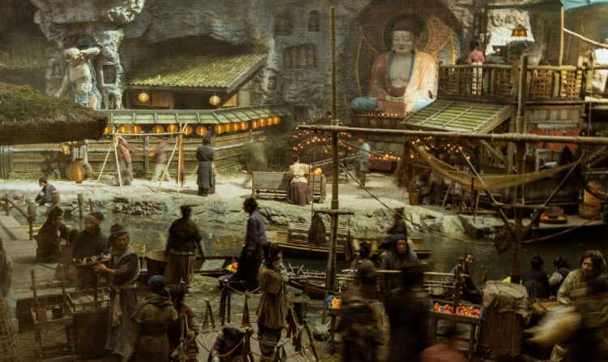
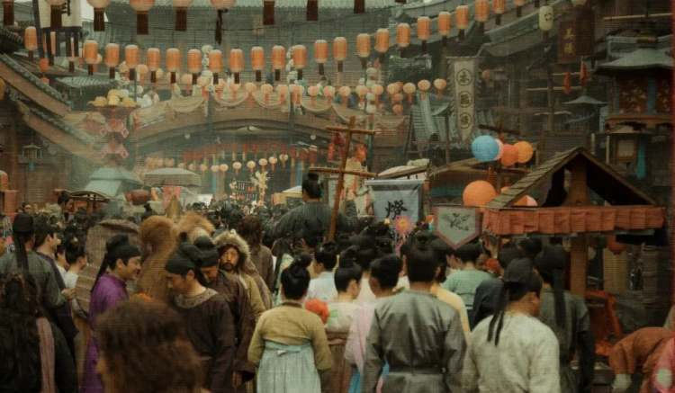
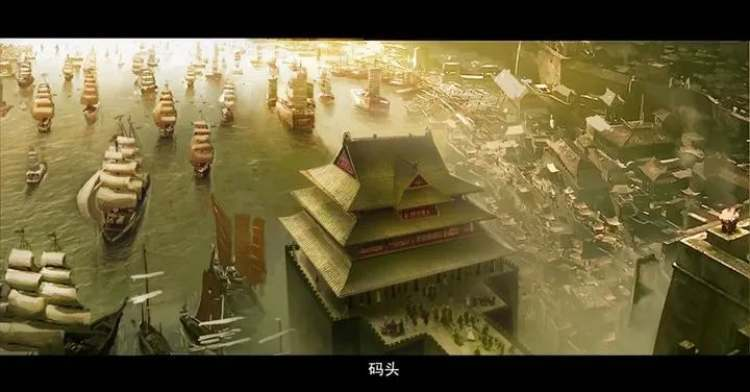

# 《长安三万里》被起诉，洛阳人想争什么

作者 | 张明扬

编辑 | 谭山山

题图 | 《风起洛阳》

《长安三万里》上映以来，似乎风波不断。

8月16日，洛阳市隋唐史学会通过官方微信公众号发布声明，认为该影片中部分情节描述与真实历史不符，部分人物身上发生的故事亦与真实历史不符，极易误导观众，特别是青少年观众，影响历史人物出生地、事发地的同胞感情。该学会要求电影《长安三万里》的制片方、导演、编剧等发表纠错、致歉声明。

当天，河南洛太律师事务所也宣布，该所已接受委托，向电影《长安三万里》制片方等发出律师函。

**洛阳的“被隐身”**

这次争议，大致可以从两个层面来解读。

第一个层面，即所谓“洛阳与长安之争”。

洛阳市隋唐史学会此次提出《长安三万里》有四处“情节与历史严重不符”的地方，分别是：李白与杜甫第一次相逢在洛阳，并非影片中描写的长安；杜甫早年生活在洛阳，并非影片中描写的长安；“一日三绝”发生在洛阳天宫寺，并非影片中描写的扬州；救下郭子仪的是李白，并非影片中描写的高适。

前三处均与洛阳“被隐身”有关。

_隋唐洛阳城模型。（图/图虫创意）_

洛阳方面此前还曾就影片的两处情节提出质疑：第一，7岁的杜甫在岐王宅见到李龟年，事实是：“岐王宅里寻常见，崔九堂前几度闻”，那是杜甫对十几岁时在洛阳所见所闻的回忆。第二，高适父亲去世，高适扶灵至广陵守孝三年，事实是：高适父亲在去世次年归葬洛阳。

早在《长安三万里》热映之初，就有洛阳网友提出，片中一些情节描述被指与真实历史不符，认为电影“不尊重历史”“伤害洛阳人民感情”。电影在洛阳举行路演时，当场有观众打出“日月同辉，史诗相遇在洛阳”，以表达不满。

就此，洛阳市隋唐史学会也表示，目前该影片情节与历史不符一事在网络上引起骂战，特别是洛阳与西安网友之间的骂战愈演愈烈，但该片制片方、导演、编剧却对此不予置评、不予回应，放任不管。

从史实上看，洛阳市隋唐史学会与当地网友很多地方说得没错，但也不无意气之争。比如，《长安三万里》是高适视角，并没有着重表现“李杜相会”，也就不存在“李杜相会从洛阳被改到了长安”。

_《长安三万里》在洛阳进行路演时，现场观众打出“坚决维护正确的历史”口号。（图/@洛阳印象）_

但我也很能理解洛阳网友的不满。

此次“洛阳与长安之争”的实质是：近年来，从《长安十二时辰》到《长安三万里》，长安（西安）在文化传播上出尽了风头，甚至可以说出现了一种“长安热”现象。但作为隋唐两都之一的洛阳，却相对沉寂了。

洛阳民间对此显然充满焦虑。无论就城市历史记忆还是更为现实的城市旅游资源而言，洛阳在这场“两都竞争”中都被甩开了几个身位。

长安很好，

但也别忘了洛阳

究其原因，可能有这么三点：

其一，相比洛阳，长安所蕴含的历史记忆更为丰富，尤其是安史之乱期间、李隆基弃长安前后的盛衰张力。但就这一点，想必洛阳网友并不愿意承认。

其二，正是因为长安在历史记忆方面的优势，国内的历史和文艺创作者部分出于对市场的敏锐观察，部分出于迎合市场，推出了一批长安主题的书籍与电影。包括我本人，去年年初也写了一本《弃长安》。可以说，“长安热”主要是市场自发形成的。

其三，西安官方显然更擅长对“长安”历史资源进行包装与开发。所谓“擅长”，不仅仅是官方花多少钱去推，而更在于被动或主动地配合市场上的热点。而这一点，正是被洛阳网友所攻讦的，他们认为西安不仅一直在自我炒作，而且在主动介入“洛阳与长安之争”。

就以上三点，无论两地在历史上的真实地位如何，长安（西安）而今在文化传播上已形成了对洛阳的先发优势，短期内洛阳很难后来居上。

_《长安十二时辰》出品方制作的“长安服饰图鉴”，图中为“襕袍”。（图/豆瓣）_

洛阳应该怎么办？

最应该干的是学习西安，效法西安与文艺市场的良性互动，不要将城市文化推广资源都集中于意义不大的内部循环与闭门自High上。大胆走出去，主动接洽国内写作者与文艺创造者，与西安形成良性竞争。

当然，西安是省会城市，在财力与文化传播力上有先天的优势。对此，洛阳得坦然接受，而后想办法缩小劣势。

按照基本的市场规律，“长安热”总有趋冷的一天，需要其他新的历史IP顶上，洛阳自然是最有机会的。

就更大的层面而言，洛阳与长安都从属于同一个历史资源之下，那就是“盛唐”，这是一处说不尽、用不尽的文化资源。洛阳与长安不仅存在竞争，更存在协力做大甚至共同炒作的空间。

_《风起洛阳》改编自马伯庸的《洛阳》，故事设定在武则天执政时期，图中描述的是洛阳的南市。（图/豆瓣）_

就事论事，我个人觉得，《长安三万里》热映之后，洛阳网友完全有权利抱怨，这是人之常情。但反而是洛阳市隋唐史学会这种半官方的地方文化组织，应该以健康的“蹭热点”心态借机进行一场更体面、更盛大的文化传播：长安很好，但也别忘了洛阳。

“蹭热点”没有任何不体面之处，与因势利导、顺势而为几乎是一个意思。“盛唐”又不是长安一家的，长安只是获得了先发优势，这种文化传播效应势必会外溢，洛阳笑着承接即可，何必感情用事，大发雷霆。

归根到底，洛阳要对自己更有信心，而不是一味抱怨与失落，诉诸法律更是最不智的一招，只能暴露洛阳在市场环境下的不知所措与进退失据。

“盛唐”与“隋唐两京”是洛阳的历史资源，但不能成为限制自身认知的历史包袱。

_（图/《狄仁杰之神都龙王》）_

**对文艺创作不妨宽容一些**

这次事件的第二个层面是：影视剧及文艺作品与历史发生关系时，要不要符合史实？

我个人认为，这是一个开放性答案，没有什么统一原则，更适合个案分析。

一方面，我很讨厌撇开基本历史情境与设定、天马行空的所谓历史正剧；但另一方面，我也很反感那些但凡看电影就扯史实的人。没有必要的虚构，电影也好，历史小说也好，根本就称不上文艺作品。

但虚构也有高下之分。最理想的状态是：史书中有明确说法和定论的，文艺作品尽量不推翻；历史中有争议的部分，正是文艺创作者可以发挥之处，甚至是天然的悬疑题材——比如，谁杀了杨贵妃、谁是马嵬驿之变的幕后大佬；历史里没有提到过的空白，文艺作品可以尽力“补白”和想象，比如马伯庸就是个中顶级高手，仅仅凭借《安禄山事迹》中的一句“骑士张小敬先射国忠落马”，就惊才绝艳地为张小敬创作了一部《长安十二时辰》。

洛阳市隋唐史学会提到，“救下郭子仪的是李白，并非影片中描写的高适”。这就是一处不太成功的虚构。在历史上，所谓李白救郭子仪可能也是传说，但至少自成逻辑；而《长安三万里》仅仅为了将高适塑造成一个高大全的形象，就贸然改变了设定。

**电影《长安三万里》中，李白和高适登场的剧照。（图/豆瓣）**

不是完全说不能改，而是要有合适的理由改，要遵循“非必要不改”的原则。

不过，对于文艺作品的“违反史实”，我个人还是主张以更宽容的态度视之，尤其不应先入为主地持一个大棒子来一个打一个，这已经构成口袋罪了。

具体到此次《长安三万里》事件，“违反史实”甚至有沦为攻讦文艺作品借口的趋势。

一部电影好不好，有很多维度，“如何处理史实”只是标准之一。

我觉得最幽默的场景是，很多并不真的懂历史的人，反而最喜欢指责某部电影不尊重史实。

与其将“违反史实”视为无往不利的批判工具，不如更关注文艺作品如何处理与史实的关系，改编是否必要、是否自洽、是否巧妙、是否契合历史情境。这些，都比抠字眼要好。

一群人因为《长安三万里》而爱上盛唐与唐诗，而后出于兴趣，去读更为严肃的历史作品，这有什么不好呢？

校对：邹蔚昀

运营：鹿子芮

排版：陈亦奇

