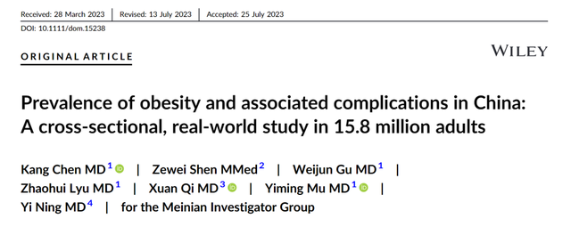

# 中国肥胖地图发布：41.1%男性体重超重，近九成肥胖患者存在并发症

**（人民日报健康客户端记者 高瑞瑞）**
8月17日，《中国肥胖患病率及相关并发症：1580万成年人的横断面真实世界研究》报告发表于学术期刊Diabetes，Obesity and
Metabolism（IF：5.8），绘制出了一幅数字版的“中国肥胖地图”，按照我国超重和肥胖的BMI（身体质量指数）分类标准，1580万成年受试者中超重人群占比34.8%，肥胖人群占比14.1%。

关注“大肚腩”，全国41.1%男性体重超重

报告数据显示，从肥胖的“性别差异”来看，超重和肥胖在男性中比女性更普遍，超重男性占比41.1，女性占比
27.7%，肥胖男性占比18.2%，女性占比9.4%。

“男性更容易肥胖有几方面的原因，通常与其在生活或工作中所受压力和情绪有关。一是长期的过高压力和不良情绪易导致内分泌激素分泌紊乱，主要是应激激素-
肾上腺糖皮质激素（既公众通常所指的激素）分泌大量增多，起到对抗胰岛素作用，增加腹部脂肪堆积，引起以“将军肚”为特征的腹型肥胖。二是为缓解压力和释放情绪，男性常常会采取喝酒和过多进食等不良生活方式为手段。除过量进食外，酒精往往也会产生大量的热量，这样也会促进肥胖形成。三是睡眠问题。长期的睡眠不足或不规律，也会通过打破能量平衡而导致男性肥胖。”北京协和医院内分泌科伍学焱教授告诉人民日报健康客户端记者。

另外，从肥胖的“年龄差异”来看，超重和肥胖的比例在不同年龄段的男性和女性之间存在差异，男性的“肥胖高峰年龄”通常比女性小。男性超重患病率在50至54岁达到峰值（55至59岁保持不变），女性则是在65至69岁达到峰值；男性的肥胖患病率在35-39岁达到峰值，而女性则是70-74岁。

糖尿病前期、脂肪肝，近九成肥胖患者存在并发症

整体人群中，最常见的肥胖相关并发症是脂肪肝（34.9%）、糖尿病前期（27.6%）、血脂异常（24.9%）和高血压（17.6%）。与健康体重参与者相比，超重/肥胖参与者的并发症患病率明显更高（趋势P＜0.001）。

“现代人因饮食不节和久坐少动，以腹型肥胖为主要特点的代谢综合征人群剧增。代谢综合征是2型糖尿病的关键预测因素，同时也是心脑血管疾病的高危因素。代谢综合征早期就存在血管功能的病变，随着病程延长，大血管并发症、微血管并发症会相继出现。”清华大学玉泉医院内分泌免疫科副主任李步满告诉人民日报健康客户端记者。

伍学焱教授向记者分析道，实际上，肥胖很容易导致胰岛素抵抗。在人体能量代谢过程中，我们需要胰岛素协助摄血糖进入细胞线粒体产生能量。如果胰岛素抵抗，就会使得血糖不能被组织细胞的线粒体所利用，于是就在脂肪组织内以脂肪的形式被储存起来而加重肥胖和胰岛素抵抗，从而形成了一个恶性循环，所以肥胖是导致糖尿病的主要的因素之一。

“很多肥胖的患者，早期比较明显的症状是脖子上会出现‘黑棘皮’，‘黑棘皮’是高胰岛素血症所导致的特征性临床表现，这是一个很严重的警示，预示着糖尿病的正在靠近。所以，肥胖的患者，如果胰岛素异常高，应尽快就医，医生会建议改变生活方式，甚或使用增强胰岛素敏感的药物，例如二甲双胍，减少胰岛素在血液中的量，从而延缓甚至阻止糖尿病的发生。”

李步满认为，预防肥胖并发症，早发现、早评估、早干预是重要策略。代谢综合征是生活方式病，管住嘴、迈开腿、中医药综合干预调理等是必要的措施。

