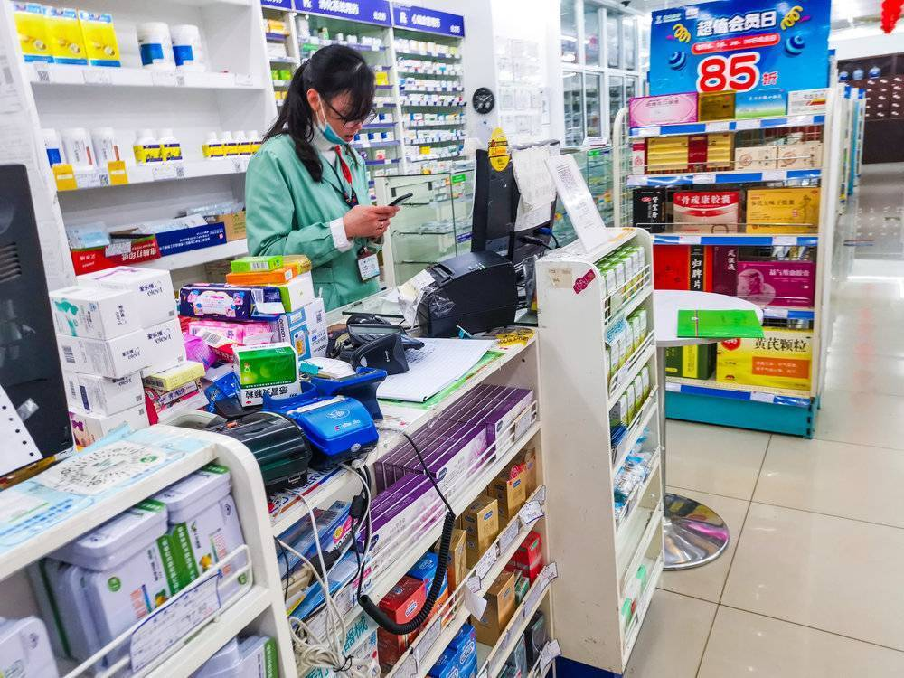
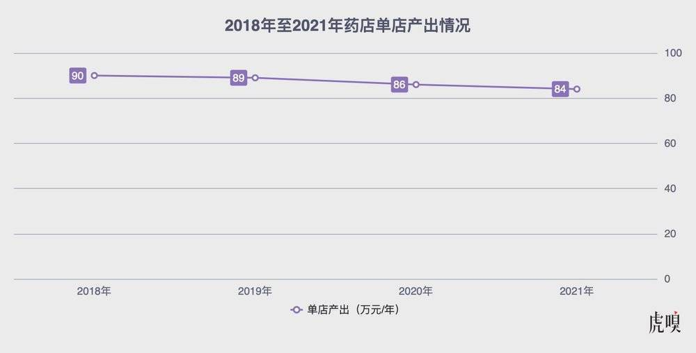
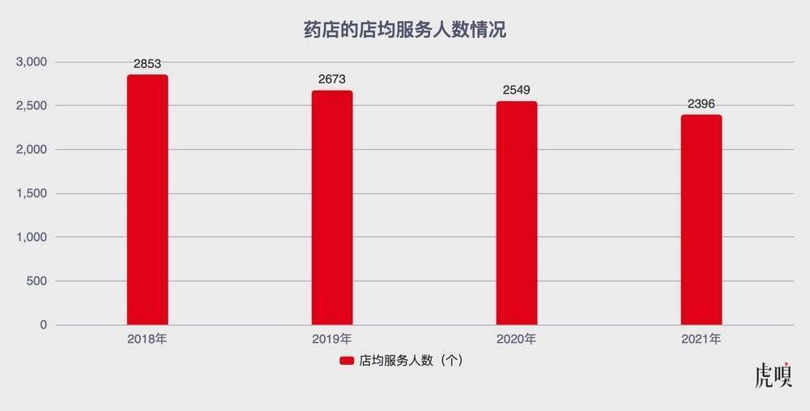
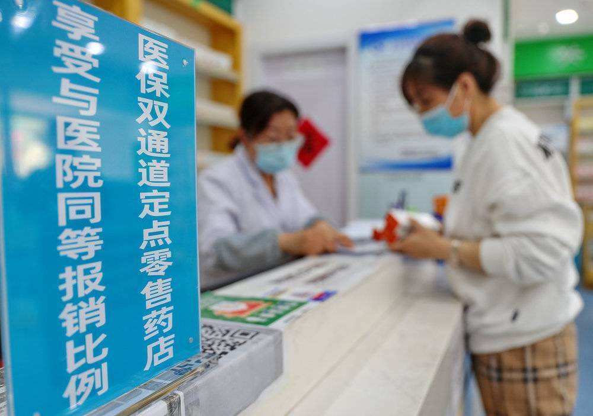

# 反腐之下，中国64万家零售药店成了药企的“救命稻草”

出品 | 虎嗅医疗组

作者 | 陈广晶

编辑 | 廖影

头图 |视觉中国

集采、反腐、医保控费的一轮又一轮风暴中，一贯不受制药企重视的“药店们”正在翻身逆袭。

炎热的8月，来自全国各地的超5万医药从业者，一股脑涌入了常住人口只有3万多人的海南小镇——博鳌，他们并不是利用暑期来享受椰林海风，而是为了在“西普会”（中国健康产业生态大会）上找到下一步发展的机会。

医疗反腐成为近期人人热议的话题，受此影响诸多医学界的学术会议被叫停，这也让国内至少428.7万医务人员、300万名医药代表，以及至少4000家制药企业又一次深切感受到了行业急剧转型带来的寒气。

这背后一个无法忽视的事实是，中国医药产业长期以来，以公立医院、严肃医疗为主导、销售仿制药为主的发展模式已经走到穷途末路，“医药分业”箭在弦上，整个医药产业都试图在医院以外，找到新的沃野。

在众多选择中，过去不太受重视的药品零售市场，特别是末端的连锁药店成为了“全村的希望”。

从数据上看，2019年以来集采药品的基本销售额正在以每年50%的速度萎缩。药品零售业作为重要的填补渠道，已经承接了55%以上的处方药分销任务。

近年来，国家医保局针对国家医保谈判（简称“国谈”）创新药的“双通道”（也就是可以在有资质的药店买到新进医保的创新），以及“门诊统筹”将药店纳入医保报销等政策，也都被视为中国64万余家社会药店，特别是占比近七成的连锁药店的新的发展希望。

可以预见，传统的主流医药市场利润继续摊薄、合规风险持续升高。那么这次，药店的机会真的来了吗？

零售成为医药产业新希望

零售药店，现下已经成了药企的“救命稻草”。

“那个店员的表情，给我的感觉就是：没有人从我这里拿走过感冒灵。”知名脱口秀演员周奇墨，曾经生动演绎过与药店店员斗智斗勇才买到廉价感冒药的经过。这般笑中带泪的背后，是很多人在药店买药经历的共鸣。

为什么在药店，买不到那些好用但便宜的药？

中康CMH数据显示，截至2023年5月，全国药店的总数超过64万家。这个数字相比药批集采试点启动的2018年，增加了约20万家。老百姓、一心堂、益丰大药房、大参林等知名连锁药店的门店总数都超过了1万家。也有行业人士预计未来2到3年，将会出现10家连锁药店门店总数超过10万家的盛况。

这些我们日常生活中常见的药店主要销售药品是OTC（非处方药），也有低价和高价之分，相当长时间里，药店是依靠低价的医保药品引流，销售高毛利OTC，甚至“米面粮油”等非药品来盈利。这也直接导致，消费者很难买到希望购买的低价药，而被兜售了很多“高价药”。

_来自：视觉中国_

虽然消费者常常感到药店的药贵，但是药店销售的OTC类药品，在整个医药产业的大盘子里，其实只有22%左右的份额。

医药产业的主要收入来源——处方药，很长时间内掌握在医院手里。

处方药，顾名思义是凭借处方才能开出的药品。这类药品疗效好，但风险高，需要遵医嘱使用。即便是医生要想获得处方权，也需要经过严格的考试。

在“以药养医”的年代——医院销售药品可以顺价加成15%销售，医生私下也凭借开处方拿到回扣；
尽管名义上，患者可以拿处方去院外开药，但实际操作上，这些处方几乎不可能流向社会药店。

在此风气下，药品零售行业作为药品销售的六大渠道之一，过去一直不受制药企业重视。

在医药代表们的“鄙视链”中，服务零售渠道的医药代表也常常处于底端，发展前景也远不如跟医院打交道的同行。做临床的代表一般都是西装革履，跟大主任打交道，专业性强、收入高，对OTC、零售药店往往不屑一顾。

零售药店不仅销售额小，而且“小、散、乱”，店员素质普遍不高，看产品只看毛利高不高，在可以“打擦边球”刷医保卡卖日用品的年代，OTC都不被看作药品，而被视为保健品，常年和米面粮油、洗发水、洗衣粉为伍。

因此，零售端药代带来的效益、学术上的能力，也被认为远远弱于临床药代。

**风水轮流转，这种情况现在改变了。**

根据国家医保局发布的《全国医疗保障事业发展统计公报》，2018年到2022年，主要在零售药店购药支出的医药费用从1645亿元，增加到了2484.41亿元，在医药总费用中的占比也从13.55%提高到了15%以上。

**“说明医保个人账户为我们药店零售也做了非常大的贡献，我们的工业面临集采、DRG，各方面的转型非常困难，但是在药店板块，至少在医保个账的助推下，是增长的。”**
医药行业第三方智库“医药云端”创始人点苍鹤解释说。

较早受到集采影响的企业，如阿斯利康、诺华等跨国药企，早就将零售处方药的权重提高，由此也成为中国数一数二的零售药品供应商。

A股上市公司广誉远，也曾在回复上交所的函件中透露，最近3年该公司因为阶段性战略调整增加了终端纯销，其中在全国连锁药店开展了一系列营销推广和培训活动，是其销售费用持续上涨的重要原因之一。

甚至有知名上市公司，任命OTC销售负责人主管处方药零售工作了。

**“从我们的企业来看，预计到2028年、2029年，药品的零售市场将要超过医疗市场。”** 天士力医药集团OTC分公司总经理李江山公开表示。

连锁药店的机会来了吗？

制药企业之所以有这样的改变，是因为政策的“板子”，主要就打在了制药企业的身上。2019年的集采、医保谈判、医保支付上的DRGs/DIP等改革，釜底抽薪式地斩断利益输送链条的同时，也在从根本上改变着药企的销售模式。

简单来说，就是以往那种“尽量让医院多进药，让医生多开药”的简单粗暴的模式失去了生存的土壤——集采榨干了多余的利润，DRGs/DIP把药品、耗材从利润变成了医院主动控制降低的成本。医院在用药上更注重“性价比”，安全无用的药彻底失去了市场，安全有用的药利润也大大降低了。

同时，医院内部用药结构也在改变，原本占大头的住院部用药所占比例到2021年下降到了46%，增长起来的门诊用药量，在政策导向下，还有向院外流动的趋势。受到医保支付的加持，这部分流出的用药需求，也更有望转化为社会药店的增量收入。

**点苍鹤算了一笔账，如果真的实现“医药分业”，医院的门急诊全部流出，按照医院当年总收入1.2万亿来计算，那市场规模将有4000亿元。**

对于制药企业来说，这是一个势必要争夺的市场，越早进入才更可能获得主动权。

这里的前景是非常诱人的。 **“门诊统筹的政策从战略上讲，这是史无前例的，医药零售行业从三线部队进入主力战场。”**
山东信宏仁医药连锁有限公司董事长张超，在谈到连锁药店杀入处方药市场后发展前景时说。

**但是对于连锁药店来说，这口“肥肉”也真的不容易吃到嘴里。**

集采药品在以前的主战场——公立医院市场正在急剧萎缩，但是零售药店的业绩似乎并没有想象中突飞猛进的发展。

阿斯利康中国副总裁、全渠道事业部负责人刘谦分享的一组数据显示，从第三批药品集采开始，集采药物在零售药店的销售额开始触底反弹，但是即便是最大幅度的增长，也不足以弥补医院市场减少的部分——2022年第七批集采药物在医院的销售额下滑了34%，在零售药店增长幅度达到历史最高值，也只有23%。

从市场份额上说，2022年整个医药市场中，零售渠道所占份额为28%；医院渠道所占份额为72%。

更残酷的现实是，即便做足了准备，很可能还是等不到流出的处方。

中康科技副总裁李俊国在今年的西普会上坦陈，政策看起来很好，实际落地不尽如人意。2023年年初“个账改革”+“门诊统筹”落地，仅武汉市就在两天内将5000多家药店纳入医保门诊统筹（理论上可以与门诊一样享受医保报销），一度让药店人感到承接处方药的机会来了。

听说北方某城市改革成效好，在2个多月内流出了几十万张处方，李俊国专门打听了一下，结果是“从等级医院（如：三级医院）流到社区医院了，跟药店没啥关系”。

这当然并不是药店态度不积极、不想承接处方药数千亿的利好，而是确有其苦衷。

首先，就是合规问题。这是监管部门最担忧的，也是药店最容易“掉链子”的地方。门诊统筹紧急落地后，很快就做好了承接医院处方流转的工作，但是意想不到的是，违规的事情也跟着来了。2023年以来，纳入门诊统筹的医保定点药店被医保通报的案例激增。

其次，药店需要有更好的承接能力。这里包括“硬件”上，也就是对接医疗机构数字化系统的能力，以及“软件”也就是有专业服务能力，这两者对于连锁药店来说都不容易。

从硬件上说，真金白银的投入是关键。老百姓大药房董事长谢子龙曾公开透露，该公司在数字化方面的投入将超过1亿元。在软件上，人员招聘、服务费用支出等，也在无形中增加成本。而且这些成本短期内根本无法从处方药中拿回。

就以药品售价来说，医院在销售集采药品时是零加成的，也就是说完全按照供货价销售，药店在承接医院流出的处方时，如果也按照这个规则销售，肯定要亏本。有行业人士测算，如果药店和医院售价相同，一家拥有400到500家门店的连锁药店，一年至少要亏7000万元。

**而药店销售医院流出的处方药，能不能加上15%的顺价加成，药师服务能不能额外收费，这个费用能不能由医保基金支付等问题，还都是需要持续向医保部门争取的事项。**

另一个需要直面的问题是，医药产业的利益格局仍然难以打破。一个残酷的事实是，尽管处方药已经成了“鸡肋”——在医保控费、降价压力下，不能滥用、毛利率也注定会压到冰点，但是其背后的流量价值，仍然是各方争夺的对象，药店最主要的对手还是医院。在政策导向下，
**“医院住院部逐渐向门诊用药转移，但是门诊能不能到药店，打个问号”。** 点苍鹤在分析处方外流趋势时提出了这一担忧。

现实情况是， **患者在医院排队、看诊、检查、拿到处方之后，已经不太可能再回到家门口的药店买药。**

救人之前，要先自救

在集采、国家医保谈判等一众新政作用下，处方流出医院是发展趋势。只不过，对于他们来说，在解决制药企业燃眉之急之前，自身要赶紧进入良性发展阶段。

药店实质还是零售，营业额增长主要由销量和利润率决定。从目前形势看，二者并不乐观。

连锁药店规模急速扩张之下，单店收益却在下降。根据中康CMH数据，2021年单店产出降到了84万元/年相比2018年下降了2.3%，每家门店的服务人数也下降了5.7%。

_数据来自中康CMH/虎嗅制图_

 _数据来自中康CMH/虎嗅制图_

**这也意味着，药品零售药店的流量进入了瓶颈期。**

迫于业绩压力，连锁药店不得不开更多的门店，否则就没有规模、没有竞争力，但是太多的店又会降低效益。

客观事实是，市场空间有限，机会只能靠从竞争对手那里抢，没有专业化的服务能力，药店也只能靠打折促销来抢顾客，这些顾客又同样会被更低的价格吸引走，毫无黏性和忠诚度可言。

从利润率上看，受到平价药房、电商低价竞争的冲击和医保控费的作用，药店早就过了高毛利的时代。根据中康CMH数据，非药占比大于30%的药店，尚且能有36%的毛利率，以处方药为主的DTP药房、门慢门特药房、门诊统筹药房利润率都很低，其中专业度最高的DTP药房毛利率只有6%。

另据上市公司年报，老百姓大药房2022年的单店利润低至7.28万元，是第一梯队药店的最低值；第二梯队的漱玉平民的处境更糟，同期单店利润只有4.2万元。

可以说，连锁药店目前的发展已经陷入了僵局。

为了多赚钱，部分药店将传统打法用到了极致，这种传统打法就是以低价药为“钩子”，当顾客进店以后，就不遗余力地推销更多高毛利的药品，甚至非药品。在去年疫情期间，还曾有媒体曝出，买一盒抗疫药品搭售14种药品的消息；在所谓的“私域”——一般是通过社交平台指导消费者用药、购药，也常有以专业服务为名推荐高毛利产品的现象。

这些也在破坏药店的形象，将消费者推向其他渠道。

从这个意义上讲，医院流出的处方，确实可能给零售药业带来了增量市场，也有望打破僵局，拉动整个行业的增长。同时，这个机遇也对于药店服务能力等提出了更高的要求，迫使药店必须改变原来不规范的打法，真的转到提供好的药品、提高服务能力上来。这些都是药店业喊了几十年而不愿意行动的方向。

在医药市场野蛮生长的30多年里，药店也曾经历过“躺着赚钱”的黄金年代。2008年至2019年，随着中国医保覆盖面的快速扩大，大众自我药疗水平持续提高，中国零售药业市场规模增速一度高达20%。

当时医保监管不严格，用医保卡刷高毛利的保健品、日用品的情况非常普遍，消费者不花自己的钱，药店赚钱也容易。这导致药店的营销手段非常有限，专业服务能力也差强人意。如今无论处方是否会大量流入医院，医保监管趋严已经是大势所趋，好日子一去不复返了。

从基因上说，连锁药店，始终更倾向于销售高毛利的产品。处方药风险高，利润越来越薄，医保、药监的监管又非常严格，实在算不上什么“香饽饽”。但是，在医保支付的加持之下，仍然不失为非常好的流量入口，是实体药店与大的电商平台竞争的关键筹码。在此基础上，从以“患者为中心”的角度，还可以组合销售患者需要的产品和服务，提高客单价和消费者黏性。

随着连锁药店门店越来越多，其网点也越织越密，触手早就伸向了“院边店”（就是医院旁边的药店），以及DTP（厂家直接销售药店，专业药房）等有一定专业性，主要销售创新药的领域。

另有《2021年中国药店创新趋势报告》显示，已有超过84%的药店拥抱数字化。

 _来自视觉中国_

**实际上，今天的中国药品零售业也正处于一个急剧转型的关键时期。**

中康CMH数据预测，到2030年，中国人均医疗保健支出在人均消费支出中的占比，将从2022年的8.6%升高到10.1%。这也将拉动中国健康产业从2022年的9万亿元提升到2030年的16万亿元。

在实现这个增长的路上，医药产业也势必经历一场重塑。药店的竞争对手不只来自医药界，更来自其他业态。

中国台湾省的药店龙头大树医药的董事长郑明龙在西普会上分享经验时表示，“零售界限越来越模糊，药店会往他业跨，他业往药店跨”。拉长时间线，在企业竞争力强弱关系和文化的共同作用下，最终药店和其他业态之间的关系会固定下来，达到新的平衡。这就是每个国家或地区的样本。

这也意味着，当下，中国的药品零售行业正处于“一切皆有可能”的阶段。

而从整个产业重塑的角度看，制药企业想从零售业找到新的增长点，光提供学术培训、营销和专业服务能力上的支持还是远远不够的，最核心的支持，还是安全有效、质优价廉，消费者真正需要的产品。实际上，业界已经认识到，医院踢出的安全无用的药品，在药店也不可能再有市场。

从国家药监局的数据看，中国仍然有近16万个批文，其中仅感冒相关就有1851个，药店常见的感冒药也有十几种，乃至数十种之多。随着连锁药业的市场竞争进入近身肉搏阶段，大批不符合消费者需求的产品也终将退出历史舞台。

从另一个角度说，在药品利润持续压低的情况下，药品零售企业也有望给制药企业提供更多缓冲。

就在8月16日，海王生物刚刚发布公告，披露了连续12个月里发生的109起诉讼，仲裁总金额5.35亿元。其中14起由海王生物发起，要求对方支付拖欠的款项，针对对象主要都是公立医院，最高的一家欠款金额达到9043万元。

这也是医药秩序急剧变化，而公立医院强势地位不变之下，制药企业经常面临的窘境，无疑增加了药企的经营风险。为此，医保基金也在尝试跳过医院，直接与药企完成结算。而在此之前，零售渠道能否尽早支楞起来，或许也决定着很多药企能否渡过难关。

