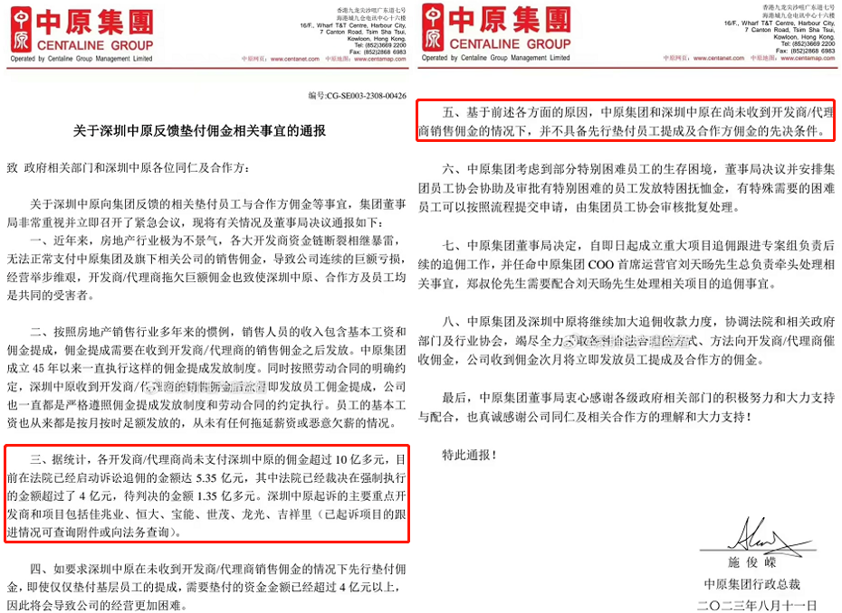

# 被欠佣金超10亿！知名房产中介发文，点名被恒大、宝能拖累

中介机构是房地产市场的重要组成部分，由于近几年房地产市场出现变化，中介机构向开发商“讨薪”事件也时有发生。

近日，一份名为《关于深圳中原反馈垫付佣金相关事宜的通报》的文件在网络上流传，其中，关于“各开发商/代理商尚未支付深圳中原的佣金超过10亿多元”的信息引发关注。

**知名中介发文讨佣金**

网传文件的落款为“中原集团行政总裁施俊嵘”，时间为2023年8月11日。

文件称，近年来，房地产行业不景气，开发商资金链断裂爆雷，无法正常支付中原集团及旗下相关公司的销售佣金，导致公司连续巨额亏损，经营举步维艰。

据第一财经，名中原集团内部人士对第一财经证实了上述文件的真实性。

“按照房地产销售行业多年来的惯例，销售人员的收入包含基本工资和佣金提成，佣金提成需要在收到开发商/代理商的销售佣金之后发放。”上述文件内容表示，中原集团成立45年以来一直执行上述的佣金提成发放制度，员工的基本工资部分，从来都是按月按时足额发放的，从未有任何拖延薪资或恶意欠薪的情况。

对于员工未收到的佣金，上述文件称，如果要求深圳中原在未收到开发商/代理商销售佣金的情况下先行垫付佣金，即使仅垫付基层员工的提成，需要垫付的资金金额已超过4亿元，这将导致公司的经营更加困难。基于前述各方面的原因，中原集团和深圳中原在尚未收到开发商/代理商销售佣金的情况下，并不具备先行垫付员工提成及合作方佣金的先决条件。不过，考虑到部分特别困难员工的生存困境，中原集团董事局决定，向有特别困难的员工发放特困抚恤金，有特殊需要的困难员工可以按照流程提交申请，由集团员工协会审核批复处理。

**涉及恒大、宝能等**

公开资料显示，深圳中原属于中原集团，中原集团成立于1978年，是一家以房地产代理业务为主，涉足物业管理、测量估价、按揭代理、资产管理、数据整合、投资移民等领域的大型综合性地产服务企业。

公司官网显示，目前，中原集团共有55000余名员工，2500间直营地铺，在包括全球60座城市成立了分公司，业务辐射百城，成为了房地产代理行业的先行者和引领者。

据上海证券报，深圳中原是中原地产代理（深圳）有限公司的简称，是深圳大型的专业地产代理公司，自2001年起在二级市场的代理楼盘数量和销售量，均占深圳房地产市场主要份额。

深圳中原为政府土地投资提供调研服务，为开发商提供全程咨询策划及销售代理服务，为深港等地客户提供住宅、写字楼、商铺、厂房租售经纪服务，以及按揭、评估等服务。

上述文件称，近年来，房地产行业不景气，各大开发商资金链断裂相继暴雷，无法正常支付中原集团及旗下相关公司的销售佣金，导致公司连续巨额亏损，经营举步维艰。
**据统计，各开发商/代理商尚未支付深圳中原的佣金超过10亿多元** ，目在法院已经启动诉讼追佣的金额达5.35亿元，
**其中法院已经裁决，在强制执行的金额超过了4亿元** ，待判决的金额1.35亿多元。

目前，深圳中原起诉的主要开发商和项目，包括佳兆业、恒大、宝能、世茂、龙光、吉祥里。而近期上述被起诉的地产开发商也是各类消息频出。

据第一财经，中国企业资本联盟副理事长、IPG中国区首席经济学家柏文喜对第一财经表示，从债权人偿付顺位角度来看，中介销售佣金的支付应该会被归为普通债权，与一般供应商处于同一序列，偿付顺序在有担保抵押等增信条件的优先债权之后，在优先股之前。

柏文喜表示，在追佣的过程中，房地产中介机构可以采取诉前保全的方式尽量多的查封对方的有效资产，以及关键往来账户，然后再与对方充分协商，双方尽可能实现最大限度的和解，从而尽快的追回债权。

**深圳二手房交易规模萎缩**

**从业人员大量流失**

来自深圳市房地产中介协会的数据显示，2020年至今，深圳二手房交易量持续走低。2020年至2022年，深圳二手房网签录得量（在深圳市房地产信息平台发起的买卖合同份数，非最终成交过户套数）分别为120295套、44375套、26853套，今年上半年的二手房录得量为20852套，仅为高峰期2020年的零头。

今年7月12日，深圳市房地产中介协会披露的数据显示，今年上半年深圳二手房房产中介平均每人每个月的成交量是0.09套，折算下来一名中介一年只能卖掉1.08套房。

近年来，深圳二手房交易规模萎缩，导致从业人员大量流失。

“市场高峰期深圳有6万多名星级中介（实名登记从业人员），现在只剩2万多人，行业生存困难。”深房中协相关人士表示。此外，今年上半年深圳中介行业的“新人率”约21.6%。在行情火热的2020年，49.3%的从业者是新人。

深圳市房地产中介协会指出，深圳二手房市场一季度“阶段性小阳春”行情在进入4月份之后戛然而止，甚至从二季度开始，每月成交量持续下探，并重回去年疫情期间月均不足3000套的尴尬境地，归根结底还是市场筑底后，市场信心仍未能彻底修复。进入下半年后，随着新房销售压力的累加，一、二手房竞争的白热化以及市场对于政策预期的减弱，在无任何托底稳预期政策的支撑下，市场近期恐难再现类似一季度“阶段性小阳春”行情。

**编辑** **|** 孙志成 易启江 **校对|** 赵庆

封面图片来源：视觉中国（图文无关）

每日经济新闻综合自证券时报、第一财经、上海证券报等

每日经济新闻

