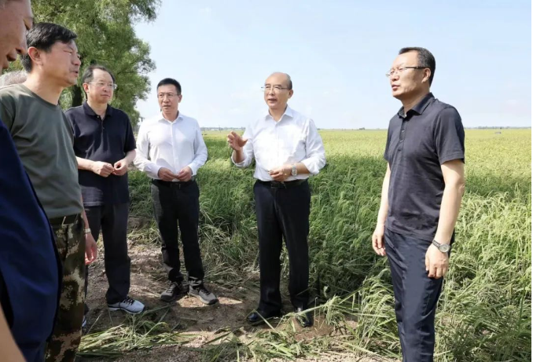

# 中央政治局常委会会议后，3位省委书记同日外出调研检查，有几个细节

**撰文 | 孟亚旭 高语阳**

随着本轮汛情发展，连日来，多个省份已经进入灾后恢复重建阶段。政知君注意到，8月20日，河北、黑龙江和吉林三省份的省委书记，都外出调研检查了灾后恢复重建工作。

此前，8月17日，中央政治局常务委员会召开会议，研究部署了防汛抗洪救灾和灾后恢复重建工作。

公开报道中，这是今年以来第二场中央政治局常委会会议。

**中央部署**

8月17日，中央政治局常委会召开会议，议题是“研究部署防汛抗洪救灾和灾后恢复重建工作”。

根据《中国共产党中央委员会工作条例》，中央政治局常务委员会会议一般定期召开，遇有重要情况可以随时召开。会议议题由中央委员会总书记确定。

公开报道中，上一次中央政治局常委会会议召开的时间是2月16日，议题是“听取近期新冠疫情防控工作情况汇报”。

时隔半年，中央政治局常委会再次召开会议。

**会议指出，当前，我国仍处于主汛期，全国多地暴雨、洪涝、台风等灾害仍然高发，一些流域仍存在洪涝灾害风险，华北、东北部分山区土壤含水量已经饱和，山洪地质灾害风险高，依然不能有丝毫放松。**

会议要求，要认真排查总结，进一步提升我国防灾减灾救灾能力。

要加强国家区域应急救援中心能力建设，立足执行急难险重任务，突出区域性重大自然灾害救援需求，尽快形成区域救援实战能力。

**3位省委书记同日外出调研**

8月20日，河北、黑龙江、吉林三地省委书记均外出调研检查灾后重建工作。

8月20日，河北省委书记倪岳峰到保定市检查防汛抗洪救灾和灾后恢复重建工作。

8月20日，黑龙江省委书记许勤到五常市看望慰问受灾群众，调研检查灾后恢复重建工作。

8月20日，吉林省委书记景俊海在本轮汛情发生后第三次到吉林舒兰市，实地检查指导灾后重建工作。

倪岳峰、许勤和景俊海都提到，要深入学习贯彻中央政治局常务委员会会议精神。

**3位省委书记的调研地都在本次汛情中遭受重创。**

例如，汛情发生以来，吉林省委书记景俊海分别于8月4日、8月10日、8月20日三次前往舒兰市。

舒兰市日前遭受了有记录以来最强降雨。防汛救灾过程中，舒兰市委常委、常务副市长骆旭东等4名公职人员牺牲，引起公众关注。

**景俊海这次在舒兰市去了开原镇新开村。新开村受灾严重，正在进行整村搬迁、集中重建。**

景俊海详细了解了设计规划，要求高地势、高标准、高质量推进集中重建工作。新开村过水农田已经开始复垦改种，景俊海走进田间地头实地了解情况。

景俊海还表示，要大力宣传骆旭东、周昆训、倪峰、张郅昭同志先进事迹，教育引导广大党员干部群众学习他们坚定的信念、忘我的精神、赤诚的情怀、高尚的情操。
**要着重考察在防汛抗洪抢险救灾一线表现突出的干部，重点培养、提拔任用，切实把鲜明选人用人导向树得更牢。**

**3个细节**

政知君注意到，倪岳峰、许勤和景俊海在调研灾后重建工作时，去了多个地方。

在保定市调研时，倪岳峰前往：

曲阳县的王快水库和位于唐县的西大洋水库，详细了解水库运行调度情况，实地考察论证重点水库扩容建设工作。

曲阳县齐村镇小口头村，随机走访群众和商户，了解恢复重建情况。

唐县白合镇南唐梅村，了解灾害处置情况。

在五常市调研时，许勤前往：

常堡乡周家岗村察看水田灾情，详细了解过水面积、水稻减产和救灾减损等情况。

常堡村新建屯刘国锋家中，询问家里受灾情况。

二河乡中学校舍维修现场。

牤牛河水毁堤坝修复工地。

在舒兰市，景俊海前往：

开原镇八里村、新开村，实地察看房屋重建修缮进展。

庆鑫吉农业发展公司，了解企业受灾损失。

珠琦河岸边，察看堤坝受损情况。

开原镇青松养老院临时安置点，了解他们基本生活保障情况。

几个细节值得关注。

**第一，“尽快兑现保险赔付”是灾后重建的重点内容之一。**

中央政治局常委会会议提到：

金融机构要优化简化相关程序，加强对受灾地区的信贷支持和保险理赔，同时持续做好风险隐患排查，努力帮助受灾群众和经营主体渡过难关。

黑龙江省委书记许勤和吉林省委书记景俊海都在调研中强调了这一问题。

许勤强调，当前正值粮食产量形成的关键期，抓好农业救灾减灾至关重要，受灾地区要抓紧落实救灾政策，尽快兑现保险赔付，千方百计减少农民损失。

景俊海在庆鑫吉农业发展公司调研期间，鼓励他们积极开展生产自救，尽快恢复正常生产经营。同时，他要求吉林市和有关部门，帮助受灾企业联系申请保险理赔，尽最大努力减少损失。

**第二，“保证受灾学生都能按时开学返校”“确保受灾群众入冬前能够回家或搬入新居，安全温暖过冬”也是中央政治局常委会会议的要求。**

在调研时，许勤强调，要全面排查受灾学校安全风险隐患，上足力量、加快进度，保证工程质量和环保安全，抓紧进行通风除潮和设备检修，保证学生按时、安全开学返校。

景俊海强调，目前洪水已经退去、重建正在加紧进行，入冬前大家一定能够安全回家或搬入新居。

**第三，中央政治局常委会会议还提到，加快完善流域特别是北方地区主要江河流域防洪工程体系。**

8月20日，河北省委书记倪岳峰在调研时指出，要复盘总结防汛救灾工作，对现有水库进行科学论证，加高加固一批水库堤坝，增加库容、提升蓄水量，同时优化水库布局，新建一批重点水库，有效发挥防洪减灾作用和综合利用效益。

**资料 ｜ 新华社 人民网 央视 吉林日报等**

**【版权声明】本文著作权归政知新媒体独家所有，未经授权，不得转载。**

