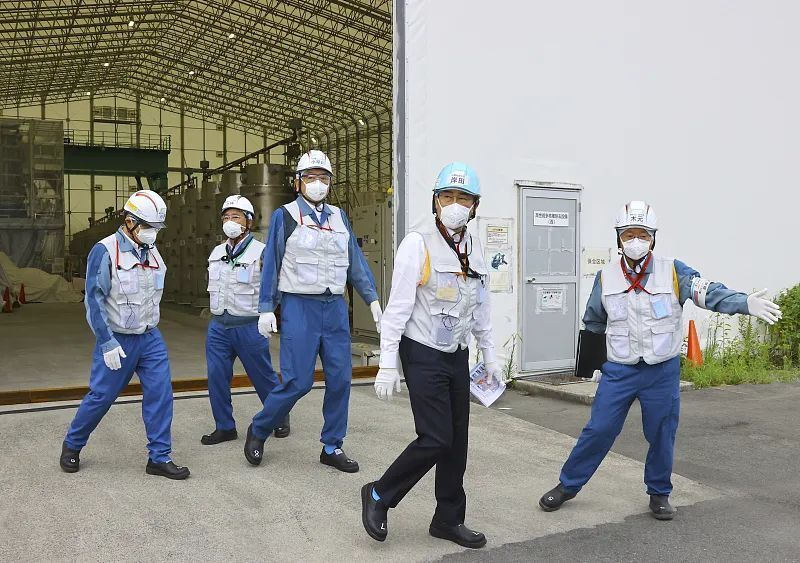
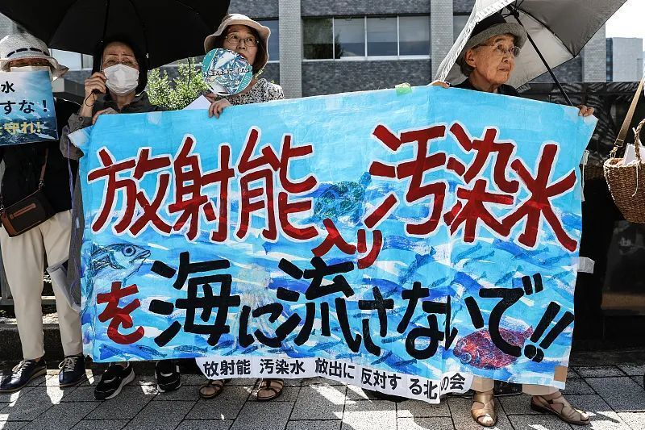

# 刚从美日韩峰会归来，日本首相急赴福岛：核污染水排放“绝不能拖延”

19日深夜刚从美日韩戴维营峰会返回日本的岸田文雄，20日上午紧急赶赴福岛第一核电站视察，强调核污染水排放是“绝不能拖延的课题”。

据日媒报道，日本首相岸田文雄当地时间8月20日到访福岛第一核电站，确认了位于离岸位置的海底隧道排水口，并检查了其他设备。此外，日本政府将于22日召开相关内阁成员会议，敲定核污染水排海具体日期。

_8月20日，岸田文雄视察福岛第一核电站。图源：视觉中国_

日本广播协会（NHK）称，这是岸田首次视察福岛第一核电站的核污染水排放设备。视察期间，岸田与东京电力公司的社长小早川智明等人会面，要求“尽全力确保安全并采取形象受损的应对措施”。

岸田文雄强调，为推进核反应堆报废和福岛重建工作，核污染水排放是“绝不能拖延的课题”。

“我认为站在国家立场，已到了应该作出（核污染水排海）判断的最后阶段。”岸田文雄说。

对于核污染水排海启动的具体时间，岸田仅称：“政府将确认采取应对措施的情况并作出判断。现阶段无法告知具体时间。”

视察结束后，岸田文雄透露，计划于21日在首相官邸与坚持反对核污染水排海的全国渔业协会联合会会长坂本雅信会面，说明“处理水”的安全性并寻求理解。

报道还称，日本政府已基本决定22日召开相关内阁成员会议，敲定核污染水排海具体日期。

长安街知事（微信ID：Capitalnews）注意到，岸田此番到访福岛第一核电站的时机颇为微妙。有分析认为，岸田刚结束戴维营峰会就赶赴福岛，意在让美韩为核污染水排海站台背书。

_当地时间8月18日，尹锡悦(左)、拜登和岸田文雄(右)在戴维营会面。图源：视觉中国_

戴维营峰会召开前，《读卖新闻》就透露，岸田文雄在戴维营将分别同美国总统拜登和韩国总统尹锡悦举行会谈，并就“核污染水排海有科学依据，确保安全性”进行说明。

韩国《朝鲜日报》则指出，日本通过与韩国、美国政府的协商，来确保核污染水排放的安全性，并摆出得到两国同意的姿态。

或许是担忧激起韩国国内的反对声音，在戴维营峰会上，日本核污染水排海并未作为公开议题讨论，但美韩均表现出默许之意。

彭博社报道称，岸田文雄与拜登在双边会谈中谈及了核污染水排海相关话题，岸田对美方给予的支持表示感谢。

对于国际原子能机构称日本排海计划符合国际安全标准一事，尹锡悦在日韩首脑会谈结束后的记者会上表示，“相信检验结果。”

尽管韩国民众强烈反对日本排放核污染水，但韩国政府已多次表达了许可。

8月7日，韩国国务调整室第一次长朴购然应询表示，日本福岛第一核电站核污染水何时排海，应由当事国（日本）定夺，而非韩日协商决定。

韩国国务总理韩德洙还曾表态称，如果福岛核污水经过科学处理后，符合韩国和世界卫生组织的饮用标准，他可以喝。

长安街知事（微信ID：Capitalnews）注意到，无论岸田文雄如何运用外交手段寻求美韩背书，也无法打消日本国内民众和国际社会对于核污染水排海的担忧。

东京电力公司近日发布调查结果，证实福岛第一核电站储存的核污染水发生泄漏，原因是用于输送核污染水的软管破裂。

不仅如此，破裂的软管后来在另一次核污染水转移作业中被再次使用，在问题储水罐附近提取的水样本显示，氚元素的含量达到了每升6.7万贝克勒尔，超出了日本政府制定的所谓“向自然环境中的排放标准”。

_2021年2月14日，航拍福岛第一核电站核污水仓。图源：视觉中国_

自福岛核事故发生以来，东京电力公司的善后处理工作漏洞百出，曾多次被曝出存在隐瞒、篡改数据，其处置核污染水的能力令人怀疑。

东京电力公司能否从始至终都安全、负责地处置福岛核污染水？能否确保长达30年的排放管理不犯错、不失误？能否确保净化装置的长期有效性和可靠性？能否严格按照规范进行核污染水的取样、监测活动？对这些问题，国际社会不得不打一个大大的问号。

就在岸田赴美参加戴维营峰会期间，日本民众18日再次在东京首相官邸附近发起集会，要求政府遵守当初作出的不擅自处置核污染水的承诺，撤回核污染水排海计划。

集会组织方代表镰田慧表示，核污染水一旦排海，不但给福岛县渔业造成危机，更将给整个日本和国际社会带来难题，这将成为“日本之耻”，是决不能容许的。

_当地时间8月18日，日本东京，民众在首相官邸前举着横幅和标语牌抗议核污染水排海。图源：视觉中国_

共同社19至20日实施的日本全国电话舆论调查结果显示，对于核污染水排海，担心日本“形象受损”的受访者达到88.1%。

此外，岸田内阁的不支持率已达50%。这是去年12月以来，岸田内阁不支持率再次升至50%，而支持率仅为33.6%。

事实再次证明，岸田文雄拉着盟友给自己站台背书，终究是打错了算盘。日方只有停止强推排海计划，以真诚态度同周边邻国充分沟通，切实以负责任的方式处置核污染水，才能真正取信于本国民众、邻国和国际社会。

