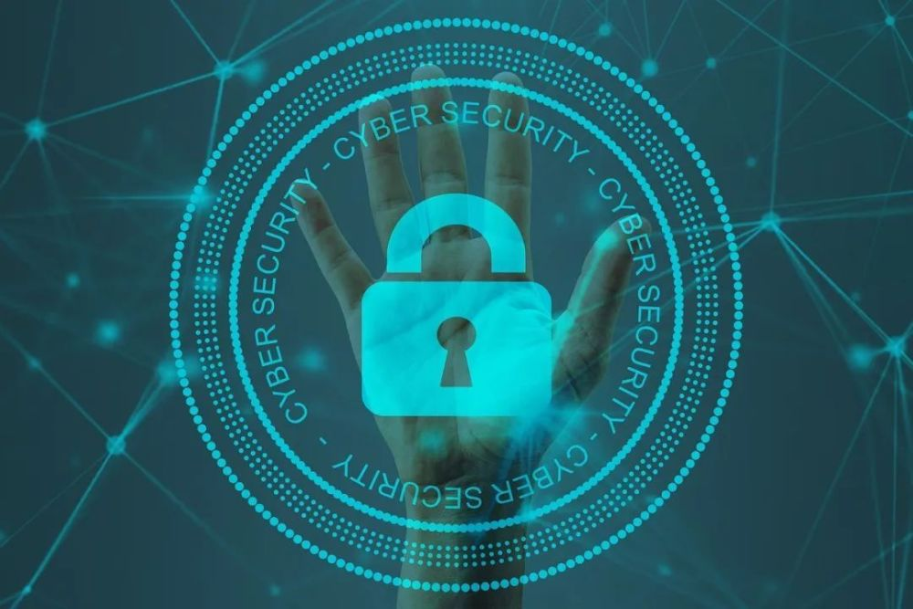

# 国安部两次点名美国中情局！透露的细节值得警惕

**文/李晓喻**

21日，国家安全部官方微信通报破获一起美国中央情报局（CIA）主导的间谍案。

这是短短十几天内，国家安全部官方微信第二次点名美国中情局。

案件

据国安部消息，犯罪嫌疑人郝某，1984年1月生，系我某国家部委干部。郝某在日本留学期间，因办理赴美签证事宜与美驻日本使馆官员泰德结识，泰德通过请客吃饭、赠送礼品等方式与郝某逐步密切关系，并请郝某帮助撰写论文，承诺支付“稿费”，郝某答应泰德要求。泰德在美驻日使馆任期结束前，又将同事李军介绍给郝某，双方继续保持合作关系。

郝某留学期满前，李军亮明美国中央情报局东京站人员身份，对郝某实施策反，要求其回国后进入我核心要害单位工作。郝某表示同意，与美方签署了参谍协议，接受美方考核和培训。

郝某回国后，按照中情局要求设法进入我某国家部委工作，在境内与中情局人员多次秘密接头，提供情报并收取间谍经费。国家安全机关侦查发现郝某间谍活动后，依法对其开展审查。目前此案正在侦办中。

8月11日，国安部还公布过一起涉美间谍案。犯罪嫌疑人曾某某，1971年7月生，系我某军工集团工作人员，属重要涉密人员。

当时披露，曾某某被单位公派至意大利留学进修期间，美国驻意大利使馆官员塞斯主动与曾某某结识，此后通过聚餐、郊游、观赏歌剧等活动逐步密切关系。曾某某心理上逐渐对塞斯产生依赖，塞斯趁此向曾某某灌输西方价值观。在塞斯的吹嘘和拉拢下，曾某某政治立场产生动摇。

后来，塞斯向曾某某亮明中央情报局罗马站人员身份，承诺给付巨额报酬并为曾某某全家办理赴美移民，要求曾某某提供我军事方面敏感信息。曾某某表示同意，与美方签署了参谍协议，接受美方考核和培训。曾某某留学进修结束后，回国继续与中情局人员多次秘密接头，提供大量我核心情报，收取间谍经费。

两次点名CIA

国家安这两次通报的间谍案，都直接点名美国中央情报局（CIA）。

CIA是美国联邦政府主要情报机构之一，总部位于美国弗吉尼亚州兰利，下设情报处（DI）、秘密行动处（NCS）、科技处（DS&T）、支援处（DS）四个部门。其主要业务范围涉及：收集外国政府、公司和公民情报信息；综合分析处理其他美国情报机构收集的情报信息；向美国高层决策者提供国家安全情报和安全风险评估意见；根据美国总统要求组织实施和指导监督跨境秘密活动等。

长期以来，CIA在世界各地秘密实施“和平演变”和“颜色革命”，持续进行间谍窃密活动。

从20世纪80年代国际社会主义阵营遭受冲击、90年代初苏东剧变到2003年格鲁吉亚“玫瑰革命”，从2004年乌克兰“橙色革命”到2005年吉尔吉斯斯坦“郁金香革命”，从2011年西亚北非国家“阿拉伯之春”到2014年乌克兰“二次颜色革命”等，都被国际机构和世界各地学者认定为由美国主导的“颜色革命”典型案例。

据统计，数十年来，CIA至少推翻或试图推翻超过50个他国合法政府（而CIA只承认其中的7起），在相关国家引发动乱。

今年5月，国家计算机病毒应急处理中心和360公司曾联合发布调查报告，揭秘CIA利用网络攻击他国的相关情况，披露部分发生在中国和其他国家的网络安全典型案事件的具体过程，全面深入分析CIA的网络攻击窃密和相关现实危害活动，以及其对美国成为“黑客帝国”所做的贡献。

今年7月，美国中央情报局局长伯恩斯出席阿斯彭安全论坛时应询称，美在华情报网络重建已取得进展，正努力构建强劲的人力情报收集能力，以补充其他情报获取渠道。

对此，中国外交部发言人毛宁表示，我们注意到有关报道，对此表示关切。美方一边反复散布所谓中国间谍、网络攻击的虚假信息，一边毫不掩饰地宣称要针对中国开展大规模情报活动。这本身就很说明问题。中方将采取一切必要措施，坚决维护国家安全。

反击

今年7月1日，新修订的《反间谍法》开始施行。这是二十大后国家安全领域的第一部专门立法。

该法律明确，国家建立反间谍工作协调机制；国家安全机关是反间谍工作的主管机关。此外，《反间谍法》还规定，任何公民和组织发现间谍行为，应当及时向国家安全机关举报。同时要求，国家安全机关应当将受理举报的电话、信箱、网络平台等向社会公开，依法及时处理举报信息，并为举报人保密。

今年8月，中共中央办公厅、国务院办公厅印发了《关于建立领导干部应知应会党内法规和国家法律清单制度的意见》，《反间谍法》被列入学习重点。《意见》明确提及，要“提高领导干部运用法律武器防范化解重大风险的能力，增强依法斗争本领”。

中国社科院法学研究所所长莫纪宏撰文称，间谍分子是具有高度隐蔽性、专业性和危害性的特殊的违法犯罪群体，反间谍工作不同于一般的执法活动，具有高度的专业性、对抗性和危险性，国家安全机关与间谍组织之间“没有硝烟”的残酷斗争和激烈博弈，无时不在、无处不在。

莫纪宏表示，在有效发挥反间谍工作专门机关作用的基础上，需要建立起社会组织和公民个人广泛支持的反间谍工作网络和体系，最大限度地发挥人民群众在反间谍工作中的主动性和积极性，只有这样才能做到“知己知彼、百战不殆”。

来源：国是直通车

编辑：诸葛瑞鑫

责编：魏晞

