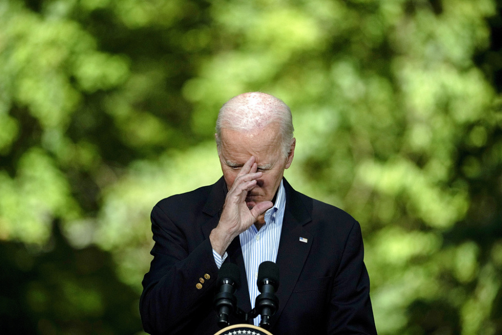

# 外媒炒作“美收紧对华核电产品出口管制”，中国驻美使馆回应

【环球时报报道 记者
索炎琦】“美国收紧对华核电产品出口管制。”路透社8月18日以此为题报道称，拜登政府已加强对出口中国核电站材料和部件的管制，声称这将确保相关产品仅用于和平目的，而非用于核武器扩散。报道炒作称，该举措是美中紧张关系的最新迹象之一，两国近来在间谍指控、人权等问题上发生冲突。

_当地时间2023年8月18日，美国马里兰州戴维营，美日韩三边峰会后，美国总统拜登与日韩领导人举行联合新闻发布会。图源：视觉中国_

关于上述举措的具体内容，报道称，美国商务部下属工业和安全局（BIS）已要求出口商在出口用于中国核电站的某些发电机、容器和软件时，必须获得特定许可证。美国核管理委员会（NRC）也要求出口商在出口特殊核材料和原材料时必须获得特定许可证。

报道称，美国核管理委员会表示，拜登政府认为，这一做法对“确保美国国家安全利益、加强共同防御和安全是必要的”。一名美国官员还称，这一举措是受美对华总体政策的影响而作出的。

路透社提到，中国驻美国大使馆发言人刘鹏宇对上述举措作出回应。刘鹏宇表示，中国坚定维护国际核不扩散体系，并履行《不扩散核武器条约》规定的义务。他表示，中国反对将地缘政治利益凌驾于核不扩散之上。

此外，报道称，美国非营利组织“忧思科学家联盟”的核不扩散专家埃德温·莱曼表示，上述举措变化“象征意义大于实质意义”，并怀疑中国核武器计划是否会因此受到实质影响。

美方被爆对华核电产品出口管制前不久，8月9日，拜登签署新的对华投资限制行政令，宣布设立对外投资审查机制，限制美国主体投资中国半导体和微电子、量子信息技术和人工智能领域。这3个领域被认为是“中美科技竞争的核心内容”。根据规定，美国财政部将制定相关细则，明年正式实施。

同月10日，中国商务部和外交部发言人相继表态，对美方执意出台对华投资限制措施强烈不满、坚决反对，向美方提出严正交涉，“中方将保留采取措施的权利。”

