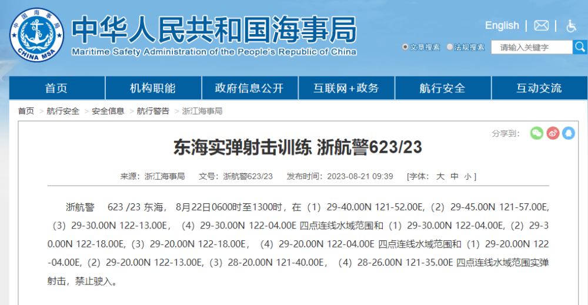

# 浙江海事局：东海部分水域范围实弹射击训练，禁止驶入

来源：浙江海事局

东海实弹射击训练 浙航警623/23

浙航警 623 /23 东海， 8月22日0600时至1300时，在（1）29-40.00N 121-52.00E,（2）29-45.00N
121-57.00E,（3）29-30.00N 122-13.00E，（4）29-30.00N 122-04.00E
四点连线水域范围和（1）29-30.00N 122-04.00E,（2）29-30.00N 122-18.00E,（3）29-20.00N
122-18.00E，（4）29-20.00N 122-04.00E 四点连线水域范围和（1）29-20.00N
122-04.00E,（2）29-20.00N 122-13.00E,（3）28-20.00N 121-40.00E，（4）28-26.00N
121-35.00E 四点连线水域范围实弹射击，禁止驶入。

