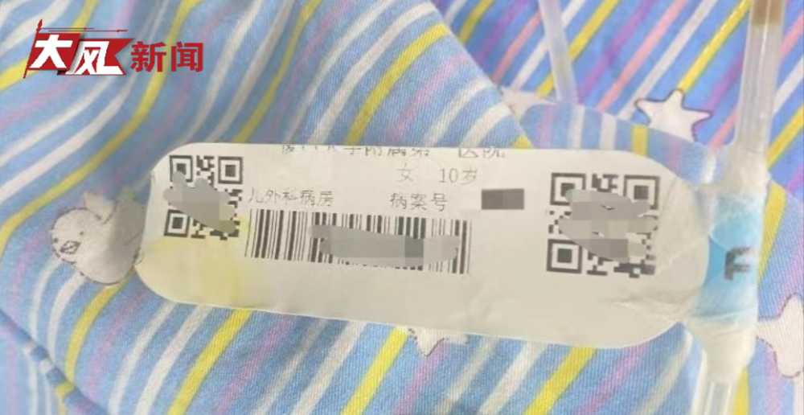
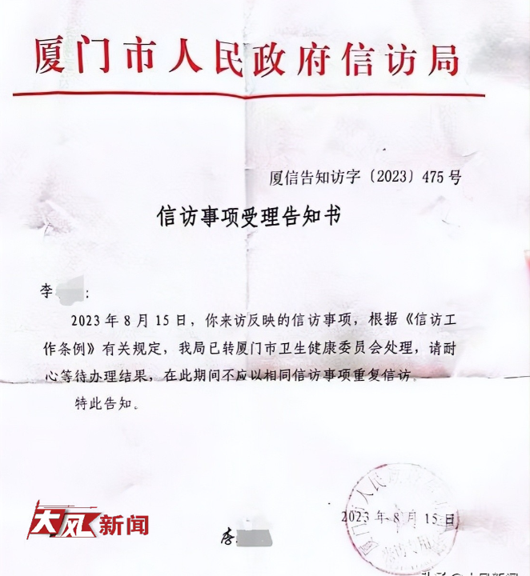
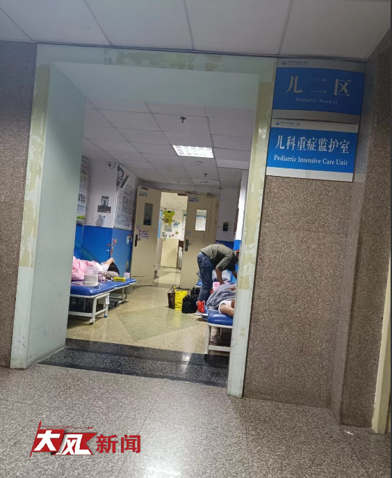

# 福建一医院擅自决定微创转开胸手术，致10岁女童脑死亡？多方回应

华商报大风新闻报道（记者
李华）8月19日，福建的李女士和丈夫赶往厦门大学附属第一医院PICU（儿科重症监护室）病房，10岁爱女静静地躺在病床上离不开呼吸机。他们无论如何也没料到，原本只是一个肺部先天性囊肿、一个微创手术，最终却被女儿推向了脑死亡的惨痛境地。

“从微创转开胸手术这个过程，没有告知我们家属。”患儿家属认为医院隐瞒手术中大出血的状况，未经家属同意擅自决定从微创转开胸手术，而主刀医生还是医院外请的微创专家。

**微创专家手术中**

**“叫胸外科的医生辅助做开胸”**

李女士介绍，2022年底，10岁女儿患上肺炎，“去医院拍片子发现肺部囊肿，我问了厦大附一院儿外科医生，说得做微创手术。我在签手术同意书时，让我签字的医生还说，找李医生是找对了医生，没什么大问题。”

李女士称在医生推荐下，他们决定在厦大附一院为女儿做微创手术。“李医生是他们医院外聘的教授，他就每月一两天在这家医院，说李医生是全国数一数二的微创专家，让我们等他来做这个手术。”

3月3日12点，女儿被推进手术室，由李医生主刀。李女士告诉华商报大风新闻记者，“手术进行了一个半小时到2个小时，就割到血管了。医生用止血钳去钳血管，说血管是脆的，结果伤口就变得更大，血喷出来，场面没办法控制，就打电话叫胸外科的医生来辅助做开胸。”

李女士提供了部分诊治病历和手术，“我这个病历太多了，有两箱子。”

**家属称没有签署**

**微创转为开胸手术同意书**

李女士表示，从微创转开胸手术这个过程，家属完全是不知情的。“没有医生出来告诉我们，也没有让我们签署转开胸手术同意书。到下午4点多手术结束，有一个医生才出来跟我说孩子手术中有出血，有割到血管，都不敢说大出血，说可能要送去儿科重症监护室观察一两天，就这样轻描淡写地就过去了。”

李女士认为医院向家属隐瞒手术当中出现的状况。“当时我们家属也没意识到这么严重嘛，还以为就是简单的出血，其实根本就不是。当天晚上在儿科重症监护室抢救，医生都不敢告诉我们，直到两三天后交待病情时，医生才说，其实那天送来在里面抢救了一整夜，止血钳碰到了血管，这个手术记录里面有记录。”

**“医生疑用止血钳夹**

**出血点的口子更大了”**

厦大附一院3月8日病理诊断报告单显示，女童右肺下叶结合临床，符合先天性囊性腺瘤样畸形。

原本只是一个微创手术，何以出现严重的状况？李女士说：“不知道主刀的李医生那天做手术怎么搞成这样子，我们找他，他就解释称，他用止血钳止血去钳，结果血管脆得一夹，出血点的口子更大了，血喷得更多。”

李女士说：“我们没有李医生的电话，从手术前查房一共就见了两次面，最后一次见面是事发后，我丈夫在‘好大夫’上面问他要躲避到什么时候？第八十几天，他来医院见了我们一面，那天情绪很激动，警察和律师都来了。”

李女士称：“我们报了警，但辖区派出所认为不在他们管辖范围，没有立案。”

**出血量1800毫升**

**家属称相当于10岁孩子**

**全身的血都流干了**

李女士告诉记者，“因为当天的手术记录上写的是出血量大约1800毫升，这对一个10岁的孩子意味着什么？几乎相当于孩子全身的血都流干了。李医生还说‘你们可以随便去做鉴定，我做的任何手术经得起任何鉴定。’”

事发后，家属请了律师收集证据。“我们花了5万元请专业的医疗律师分析，说李医生用这个钳子就是错误的，按规定遇到这种情况应该采取“胸腔镜吸引-
侧压止血法”，他是止血方式用错了，他本人怎么可能告诉我们他用错了止血方式。”

厦大附一院儿科重症监护科3月3日的转入记录显示，当晚7点40分转入时，女童神志不清，每分钟呼吸20下，当时诊断为右肺下叶肿物切除术后，缺血缺氧性脑病？休克，心功能不全，予以重症护理、一级护理。

**仅靠呼吸机维持**

**女儿被判定脑死亡**

**“她是把命吊着”**

李女士表示，10岁女儿至今仍躺在儿科重症监护室病房里，命悬一线。“她是把命吊着的，她没有意识，处于昏迷当中。没有自主呼吸，生命完全靠呼吸机维持，医生说只要呼吸机管子一拔，人肯定就三五分钟就没了。”

 _10岁女童躺在病床上5个多月离不开呼吸机_

一份4月23日有医护签字的记录显示，女童无自主呼吸，对外界刺激无任何反应，考虑脑死亡，临床上无继续治疗意义，建议行脑死亡鉴定。

李女士说：“她目前被上海请过来的医生判定已经脑死亡。查房记录上写的是建议做脑死亡鉴定。这位医生说，脑死亡在国外就意味着人已经没了。”

“诊断为脑死亡等于宣判一个人的死亡。”8月21日，记者联系国内一位资深医生，他解释称脑死亡是指包括脑干在内的全脑功能不可逆转的丧失，即死亡。

“脑死亡主要由原发性和继发性脑损伤引起。患者深昏迷，自主呼吸和各种脑干反射消失。”

这位医生介绍，大脑和脑干是人体接收信号和传出命令的“最高指挥官”，“一旦大脑和脑干功能丧失，机体的其他器官将无法继续协同工作，也无法对环境变化做出反应，最终出现呼吸心跳停止、各种脑干反射消失的临床死亡结局。”

**重症监护5个多月**

**医药费花了70万**

**谁来结算？**

李女士说：“现在只用一些抗感染的药。伤口的那些地方没有办法再用其他的什么药了。”

李女士告诉记者，截至目前，巨额医药费让他们难以承受。“从我女儿住进PICU到现在已经5个多月，目前花了快70万了。目前详细的费用还没有结算，他们现在也不敢找我们结算。我们刚开始去找，医院说他们承担40%，说医药费他们来报，中间我们去其他部门反映后，医院医务科的工作人员说他们没说过这个话，说就算赔50%，我们家属也要承担另一半。”李女士表示：“我们向信访局反映后，信访局给了我们一份受理通知书，说60天内给书面的回复。”

_受理告知书显示，8月15日厦门市信访局已转厦门市卫健委处理_

记者看到，8月15日厦门市政府信访局出具的信访事项受理告知书显示：当日，李女士来访反映的信访事项，我局已转厦门市卫健委处理，请耐心等待办理结果。受理告知书上盖有厦门市政府信访局来访专用章。

**手术记录显示**

**术毕充分与患儿父母沟通**

**并告知术中情况**

记者注意到，3月3日，厦大附一院手术记录单显示：拟行右肺下叶肿物切除术，超声刀逐步分离胸膜粘连沿下叶内侧胸膜处切开脏层胸膜，逐步向肺门处游离，肿物张力大，予肿物顶部切开，吸净腔液，予超声刀沿肿物囊壁内侧边缘向肺门处分离肿物，内侧壁与肺门处组织间粘连紧密分离困难，分离切开过程中损伤右侧下肺静脉，出血量多，腔镜下无法很好控制出血，术中紧急改开胸探查。请胸外科主任会诊，上台辅助开胸探查。

腔镜前控制出血处。探查见右肺下静脉局部裂伤，控制钳控制出血点。手术顺利，术中出血约1800毫升，回输自体血约900毫升。输血过程顺利，无输血相关并发症。术毕，充分与患儿父母沟通，并告知术中情况。记者注意到，这份手术记录单末尾有手术医师的签字，其中就有主刀的李医生。

**涉事医院医务部称联系宣传科**

**宣传科称医务部主管**

8月21日，华商报大风新闻记者从厦门市卫健委获悉，相关科室已接到厦门市信访局转来的信访处理事项。记者联系厦大附一院医务部，针对患童家属所说的情况，一位工作人员回应称：“你是媒体，要了解，要跟我们对外宣传的部门联系。”记者询问院方的调查结论，对方表示：“媒体报道的话，都要和我们宣传科联系，以我们宣传科说的为准。”无奈，记者根据其提供的电话联系了医院宣传科，工作人员答复称：“这个我们不了解。”记者询问外请的主刀李医生手术情况，工作人员表示：“这个事是医务部在主管，这个要和医务部联系，这是他们医务部主管的业务。”记者询问是否医院配合厦门市卫健委的调查，这名工作人员称不了解。

该院儿外科医生简介栏第一排主刀李医生的简介资料显示，李教授是国家特级专家，国家级教授，医院小儿外科特聘主任，主任医师，博士生导师。是国内外小儿微创外科权威专家，擅长腹部、泌尿、胸部外科，首创多种高难度腔镜手术。

**厦漳往返奔波**

**夫妇每晚在医院走廊上过夜**

_夫妇每晚在儿科重症监护室门外走廊上过夜_

8月19日，李女士接受记者采访时，正在从漳州赶往厦门的路上。夫妻俩家住漳州，在漳州经营一家店铺，他们下面还有一个孩子，目前只能是在漳州、厦门往返奔波。

“我跟我老公每天下午下班后，晚8点钟开车从漳州赶往厦门，差不多一个小时的车程。每天都守在PICU病房外，晚上就在PICU门口的走廊上过夜。第二天听完病情介绍，我们再返回漳州，每天都是来回跑这样子。”李女士坦言：“我们希望给女儿讨回公道，尽快解决这件事。小孩子在医院已经拖到变形了，因为颅内高压很高，直接额头上鼓起一个包，都破裂了，现在伤口是完全合不上的。”

