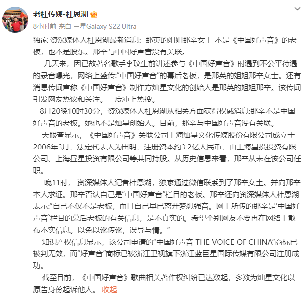
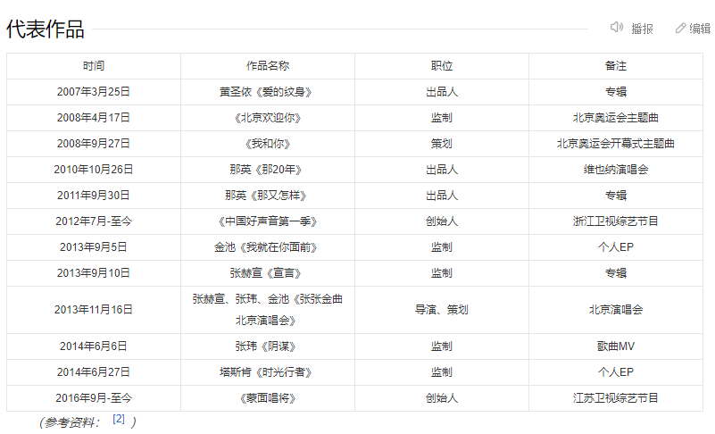

# 网传那英姐姐那辛发声：我不是《好声音》老板，目前与节目组无关联

8月20日，浙江广电发声明回应《中国好声音》争议，督促浙江卫视、灿星文化听从大众意见，维护公平公正。

浙江广电发布声明后不久后，那英姐姐那辛接受记者采访否认网络上的相关传言。

资深记者杜恩湖20日深夜发文表示，独家采访了那辛女士，那辛在20日晚11时回应，表示自己不是《中国好声音》的老板，早已离开梦想强音，网络上说她是《中国好声音》幕后老板是假的，希望个别网友不要散布不实信息。

记者指出，那辛不仅不是《中国好声音》的老板，同时也不是灿星创始人，目前跟节目组没有关联，《中国好声音》制作方灿星文化成立于2006年3月，法定代表人为田明，注册资本约3.2亿人民币，那辛从未在该公司任职。

此前，网传那辛在朋友圈发文辟谣。

公开资料显示，那辛是那英的姐姐，1988年开始担任那英的经纪人，是歌曲《北京欢迎你》的监制，歌曲《我和你》的策划。

外界一直盛传那辛是《中国好声音》的创始人及幕后操盘手，那英才稳坐导师位置。

资料显示，那辛不仅是那英的经纪人，也与那英战队学员有着千丝万缕的关系，比如平安、张玮、金池等人，在那辛的推动下参加《蒙面唱将》，而《蒙面唱将》的创始人疑似就是那辛。

2013年，那辛还策划张赫宣、张玮、金池组等人开启演唱会，在澳洲等人巡演。

总之，那辛确实参与了那英学员成名后的工作事务，这是公开的资料，大部分是由那辛本人或者团队编辑，目前也没有改动，不知那辛接下来会否回应这一问题？

李玟生前录音曝光以来，《中国好声音》成为众矢之的，除了圈内艺人之外，多位学员也纷纷发声，内涵节目组存在黑幕。

学员徐海星发文爆料，指盲选过后没几天，那辛等人就找过来签约。

对于外界关心的问题，浙江广电表示会进一步调查核实，也希望早日看到调查结果，还逝者李玟以及各位学员一个公道，对于签约的爆料，那辛在朋友圈澄清是编出来的段子，完全是蹭热度。

