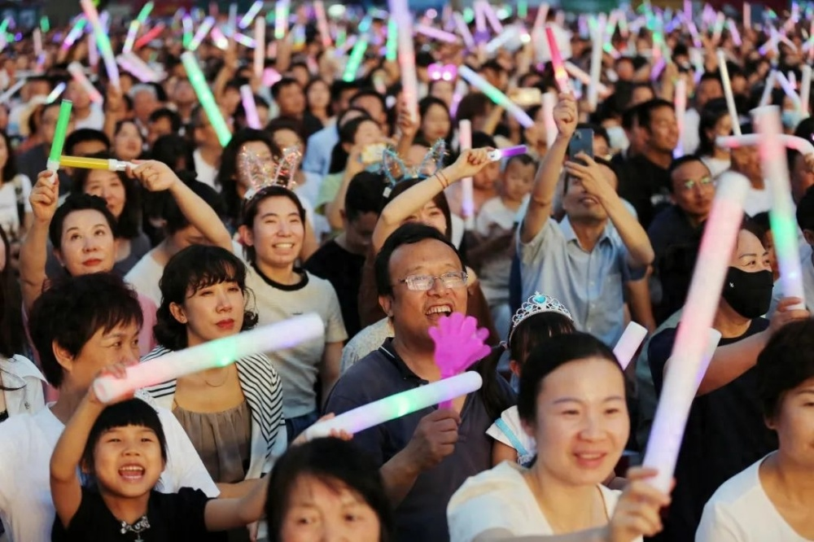
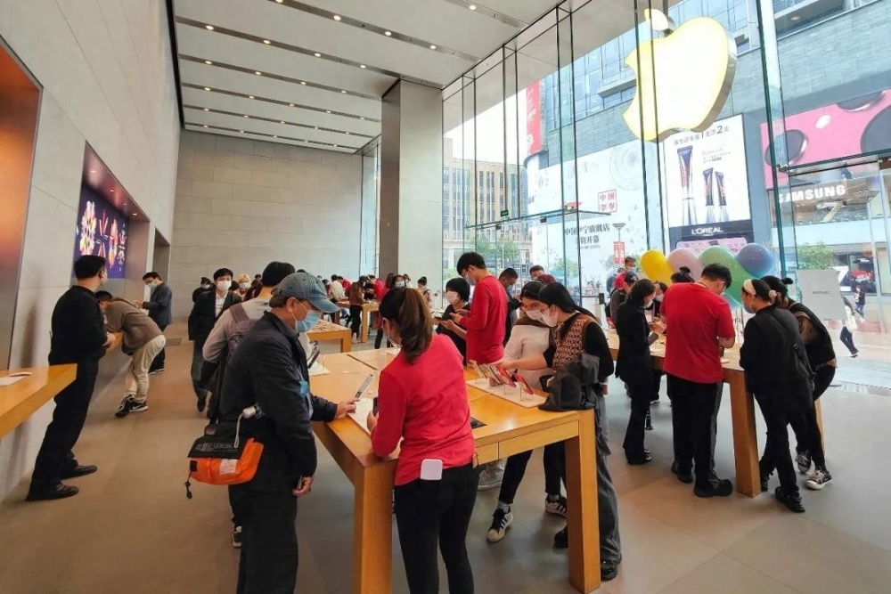
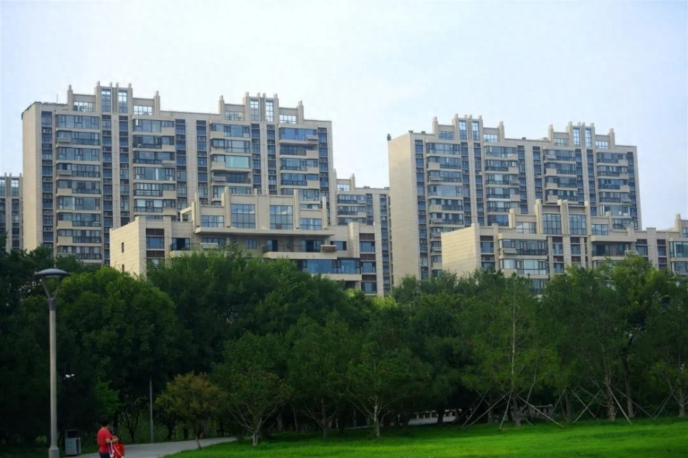
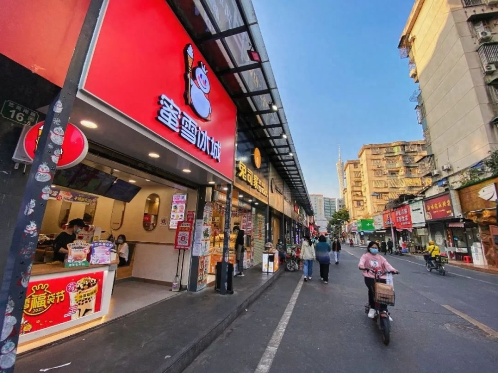
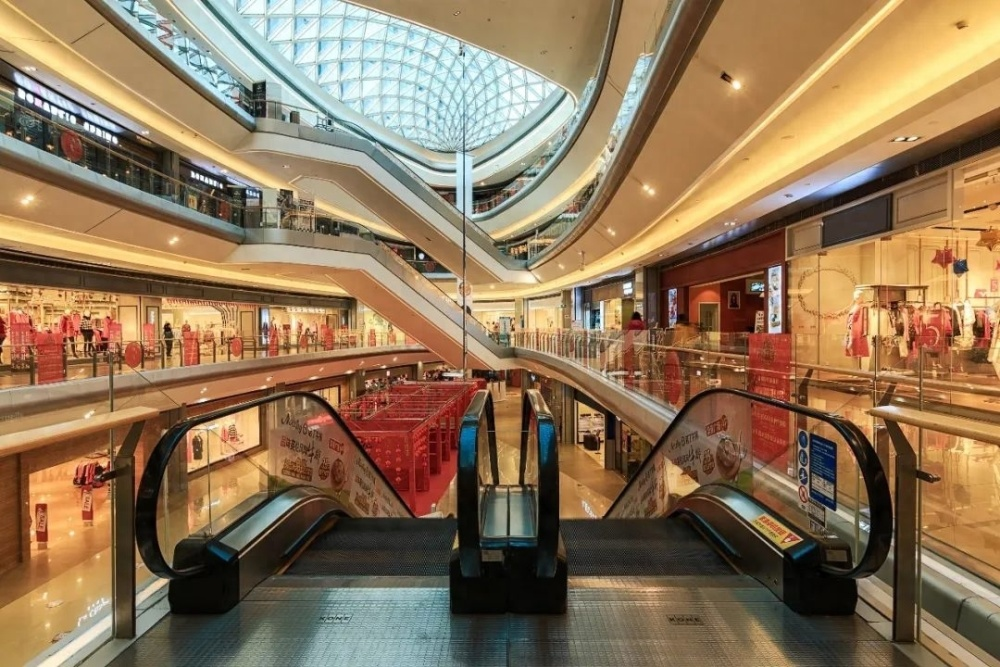

# 这届消费者花小钱找乐子：不买房不买车不投资，收入都花在吃喝玩乐上

8月15日，国新办召开新闻发布会，国家统计局有关负责人介绍了7月份国民经济运行数据，有两点引发了讨论：一是暂停发布全国青年人等分年龄段的城镇调查失业率；二是7月全国居民消费价格（CPI）同比下降0.3%，继6月CPI“零增长”后继续下探，再次引发市场对通缩的担忧。

CPI下滑，反映的是需求不足、消费不振，7月份的社会零售品销售总额同比仅增长2.5%，远低于预期的5.3%，也不及前值3.1%，消费景气度有所回落。不过，统计局再次强调，“当前中国经济不存在通缩，下阶段也不会出现通缩”。

看数据，感觉大家都不愿意花钱了，但视线落到身边，却是另一番场景——暑假出游火爆，大学生热衷特种兵旅游，新疆的独库公路再次“堵哭”；餐饮强劲复苏，商场里的海底捞、费大厨们大排长队，古茗、沪上阿姨们则疯狂开店，争抢上市；电影行业迎来“史上最强暑期档”，票房超过180亿，七八十块钱一张的票也拦不住人们冲向电影院；还有动辄上千元一晚的如家、汉庭，背刺了打工人的钱包。

这让我们开始错乱：谁说大家都没钱了？这么多疯狂吃喝玩乐的人都是哪儿来的？难道只有我一个人穷？

最近，上市公司的上半年业绩陆续出来了，每日人物翻了翻各行业龙头公司的数据，找到了答案——消费还在缓慢复苏，只是出现了严重的分化，人们有限的收入主要花在了吃喝玩乐上，但花的都是小钱，不买房、不买车、不装修、不买手机、不投资，则是消费的另一个侧面。

**大家钱都花哪儿了？**

上半年，想从消费者的口袋里掏出钱来，需要付出比从前更多的努力。

海底捞就是一个“人家那么优秀，还那么努力”的典型。近日，海底捞在一些地方的夜市摆起了摊，8块8的小油条、9块9的毛血旺、16块的小酥肉，年轻人们挤在摊位前，花很少的钱就能尝到海底捞的招牌，“干净又好吃”“希望上更多新品”，着实卷到了夜市的小吃摊主们。

趁着今年线下演出的火爆，海底捞还去演唱会门口拉人。在许多演唱会散场后，海底捞的员工举着横幅拿着喇叭，招呼着观众坐上大巴、接到店里吃火锅，不想吃的还能免费送到地铁站。各地海底捞门店纷纷效仿，有的甚至把门店改造成粉丝见面会现场，应援荧光棒、气球彩带、偶像照片一应俱全，主打一个体验式消费。

从更早的大学生旅游特种兵深夜挤在海底捞，到如今夜市摆摊、演唱会拉人，海底捞紧紧抓住了夜间经济和自身的契合点，顺着消费潮流快速复苏。今年上半年，海底捞收入188亿元，同比增长24%，盈利22亿元，增长近3000%，彻底扭转了疫情期间因抄底误判、大幅亏损关店的局面。

盈利大幅增长，靠的是海底捞自身管理效率和低成本供应链的内功，但收入增长，除了自身的努力，更重要的是踩中了今年上半年餐饮行业复苏的凶猛势头。

 _▲ 2023年8月10日，青岛，海底捞在夜市摆摊卖火锅。图 / 视觉中国_

翻开餐饮上市公司的财报，基本没有哪家是不亮眼的。大到拥有肯德基、必胜客、小肥羊、黄记煌等品牌的餐饮巨头百胜中国，以400亿的庞大营收规模实现16%的营收增速和166%的利润增速；小到卤味细分赛道的绝味食品，预告营收增长9.42%-1.92%，净利润增长131.25%-146.47%；连亏损了好几年的老牌餐企全聚德、同庆楼、金陵饭店，都纷纷扭亏为盈。

根据国家统计局公布的上半年社会消费品零售额数据，餐饮收入的增速最高，达到21.4%，而商品零售中粮油、食品类和烟酒类目也有相对不错的增速，青岛啤酒、东鹏饮料、东阿阿胶之类的公司，都有优秀的业绩。更不用说A股巨无霸贵州茅台，营收和利润增速双双破20%，酒桌上的酒一喝，不管大家的生意谈没谈成，反正茅台是赚麻了。

如果算上餐饮，吃喝这件事，在上半年居民消费支出中的占比超过了50%，上半年中国人的恩格尔系数可谓是拉满了。

仿佛要修复疫情以来的心理创伤，上半年大家最愿意花钱的地方，除了吃喝，就是玩乐。

比夏天40度的高温更火的，是人们对旅游的热情，从五一到暑期，有很多刷新认知的新闻，描绘出旅游行业的疯狂——“故宫的门票提前七天也抢不到”“新疆的民宿涨到2万一晚还是有人买”“导游日薪2000元还招不到人”……现在，有了更直接的数据把疯狂量化：

旅游OTA平台携程网，一季度营收92亿，同比增长124%，二季度业绩还没公布，市场预期是108亿，预期增幅170%。携程一季度的利润表现也非常惊人，赚了34亿，同比增长441%。

携程是旅游集散的平台，毛利率高，赚的钱最多，而旅行社、酒店、航司，也都在上半年的热潮中咸鱼翻身。比如中青旅，去年上半年还亏2个亿，今年发布年中盈利预告，宣称扭亏为盈1个亿；拥有汉庭、全季、桔子等酒店品牌的华住集团，一季度收入同比增长了67%，净利润增长了257%，二季度市场预期是继续保持这个增速；而国航、东航、南航等7家航司发布的业绩预告显示，今年上半年亏损大幅收窄，比去年减亏约7成，预计超过500亿元，春秋航空和吉祥航空作为廉价航空的代表，已经率先扭亏为盈。

 _▲ 2023年8月19日，北京，游客高温下游览故宫博物院。图 / 视觉中国_

上半年，一首主打治愈的《向云端》传遍网络，经过三年的疫情，人们不仅向往远方，也开始重新思考当下生活的方式和意义，喜欢上今朝有酒今朝醉的活法。随之而来的，是音乐、演唱会、电影、彩票等娱乐消费的火热。

在阿里巴巴业绩报告里，连年亏损、一向被看成集团拖累的大文娱板块，首次实现了盈利，并不是烧钱专业户优酷突然支棱起来了，而是大文娱之下两个小兄弟——大麦网和阿里影业抓住了今年线下演出和影视复苏的红利。

据中国演出行业协会票务信息采集平台的数据，2023年上半年，全国营业性演出场次19.33万场，同比增长400.86%；演出票房收入167.93亿元，同比增长673.49%；观众人数6223.66万人次，同比增长超10倍。大麦网，是线下演出爆发最大的赢家之一，场场爆满、开票秒没，把票给黄牛匀一匀，就能躺着赚钱。

而阿里影业，在2023年参与制作的12部影片，已上映8部，总票房112.2亿。其中，主出品8部，出品总票房36.76亿；主发行5部，发行总票房49.67亿；有7部票房过亿，3部票房破15亿，《消失的她》，登上4-6月中国票房榜首。

票房飞涨，影视行业上下游都等来了春天。兼顾投资、发行、院线的中国电影，预计上半年净利润2.8亿到3.8亿，同比增加1287.12%到1782.52%；主营院线的金逸影视，过去三年接连亏损，今年上半年也预告扭亏为盈，净利润同比增长110.69%至113.74%，终于“活了过来”。

演唱会和电影票还都在涨价，更能让人们花小钱就能感受快乐的，是音乐和彩票。上半年，在线音乐龙头腾讯音乐也收获了罕见的增长——月活跃用户数近6000万，同比增长了22.8%，付费用户数8270万，同比增长了33.2%，这让腾讯音乐的订阅收入（如绿钻会员）首次超过了直播PK打赏，毛利率得以提升，二季度就赚了15.3亿净利润，同比增长48.6%。

_▲ 2023年8月13日晚，在“2023甘肃平凉金曲演唱会”上，现场观众与台上歌手激情互动。图 / 视觉中国_

音乐能抚慰人心，彩票则能寄托人民对美好生活的向往。财政部公布的数据显示，上半年全国累计销售彩票2739亿，同比增长50%。并不是所有彩票都招人喜爱，大家迷上的是十元一张的刮刮乐，和看比赛时那种竞猜的快感。

拿6月份的数据说，竞猜型彩票销售192.19亿元，同比增长83.9%，即开型彩票销售108.10亿元，同比增长99.4%。这边大运会、亚运会、男篮世界杯、女足世界杯等大型赛事接连不断，那边年轻人沉迷于刮出几十块钱的即时满足，彩票的火热还会持续，也利好了旗下拥有中体彩科技和中体彩印务两家彩票核心企业的中体产业，一定程度上对冲了这家国家体总旗下唯一A股上市公司在房地产领域的窘迫。

吃喝玩乐，带来即时的、真实的快乐反馈，还不用花太多钱，这些都可以让年轻人心甘情愿掏腰包，但这些消费火热的另一个侧面，是大宗、可选消费品的疲软。年轻人的腰包，在吃喝玩乐之后，就已经快没得掏了。

**低价是标准答案**

一位名叫辜朝明的日本华裔经济学家，今年在中国火了起来，在他笔下，日本国民和企业在经历资产泡沫破裂后，努力赚钱还债，修复资产负债表，不投资、不消费，使日本长期处于内需不足的状态，并陷入到这种惯性中。

而在大前研一笔下，日本就此迎来一个“低欲望时代”，人们崇尚朴素，消费时追求性价比，日本人整体经历了长达三十年的消费降级，还跑出了一批如优衣库等踩中消费趋势的企业。

在上半年，中国的许多公司也牢牢抓住了低价策略，交出了一份完美的答卷。

最典型的是原本就走白牌低价路线的电商平台拼多多，大量收入降低且不稳定的人群涌入拼多多，为其带来了亮眼的增长。今年一季度，拼多多营收376亿，比去年同期增长58%，净利润81亿，同比增长212%。二季度的业绩还没公布，市场预测437亿，比去年同期高40%，大概率超预期。而高客单价，以服务、物流见长的京东，在刘强东反复强调重回低价、大力开展百亿补贴的情况下，上半年的营收增速仅为5%。

毫无疑问，人们的消费变得更加理性了，总结起来就是，“没必要的钱不花，该花的钱要花在刀刃上”。

_▲ 广告牌上的电商平台拼多多APP的标志logo。图 / 视觉中国_

比如咖啡，中国的咖啡市场越来越庞大，咖啡成为越来越多人的生活必需品，但占据主流的，不是一杯动辄三四十元的星巴克和独立咖啡，大多数人对咖啡的要求只是提神，对口味没有太大要求，对价格却十分敏感。在一二线城市，15元以下是主要价格区间，在四五线城市，10元以下的咖啡品牌发展最迅猛，包括蜜雪冰城旗下的幸运咖，和打得火热的瑞幸和库迪。

瑞幸咖啡，是今年中国咖啡市场最大的赢家，上半年总收入106亿，其中二季度营收62亿，首次超越星巴克中国的59亿元，净利润15.64亿元，同比去年翻了17倍，成了真正的“国货之光”。9块9的瑞幸，谁见了都得说一声“真香”。

消费升级时代大放异彩的新茶饮们，一个个都放低身段，告别二三十元，向10元无限靠近。中高端餐饮品牌也开始想招，一方面大规模使用预制菜降低成本，为降价争取空间，另一方面探索新的产品，比如西贝推出了均价二十多元的贾国龙中国堡，也想赚赚年轻人的钱。

 _▲ 9.9元喝瑞幸咖啡。图 / 截图_

生活必需品尚且还可以降价竞争，对于手机、汽车、房子等耐用消费品或大宗消费品，降价可能也没用，人们普遍的心态是，能用就再用一用，连衣服都可能“缝缝补补又三年”。

比如既是生活必需品，又是可选消费品的衣服，就不是很好卖。服装龙头海澜之家去年的营收同比下滑8.06%，净利润同比下滑14.11%，给出的解释是居民消费需求与消费信心下降，而服装鞋帽作为可选消费品，受到的冲击则更加明显。今年，随着疫情放开，线下场合多了，海澜之家的业绩在一季度有所回正，但也只是同比微增11%。

中年男人的消费太过理性，服装行业中抓住今年户外运动风、赚年轻人钱的公司表现就更好些，比如森马服饰，业绩预告上半年归母净利润4.5亿元-5.5亿元，同比增长331.05%-426.84%，公司解释称，“伴随着当下生活方式的改变，消费者对运动产品需求的增加也是服饰消费增长点之一”。

衣服都省着穿，何况手机。从前两年开始，消费电子市场就迎来寒冬，手机出货量持续下降，Counterpoint
Research的数据显示，中国Q2智能手机销量创2014年以来Q2最低水平。

以小米为例，今年一季度的营收595亿，比去年同期下降18.9%，具体到手机业务，收入350亿元，同比下滑30.8%。2023年第一季度小米全球智能手机出货量为3040万台，同比下滑13.3%。在国外，小米是全球化做的最好的国产厂商，在国内，小米有着天然的低价优势，即便如此，也抵挡不住大势。

只有苹果依然坚挺，牢牢把控着高端市场，上个季度大中华区依然有8%的营收增长，说明如今的形势下，高收入人群受到的影响相对较小。

 _▲ 顾客在苹果专卖店选购手机 。图 / 视觉中国_

作为最大的耐用消费品，汽车上半年的销量依然有9.8%的增长，但这是叠加了中央到地方多项促消费政策、轻型车国六实施带来的促销和车企们一波又一波推新降价才取得的成绩，新能源车的替代也还在进行，上半年新能源汽车销售374.7万辆，同比增长44.1%。新能源汽车销量占全部汽车销量的比重将近三成，带动了汽车行业整体的销量，燃油车销量依然在下滑，尤其在中国最广袤的四五线城市和县城，10万元以内的燃油车下滑速度很快。

国内产销规模最大的上汽集团7月发布产销快报显示，公司6月份销量达40.57万辆，同比下滑16.1%；上半年销量达207.16万辆，同比下滑7.28%。上汽集团今年的整车销量年度目标是600万辆，上半年只完成了35%，销量下滑最重要的原因是合资燃油车表现不佳。

反观比亚迪，产销快报显示，今年上半年，比亚迪累计销量已达125.56万辆，同比增长94.25%。中汽协数据显示，比亚迪在国内整个汽车市场的市占率为10.6%，在新能源汽车市场中的市占率已经高达33.5%。比亚迪赚得盆满钵满，业绩预告上半年比亚迪归母净利润105亿-117亿元，同比增加192.05%-225.43%。

电车、便宜、好用，这就是比亚迪在这个时代的成功秘诀。

而最贵的房子，今年是真的卖不动了。国家统计局公布的《2023年上半年全国房地产市场基本情况》显示，上半年，全国房地产开发投资58550亿元，同比下降7.9%；商品房销售面积59515万平方米，同比下降5.3%。

时代的大山，也让一众房企不堪重负。最近民营房企中的优等生碧桂园暴雷，业绩预告显示，预计今年上半年净亏损在450亿元至550亿元之间——已经卖出去的要保交楼，还没卖出去的却卖不动了，这让碧桂园的现金流持续承压。

房子卖不动了，是高周转模式维持不下去的根本。2023年1–7月，碧桂园实现权益销售金额1408亿元，同比下降35%，较2021年下降61%；7月单月实现权益销售金额人民币121亿元，连续第四个月环比下降，同比下降60%，较2021年下降78%。

房地产是周期之母，房子卖不动，上游的原材料、建筑装潢，下游的家具家电，没有一家能过得舒服。比如红星美凯龙财报数据显示，预估2023上半年实现归母净利润1.35亿元至1.65亿元，同比减少83.9%至86.8%，欧派家居、顾家家居一季度均有不同程度下滑，美的、格力也增长缓慢。

关键是，房子再卖不动，也不能大幅降价，它不仅关联着土地，也维系着金融稳定，更是凝结了大多数中国家庭的财富。日本失落的三十年，就是从资产价格暴跌开始的，如果房价下跌，老百姓的资产变成负债，压垮的不止是消费，更是人们对于未来的信心。

碧桂园们面临的，可能是一个死局。

_▲ 2023年8月11日，江苏盐城市某地段的碧桂园楼盘，房企logo已被拆下。图 / 视觉中国_

**赚钱越来越难了**

整体上，今年大多数人的感受是，赚钱越来越难了。

光看财报，许多公司的利润表现都不错，但实际上是降本带来的增效，而不是业务扩张带来的利润增加。

比如将降本增效贯彻到底的互联网公司，上半年的利润都不错，但仔细一看，是降低了人员和研发成本、砍掉了市场营销费用、关闭了烧钱亏损的业务，修复了资产负债表的同时，也削弱了发展的动力。

即便在一片红火的餐饮和新能源行业，一波又一波的价格战和降价潮，辛辛苦苦抢来了客户，却可能只赚了吆喝，没赚到钱。经过上半年的报复性反弹后，五六月份，餐饮行业的景气开始回落，大部分餐饮人对下半年的市场都不太乐观。

上半年，餐饮企业暴增200多万家，几乎等于去年一整年，街边的奶茶店、烧烤店、小吃店如雨后春笋，大量找不到工作的年轻人成了餐饮个体户，卷入同质化的残酷竞争中，只能不断压低价格、牺牲利润。连海底捞这样的头部餐企，都得变着法子去争抢客户，其他都只能比拼价格。

_▲ 街边门店。图 / 视觉中国_

阿里、京东、拼多多，都在比拼谁的价格更低；瑞幸和库迪，你卖9块9，我就卖8块8；盒马和山姆，在一块榴莲千层上打破了脑袋，硬是把价格拉低了一半；新能源车企打得太厉害，还达成了不降价的约定，但还是忍不住变相降价……

这轮价格下跌，影响的不只是企业的利润，更是企业的投资信心。7月份，中国制造业采购经理指数(PMI)为49.3%，依然处于荣枯线之下，制造业出厂价格同比下降4.4%，环比下降0.2%，结合CPI一起看，说明上游原材料过剩，库存压力巨大，但消费市场的有效需求不足。

一个制造业公司，买进来原材料后，原材料价格就跌了，等制成工业品，发现只有降价才能卖出去，面粉甚至比面包贵，库存都变成了风险，这种情况下，减少投资、消化产能，才是最稳妥的办法，这也往往意味着裁员降薪，导致居民消费需求进一步减弱，形成恶性循环。

最终，大家都挤在刚需赛道上，承受着无尽的内卷，争抢有限的家庭购买力，辛苦打拼也赚不到钱。可选消费品则处境艰难，最终导致居民整体生活水平的下降，也就是所谓的消费降级。

泡沫危机后，日本的价格下行持续了三十年，直到今年CPI才恢复上涨，可是我们无法承受这样的代价。怎么扩大居民的有效需求，让大家更有信心花钱，而不是拿来提前还贷或存在银行，是解决当下一切经济问题的关键。

但我们面临的困难也是巨大的，按官方的话说，有“需求收缩、供给冲击、预期转弱”三重压力。7月31日，国家发展改革委发布关于恢复和扩大消费的二十条措施，称要“把恢复和扩大消费摆在优先位置，优化就业、收入分配和消费全链条良性循环促进机制，增强消费能力，改善消费条件，创新消费场景，充分挖掘超大规模市场优势，畅通经济循环，释放消费潜力”。

靠投资和出口拉动经济的时代真的过去了，只有消费才能破局。这不仅是因为外需疲软和投资回报率降低，需要消费稳住经济基本盘。更重要的是，能不能振兴消费，决定了我们未来的经济发展方式能否找到内生增长的动力，进一步影响着我们产业升级的成败，和全体国民的生活幸福程度——毕竟，消费是经济的最终目的。

那么问题来了，对于我们个体来说，怎么才能有更多的钱拿去消费呢？

_▲ 图 / 视觉中国_

**参考资料：**

[1]上半年餐企财报出炉，业绩一个比一个亮眼！餐饮O2O

[2]从“内卷”到“躺平”，说一说日本经济和股市这三十年 秦朔朋友圈

[3]中国经济十大复苏行业 财经十一人

**文 |** 卢枕

**编辑 |** 赵磊

**运营 |** 橙子

**文章为每日人物原创，侵权必究。**

