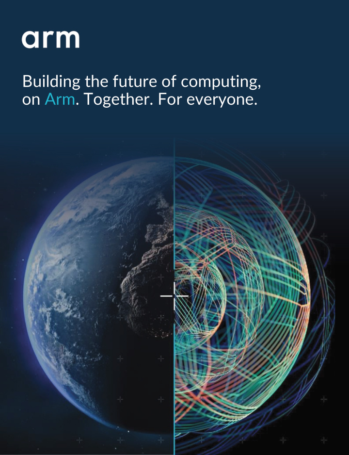
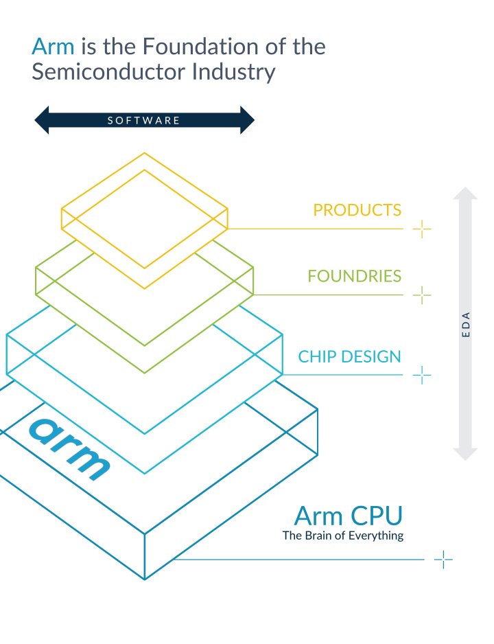
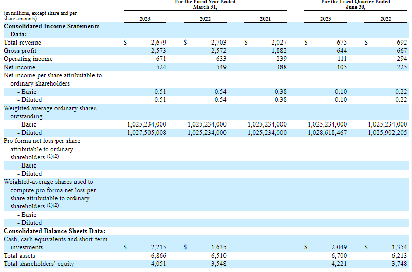

# 一文读懂美股今年最大IPO：Arm已提交招股书 中国收入占25%

**划重点：**

  * _1_ Arm向美SEC提交招股说明书，拟在纳斯达克证券市场挂牌，证券代码为“ARM”.
  * _2_ 包括巴克莱、高盛、摩根大通和日本瑞穗金融等21家投行将担任Arm首次公开募股的联席承销商。
  * _3_ Arm 2023财年及2024财年第一财季营收及净利润均同比出现下滑。
  * _4_ 2023财年，中国业务营收占Arm总营收的约25%。

腾讯科技讯
8月22日消息，Arm周一向美国证券交易委员会（SEC）提交招股说明书，计划在纳斯达克证券市场进行首次公开招股（IPO），证券代码为“ARM”。包括巴克莱（Barclays）、高盛、摩根大通和日本瑞穗金融等21家投行将担任Arm首次公开募股的联席承销商。Arm的招股说明书暂未披露发行量、估值及股价等相关信息。

**以下为Arm招股说明书内容摘要：**

**公司简介**

Arm正在定义计算的未来。半导体技术已成为全球最重要的资源之一，原因是它支持当今所有的电子设备。这些设备的核心是CPU，Arm是CPU的行业领导者。Arm设计、开发和授权高性能、低成本、高能效的CPU产品和相关技术，许多世界领先的半导体公司和原始设备制造商都依赖这些产品和技术来开发产品。截至2022年12月31日，Arm的高能效CPU已经在全球超过99%的智能手机中实现了高级计算，累计超过2500亿颗芯片，为从最小的传感器到最强大的超级计算机的一切提供动力。今天，Arm的CPU运行着世界上绝大多数的软件，包括智能手机、平板电脑和个人电脑、数据中心和网络设备以及车辆的操作系统和应用程序，以及智能手表、恒温器、无人机和工业机器人等设备中的嵌入式操作系统。Arm估计，全球约有70%的人口使用基于公司技术的产品，并且Arm的覆盖范围继续扩大，仅在截至2023年3月31日的财年中，Arm架构的芯片出货量就超过300亿颗，比截至2016年3月31日的财年增长了约70%。

今天，任何公司都可以通过Arm的高能效CPU专利和相关技术，以及Arm的技术合作伙伴生态系统的组合来制造现代计算机芯片，并且由于Arm灵活的业务模式，可以经济高效地进行生产。每种CPU产品都可以授权给多家公司，从而实现规模经济，使Arm向每家授权厂商收取的费用仅为他们内部开发成本的一小部分，同时最大限度地降低了他们的风险和上市时间。随着CPU设计的复杂性呈指数增长，在过去的十年中，没有一家公司能够从零开始成功设计出现代CPU。几十年来，Arm一直在计算技术的前沿进行创新，并与推动多个行业计算未来发展的公司建立了重要的关系。超过260家公司报告称，他们在截至2023年3月31日的财年中发货了基于Arm的芯片，其中包括一些全球最大的科技公司（如亚马逊和谷歌母公司Alphabet)、主要的半导体芯片供应商（如AMD、英特尔、英伟达、高通和三星电子)、汽车行业的公司、领先的汽车供应商、以及物联网创新者等。

消费者和企业市场中智能设备的指数级增长增加了对芯片的需求，这些芯片在优化能效的同时提供更大的计算能力。三十年前，PC是大多数人在家中、工作场所或学校里唯一可以互动的电脑。然后，智能手机变成了我们口袋里的电脑，数字电视变成了客厅里的电脑。如今，车辆实际上是车轮上的计算机，而服务器和网络设备是将所有这些设备和服务连接在一起的计算机。此外，还有数以十亿计的微型低成本设备
--从传感器到电视遥控器--现在也是功能性计算机。每台计算机至少需要一颗CPU，在许多情况下还不止一颗。过去几年，这一趋势推动了基于Arm的芯片的迅猛发展。

Arm创建的Arm
CPU架构是全球使用最广泛的CPU架构，它导致了当今人们所知的计算机的激增和发展，推进了一种提高计算性能和行业领先能效的典范。Arm推动了移动电话和智能手机革命，并通过对能效的关注和持续创新的历史，Arm创造了新类别的“智能”消费电子产品。今天，Arm正在重新定义云计算、汽车和物联网等行业的可能性。能源效率不仅对企业非常重要，也是实现地球可持续发展的一个重要组成部分。这使得Arm
CPU技术成为当前和未来计算应用的理想选择，因为计算性能需求呈指数级增长，而低功耗需求仍然至关重要。

每颗CPU都有一个指令集（ISA），它定义了可以由CPU执行的软件指令，本质上是软件开发人员使用的一种通用语言。指令集为运行在这些CPU上的大型兼容软件库奠定了基础。由于Arm
CPU是历史上最流行和普及的CPU，Arm指令集也是历史上最流行和普及的指令集。这意味着基于Arm的芯片拥有一个熟悉如何为CPU编程的全球软件开发人员社区。利用Arm
CPU的芯片设计人员可以添加所需的功能（Wi-Fi连接、图像处理、视频处理等）来创建系统级芯片（SoC），以满足任何终端市场的需求。

Arm的主要产品是领先的CPU产品，可满足不同的性能、功耗和成本要求。GPU、系统IP和计算平台等补充产品也可供使用，可为各种日益复杂的设备和应用提供高性能、高效、可靠的系统级创作。Arm的开发工具和强大的软件生态系统进一步巩固了该公司作为世界上最广泛采用的处理器架构的地位，并创造了一个采用的良性循环，这意味着软件开发人员为基于Arm的设备编写软件，因为它为他们的产品提供了最大的市场，芯片设计人员选择Arm处理器，因为他们拥有最广泛的软件应用支持。

这种普及性和便携性的结合让Arm的CPU设计拥有世界上最丰富的软件生态系统，该生态系统是与领先的操作系统提供商（包括谷歌Android、微软Windows和所有主要的Linux发行版）、软件工具和游戏引擎供应商（如艺电、Unity
Software和Epic
Games）以及应用开发商合作构建的。Arm还支持面向嵌入式软件的第三方工具供应商的蓬勃发展的生态系统和充满活力的物联网生态系统。开源软件在基于Arm的芯片的成功中起着至关重要的作用，Arm致力于为开源软件和工具做出贡献，以确保公司产品针对最新技术进行优化。

随着世界越来越多地转向支持人工智能和人工智能的计算，Arm将成为这一转变的核心。Arm
CPU已经在数十亿台设备上运行人工智能和机器学习工作负载，包括智能手机、相机、数字电视、汽车和云数据中心。CPU在所有人工智能系统中都是至关重要的，无论它是完全处理人工智能工作负载，还是与协处理器（如GPU或NPU）相结合。在大型语言模型、生成式人工智能和自动驾驶的新兴领域，这些算法的低功耗加速将受到高度重视。在ML最新的指令集、CPU和GPU中，该公司添加了新的功能和指令来加速未来的人工智能和机器学习算法。Arm正在与Alphabet、Cruise、梅赛德斯-
奔驰、Meta和英伟达等领先公司合作，部署Arm技术来运行人工智能工作负载。

截至2023年3月31日，Arm在北美、欧洲和亚洲拥有5963名全职员工。该公司是一家以工程为先的公司，截至2023年3月31日，Arm在全球的约80%员工专注于研究、设计和技术创新。Arm在英国、欧洲、北美、印度和亚太地区设有全球运营和研发中心。Arm总部位于英国剑桥。

**中国业务相关情况**

Arm在招股说明书中透露，“Arm中国”指的是安谋科技(中国)有限公司，一家独立于Arm运营的实体，也是Arm最大的单一客户。软银集团控股的实体Acetone有限公司持有Arm中国大约48%的股份，Arm拥有该实体10%的无投票权权益。Arm在Acetone
10%的无投票权权益代表了在Arm中国大约4.8%的间接所有权权益。

截至2023年、2022年和2021年3月31日的财政年度，来自中国的营收分别占Arm总营收的约25%、18%和20%，包括直接营收和来自与Arm中国的关系的营收。Arm在中国的营收来自中国半导体公司和原始设备制造商，以及非中国半导体公司和原始设备制造商，它们在芯片和终端产品中使用Arm的产品，并将其销售到中国。按国家划分，中国拥有全球最多的智能手机用户。Arm未能保持来自中国的收入、进入中国新的和现有的市场或在中国获得新业务领域的吸引力，或Arm在中国的竞争中失去市场份额，可能会对其经营业绩和竞争地位产生重大不利影响。

过去十年，中国一直是半导体行业收入和增长的重要来源。然而，由于一些不确定因素影响，中国半导体行业及相关行业的近期增长前景尚不明朗。截至2023年3月31日止财政年度，虽然Arm来自中国的总营收较上一财政年度有所增加，但同期本公司来自中国的版税营收增长放缓。Arm预计，中国业务版税营收将继续下降，来自中国的许可营收也将下降。

Arm在招股说明书中称，该公司依靠与Arm中国的商业关系进入中国市场。如果这种商业关系不复存在或恶化，该公司在中国市场的竞争能力将受到重大不利影响。

2022年3月28日，Arm将自己在Arm中国的全部股权转让给软银集团的一家子公司。截至本招股说明书日期，Arm中国约48%的股权由软银集团控制的实体Acetone拥有，Arm拥有该实体10%的无投票权权益，约35%股权由HOPU
Investment Management Company间接拥有，约17%由中国直接和间接方拥有。Arm在Acetone
10%的无投票权权益代表了在Arm中国大约4.8%的间接所有权权益。

此外，Arm没有任何关于Arm中国的直接管理权，例如在Arm中国董事会的代表权。根据Arm中国安排的条款，软银集团任命的人不能单方面实施某些需要Arm中国全体董事或绝大多数董事采取行动的措施。

**财务状况**

**上一财年数据：**

\--截至2023年3月31日的上一财年，Arm总营收为26.79亿美元，低于上一财年的27.03亿美元，高于2021财年的20.27亿美元。

\--截至2023年3月31日的上一财年，Arm毛利润为25.73亿美元，略高于上一财年的25.72亿美元，高于2021财年的18.82亿美元。

\--截至2023年3月31日的上一财年，Arm运营利润为6.71亿美元，高于上一财年的6.33亿美元，高于2021财年的2.39亿美元。

\--截至2023年3月31日的上一财年，Arm总运营支出为19.02亿美元，低于上一财年的19.39亿美元，高于2021财年的16.43亿美元。其中，研发支出为11.33亿美元，相比之下2022财年为9.95亿美元，2021财年为8.14亿美元；销售、总务和行政支出为7.62亿美元，相比之下2022财年为8.97亿美元，2021财年为8.26亿美元。

\--截至2023年3月31日的上一财年，Arm净利润为5.24亿美元，低于上一财年的5.49亿美元，高于2021财年的3.88亿美元。

\--截至2023年3月31日的上一财年，Arm每股摊薄收益为0.51美元，低于上一财年的0.54美元，高于2021财年的0.38美元。

**第一财季业绩：**

\--截至2023年6月30日的第一财季，Arm总营收为6.75亿美元，低于去年同期的6.92亿美元。

\--截至2023年6月30日的第一财季，Arm毛利润为6.44亿美元，低于去年同期的6.67亿美元。

\--截至2023年6月30日的第一财季，Arm运营利润为1.11亿美元，低于去年同期的2.94亿美元。

\--截至2023年6月30日的第一财季，Arm净利润为1.05亿美元，低于去年同期的2.25亿美元。

\--截至2023年6月30日的第一财季，Arm每股摊薄收益为0.10美元，低于去年同期的0.22美元。（无忌）

