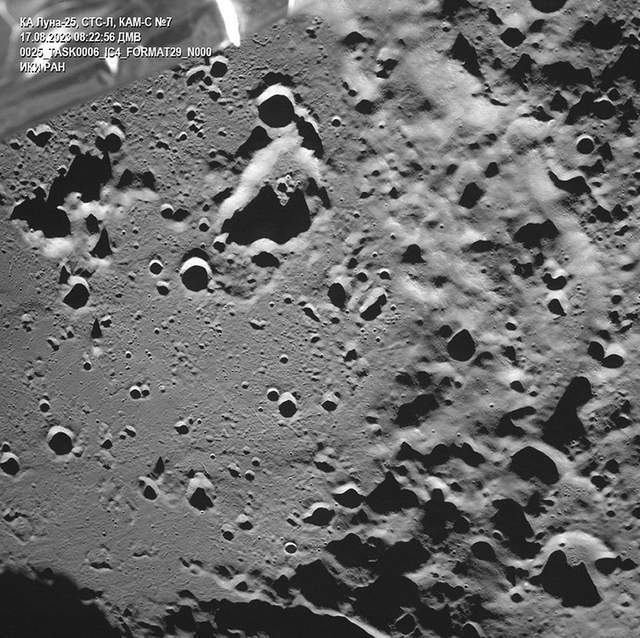

# 俄罗斯探测器，坠毁在月球之上

时隔近半个世纪，俄罗斯再次探月，却以失败告终。

当地时间8月20日，俄罗斯国家航天局宣布，“月球-25”号（Luna-25）航天器“因与月球表面相撞而不再存在”。

听到这个消息后，90岁的俄罗斯顶级科学家和天文学家米哈伊尔·马罗夫住进了医院。身为苏联太空计划领军人物之一的马罗夫表示，月球探索是他一生的事业，但结果却令人遗憾。

苏联太空计划的领军人物之一米哈伊尔·马罗夫感叹：“对我来说，也许这是我们的月球计划复兴的最后希望。”

 _8月17日，俄罗斯“月球-25”号探测器坠毁前拍摄的月球背面南极地区的图像。图/视觉中国_

**坠毁**

1976年8月18日，4米高的航天器“月球-24”号降落在“危机海”——月球北半球的一片平坦地带。四天后，这艘苏联制造的航天器返回地球，带回了宝贵的170
克月球土壤样本。后来，苏联科学家将其中一部分土壤以国际科学合作的名义与美国宇航局的同事进行了交换。

大约半个月世纪后，俄罗斯再次发射一艘装满科学仪器的航天器，降落在月球南半球，并计划通过一年时间来勘察月球表面。

8月11日，“月球-25”号航天器从东方航天发射场升空。根据计划，此次发射主要有两个科学目标：研究极地风化层的成分，以及研究月球极地外逸层的光子和尘埃成分。为完成这两个目标，“月球-25”号将在月球表面运行一年。

在8月11日发射后，“月球-25”号成功修正轨道并接近月球。8月13日，俄国家航天局宣布已经收到其传回来的第一批数据。次日，“月球-25”号还传来了多张来自太空的图像，在这些图像上可以看到设备本身、月球和地球。8月17日，航天器发回了第一张月球表面图像，捕捉到了月球背面的南极塞曼陨石坑。

如果一直这样顺利的话，“月球-25”号本该在月球南极附近的博古斯拉夫斯基陨石坑区域软着陆。在这片可能富含冰冻水的区域，探测器还会探测极地土壤的性质和成分，并测量其力学特性。

长期以来，月球南极被视为未来人类定居的潜在区域。资料显示，获取南极地区的冰冻水，对于判断人类能否在这个区域生存至关重要。水不仅可以维持生命，而且其氢和氧的组成部分也可以用作火箭燃料，有可能将月球当作通往太阳系其他星球的跳板。

然而，到了8月19日，当地面控制人员启动发动机，试图将“月球-25”号送入预着陆轨道时，航空器出现异常。按计划，发动机应该燃烧84秒，但它们没有按预期结束，足足燃烧127秒，导致高速坠落。当天14点57分左右，俄国家航天局宣布与“月球-25”号的通讯中断。业界开始担心，“月球-25”号可能不复存在了。

第二天，俄国家航天局承认了这一结果。该机构声明称，初步推测，航天器进入了非预先规划的轨道并撞上了月球表面坠毁。

**竞争**

苏联曾在1957年成功发射了全球第一颗人造地球卫星，开启了人类航天时代的序幕。

从上世纪50年代到1970年代，苏联在航天领域的探索和创新，可以说领先了美国。苏联当时不仅发射了第一颗人造卫星、第一艘月球航天器和轨道飞行器，还实现了第一次载人航天和第一次太空行走。

这期间，苏联也开始对月球进行探索。1966年2月，苏联太空探测器“月球-9”号首次在月球上成功实现软着陆。7小时后，“月球-9”号向地球传送了首张月球表面的全景照片，成为航天工程学上的奇迹。它帮助人类解答了关于月球表面的基本问题，并为第一次载人登月任务奠定了基础。

而载人登月计划，是苏联太空计划最重要的项目之一，也是最让他们感到遗憾的一项。

1961年，美国突然公布“阿波罗”计划，目的实现载人登月飞行和人类对月球的实地考察。苏联随后也加速推进登月项目。1962年1月，科罗廖夫设计局针对苏联的“登月计划”对N1运载火箭进行了多次改进，并计划在1967至1968年间赶在美国之前，将第一个苏联人送上月球。1963年，苏联成立了第一支宇航员登月分队，最初由尤里·加加林担任该分队的队长。

但是在1969年到1972年，该火箭经历了四次发射，全部失败。最终苏联人不得不眼睁睁看着美国宇航员阿姆斯特朗成为第一个登上月球的人。

苏联解体后，俄罗斯宣布“月球-25”号的发射项目于1997年重启，随后由于资金缺乏等因素被多次推迟。俄罗斯航天局战略规划部门负责人尤里·马卡罗夫
2014年表示，“月球-25”号任务的成本将是“数百亿卢布”
。该机构估计，俄罗斯当局在“月球-25”号项目上花费了至少126亿卢布（约10亿人民币），相当于一个人口在26万至50万的俄罗斯大城市的年度预算。

**教训**

近年来，随着俄罗斯政府将资金转向军事工业，外界认为，俄罗斯的太空计划正在萎缩。

2012年，俄罗斯的Phobos-Grunt航天器在地球轨道上滞留约两个月后坠入太平洋。Phobos-
Grunt航天器原本的任务是，登陆火星卫星“火卫一”(Phobos)，并将样本带回地球。

2018年，俄罗斯总统普京表示，俄罗斯在太空探索领域的领导地位受到威胁，并宣布进行改革以促进该领域发展。

太空地缘政治学《地理学的未来》一书的作者蒂姆·马歇尔认为，俄罗斯向月球发射航天器，表明莫斯科正在重返太空竞赛。他还表示，“如果他们能够（完成任务目标），这将是一项巨大的技术突破和科学成就。”

然而，俄罗斯时隔约半个世纪再度启动的探月任务宣布失败。美国宇航局前科学负责人托马斯·祖布臣指出，“一次次失败提醒我们，登陆任何天体都绝非易事。仅仅因为几十年前就做到了这一点，并不能保证今天的成功。”

其实，俄罗斯也并不是近年来唯一一个登月任务以失败告终的国家。2023年4月底，日本太空新创企业iSpace公司的登月艇登月失败。2019年，印度“月船2号”的登陆器维克拉姆预计能减速并轻轻着陆在月球表面上。然而，由于发动机产生了较大的推力，登陆器在下降过程中坠毁。它原计划降落在南极地区，即与俄罗斯“月球-25”号探测器大约在同一地点。同年，以色列的“创世纪”号探测器在着陆前最后时刻坠毁。

对于俄罗斯登月计划的艰难复兴，俄罗斯航天局局长尤里·鲍里索夫8月21日表示，登月计划中断近50年，是本次失败的主要原因。他呼吁，“在任何情况下都不应中断登月计划，那将是有史以来最糟糕的决定。”

按照计划，“月球-25”号成功以后，“月球-26”号和“月球-27”号将分别在2027年和2028年发射，但随着本次的坠毁事故，尚不清楚计划是否还能如期。

记者：郑立颖

